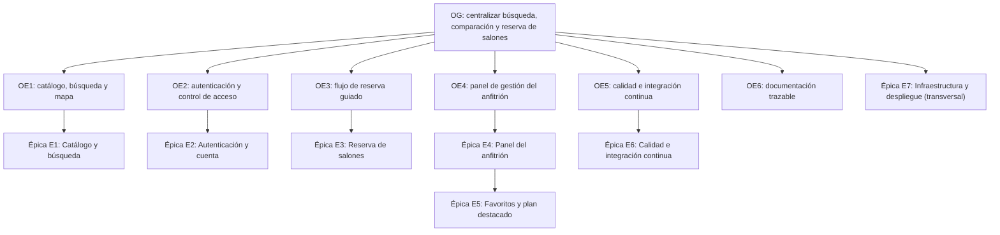

# 4. Objetivos

## Objetivo general

**OG** — Desarrollar y poner en funcionamiento una plataforma web que centralice la búsqueda, la
comparación y la reserva de salones de eventos en la provincia de Tucumán, vinculando a
organizadores con propietarios. Este objetivo general resume el propósito completo del proyecto y
se traduce operativamente en los seis objetivos específicos que se detallan a continuación, cada
uno acotado a una capacidad concreta del producto y verificable contra el estado actual del
repositorio.

## Objetivos específicos

A partir del objetivo general se derivan seis objetivos específicos (OE1–OE6). Cada uno delimita
una capacidad concreta del sistema y se acompaña de un criterio de verificación que permite
confirmar, contra el estado real del repositorio, si la capacidad fue efectivamente entregada.

| Objetivo | Descripción | Criterio de verificación |
|---|---|---|
| OE1 | Implementar un catálogo público de salones con búsqueda, filtros y visualización geolocalizada | Ruta `/salones` operativa con filtros y mapa (Leaflet + geocodificación Nominatim) |
| OE2 | Proveer autenticación de usuarios y control de acceso a los datos basado en propiedad | Sesiones de Supabase Auth + guardas `requireAuth` sobre 8 de las 14 rutas del frontend (M09) |
| OE3 | Habilitar un flujo de reserva guiado con validación de disponibilidad y de horarios | Wizard de reserva de 3 pasos (M20), con verificación de bloqueos de disponibilidad |
| OE4 | Ofrecer al propietario un panel de gestión de sus salones y de las reservas recibidas | Panel del anfitrión con calendario y cotización de precio por reserva |
| OE5 | Asegurar la calidad mediante pruebas automatizadas e integración continua | 94 pruebas automatizadas (M12) y 3 workflows de CI/CD (M14) |
| OE6 | Documentar la arquitectura, el proceso y las métricas del proyecto de forma trazable | Este mismo vault: 36 notas —17 secciones, 6 anexos, 11 notas de apoyo y 2 de índice— con toda métrica citada a su fuente en la nota Datos-Verificables |

*Tabla 6 — Objetivos específicos y criterio de verificación.*

## Objetivo de calidad

El objetivo de calidad definido para el proyecto consiste en sostener una suite de pruebas
automatizadas que cubra los flujos críticos del frontend. A la fecha de verificación de este
informe existen 94 pruebas automatizadas distribuidas en 21 archivos de prueba — 16 pruebas
unitarias y de componente con Vitest y Testing Library, más 5 especificaciones end-to-end con
Playwright — (M12, M13). La cobertura se mide con `@vitest/coverage-v8` y se reporta bajo dos
criterios —global y sobre el código efectivamente ejercitado— en la Tabla 32 de la sección 12,
Testing y Calidad, con la medición citada a su comando reproducible. El objetivo no se formuló como
un umbral porcentual: se priorizó cubrir la lógica de dominio y de acceso a datos antes que la capa
de presentación, y la Tabla 32a documenta el resultado de esa priorización.

## Trazabilidad objetivo → épica → funcionalidad

*Figura 3 — Árbol de objetivos: OG → OE1..OE6, con la épica asociada a cada OE.*

La siguiente tabla conecta cada objetivo específico con la épica temática correspondiente, la
funcionalidad concreta entregada y la evidencia verificable que respalda la afirmación de que
dicha funcionalidad efectivamente existe en el producto.

| Objetivo | Épica asociada | Funcionalidad entregada | Evidencia |
|---|---|---|---|
| OE1 | E1 — Catálogo y búsqueda | Catálogo público con filtros y mapa | M09, M15 |
| OE2 | E2 — Autenticación y cuenta | Sesiones de Supabase Auth, guarda `requireAuth`, RLS por `auth.uid()` | M09 |
| OE3 | E3 — Reserva de salones | Wizard de reserva de 3 pasos; estados `pending`/`confirmed`/`declined`/`cancelled` | M17, M20 |
| OE4 | E4 — Panel del anfitrión; E5 — Favoritos y plan destacado | Panel de calendario y cotización; favoritos; plan Destacado (cobro con Mercado Pago diferido, issue #45 cerrado `not planned`) | M10 |
| OE5 | E6 — Calidad e integración continua | 94 pruebas automatizadas y 3 workflows de CI/CD | M12, M13, M14 |
| OE6 | E7 — Infraestructura y despliegue (transversal) | Documentación trazable del proyecto (este vault) y despliegue automatizado vía GitHub Actions | M14 |

*Tabla 7 — Trazabilidad objetivo → épica → funcionalidad → evidencia.*

> [!info] Fuente — Las "épicas" (E1–E7) son una agrupación temática utilizada en este informe para
> organizar el contenido; no son un artefacto nativo de GitHub. Los 7 milestones reales del
> repositorio (M08) se organizan de forma cronológica por fase de entrega ("Phase 1.A: Auth &
> Onboarding", "Phase 1.B: Search & Filtering", "Phase 2: Booking & Payments", "Phase 2.B:
> Notifications", "Phase 3: Host Features", "Phase 3.B: Admin Panel", "Phase 2+: Polish &
> Optimization"), no por temática funcional. La correspondencia detallada entre épica, milestone e
> issues se documenta en la sección 9 (Planificación Scrum, Tabla 18) y en
> [[Anexo-III-Backlog-User-Stories]] (Tabla 51).

Esta trazabilidad explícita —de objetivo a épica, funcionalidad y evidencia— es en sí misma una
forma de cumplir OE6: cada afirmación de este documento remite a un artefacto verificable, ya sea
un archivo del repositorio, una métrica de la nota Datos-Verificables o un issue del repositorio de
GitHub. Los objetivos aquí definidos se contrastan con el problema que les da origen en
[[05-Problema-a-Resolver]], y el balance entre lo planificado y lo entregado se retoma en
[[15-Conclusiones]].

---
[[Indice|Índice]] · ← [[03-Introduccion]] · [[05-Problema-a-Resolver]] →
