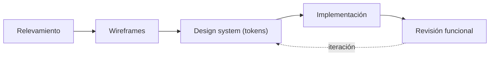
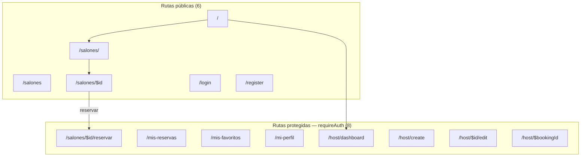
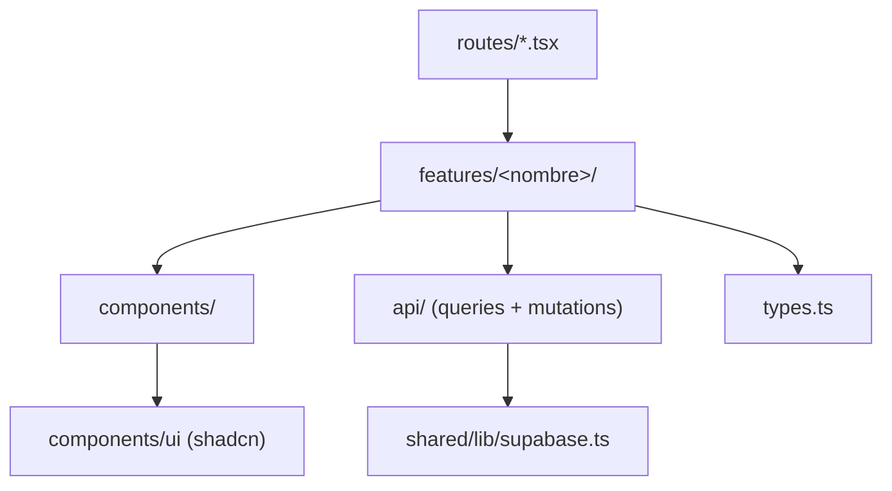

# 8. Diseño y Desarrollo

Esta sección describe el proceso de diseño seguido, el inventario funcional de pantallas
organizado por tipo de usuario, la arquitectura de carpetas que materializa esas pantallas en
código, y las decisiones de UX/UI adoptadas junto con su justificación. Los diagramas de flujo de
cada proceso de negocio (búsqueda, reserva, publicación, estados de una reserva, favoritos) se
documentan en detalle en [[Anexo-II-Diagramas-de-Flujo]] para evitar duplicación, y la
justificación arquitectónica de esta organización de carpetas se profundiza en
[[11-Arquitectura]].

## 8.1 Proceso de diseño

El desarrollo de la interfaz siguió un proceso iterativo de cinco etapas, sin una fase de diseño
visual centralizada previa a la implementación: relevamiento de requerimientos por módulo,
wireframes de baja fidelidad, definición del sistema de diseño (tokens de marca en
`frontend/src/index.css`), implementación directa con componentes de `shadcn/ui`, y revisión
funcional antes de cada entrega. Las etapas de design system e implementación se retroalimentaron
de forma iterativa a medida que se incorporaron nuevos módulos (reservas, panel de anfitrión, plan
destacado).

*Figura 7 — Proceso de diseño: relevamiento → wireframes → design system → implementación → revisión.*

## 8.2 Módulos y pantallas por tipo de usuario

El inventario de pantallas se organiza en tres tipos de usuario, coherentes con la aclaración de
[[07-Equipo-y-Roles]] de que Hosty no tiene una tabla de roles: "anfitrión" es una condición
derivada de poseer al menos un registro propio en `salones`, no un rol almacenado.

**Visitante (sin sesión).** La Home (`/`) presenta salones destacados
(`useFeaturedSalones`); `/salones` ofrece búsqueda con filtros y alterna entre vista de lista y
vista de mapa (Leaflet); `/salones/$id` muestra el detalle completo de un salón (fotos, precio,
servicios y disponibilidad). `/login` y `/register` completan el acceso.

**Usuario autenticado (organizador).** `/mis-reservas` lista las reservas propias con su estado;
`/mis-favoritos` lista los salones marcados; `/mi-perfil` permite actualizar nombre y contraseña;
`/salones/$id/reservar` implementa el flujo de reserva guiado de tres pasos.

**Anfitrión.** `/host/dashboard` centraliza los salones publicados y las reservas recibidas;
`/host/create` y `/host/$id/edit` exponen el mismo asistente de publicación de cuatro pasos, en
modo creación y edición respectivamente; `/host/$bookingId` permite revisar, cotizar, confirmar o
rechazar una reserva puntual.

| Ruta | Componente | Tipo de usuario |
|---|---|---|
| `/` | `HomePage` | Visitante |
| `/salones` | Layout (`Outlet`) | Visitante |
| `/salones/` | `SalonesPage` | Visitante |
| `/salones/$id` | `SalonDetailPage` | Visitante |
| `/login` | `LoginPage` | Visitante |
| `/register` | `RegisterPage` | Visitante |
| `/salones/$id/reservar` | `BookingFlow` | Usuario autenticado |
| `/mis-reservas` | `MyBookingsPage` | Usuario autenticado |
| `/mis-favoritos` | `MisFavoritosPage` | Usuario autenticado |
| `/mi-perfil` | `MiPerfilPage` | Usuario autenticado |
| `/host/dashboard` | `HostDashboardPage` | Anfitrión |
| `/host/create` | `CreateSalonPage` | Anfitrión |
| `/host/$id/edit` | `EditSalonPage` | Anfitrión |
| `/host/$bookingId` | `BookingDetailPage` | Anfitrión |

*Tabla 15 — Inventario de pantallas: ruta, componente y tipo de usuario.*

La ruta `/salones` es un caso particular: no renderiza una pantalla propia, sino un `Outlet` de
TanStack Router que agrupa `/salones/`, `/salones/$id` y `/salones/$id/reservar` bajo un mismo
segmento de URL. Se incluye en el inventario porque el comando de conteo de M09 la contabiliza
como archivo de ruta, aun cuando no tiene contenido visual propio.

> [!info] Fuente — M09: 14 rutas, 6 públicas / 8 protegidas con `requireAuth`
> (`frontend/src/routes/`).

## 8.3 Mapa de navegación

*Figura 8 — Mapa de navegación: 14 rutas — 6 públicas / 8 protegidas (`requireAuth`).*

## 8.4 Anatomía de una feature

El código de cada módulo funcional sigue una organización por *feature*, no por tipo técnico de
archivo: cada carpeta bajo `features/<nombre>/` agrupa sus propios `components/`, `api/` (hooks de
TanStack Query sobre `supabase-js`) y `types.ts`. Las rutas de `routes/` son deliberadamente
delgadas — sólo declaran el path, la validación de búsqueda (Zod) y, cuando corresponde, el guard
`requireAuth` — y delegan toda la lógica visual y de datos en el componente de la feature
correspondiente.

*Figura 9 — Anatomía de una feature: `features/<n>/{components,api,types.ts}` ↔ `routes/` ↔ `shared/lib`.*

## 8.5 Decisiones de UX/UI

La paleta e identidad visual provienen del `docs/hosty-brandbook.pdf` (v1.0, abril 2026): el
isotipo combina la letra "H" con un arco —la forma de una entrada o umbral— y un punto central que
representa un pin de ubicación, coherente con un producto de búsqueda geolocalizada de salones.

| Token | Valor | Uso |
|---|---|---|
| `--color-coral` | `#E8452A` | Acción principal (`primary`) |
| `--color-ink` | `#1C2B3A` | Texto y jerarquía visual (`foreground`) |
| `--color-bone` | `#FAF8F5` | Fondo cálido (`background`) |
| `--color-amber` | `#F5A623` | Acento cálido (`accent`) |
| `--font-sans` | Plus Jakarta Sans | Tipografía principal (encabezados y cuerpo) |
| `--font-serif-accent` | Instrument Serif | Acento tipográfico puntual |

*Tabla 14 — Tokens de marca y tipografía.*

> [!info] Fuente — `docs/hosty-brandbook.pdf` (págs. 4, 8-9); `frontend/src/index.css` (bloque
> `@theme`).

| Decisión | Justificación |
|---|---|
| Tokens de marca vía Tailwind v4 CSS-first (`@theme`) | Sin configuración JS separada; un único punto de verdad para color y tipografía |
| Diseño mobile-first | La búsqueda y reserva de un salón ocurren mayormente desde el celular |
| `shadcn/ui` sobre primitivos Radix | Componentes accesibles con código propio, sin dependencia de un paquete de UI cerrado |
| Búsqueda con mapa (Leaflet + Nominatim) | Experiencia geolocalizada específica de Tucumán sin costo de licencia de mapas |
| Asistentes ("wizards") de varios pasos para reserva (3) y publicación (4) | Reduce la carga cognitiva de formularios largos y permite validar por etapas |
| Iconografía outline uniforme (`lucide-react`, `strokeWidth=1.5`) | Coherente con el pack de íconos *outline* definido en el brandbook |

*Tabla 16 — Decisiones de UX/UI y su justificación.*

La escala tipográfica de encabezados también proviene del sistema de diseño: `h1` usa peso 800,
`h2` peso 700 y `h3`/`h4` peso 600, todos sobre la misma familia Plus Jakarta Sans, replicando la
jerarquía definida en el brandbook (H1/H2/H3 en la sección de tipografía) en lugar de introducir
pesos ad hoc por componente. El modo oscuro reutiliza los mismos tokens semánticos
(`--background`, `--foreground`, etc.) con valores HSL alternativos, de modo que ningún componente
necesita lógica condicional de tema: sólo cambia la clase `dark` en el elemento raíz.

## 8.6 Diagramas de flujo principales

El detalle diagramado de cada proceso de negocio —búsqueda y filtrado, reserva guiada,
publicación de un salón, máquina de estados de una reserva y gestión de favoritos/plan
destacado— se documenta como Figuras 30 a 34 en [[Anexo-II-Diagramas-de-Flujo]], para mantener en
esta sección únicamente el diseño de la interfaz y no duplicar diagramas de proceso.

---
[[Indice|Índice]] · ← [[07-Equipo-y-Roles]] · [[09-Planificacion-Scrum]] →
