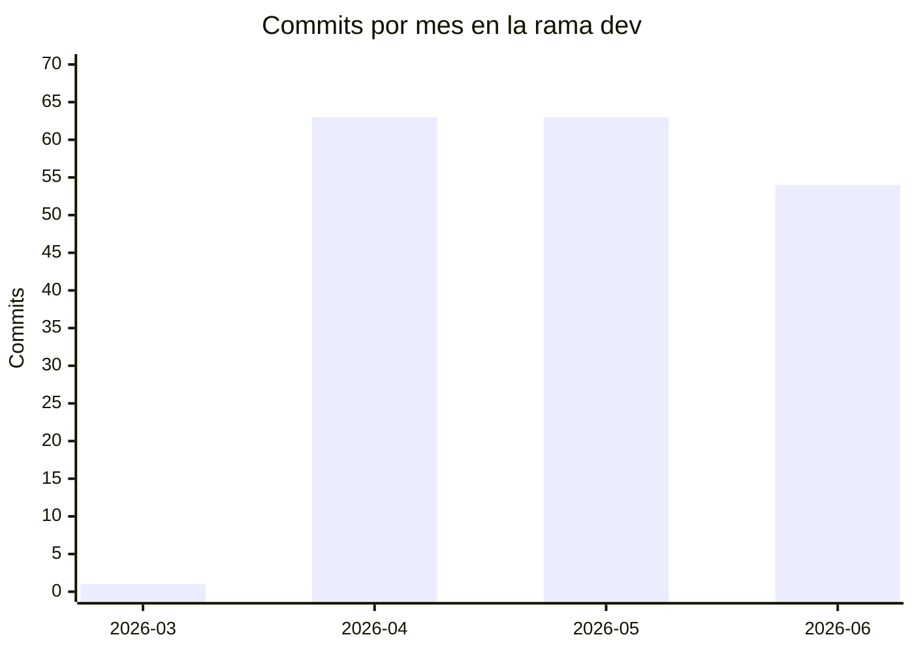
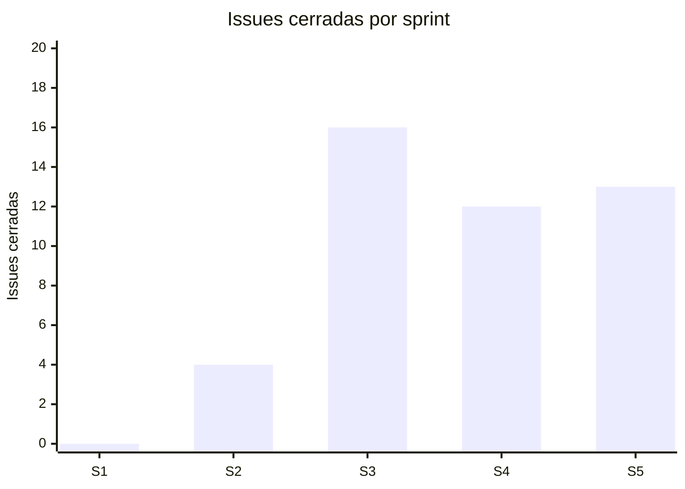
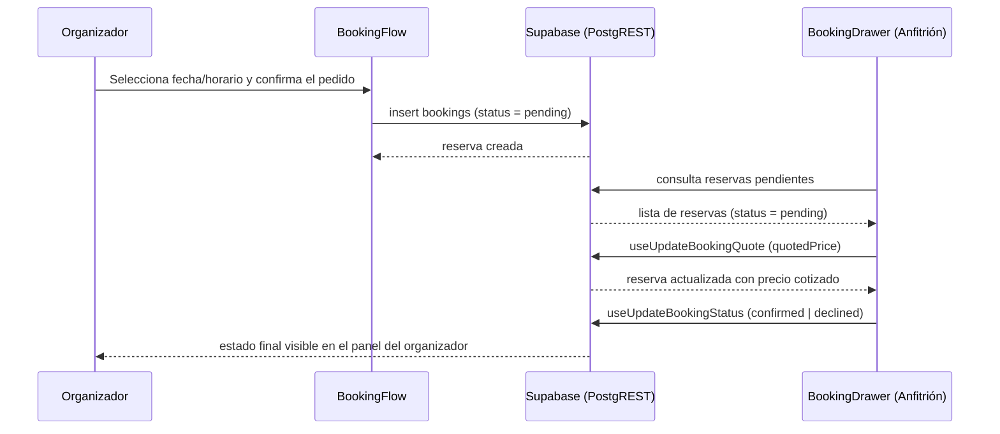

# 13. Ejecución por Sprint

Esta sección reconstruye la ejecución cronológica del proyecto, sprint por sprint, sobre la base
del calendario presentado en [[09-Planificacion-Scrum]] (Tabla 21). A diferencia de esa tabla, que
resume cantidades, aquí se detallan los entregables concretos de cada sprint, los cambios de
alcance o diseño ocurridos durante el desarrollo y la capacidad funcional más distintiva del
sistema, ilustrada con un diagrama de secuencia.

> [!info] Fuente — Los límites de fecha de cada sprint son una reconstrucción inferida a partir de
> la densidad de commits y de los clústeres de fecha de las migraciones de Supabase; ver SIM-13 en
> [[09-Planificacion-Scrum]]. Los conteos de commits e issues cerradas citados abajo son reales
> (M23, M24).

## Relato por sprint

| Sprint | Foco | Entregables | Decisión relevante | Cierre |
|---|---|---|---|---|
| S1 | Arranque, arquitectura base, home | Scaffolding Vite + React 19 + TypeScript, layout base, página de inicio | Elección de stack (React 19, Tailwind v4, Supabase) | 2026-04-19 |
| S2 | Catálogo, filtros, detalle de salón | Listado dinámico desde Supabase, UI de búsqueda, página de detalle de salón | Migración de NestJS a Supabase (commit `3a89616`) | 2026-05-15 |
| S3 | Autenticación, carga de imágenes | Login/registro con Supabase Auth, bucket `salon-images`, panel y asistente del anfitrión | Adopción de Supabase Storage para imágenes | 2026-06-05 |
| S4 | Panel del anfitrión, reservas, precios, bloqueos | Drawer de gestión de reservas, precios/servicios flexibles, bloqueos de disponibilidad | Corrección del `CHECK` de `bookings` a 4 estados | 2026-06-13 |
| S5 | Plan destacado, coordenadas, favoritos | Suscripción destacada, geocodificación de salones, favoritos persistentes, política de borrado | Consolidación de 7 pull requests en la PR #93 | 2026-06-24 |

*Tabla 35 — Sprints: foco, entregables, decisiones y fecha de cierre.*

*Figura 22 — Commits por mes en la rama dev (marzo-junio 2026).*

> [!info] Fuente — M01, M03, M04: `git log dev --date=format:'%Y-%m' --format=%ad | sort | uniq -c`
> (verificado 2026-07-28). Ver [[Datos-Verificables]].

*Figura 23 — Issues cerradas por sprint (S1-S5).*

> [!info] Fuente — M24 (issues cerradas por sprint, calculado para este informe a partir de
> `closedAt`): `gh issue list --state closed --json number,closedAt` (verificado 2026-07-28). Los
> 45 cierres suman el total de M06. Ver [[Datos-Verificables]].

## Cambios de alcance y de diseño

| Cambio | Justificación | Evidencia |
|---|---|---|
| Migración de NestJS a Supabase | Reducir la complejidad operativa de mantener un backend propio con un equipo part-time; aprovechar autenticación, PostgREST y Storage administrados | Commit `3a89616` (2026-04-29): remoción completa de `backend/` y de los workflows de CI/CD asociados |
| Consolidación de 7 pull requests en una única PR de integración | Evitar conflictos entre ramas de feature abiertas en simultáneo cerca del cierre del proyecto, incluyendo una colisión real de nombre de migración | PR #93, "consolidate all active PRs (#80 #82 #84 #86 #89 #90 #91)", mergeada el 2026-06-23 desde la rama `integration/consolidated-prs` |
| Postergación de la integración de Mercado Pago | La pasarela de pago no se completó dentro del período relevado | Issue #45, abierta al cierre del período |
| Postergación del sistema de reviews y calificaciones | Decisión explícita de alcance, etiquetada `post-mvp` en el propio backlog | Issue #33, etiqueta `post-mvp` |

*Tabla 36 — Cambios de alcance y de diseño con justificación.*

> [!info] Fuente — M26: de las 48 pull requests totales, 20 se cerraron sin fusionar (41,7 %) —
> `gh pr list --state all --json number,state,mergedAt` (verificado 2026-07-28). Siete de esas 20
> corresponden directamente al evento de consolidación descrito arriba (#80, #82, #84, #86, #89,
> #90, #91); el resto responde a un patrón similar de ramas reintegradas por otra vía a lo largo
> del proyecto, sin que exista un registro explícito del motivo caso por caso. Ver
> [[Datos-Verificables]].

## Capacidad más distintiva: cotización y confirmación de una reserva

La funcionalidad que mejor distingue a Hosty de un simple formulario de contacto es el flujo de
cotización y confirmación de reservas del anfitrión, que combina un precio ajustable
(`quotedPrice`) con el bloqueo de fechas (`salon_availability_blocks`).

*Figura 24 — Capacidad más distintiva, extremo a extremo: huésped reserva → anfitrión cotiza (`quotedPrice`) → confirma/rechaza → estado final del huésped.*

> [!info] Fuente — `frontend/src/features/bookings/components/BookingFlow.tsx`,
> `frontend/src/features/host/components/BookingDrawer.tsx`,
> `frontend/src/features/host/api/host.mutations.ts` (`useUpdateBookingQuote`,
> `useUpdateBookingStatus`), `supabase/migrations/20260610082550_salon_availability_blocks.sql`
> (verificado 2026-07-28).

---
[[Indice|Índice]] · ← [[12-Testing-y-Calidad]] · [[14-Metricas]] →
