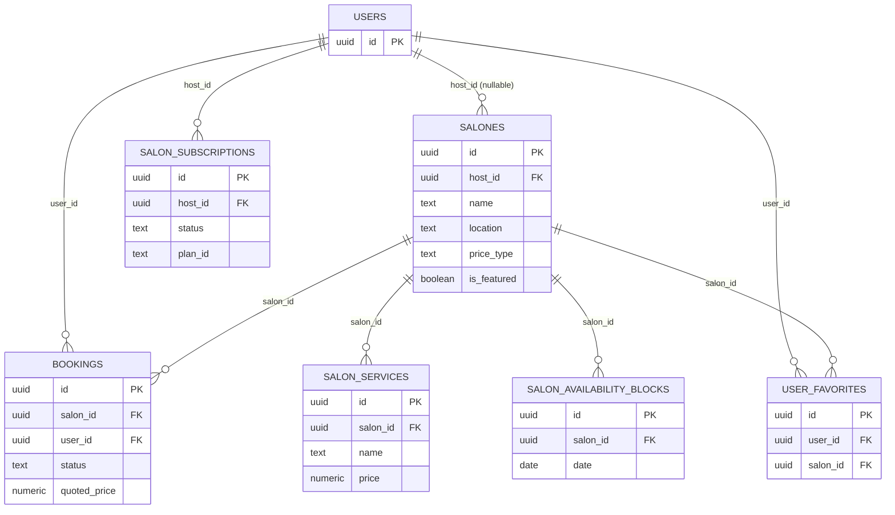
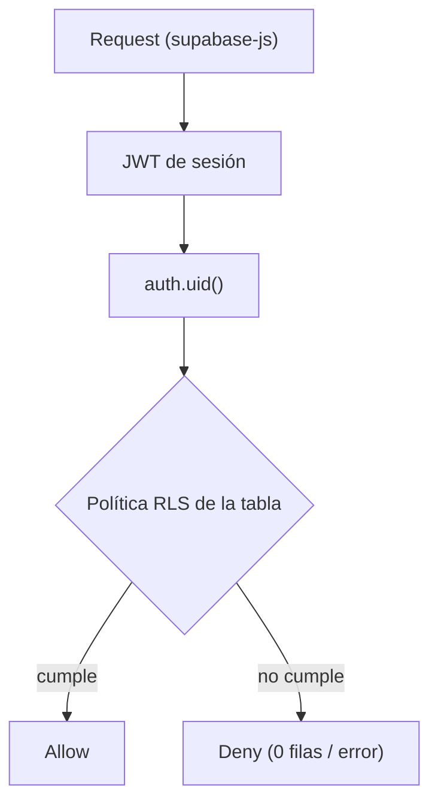

# Anexo I. Modelo de Datos

El esquema `public` tiene 6 tablas (M10) más `auth.users`, administrada por Supabase Auth. No se
usa ningún ORM: los tipos de TypeScript se generan directamente desde el esquema real
(`frontend/src/shared/lib/database.types.ts`). Este anexo documenta el diagrama entidad-relación
completo, el diccionario de datos por tabla, las políticas RLS y el historial de migraciones; la
discusión arquitectónica de este modelo está en [[11-Arquitectura]], y las métricas M10/M11/M17/M22
citadas a lo largo del anexo se consolidan, con su comando de reproducción, en
[[Datos-Verificables]].

## Diagrama entidad-relación

*Figura 28 — Modelo de datos completo: `auth.users` + las 6 tablas públicas con cardinalidades y claves foráneas.*

*Figura 29 — Cadena de autorización por propiedad: request → JWT → `auth.uid()` → política RLS → allow/deny.*

Las ocho relaciones del diagrama son todas de cardinalidad uno a muchos desde `auth.users` o
desde `salones` hacia las tablas dependientes; ninguna tabla del esquema tiene una relación
muchos a muchos directa. `salones.host_id` es la única clave foránea nullable de todo el modelo
(`on delete set null`): un salón puede quedar sin propietario si la cuenta del anfitrión se
elimina, en lugar de eliminarse en cascada junto con ella. Todas las demás relaciones hacia
`salones` (`bookings`, `salon_services`, `salon_availability_blocks`, `user_favorites`) se borran
en cascada cuando se elimina el salón.

## Diccionario de datos

La tabla `salones` es la entidad central del modelo: concentra tanto los datos de catálogo
(nombre, ubicación, capacidad, imágenes) como el estado comercial del anfitrión (modo de precio,
plan destacado, verificación editorial). El campo `price_type` determina qué otras columnas de
precio son relevantes: `price_per_hour` sólo se usa cuando el precio es fijo, y `price_min`/
`price_max` sólo cuando es un rango estimado; con `on_request` ninguno de los tres se completa y
el anfitrión cotiza manualmente desde el panel (ver [[Anexo-II-Diagramas-de-Flujo]]).

| Columna | Tipo SQL | Restricción | Descripción |
|---|---|---|---|
| `id` | `uuid` | PK, `default gen_random_uuid()` | Identificador |
| `created_at` | `timestamptz` | `not null default now()` | Alta del registro |
| `name` | `text` | `not null` | Nombre del salón |
| `description` | `text` | nullable | Descripción |
| `location` | `text` | `not null` | Zona (Tucumán) |
| `address` | `text` | `not null` | Dirección completa |
| `price_per_hour` | `numeric(12,2)` | nullable | Precio fijo por hora (sólo `price_type='fixed'`) |
| `price_type` | `text` | `check in ('fixed','estimated','on_request')` | Modo de precio (M18) |
| `price_min` / `price_max` | `numeric(12,2)` | nullable | Rango estimado |
| `capacity` | `int` | `not null` | Capacidad máxima |
| `rating_value` / `rating_count` | `numeric(3,2)` / `int` | nullable | Calificación agregada |
| `is_verified` | `boolean` | `not null default false` | Verificación editorial |
| `is_featured` | `boolean` | `not null default false` | Plan Destacado activo |
| `availability_status` | `text` | `check in ('disponible','reservado','no disponible')` | Estado operativo |
| `event_types` / `amenities` / `images` | `text[]` | `not null default '{}'` | Listas |
| `host_id` | `uuid` | FK → `auth.users(id)` `on delete set null`, nullable | Propietario |
| `rent_time_hours` | `int` | `not null default 1` | Alquiler mínimo en horas |
| `latitude` / `longitude` | `double precision` | nullable | Geolocalización |

*Tabla 42 — Diccionario de datos — salones.*

| Columna | Tipo SQL | Restricción | Descripción |
|---|---|---|---|
| `id` | `uuid` | PK | Identificador |
| `salon_id` | `uuid` | `not null` FK → `salones(id)` `on delete cascade` | Salón reservado |
| `user_id` | `uuid` | `not null` FK → `auth.users(id)` `on delete cascade` | Huésped |
| `event_date`, `start_time`, `end_time` | `date`, `time`, `time` | `not null` | Fecha y horario |
| `attendees` | `int` | `not null` | Asistentes |
| `event_type` | `text` | `not null` | Tipo de evento |
| `status` | `text` | `check in ('pending','confirmed','declined','cancelled')` | Estado de la reserva — ver hallazgo abajo (M17) |
| `total_price` / `quoted_price` | `numeric(12,2)` | nullable | Precio final / cotizado por el anfitrión |
| `selected_services` | `jsonb` | `not null default '[]'` | Servicios extra elegidos |
| `rejection_reason`, `contact_name`, `contact_phone` | `text` | nullable | Datos agregados por gestión del anfitrión |

*Tabla 43 — Diccionario de datos — bookings.*

La tabla `bookings` registra tanto la solicitud original del huésped (fecha, horario,
asistentes, servicios elegidos) como el resultado de la gestión del anfitrión (`quoted_price`,
`rejection_reason`). El wizard de reserva de tres pasos descrito en
[[Anexo-II-Diagramas-de-Flujo]] escribe una única fila con `status = 'pending'`; las
transiciones posteriores las produce el panel del anfitrión mediante actualizaciones parciales
sobre esa misma fila, nunca filas nuevas.

> [!info] Fuente — M17: hallazgo verificado sobre `status`. La migración inicial
> `supabase/migrations/20240101000000_init_hosty.sql:57-58` sólo permitía tres valores
> (`'pending', 'confirmed', 'cancelled'`). El comentario verbatim de
> `supabase/migrations/20260609233130_host_booking_management.sql:7-11` documenta el defecto:
> *"'declined' was used by the app but missing from the DB check."* La migración reemplaza la
> restricción por `check (status in ('pending', 'confirmed', 'declined', 'cancelled'))`. El tipo
> TypeScript de `frontend/src/features/host/lib/booking-status.ts` ya modelaba las cuatro
> variantes antes de que la base de datos las aceptara: drift real entre el `CHECK` de Postgres y
> el dominio TS, sin ningún `enum` de Postgres de por medio (M22 = 0). Desarrollado como deuda
> técnica en [[15-Conclusiones]] (Tabla 40) y en [[11-Arquitectura]] (Tabla 27, Hallazgo C).

| Columna | Tipo SQL | Restricción | Descripción |
|---|---|---|---|
| `id` | `uuid` | PK | Identificador |
| `salon_id` | `uuid` | `not null` FK → `salones(id)` `on delete cascade` | Salón |
| `name` | `text` | `not null` | Nombre del servicio |
| `price` | `numeric(12,2)` | nullable ("a consultar" si es `null`) | Precio del servicio |

*Tabla 44 — Diccionario de datos — salon_services.*

| Columna | Tipo SQL | Restricción | Descripción |
|---|---|---|---|
| `id` | `uuid` | PK | Identificador |
| `salon_id` | `uuid` | `not null` FK → `salones(id)` `on delete cascade` | Salón bloqueado |
| `date` | `date` | `not null`, `unique(salon_id, date)` | Día no disponible |
| `reason` | `text` | nullable | Motivo |

*Tabla 45 — Diccionario de datos — salon_availability_blocks.*

`salon_services` y `salon_availability_blocks` son ambas sub-recursos de `salones` administrados
exclusivamente por el anfitrión propietario (política RLS `ALL`), pero de lectura pública: el
huésped las consulta durante el flujo de reserva sin necesitar sesión iniciada, ya que la
disponibilidad y los servicios extra de un salón son información de catálogo, no privada.

| Columna | Tipo SQL | Restricción | Descripción |
|---|---|---|---|
| `id` | `uuid` | PK | Identificador |
| `user_id` | `uuid` | `not null` FK → `auth.users(id)` | Usuario |
| `salon_id` | `uuid` | `not null` FK → `salones(id)` `on delete cascade` | Salón favorito |
| `created_at` | `timestamptz` | `not null default now()`, `unique(user_id, salon_id)` | Alta |

*Tabla 46 — Diccionario de datos — user_favorites.*

La restricción `unique(user_id, salon_id)` es la única regla de integridad que impide un
favorito duplicado; la lógica de alternar (agregar/quitar) vive enteramente en el cliente, como
se detalla en [[Anexo-II-Diagramas-de-Flujo]] (Figura 34).

| Columna | Tipo SQL | Restricción | Descripción |
|---|---|---|---|
| `id` | `uuid` | PK | Identificador |
| `host_id` | `uuid` | `not null` FK → `auth.users(id)` | Anfitrión suscripto |
| `status` | `text` | `check in ('pending','active','cancelled','expired')` | Estado de la suscripción |
| `plan_id` | `text` | `not null default 'destacado'` | Plan contratado |
| `amount_monthly` | `numeric(10,2)` | `not null default 4999` | Monto mensual |
| `mercadopago_subscription_id` | `text` | nullable | Referencia externa de pago |
| `started_at`, `current_period_end`, `cancelled_at` | `timestamptz` | nullable | Ciclo de vida |

*Tabla 47 — Diccionario de datos — salon_subscriptions.*

`salon_subscriptions` no tiene relación directa con `salones` a nivel de clave foránea: el
vínculo comercial se cierra mediante la aplicación, que al cancelar una suscripción actualiza por
separado `salones.is_featured` a `false` para el `host_id` correspondiente. El campo
`mercadopago_subscription_id` anticipa una integración de cobro que, a la fecha de esta
verificación, no está conectada a un flujo de pago real.

## Políticas RLS por tabla y operación

Todas las tablas del esquema `public` tienen Row Level Security habilitada; no existe ninguna
tabla de negocio con lectura o escritura sin restricción. El patrón dominante es "lectura
pública, escritura por propietario": el catálogo (`salones`, `salon_services`,
`salon_availability_blocks`) es visible sin sesión, mientras que las tablas de datos personales
(`bookings`, `user_favorites`, `salon_subscriptions`) exigen coincidencia de `auth.uid()` incluso
para `SELECT`.

| Tabla | Operación | Regla |
|---|---|---|
| `salones` | SELECT | Pública (`using (true)`) |
| `salones` | INSERT / UPDATE / DELETE | Propietario (`auth.uid() = host_id`) |
| `bookings` | SELECT | Huésped propio (`user_id`) o anfitrión del salón (`salon_id in (... host_id = auth.uid())`) |
| `bookings` | INSERT | Huésped propio (`auth.uid() = user_id`) |
| `bookings` | UPDATE | Huésped propio (cancelar) o anfitrión del salón (confirmar/rechazar/cotizar) |
| `salon_services` | SELECT | Pública |
| `salon_services` | ALL (host) | Anfitrión dueño del salón relacionado |
| `salon_availability_blocks` | SELECT | Pública |
| `salon_availability_blocks` | ALL (host) | Anfitrión dueño del salón relacionado |
| `user_favorites` | SELECT / INSERT / DELETE | Propietario (`user_id = auth.uid()`) |
| `salon_subscriptions` | SELECT / INSERT / UPDATE | Propietario (`host_id = auth.uid()`) |
| `storage.objects` (`salon-images`) | INSERT | Cualquier usuario autenticado |
| `storage.objects` (`salon-images`) | SELECT | Pública |
| `storage.objects` (`salon-images`) | UPDATE / DELETE | Dueño de la ruta (`salones/{auth.uid()}/...`) |

*Tabla 48 — Políticas RLS por tabla y operación.*

> [!info] Fuente — hallazgo verificado adicional: la tabla `salones` no tuvo política de `DELETE`
> hasta `supabase/migrations/20260616000001_add_salon_delete_policy.sql`. El comentario verbatim
> del archivo documenta el efecto: con RLS activo y sin política de `DELETE`, el borrado desde el
> cliente afectaba 0 filas sin devolver error, de modo que el salón nunca se eliminaba. Corregido
> con la política `Host can delete their own salon`. Ver también [[11-Arquitectura]] (Tabla 27,
> Hallazgo D).

## Historial de migraciones

El esquema creció de forma incremental a lo largo de los cinco sprints documentados en
[[13-Ejecucion-por-Sprint]]: la migración inicial cubre sólo `salones` y `bookings`; el resto de
las tablas y columnas se agregó a medida que se incorporaron precios flexibles, gestión de
disponibilidad, plan destacado, coordenadas geográficas y favoritos.

| Migración | Contenido |
|---|---|
| `20240101000000_init_hosty` | Esquema inicial: `salones`, `bookings`, RLS base, datos semilla |
| `20260516000001_add_performance_indexes` | Índices GIN/`trgm` y de rango para búsqueda |
| `20260525000001_create_storage_bucket` | Bucket `salon-images` (M16) y políticas de Storage |
| `20260609233130_host_booking_management` | Estado `declined`, motivo de rechazo, RLS de anfitrión sobre `bookings` |
| `20260609234240_pricing_and_services` | Precios flexibles, `salon_services`, `quoted_price` |
| `20260610082550_salon_availability_blocks` | Bloqueos de disponibilidad por fecha |
| `20260614000001_host_destacado_plan` | `salon_subscriptions`, `is_featured` |
| `20260614000002_add_salon_coordinates` | `latitude`/`longitude` y backfill de semillas |
| `20260616000001_add_salon_delete_policy` | Política de `DELETE` faltante en `salones` |
| `20260617000001_user_favorites` | Tabla `user_favorites` |

*Tabla 49 — Historial de migraciones.*

> [!info] Fuente — M11: 10 archivos de migración (`supabase/migrations/*.sql`). La marca de
> tiempo `20240101000000` del archivo inicial es un valor placeholder anterior a la creación real
> del repositorio (2026-03-29, M03) y no debe leerse como fecha real de ese cambio.

---
[[Indice|Índice]] · ← [[15-Conclusiones]] · [[Anexo-II-Diagramas-de-Flujo]] →
