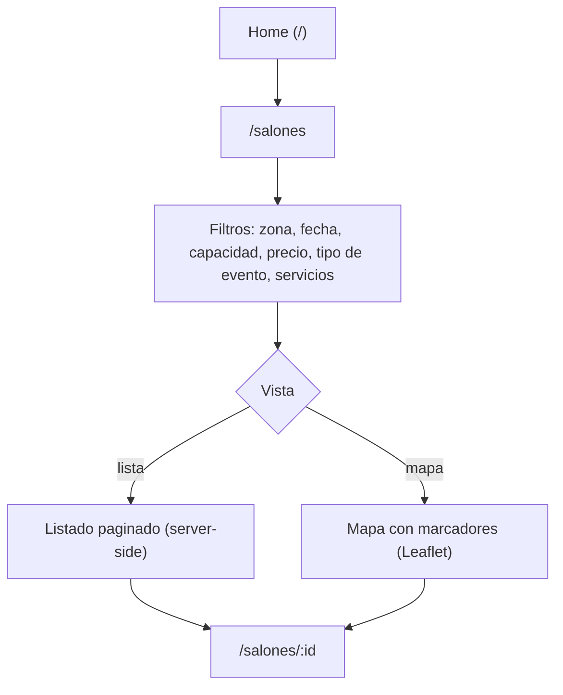
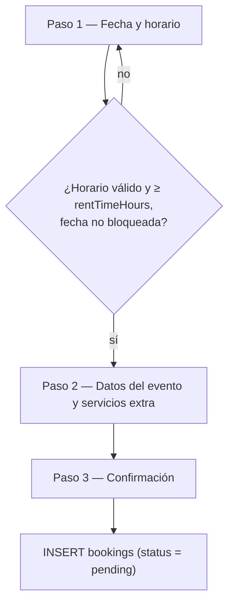
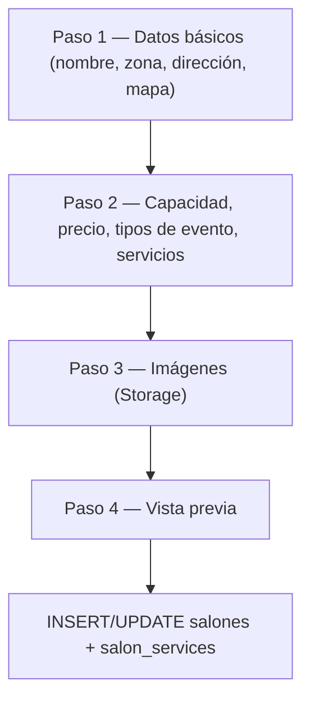
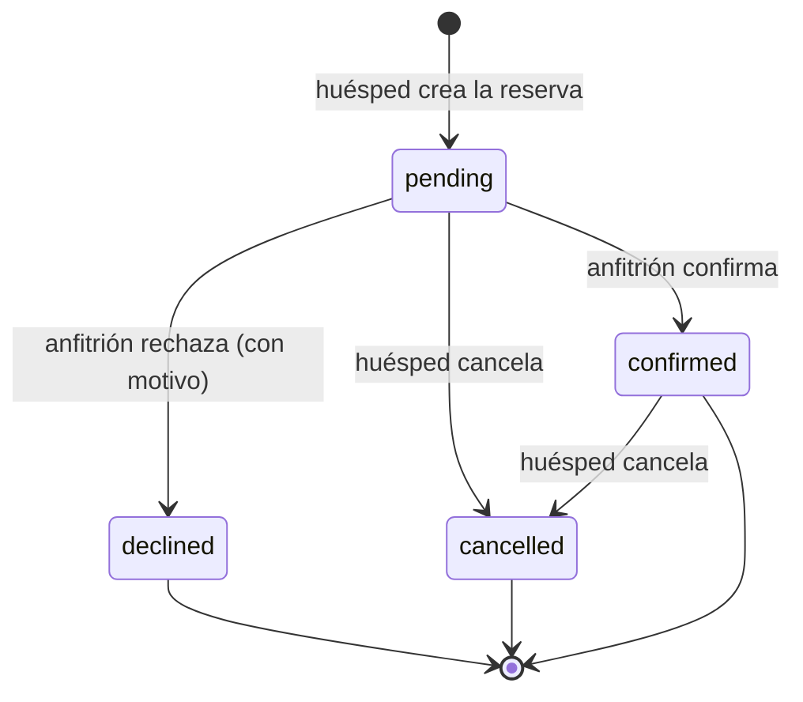
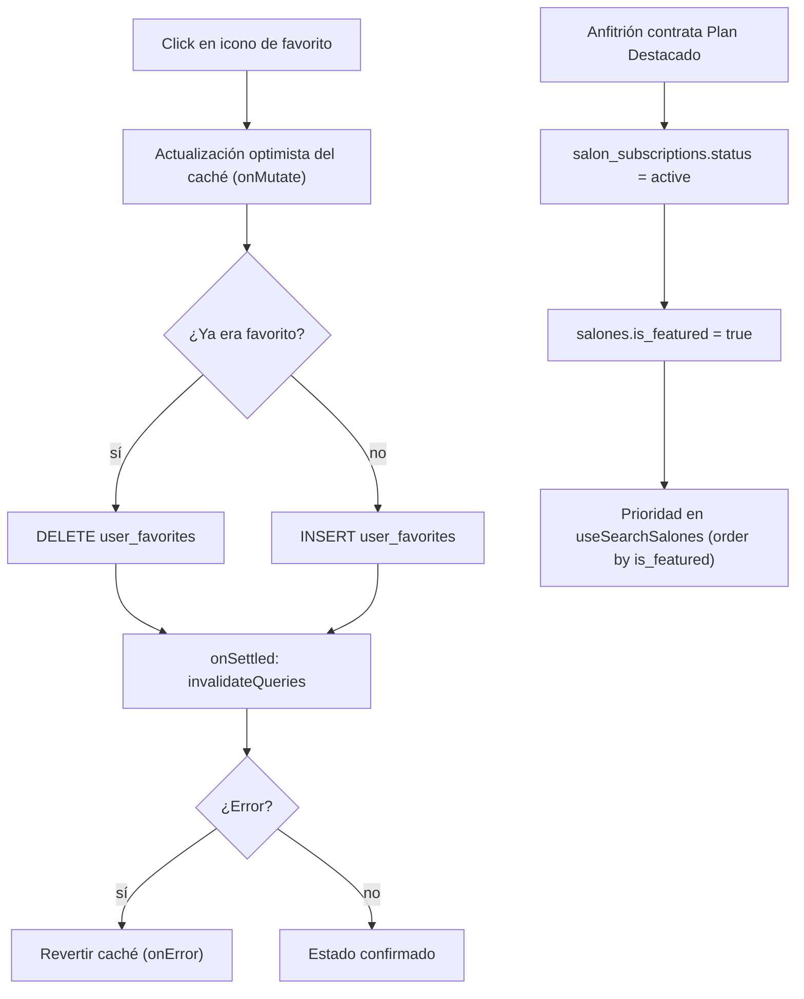

# Anexo II. Diagramas de Flujo Complementarios

Este anexo detalla los flujos de proceso que [[08-Diseno-y-Desarrollo]] referencia sin
diagramar, para mantener esa sección centrada en la interfaz. La lectura de estos flujos
complementa el modelo de datos de [[Anexo-I-Modelo-de-Datos]] y la arquitectura de
[[11-Arquitectura]].

## Búsqueda y filtrado

La búsqueda no requiere sesión iniciada: los filtros de la ruta `/salones/` se codifican
enteramente en la URL (`validateSearch` con Zod), por lo que un resultado de búsqueda es
enlazable y compartible. El ordenamiento y la paginación se resuelven del lado del servidor
(PostgREST), no en el cliente, para no descargar el catálogo completo en cada búsqueda.

*Figura 30 — Flujo de búsqueda y filtrado: home → `/salones` → filtros/mapa → `/salones/:id`.*

> [!info] Fuente — la ruta `/salones/` valida 17 parámetros de búsqueda con Zod
> (`frontend/src/routes/salones/index.tsx`, `searchSchema`; verificado 2026-07-28).

## Flujo de reserva

El asistente exige sesión iniciada (`requireAuth`) recién al llegar a
`/salones/:id/reservar`; los dos primeros pasos se validan íntegramente en el cliente antes de
escribir nada en la base de datos, y sólo la confirmación del paso 3 dispara la mutación. Si el
salón cotiza "a consultar", el total se muestra como pendiente de cotización en lugar de un
monto, y la reserva igual se crea en estado `pending`.

*Figura 31 — Flujo de reserva (wizard de 3 pasos): fecha y horario → datos del evento → confirmación.*

> [!info] Fuente — M20: 3 pasos (`frontend/src/features/bookings/components/BookingFlow.tsx`).
> Valida horario mínimo (`salon.rentTimeHours`) y fechas de `salon_availability_blocks`.

## Publicación de un salón (anfitrión)

El mismo componente (`SalonWizard`) se reutiliza en modo creación y en modo edición: en edición,
el paso de imágenes conserva las URLs existentes y sólo sube a Storage los archivos nuevos, y el
paso final reemplaza el registro completo de `salones` en lugar de aplicar un parche parcial.

*Figura 32 — Flujo de publicación de salón (wizard de 4 pasos): datos básicos → capacidad/precio/servicios → imágenes → vista previa.*

> [!info] Fuente — M21: 4 pasos (`frontend/src/features/host/components/SalonWizard.tsx`).

## Máquina de estados de una reserva

Toda transición la ejecuta el anfitrión desde su panel, salvo la cancelación, que también puede
iniciarla el huésped desde `/mis-reservas`. No existe una transición automática por vencimiento
de fecha: una reserva `confirmed` para un evento ya pasado permanece en ese estado indefinidamente
si nadie la actualiza manualmente.

*Figura 33 — Máquina de estados de una reserva: `pending` → `confirmed` | `declined` | `cancelled`.*

> [!info] Fuente — M17. El cuarto estado (`declined`) fue admitido por la restricción `CHECK` de
> Postgres recién en la migración `20260609233130`; el hallazgo completo, con cita verbatim de
> ambas migraciones, se documenta en [[Anexo-I-Modelo-de-Datos]] (Tabla 43).

## Favoritos y plan destacado

El toggle de favorito actualiza el caché de TanStack Query antes de recibir respuesta del
servidor (`onMutate`), para que el ícono cambie sin demora perceptible; si la mutación falla, el
valor previo se restaura (`onError`) y la interfaz vuelve a su estado real. El plan destacado
sigue un ciclo independiente: al activarse la suscripción, un único salón por anfitrión pasa a
`is_featured = true` y gana prioridad de orden en los resultados de búsqueda por defecto; al
cancelarse, ambos cambios (suscripción y bandera) se revierten en la misma operación.

*Figura 34 — Gestión de favoritos y plan destacado.*

## Índice de flujos

| Flujo | Actor | Precondición | Resultado |
|---|---|---|---|
| Búsqueda y filtrado | Visitante | Ninguna | Lista/mapa de salones filtrados |
| Reserva (3 pasos) | Usuario autenticado | Sesión iniciada; salón con disponibilidad en la fecha elegida | Reserva creada en estado `pending` |
| Publicación de salón (4 pasos) | Anfitrión | Sesión iniciada | Salón publicado o actualizado, con imágenes en Storage |
| Cambio de estado de reserva | Anfitrión | Reserva en estado `pending` | Reserva en `confirmed`, `declined` (con motivo) o cotizada |
| Gestión de favoritos | Usuario autenticado | Sesión iniciada | Salón agregado/quitado de favoritos, con reversión ante error |
| Plan destacado | Anfitrión | Sesión iniciada; suscripción `active` | Salón con `is_featured = true` y prioridad en resultados |

*Tabla 50 — Índice de flujos: actor, precondición y resultado.*

---
[[Indice|Índice]] · ← [[Anexo-I-Modelo-de-Datos]] · [[Anexo-III-Backlog-User-Stories]] →
