# Hosty

**Encontrá, compará y reservá salones sin vueltas**

*Marketplace web para la búsqueda y reserva de salones de eventos en Tucumán*

**Universidad del Norte Santo Tomás de Aquino**
Tecnicatura en Desarrollo y Calidad de Software
Proyecto Final — 2026

**Autores**

| Integrante | Legajo |
|---|---|
| Juan Pablo Valdez | UIA7-0262 |
| Lautaro David Martínez Naglieri | UIA7-0286 |
| Juan Ignacio Mignone | UIA7-0298 |
| Juan Pablo Czurylo | UIA7-0331 |
| Benjamín Garma | UIA7-0362 |

San Miguel de Tucumán, Argentina — 7 de agosto de 2026

## Resumen

La contratación de un salón de eventos en la provincia de Tucumán se resuelve hoy por canales
dispersos —recomendación personal, grupos de redes sociales y llamadas telefónicas— sin ningún
espacio donde comparar disponibilidad, precio y condiciones antes de decidir. El organizador no
llega a conocer el universo real de opciones y no puede saber cuánto cuesta un salón sin contactar
a cada dueño por separado; el anfitrión, en el otro extremo, depende del boca a boca para conseguir
clientes y administra cada reserva a mano, con riesgo de comprometer dos veces la misma fecha.

Este trabajo presenta **Hosty**, un *marketplace* web que reúne la búsqueda, la comparación y la
reserva en un solo lugar, para los dos lados de esa transacción. El producto entrega tres
capacidades de punta a punta: un catálogo público con filtros y mapa geolocalizado; un asistente de
reserva en tres pasos que verifica la disponibilidad antes de confirmar; y un panel para el
anfitrión, con calendario, publicación de salones y gestión de las reservas recibidas.

La solución se construyó como una aplicación de dos capas, sin servidor de aplicación propio: una
*single-page application* en React sobre Vite y TypeScript, y Supabase como plataforma de datos,
autenticación y almacenamiento. La autorización no se resuelve con un esquema de roles sino por
propiedad de la fila, mediante políticas de seguridad a nivel de fila de PostgreSQL. El desarrollo
siguió Scrum a lo largo de cinco *sprints* entre marzo y junio de 2026, con el tablero, las
incidencias y las solicitudes de incorporación administrados en GitHub.

El resultado es una aplicación desplegada y funcionando sobre infraestructura real, con 75 pruebas
automatizadas y 111 ejecuciones de prueba de punta a punta sobre tres navegadores, todas en verde,
y una canalización de integración y despliegue continuos. Cada cifra de este informe se cita contra
el comando que permite reproducirla, y el contenido que no pudo verificarse en el repositorio se
declara explícitamente como reconstruido.

**Palabras clave:** marketplace de servicios · aplicación web · *backend as a service* ·
seguridad a nivel de fila · Scrum · pruebas automatizadas · integración continua

## Ficha técnica del proyecto

| Campo | Valor |
|---|---|
| Nombre del proyecto | Hosty |
| Eslogan | Encontrá, compará y reservá salones sin vueltas |
| Materia | Proyecto Final |
| Carrera | Tecnicatura en Desarrollo y Calidad de Software |
| Institución | Universidad del Norte Santo Tomás de Aquino |
| Año | 2026 — tercer año (último año) de la Tecnicatura |
| Integrantes y roles | Ver Tabla 11 en [Equipo y Roles](#7-equipo-y-roles) |
| Metodología | Scrum, con iteraciones (*sprints*) |
| Período de desarrollo | 2026-03-29 – 2026-06-24 (*sprints* S1–S5) |
| Repositorio | `https://github.com/juanpablovaldez/hosty` |
| Frontend desplegado | `https://d1ako6y2uvskg7.cloudfront.net` |
| Backend (Supabase) | `https://gjxextyntxfsztpgkqig.supabase.co` |
| Fecha de defensa | 2026-08-07 |
| Integrantes que exponen en esta instancia | Juan Pablo Valdez, Juan Ignacio Mignone, Juan Pablo Czurylo y Benjamín Garma. Lautaro David Martínez Naglieri, cuya participación en el desarrollo se documenta en las Tablas 11 y 12, defiende en una instancia posterior |
| Versión de este documento | v1.4 (versión de entrega) |

*Tabla 1 — Ficha técnica del proyecto.*

> **Fuente.** La URL del backend corresponde al identificador de proyecto de Supabase
> (`hosty`, región `us-west-2`), verificado tanto en la consola del proveedor como en la traza de
> red real de la aplicación desplegada que documenta la Figura 35.

## Control de versiones del documento

| Versión | Fecha | Cambios | Responsable |
|---|---|---|---|
| v0.1 | 2026-07-28 | Redacción inicial del informe a partir del historial del repositorio | Equipo |
| v1.0 | 2026-07-29 | Datos institucionales, entornos desplegados y primeras evidencias de QA | Equipo |
| v1.1 | 2026-08-02 | Revisión de usabilidad previa a la entrega (Tabla 34b); corrección de los seis casos E2E que fallaban y reejecución de la suite completa sobre el entorno desplegado (Tablas 57b y 57c) | Equipo |
| v1.2 | 2026-08-02 | Adopción de `@vitest/coverage-v8` y medición de cobertura bajo ambos criterios (Tablas 32 y 32a, Figura 37); cierre de los 17 marcadores de contenido pendiente | Equipo |
| v1.3 | 2026-08-03 | Versión de entrega: estructura de trabajo final —portada, resumen, índices de tablas y figuras, bibliografía— y numeración corrida de las secciones | Equipo |
| v1.4 | 2026-08-03 | Fecha de corte de las métricas de proceso incorporada a esta nota metodológica; desglose de los commits fuera de `dev` (sección 14); advertencia sobre el alcance de la Tabla 12; desambiguación del recuento de operaciones de API entre las Tablas 30, 38 y 53 | Equipo |

*Tabla 2 — Control de versiones del documento.*

## Nota metodológica sobre el origen de la información

Este informe distingue de manera explícita dos tipos de contenido. **(a) Datos verificados**:
extraídos del historial Git del repositorio, de la API de GitHub y de los archivos de migración del
proyecto; su origen se cita en una nota *Fuente* que incluye el identificador de la métrica y el
comando que permite reproducirla. **(b) Contenido reconstruido**: redactado de forma plausible por
no existir registro documental del hecho —retrospectivas, entrevistas y estimaciones de esfuerzo y
presupuesto—; se señaliza como *Dato simulado* e indica la base sobre la que se reconstruyó. Ningún
contenido reconstruido debe interpretarse como evidencia empírica.

Esta necesidad de reconstrucción es consecuencia directa de la naturaleza del proyecto: Hosty es un
**MVP académico**, sin cliente real ni instancias formales de relevamiento, entrevista o ceremonia
documentada de punta a punta durante los cuatro meses de desarrollo. Para que el informe igual
describa un proceso de trabajo completo y coherente —con su planificación, sus ceremonias y su
presupuesto—, el equipo optó por reconstruir de forma explícita el contenido que no quedó
documentado en su momento, en lugar de dejar esas secciones vacías. Esa decisión editorial es la que
señaliza el sistema *Dato simulado* descripto arriba.

**Fecha de corte de las métricas de proceso.** Las cifras que describen la ejecución del proyecto
—commits, *issues*, *pull requests* y su distribución por *sprint*— se congelaron el **2026-07-28**,
al cierre del quinto y último *sprint*. El trabajo posterior a esa fecha corresponde a tareas de
estabilización previas a la defensa —ampliación de la suite de pruebas, corrección de detalles de
interfaz y redacción de este informe— y no forma parte del alcance planificado de los *sprints*,
por lo que se excluye deliberadamente: incorporarlo distorsionaría la lectura de la velocidad del
equipo durante el desarrollo. Por eso el repositorio, consultado hoy, exhibe más *commits* que los
que cita la sección 14. Las métricas que describen el **estado actual del producto** —rutas,
tablas, operaciones de API, cobertura de pruebas— se re-verificaron en cambio el **2026-08-02** y
reflejan el repositorio tal como se entrega.

---

## Índice general

- [1. Resumen Ejecutivo](#1-resumen-ejecutivo)
- [2. Acrónimos](#2-acronimos)
- [3. Introducción](#3-introduccion)
  - [Contexto y dominio](#contexto-y-dominio)
  - [Relevamiento de requerimientos](#relevamiento-de-requerimientos)
  - [Alcance de este documento](#alcance-de-este-documento)
- [4. Objetivos](#4-objetivos)
  - [Objetivo general](#objetivo-general)
  - [Objetivos específicos](#objetivos-especificos)
  - [Objetivo de calidad](#objetivo-de-calidad)
  - [Trazabilidad objetivo → épica → funcionalidad](#trazabilidad-objetivo-epica-funcionalidad)
- [5. Problema a Resolver](#5-problema-a-resolver)
  - [Problema central](#problema-central)
  - [Consecuencias para el organizador](#consecuencias-para-el-organizador)
  - [Consecuencias para el anfitrión](#consecuencias-para-el-anfitrion)
  - [Problema, consecuencia y respuesta del sistema](#problema-consecuencia-y-respuesta-del-sistema)
  - [Puntos de dolor por actor y alternativas actuales](#puntos-de-dolor-por-actor-y-alternativas-actuales)
- [6. Impacto de la Solución](#6-impacto-de-la-solucion)
  - [Beneficios por tipo de usuario](#beneficios-por-tipo-de-usuario)
  - [Qué cambia respecto de la situación anterior](#que-cambia-respecto-de-la-situacion-anterior)
- [7. Equipo y Roles](#7-equipo-y-roles)
  - [Composición del equipo](#composicion-del-equipo)
  - [Contribuciones por identidad Git](#contribuciones-por-identidad-git)
  - [Roles de usuario, permisos y mecanismo de autorización](#roles-de-usuario-permisos-y-mecanismo-de-autorizacion)
- [8. Diseño y Desarrollo](#8-diseno-y-desarrollo)
  - [8.1 Proceso de diseño](#81-proceso-de-diseno)
  - [8.2 Módulos y pantallas por tipo de usuario](#82-modulos-y-pantallas-por-tipo-de-usuario)
  - [8.3 Mapa de navegación](#83-mapa-de-navegacion)
  - [8.4 Anatomía de una feature](#84-anatomia-de-una-feature)
  - [8.5 Decisiones de UX/UI](#85-decisiones-de-uxui)
  - [8.6 Diagramas de flujo principales](#86-diagramas-de-flujo-principales)
- [9. Planificación Scrum](#9-planificacion-scrum)
  - [Ceremonias y cadencia](#ceremonias-y-cadencia)
  - [Épicas](#epicas)
  - [User stories destacadas](#user-stories-destacadas)
  - [Definition of Ready y Definition of Done](#definition-of-ready-y-definition-of-done)
  - [Plan de sprints](#plan-de-sprints)
  - [Retrospectivas](#retrospectivas)
- [10. Presupuesto](#10-presupuesto)
  - [10.1 Retrospectivo — costo de desarrollo del MVP a valor de mercado](#101-retrospectivo-costo-de-desarrollo-del-mvp-a-valor-de-mercado)
  - [10.2 Prospectivo — costo de sostener Hosty en producción](#102-prospectivo-costo-de-sostener-hosty-en-produccion)
- [11. Arquitectura](#11-arquitectura)
  - [11.1 Patrón arquitectónico](#111-patron-arquitectonico)
  - [11.2 Despliegue (visión general)](#112-despliegue-vision-general)
  - [11.3 Frontend](#113-frontend)
  - [11.4 "Backend" — capa BaaS](#114-backend-capa-baas)
  - [11.5 Base de datos](#115-base-de-datos)
  - [11.6 Seguridad](#116-seguridad)
  - [11.7 API](#117-api)
  - [11.8 Deployment](#118-deployment)
- [12. Testing y Calidad](#12-testing-y-calidad)
  - [Estrategia general](#estrategia-general)
  - [Tipos de prueba](#tipos-de-prueba)
  - [Cobertura](#cobertura)
  - [Matriz de casos de prueba manuales](#matriz-de-casos-de-prueba-manuales)
  - [Manejo de incidencias](#manejo-de-incidencias)
  - [Revisión de usabilidad previa a la entrega final](#revision-de-usabilidad-previa-a-la-entrega-final)
  - [Criterios de salida](#criterios-de-salida)
- [13. Ejecución por Sprint](#13-ejecucion-por-sprint)
  - [Relato por sprint](#relato-por-sprint)
  - [Cambios de alcance y de diseño](#cambios-de-alcance-y-de-diseno)
  - [Capacidad más distintiva: cotización y confirmación de una reserva](#capacidad-mas-distintiva-cotizacion-y-confirmacion-de-una-reserva)
- [14. Métricas](#14-metricas)
  - [Métricas de repositorio y de gestión](#metricas-de-repositorio-y-de-gestion)
  - [Métricas de producto y de calidad](#metricas-de-producto-y-de-calidad)
- [15. Conclusiones](#15-conclusiones)
  - [Balance funcional](#balance-funcional)
  - [Balance técnico y metodológico](#balance-tecnico-y-metodologico)
  - [Deuda técnica](#deuda-tecnica)
  - [Aprendizajes y líneas de evolución futura](#aprendizajes-y-lineas-de-evolucion-futura)
- [16. Bibliografía](#16-bibliografia)
  - [Metodología y proceso](#metodologia-y-proceso)
  - [Arquitectura y plataforma de datos](#arquitectura-y-plataforma-de-datos)
  - [Desarrollo del cliente](#desarrollo-del-cliente)
  - [Calidad y automatización](#calidad-y-automatizacion)
  - [Infraestructura](#infraestructura)
- [Anexo I. Modelo de Datos](#anexo-i-modelo-de-datos)
  - [Diagrama entidad-relación](#diagrama-entidad-relacion)
  - [Diccionario de datos](#diccionario-de-datos)
  - [Políticas RLS por tabla y operación](#politicas-rls-por-tabla-y-operacion)
  - [Historial de migraciones](#historial-de-migraciones)
- [Anexo II. Diagramas de Flujo Complementarios](#anexo-ii-diagramas-de-flujo-complementarios)
  - [Búsqueda y filtrado](#busqueda-y-filtrado)
  - [Flujo de reserva](#flujo-de-reserva)
  - [Publicación de un salón (anfitrión)](#publicacion-de-un-salon-anfitrion)
  - [Máquina de estados de una reserva](#maquina-de-estados-de-una-reserva)
  - [Favoritos y plan destacado](#favoritos-y-plan-destacado)
  - [Índice de flujos](#indice-de-flujos)
- [Anexo III. Backlog Completo de User Stories](#anexo-iii-backlog-completo-de-user-stories)
  - [Backlog completo](#backlog-completo)
  - [Trazabilidad: historia → issue → PR → archivo](#trazabilidad-historia-issue-pr-archivo)
- [Anexo IV. API y Repositorio](#anexo-iv-api-y-repositorio)
  - [Operaciones PostgREST por módulo](#operaciones-postgrest-por-modulo)
  - [Documento OpenAPI](#documento-openapi)
  - [Repositorio](#repositorio)
  - [Workflows de CI/CD](#workflows-de-cicd)
- [Anexo V. Evidencias de QA](#anexo-v-evidencias-de-qa)
  - [Suite de pruebas automatizadas](#suite-de-pruebas-automatizadas)
  - [Escenarios de prueba E2E (Playwright)](#escenarios-de-prueba-e2e-playwright)
  - [Evidencia de pruebas sobre la API PostgREST](#evidencia-de-pruebas-sobre-la-api-postgrest)
  - [Registro de defectos y retesting](#registro-de-defectos-y-retesting)
  - [Evidencia de la aplicación en ejecución](#evidencia-de-la-aplicacion-en-ejecucion)
  - [Evidencia de cobertura de pruebas](#evidencia-de-cobertura-de-pruebas)
  - [Resumen de evidencias](#resumen-de-evidencias)

---

## Índice de tablas

Sin numeración de página: el documento se compone en markdown y la paginación la resuelve el
exportador. Cada entrada indica la sección donde se encuentra la tabla.

| N.º | Título | Sección |
|---|---|---|
| Tabla 1 | Ficha técnica del proyecto | Material preliminar |
| Tabla 2 | Control de versiones del documento | Material preliminar |
| Tabla 3 | Cifras clave del proyecto | 1. Resumen Ejecutivo |
| Tabla 4 | Glosario de acrónimos y términos | 2. Acrónimos |
| Tabla 5 | Alcance incluido y excluido | 3. Introducción |
| Tabla 6 | Objetivos específicos y criterio de verificación | 4. Objetivos |
| Tabla 7 | Trazabilidad objetivo → épica → funcionalidad → evidencia | 4. Objetivos |
| Tabla 8 | Problema, consecuencia y respuesta del sistema | 5. Problema a Resolver |
| Tabla 9 | Puntos de dolor por actor y alternativas actuales | 5. Problema a Resolver |
| Tabla 10 | Impacto por dimensión y tipo de usuario, con indicador y método de medición | 6. Impacto de la Solución |
| Tabla 11 | Integrantes, legajo, rol de equipo y responsabilidades | 7. Equipo y Roles |
| Tabla 12 | Contribuciones por identidad Git | 7. Equipo y Roles |
| Tabla 13 | Roles de usuario, permisos y mecanismo de autorización | 7. Equipo y Roles |
| Tabla 15 | Inventario de pantallas: ruta, componente y tipo de usuario | 8. Diseño y Desarrollo |
| Tabla 14 | Tokens de marca y tipografía | 8. Diseño y Desarrollo |
| Tabla 16 | Decisiones de UX/UI y su justificación | 8. Diseño y Desarrollo |
| Tabla 17 | Ceremonias Scrum y cadencia | 9. Planificación Scrum |
| Tabla 18 | Épicas: código, objetivo y estado | 9. Planificación Scrum |
| Tabla 19 | User stories destacadas: formato Como/quiero/para, story points y épica | 9. Planificación Scrum |
| Tabla 20 | Definition of Ready y Definition of Done | 9. Planificación Scrum |
| Tabla 21 | Plan de sprints: cantidad, duración, foco y resultado | 9. Planificación Scrum |
| Tabla 22 | Retrospectivas: problema, impacto y acción correctiva | 9. Planificación Scrum |
| Tabla 24 | Infraestructura estimada para producción comercial, mensual | 10. Presupuesto |
| Tabla 25 | Costo mensual y proyectado de sostener Hosty en producción, con contingencia | 10. Presupuesto |
| Tabla 26 | Stack tecnológico por capa, versión y justificación | 11. Arquitectura |
| Tabla 29 | Rutas, control de acceso y política RLS asociada | 11. Arquitectura |
| Tabla 30 | Operaciones de API expuestas como hooks, por módulo | 11. Arquitectura |
| Tabla 28 | Estructura de carpetas y responsabilidad | 11. Arquitectura |
| Tabla 27 | Decisiones arquitectónicas (ADR resumidas) | 11. Arquitectura |
| Tabla 31 | Tipos de prueba, herramienta y alcance real | 12. Testing y Calidad |
| Tabla 32 | Cobertura de pruebas bajo ambos criterios | 12. Testing y Calidad |
| Tabla 32a | Cobertura por módulo, ordenada por cobertura de sentencias | 12. Testing y Calidad |
| Tabla 32b | Volumen de la suite de pruebas | 12. Testing y Calidad |
| Tabla 33 | Matriz de casos de prueba manuales | 12. Testing y Calidad |
| Tabla 34b | Defectos detectados en la revisión de usabilidad previa a la entrega y su corrección | 12. Testing y Calidad |
| Tabla 34 | Severidad de incidencias y criterios de salida | 12. Testing y Calidad |
| Tabla 35 | Sprints: foco, entregables, decisiones y fecha de cierre | 13. Ejecución por Sprint |
| Tabla 36 | Cambios de alcance y de diseño con justificación | 13. Ejecución por Sprint |
| Tabla 37 | Métricas de repositorio y de gestión | 14. Métricas |
| Tabla 37a | Distribución de los commits que no integran la rama `dev` | 14. Métricas |
| Tabla 38 | Métricas de producto y de calidad | 14. Métricas |
| Tabla 39 | Balance funcional: planificado vs. entregado | 15. Conclusiones |
| Tabla 40 | Deuda técnica: severidad, impacto y plan de remediación | 15. Conclusiones |
| Tabla 41 | Aprendizajes y líneas de evolución futura | 15. Conclusiones |
| Tabla 42 | Diccionario de datos — salones | Anexo I. Modelo de Datos |
| Tabla 43 | Diccionario de datos — bookings | Anexo I. Modelo de Datos |
| Tabla 44 | Diccionario de datos — salon_services | Anexo I. Modelo de Datos |
| Tabla 45 | Diccionario de datos — salon_availability_blocks | Anexo I. Modelo de Datos |
| Tabla 46 | Diccionario de datos — user_favorites | Anexo I. Modelo de Datos |
| Tabla 47 | Diccionario de datos — salon_subscriptions | Anexo I. Modelo de Datos |
| Tabla 48 | Políticas RLS por tabla y operación | Anexo I. Modelo de Datos |
| Tabla 49 | Historial de migraciones | Anexo I. Modelo de Datos |
| Tabla 50 | Índice de flujos: actor, precondición y resultado | Anexo II. Diagramas de Flujo Complementarios |
| Tabla 51 | Backlog completo de user stories con estado (entregada/diferida) | Anexo III. Backlog Completo de User Stories |
| Tabla 52 | Trazabilidad historia ↔ issue ↔ PR ↔ archivo | Anexo III. Backlog Completo de User Stories |
| Tabla 53 | Invocaciones PostgREST por módulo | Anexo IV. API y Repositorio |
| Tabla 52b | Documento OpenAPI de la API de datos | Anexo IV. API y Repositorio |
| Tabla 54 | Estructura del repositorio y convenciones de commits y ramas | Anexo IV. API y Repositorio |
| Tabla 55 | Workflows de CI/CD: disparador, jobs y resultado | Anexo IV. API y Repositorio |
| Tabla 56 | Suite de pruebas automatizadas: archivo y casos | Anexo V. Evidencias de QA |
| Tabla 57 | Escenarios de prueba E2E (Playwright) | Anexo V. Evidencias de QA |
| Tabla 57b | Resultado de la corrida E2E sobre el entorno desplegado | Anexo V. Evidencias de QA |
| Tabla 57c | Análisis de los casos fallidos y su corrección | Anexo V. Evidencias de QA |
| Tabla 58 | Registro de defectos y retesting. "(verificada)" = severidad confirmada por etiqueta real de GitHub, no estimación | Anexo V. Evidencias de QA |
| Tabla 59 | Resumen de evidencias de calidad | Anexo V. Evidencias de QA |

---

## Índice de figuras

| N.º | Título | Sección |
|---|---|---|
| Figura 1 | Síntesis: problema → solución (marketplace de salones) → resultados verificables | 1. Resumen Ejecutivo |
| Figura 2 | Estructura del informe: 16 secciones + 5 anexos y sus dependencias de lectura | 3. Introducción |
| Figura 3 | Árbol de objetivos: OG → OE1..OE6, con la épica asociada a cada OE | 4. Objetivos |
| Figura 4 | Árbol de problemas: causas → problema central → efectos | 5. Problema a Resolver |
| Figura 5 | Proceso as-is (WhatsApp/Instagram/boca a boca) vs. to-be con Hosty | 6. Impacto de la Solución |
| Figura 6 | Organigrama del equipo: Product Owner y equipo de desarrollo (5 integrantes) | 7. Equipo y Roles |
| Figura 7 | Proceso de diseño: relevamiento → wireframes → design system → implementación → revisión | 8. Diseño y Desarrollo |
| Figura 8 | Mapa de navegación: 14 rutas — 6 públicas / 8 protegidas (`requireAuth`) | 8. Diseño y Desarrollo |
| Figura 9 | Anatomía de una feature: `features/<n>/{components,api,types.ts}` ↔ `routes/` ↔ `shared/lib` | 8. Diseño y Desarrollo |
| Figura 10 | Iteración Scrum: refinamiento, planificación, weekly, revisión y retrospectiva | 9. Planificación Scrum |
| Figura 11 | Ciclo de vida de un issue en GitHub Projects v2: Todo → In Progress → In Review → Done (+ Blocked) | 9. Planificación Scrum |
| Figura 12 | Tablero de gestión del proyecto en GitHub Projects v2 (board #4) | 9. Planificación Scrum |
| Figura 14 | Arquitectura general: SPA React ↔ Supabase (Auth/PostgREST/Storage/Postgres+RLS) | 11. Arquitectura |
| Figura 15 | Despliegue: repo → GitHub Actions → build → S3+CloudFront (DEV); Supabase Cloud; Terraform | 11. Arquitectura |
| Figura 16 | Bootstrap de autenticación: `main.tsx` → `initAuth()` → `getSession()` → `auth.store` → `authReady` → ruta o redirect | 11. Arquitectura |
| Figura 17 | Capas y dependencias permitidas: `routes → features → shared/lib → Supabase` | 11. Arquitectura |
| Figura 18 | Ciclo de lectura de datos: componente → hook TanStack Query → `supabase-js` → PostgREST → RLS → Postgres → caché | 11. Arquitectura |
| Figura 19 | Pirámide de pruebas: unitarias (Vitest) / componentes (RTL+jsdom) / E2E (Playwright) | 12. Testing y Calidad |
| Figura 20 | Pipeline CI/CD: PR → `frontend-tests.yml` (Vitest) → merge a `dev` → `web-dev.yml` (build + sync S3 + invalidación CloudFront); `infra-ci.yml` manual (`terraform plan`) | 12. Testing y Calidad |
| Figura 21 | Ciclo de vida de un defecto: Reportado → Triage → En curso → En revisión → Retesting → Cerrado (+ No reproducible / Diferido) | 12. Testing y Calidad |
| Figura 22 | Commits por mes en la rama dev (marzo-junio 2026) | 13. Ejecución por Sprint |
| Figura 23 | Issues cerradas por sprint (S1-S5) | 13. Ejecución por Sprint |
| Figura 24 | Capacidad más distintiva, extremo a extremo: huésped reserva → anfitrión cotiza (`quotedPrice`) → confirma/rechaza → estado final del huésped | 13. Ejecución por Sprint |
| Figura 25 | Distribución de commits por contribuidor (5 contribuidores) | 14. Métricas |
| Figura 26 | Pull requests abiertos vs. mergeados por mes | 14. Métricas |
| Figura 27 | Roadmap de evolución: corto (deuda técnica) / medio (i18n, pagos) / largo (multi-provincia) | 15. Conclusiones |
| Figura 28 | Modelo de datos completo: `auth.users` + las 6 tablas públicas con cardinalidades y claves foráneas | Anexo I. Modelo de Datos |
| Figura 29 | Cadena de autorización por propiedad: request → JWT → `auth.uid()` → política RLS → allow/deny | Anexo I. Modelo de Datos |
| Figura 30 | Flujo de búsqueda y filtrado: home → `/salones` → filtros/mapa → `/salones/:id` | Anexo II. Diagramas de Flujo Complementarios |
| Figura 31 | Flujo de reserva (wizard de 3 pasos): fecha y horario → datos del evento → confirmación | Anexo II. Diagramas de Flujo Complementarios |
| Figura 32 | Flujo de publicación de salón (wizard de 4 pasos): datos básicos → capacidad/precio/servicios → imágenes → vista previa | Anexo II. Diagramas de Flujo Complementarios |
| Figura 33 | Máquina de estados de una reserva: `pending` → `confirmed` \| `declined` \| `cancelled` | Anexo II. Diagramas de Flujo Complementarios |
| Figura 34 | Gestión de favoritos y plan destacado | Anexo II. Diagramas de Flujo Complementarios |
| Figura 35 | Evidencia de pruebas sobre la API PostgREST | Anexo V. Evidencias de QA |
| Figura 36 | Flujo de reserva de la aplicación en ejecución | Anexo V. Evidencias de QA |
| Figura 37 | Reporte de cobertura de pruebas (`@vitest/coverage-v8`, 2026-08-02) | Anexo V. Evidencias de QA |

---


# 1. Resumen Ejecutivo

En la provincia de Tucumán, la búsqueda, comparación y reserva de un salón de eventos depende
todavía de canales informales y dispersos: recomendaciones personales, publicaciones en redes
sociales o llamados telefónicos, sin un canal único que permita comparar disponibilidad, precio y
condiciones entre distintas opciones (ver [Introducción](#3-introduccion) para el desarrollo completo de este
contexto). **Hosty** es una plataforma web de tipo *marketplace* que centraliza la búsqueda, la
comparación y la reserva de salones de eventos, vinculando directamente a dos tipos de usuario: el
organizador, que necesita encontrar y reservar un salón acorde a su presupuesto y ubicación, y el
propietario o anfitrión, que necesita mayor visibilidad comercial y una gestión centralizada de las
reservas que recibe.

La propuesta de valor de Hosty se apoya en tres capacidades centrales: un catálogo público con
búsqueda, filtros y visualización geolocalizada de salones; un flujo de reserva guiado que valida
disponibilidad y horarios antes de confirmar; y un panel de gestión para el anfitrión, con
calendario de reservas y cotización de precio por evento. El alcance del MVP entregado cubre estas
tres capacidades de punta a punta, junto con un sistema de favoritos para el organizador y un plan
de suscripción "Destacado" que mejora la posición del salón dentro del catálogo. Dos capacidades
quedaron fuera del alcance entregado y se documentan explícitamente como diferidas: la integración
de cobro con Mercado Pago, tanto para las reservas como para el plan Destacado, y un sistema de
reseñas y calificaciones de usuarios.

El proyecto se desarrolló bajo la metodología Scrum, en iteraciones (sprints) sucesivas, a lo
largo de un período de aproximadamente 12,6 semanas, entre el 2026-03-29 y el 2026-06-24. Desde el
punto de vista técnico, Hosty es una aplicación de una sola página (*SPA*) construida en React 19,
sin servidor de aplicación propio: la persistencia, la autenticación y la autorización se apoyan
íntegramente en Supabase como plataforma de *backend as a service* (BaaS), con control de acceso a
los datos basado en la propiedad de cada registro y no en un esquema de roles.

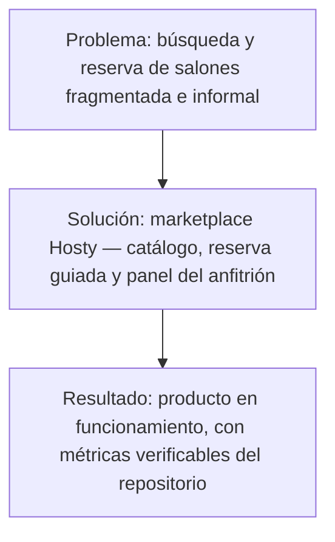
```mermaid
flowchart TD
 A["Problema: búsqueda y reserva de salones fragmentada e informal"] --> B["Solución: marketplace Hosty — catálogo, reserva guiada y panel del anfitrión"]
 B --> C["Resultado: producto en funcionamiento, con métricas verificables del repositorio"]
```

*Figura 1 — Síntesis: problema → solución (marketplace de salones) → resultados verificables.*

| Cifra | Valor | Fuente |
|---|---|---|
| Duración del proyecto | ~12,6 semanas (2026-03-29 – 2026-06-24) | M03, M04 |
| Commits en `dev` | 181 | M01 |
| Contribuidores | 5 (9 identidades Git) | M05 |
| Issues cerradas / totales | 45 / 50 | M06 |
| Pull requests mergeados / totales | 26 / 48 | M07 |
| Épicas / milestones | 7 | M08 |
| Rutas totales / protegidas | 14 / 8 | M09 |
| Tablas del modelo de datos | 6 | M10 |
| Pruebas automatizadas / archivos de prueba | 73 / 19 | M12, M13 |

*Tabla 3 — Cifras clave del proyecto.*

> **Fuente.** Todos los valores de esta tabla se citan textualmente desde la nota
> `Datos-Verificables` (M01, M03, M04, M05, M06, M07, M08, M09, M10, M12, M13); no se recalculan ni
> se aproximan en esta nota.

El detalle de estas métricas y su interpretación se desarrolla en [Métricas](#14-metricas); el balance
final entre lo planificado y lo entregado se documenta en [Conclusiones](#15-conclusiones).

---


# 2. Acrónimos

Esta sección reúne, en orden alfabético, las siglas y los términos técnicos utilizados a lo largo
del informe. Para cada uno se indica su significado y, cuando corresponde, una aclaración sobre su
aplicación concreta en la arquitectura de Hosty — en particular en los casos en que el proyecto se
aparta de la implementación más habitual del término, como ocurre con JWT, RBAC y ORM/ODM. El
resto de los acrónimos se define de forma estándar, sin adaptaciones particulares al proyecto.
Cuando corresponde, cada fila remite al número de la sección del informe donde el concepto se
desarrolla con mayor detalle.

| Sigla | Significado | Aplicación en Hosty |
|---|---|---|
| API | Application Programming Interface | Hosty consume la API REST auto-generada por PostgREST (Supabase); no expone una API propia. |
| BaaS | Backend as a Service | Supabase actúa como BaaS: no existe un servidor de aplicación propio en el proyecto. |
| CI/CD | Integración continua / despliegue continuo | GitHub Actions (`frontend-tests.yml`, `web-dev.yml`, `infra-ci.yml`). |
| CRUD | Create, Read, Update, Delete | Operaciones básicas sobre las 6 tablas del esquema `public`. |
| DER | Diagrama de Entidad-Relación | Modelo de datos completo, documentado en el Anexo I. |
| E2E | End to End | Pruebas automatizadas con Playwright sobre flujos completos de usuario. |
| JWT | JSON Web Token | Supabase Auth emite internamente un JWT por sesión; Hosty no implementa un servicio de JWT propio ni maneja tokens manualmente, sino que delega la autenticación completa en las sesiones de Supabase Auth. |
| MVP | Producto Mínimo Viable | Alcance funcional entregado en este proyecto (ver sección 1). |
| ORM/ODM | Object-Relational / Object-Document Mapping | Hosty no utiliza un ORM: accede a los datos mediante `supabase-js` sobre la API PostgREST y tipos TypeScript generados por introspección del esquema. |
| PR | Pull Request | Unidad de integración de código en GitHub. |
| QA | Quality Assurance | Aseguramiento de calidad, cubierto por pruebas automatizadas y manuales (ver sección 12). |
| RBAC | Role-Based Access Control | Hosty **no** implementa RBAC: la autorización es por propiedad (*ownership*) vía RLS (ver sección 7). |
| RLS | Row Level Security | Mecanismo de Postgres que restringe las filas visibles o editables según `auth.uid()`. |
| SPA | Single Page Application | Arquitectura del frontend, construido en React 19. |
| SQL | Structured Query Language | Lenguaje de consulta de la base de datos Postgres. |
| UX/UI | Experiencia de usuario / Interfaz de usuario | Diseño funcional y visual del producto (ver sección 8). |

*Tabla 4 — Glosario de acrónimos y términos.*

---


# 3. Introducción

## Contexto y dominio

El mercado de salones de eventos en la provincia de Tucumán está fragmentado: la oferta de
espacios para fiestas, casamientos, cumpleaños y eventos corporativos no se concentra en ningún
canal digital especializado. Su descubrimiento depende, en la práctica, de recomendaciones
personales, publicaciones en redes sociales de alcance limitado o directorios genéricos que no
están orientados a este rubro y que no permiten comparar disponibilidad, precio ni condiciones
entre distintas opciones. Como consecuencia, un organizador de eventos no cuenta con una forma
sistemática de evaluar alternativas antes de comprometerse con un salón, y un propietario que
recién comienza a ofrecer su espacio no dispone de un canal propio para ganar visibilidad frente a
organizadores que todavía no lo conocen. La coordinación de la reserva en sí —fecha, horario,
condiciones del evento— también queda librada a intercambios informales por mensajería o llamada
telefónica, sin un registro estructurado que ambas partes puedan consultar.

Hosty surge como respuesta directa a esta fragmentación: propone un punto de encuentro digital
único entre organizadores y propietarios, que reemplaza la búsqueda dispersa por un catálogo
consultable, y la coordinación manual de la reserva por un flujo guiado con validación de
disponibilidad. El desarrollo del producto tomó como referencia el comportamiento observable de
mercados similares (alojamiento, servicios para eventos) para definir cuáles de estas capacidades
constituían el núcleo mínimo indispensable del producto.

## Relevamiento de requerimientos

El alcance funcional del producto entregado se definió a partir del documento `Definicion de MVP -
HOSTY-2026040419562816.pdf`, elaborado por el equipo al inicio del proyecto como especificación de
referencia del producto a construir. Este documento fue el que fijó, en última instancia, cuáles
funcionalidades formaban parte del MVP (catálogo, reserva, panel del anfitrión) y cuáles quedaban
fuera de su alcance inicial, como el cobro en línea o las reseñas de usuarios (ver sección 1).

> **Dato simulado (SIM-01) — Contenido reconstruido en las secciones 3, 5 y 6 (cubre también SIM-02 y SIM-03).**
> El documento de alcance del MVP (`Definicion de MVP - HOSTY-2026040419562816.pdf`) fue la única
> fuente documental disponible para esta introducción, para los puntos de dolor por actor (sección
> 5, [Problema a Resolver](#5-problema-a-resolver), Tabla 9) y para los indicadores de impacto (sección 6,
> [Impacto de la Solución](#6-impacto-de-la-solucion), Tabla 10). No hubo entrevistas, encuestas ni instrumentación de
> producto registradas: lo que ese documento no cubre se completó con una reconstrucción razonada a
> partir del dominio del problema y de las funcionalidades priorizadas, no con datos verificados.
> Dos de las cuatro filas de la Tabla 10 sí tienen fuente citada (M10). Esta nota aplica a los tres
> identificadores y no se repite en cada sección; en Problema a Resolver e Impacto de la Solución
> queda sólo una referencia breve a este mismo párrafo.

## Alcance de este documento

Este informe documenta el producto, su arquitectura técnica, el proceso de gestión bajo el que se
construyó y la evidencia de calidad reunida durante el desarrollo. Deliberadamente, no reproduce
un manual de usuario final exhaustivo ni transcribe el código fuente completo del proyecto: ambos
elementos ya están disponibles en el repositorio y su transcripción no aportaría valor adicional a
una audiencia académica. La siguiente tabla resume, de forma explícita, qué contenidos entran y
cuáles quedan fuera del alcance de este documento.

| Incluye | No incluye |
|---|---|
| Descripción funcional del producto y su arquitectura técnica | Manual de usuario final extenso, paso a paso, por cada pantalla |
| Proceso de gestión del proyecto (Scrum, épicas, sprints, backlog) | Código fuente completo (se referencia el repositorio, no se transcribe) |
| Estrategia y evidencias de calidad (testing, incidencias) | Actas originales de entrevistas o encuestas no documentadas en el repositorio |
| Métricas verificables del repositorio y del proceso, con su fuente citada | Capturas de pantalla ya incorporadas — quedan como pendiente en el Anexo V |

*Tabla 5 — Alcance incluido y excluido.*

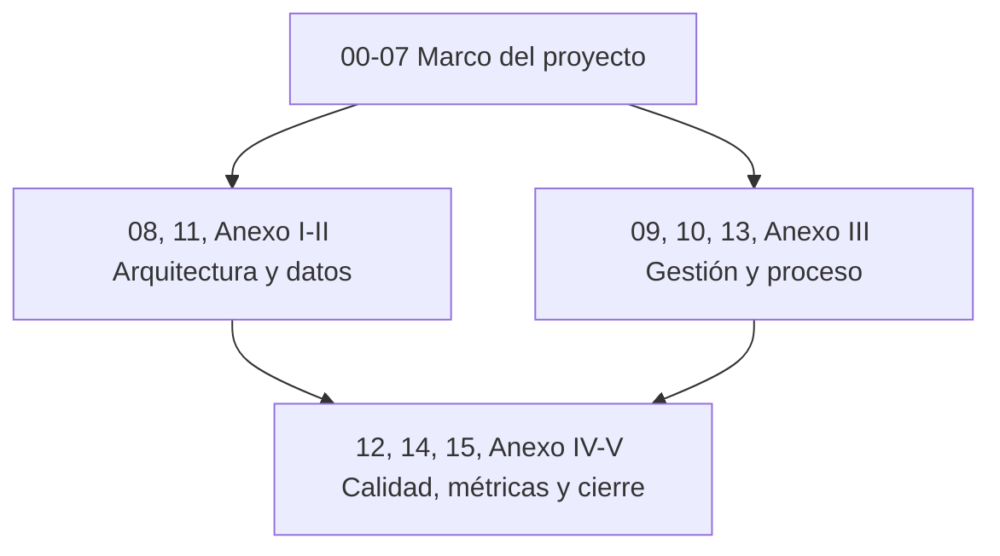
```mermaid
flowchart TD
 A["00-07 Marco del proyecto"] --> B["08, 11, Anexo I-II Arquitectura y datos"]
 A --> C["09, 10, 13, Anexo III Gestión y proceso"]
 B --> D["12, 14, 15, Anexo IV-V Calidad, métricas y cierre"]
 C --> D
```

*Figura 2 — Estructura del informe: 16 secciones + 5 anexos y sus dependencias de lectura.*

Los objetivos que se desprenden de este contexto se desarrollan en [Objetivos](#4-objetivos), y el problema
central junto con sus consecuencias se detalla en [Problema a Resolver](#5-problema-a-resolver).

---


# 4. Objetivos

## Objetivo general

**OG** — Desarrollar y poner en funcionamiento una plataforma web que centralice la búsqueda, la
comparación y la reserva de salones de eventos en la provincia de Tucumán, vinculando a
organizadores con propietarios. Este objetivo general resume el propósito completo del proyecto y
se traduce operativamente en los seis objetivos específicos que se detallan a continuación, cada
uno acotado a una capacidad concreta del producto y verificable contra el estado actual del
repositorio.

## Objetivos específicos

A partir del objetivo general se derivan seis objetivos específicos (OE1–OE6). Cada uno delimita
una capacidad concreta del sistema y se acompaña de un criterio de verificación que permite
confirmar, contra el estado real del repositorio, si la capacidad fue efectivamente entregada.

| Objetivo | Descripción | Criterio de verificación |
|---|---|---|
| OE1 | Implementar un catálogo público de salones con búsqueda, filtros y visualización geolocalizada | Ruta `/salones` operativa con filtros y mapa (Leaflet + geocodificación Nominatim) |
| OE2 | Proveer autenticación de usuarios y control de acceso a los datos basado en propiedad | Sesiones de Supabase Auth + guardas `requireAuth` sobre 8 de las 14 rutas del frontend (M09) |
| OE3 | Habilitar un flujo de reserva guiado con validación de disponibilidad y de horarios | Wizard de reserva de 3 pasos (M20), con verificación de bloqueos de disponibilidad |
| OE4 | Ofrecer al propietario un panel de gestión de sus salones y de las reservas recibidas | Panel del anfitrión con calendario y cotización de precio por reserva |
| OE5 | Asegurar la calidad mediante pruebas automatizadas e integración continua | 75 pruebas automatizadas (M12) y 3 workflows de CI/CD (M14) |
| OE6 | Documentar la arquitectura, el proceso y las métricas del proyecto de forma trazable | Este mismo vault: 35 notas —17 secciones, 5 anexos, 11 notas de apoyo y 2 de índice— con toda métrica citada a su fuente en la nota Datos-Verificables |

*Tabla 6 — Objetivos específicos y criterio de verificación.*

## Objetivo de calidad

El objetivo de calidad definido para el proyecto consiste en sostener una suite de pruebas
automatizadas que cubra los flujos críticos del frontend. A la fecha de verificación de este
informe existen 75 pruebas automatizadas distribuidas en 20 archivos de prueba — 15 pruebas
unitarias y de componente con Vitest y Testing Library, más 5 especificaciones end-to-end con
Playwright — (M12, M13). La cobertura se mide con `@vitest/coverage-v8` y se reporta bajo dos
criterios —global y sobre el código efectivamente ejercitado— en la Tabla 32 de la sección 12,
Testing y Calidad, con la medición citada a su comando reproducible. El objetivo no se formuló como
un umbral porcentual: se priorizó cubrir la lógica de dominio y de acceso a datos antes que la capa
de presentación, y la Tabla 32a documenta el resultado de esa priorización.

## Trazabilidad objetivo → épica → funcionalidad

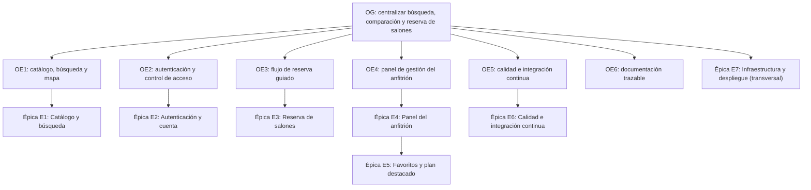
```mermaid
flowchart TD
 OG["OG: centralizar búsqueda, comparación y reserva de salones"]
 OG --> OE1["OE1: catálogo, búsqueda y mapa"] --> E1["Épica E1: Catálogo y búsqueda"]
 OG --> OE2["OE2: autenticación y control de acceso"] --> E2["Épica E2: Autenticación y cuenta"]
 OG --> OE3["OE3: flujo de reserva guiado"] --> E3["Épica E3: Reserva de salones"]
 OG --> OE4["OE4: panel de gestión del anfitrión"] --> E4["Épica E4: Panel del anfitrión"]
 E4 --> E5["Épica E5: Favoritos y plan destacado"]
 OG --> OE5["OE5: calidad e integración continua"] --> E6["Épica E6: Calidad e integración continua"]
 OG --> OE6["OE6: documentación trazable"]
 OG --> E7["Épica E7: Infraestructura y despliegue (transversal)"]
```

*Figura 3 — Árbol de objetivos: OG → OE1..OE6, con la épica asociada a cada OE.*

La siguiente tabla conecta cada objetivo específico con la épica temática correspondiente, la
funcionalidad concreta entregada y la evidencia verificable que respalda la afirmación de que
dicha funcionalidad efectivamente existe en el producto.

| Objetivo | Épica asociada | Funcionalidad entregada | Evidencia |
|---|---|---|---|
| OE1 | E1 — Catálogo y búsqueda | Catálogo público con filtros y mapa | M09, M15 |
| OE2 | E2 — Autenticación y cuenta | Sesiones de Supabase Auth, guarda `requireAuth`, RLS por `auth.uid()` | M09 |
| OE3 | E3 — Reserva de salones | Wizard de reserva de 3 pasos; estados `pending`/`confirmed`/`declined`/`cancelled` | M17, M20 |
| OE4 | E4 — Panel del anfitrión; E5 — Favoritos y plan destacado | Panel de calendario y cotización; favoritos; plan Destacado (cobro con Mercado Pago diferido, issue #45 abierto) | M10 |
| OE5 | E6 — Calidad e integración continua | 75 pruebas automatizadas y 3 workflows de CI/CD | M12, M13, M14 |
| OE6 | E7 — Infraestructura y despliegue (transversal) | Documentación trazable del proyecto (este vault) y despliegue automatizado vía GitHub Actions | M14 |

*Tabla 7 — Trazabilidad objetivo → épica → funcionalidad → evidencia.*

> **Fuente.** Las "épicas" (E1–E7) son una agrupación temática utilizada en este informe para
> organizar el contenido; no son un artefacto nativo de GitHub. Los 7 milestones reales del
> repositorio (M08) se organizan de forma cronológica por fase de entrega ("Phase 1.A: Auth &
> Onboarding", "Phase 1.B: Search & Filtering", "Phase 2: Booking & Payments", "Phase 2.B:
> Notifications", "Phase 3: Host Features", "Phase 3.B: Admin Panel", "Phase 2+: Polish &
> Optimization"), no por temática funcional. La correspondencia detallada entre épica, milestone e
> issues se documenta en la sección 9 (Planificación Scrum, Tabla 18) y en
> [Anexo III. Backlog Completo de User Stories](#anexo-iii-backlog-completo-de-user-stories) (Tabla 51).

Esta trazabilidad explícita —de objetivo a épica, funcionalidad y evidencia— es en sí misma una
forma de cumplir OE6: cada afirmación de este documento remite a un artefacto verificable, ya sea
un archivo del repositorio, una métrica de la nota Datos-Verificables o un issue del repositorio de
GitHub. Los objetivos aquí definidos se contrastan con el problema que les da origen en
[Problema a Resolver](#5-problema-a-resolver), y el balance entre lo planificado y lo entregado se retoma en
[Conclusiones](#15-conclusiones).

---


# 5. Problema a Resolver

## Problema central

Buscar, comparar y reservar un salón de eventos en la provincia de Tucumán depende, en la
actualidad, de canales informales y dispersos —recomendaciones personales, publicaciones en redes
sociales, llamados telefónicos— sin un canal único que permita comparar disponibilidad, precio y
condiciones entre distintas opciones antes de comprometerse con una reserva. Este problema afecta a
los dos perfiles de usuario de forma distinta pero relacionada: al organizador, porque no cuenta
con una forma sistemática de evaluar alternativas ni de conocer el precio real de un salón sin
contactarlo directamente; y al propietario del salón (el anfitrión), porque no dispone de un canal
propio de visibilidad comercial y debe gestionar cada reserva de forma manual, típicamente por
WhatsApp, redes sociales o llamadas telefónicas, sin un registro centralizado del estado de cada
una.

## Consecuencias para el organizador

Para el organizador de un evento, la ausencia de un catálogo centralizado se traduce en un costo de
búsqueda elevado: para conocer siquiera las opciones disponibles en una zona o rango de precio
determinado, debe recurrir a múltiples fuentes dispersas —grupos de redes sociales, recomendaciones
de conocidos, búsquedas genéricas— sin garantía de estar viendo el universo real de salones
disponibles. A esto se suma la falta de transparencia de precios: la mayoría de los salones no
publica un precio de referencia, por lo que el organizador debe iniciar una conversación individual
con cada opción antes de poder comparar presupuestos, lo que multiplica el tiempo invertido en la
etapa de decisión y dificulta descartar alternativas tempranamente.

## Consecuencias para el anfitrión

Para el propietario de un salón, la falta de un canal de visibilidad especializado limita su
alcance a la red de contactos existente o a la inversión en publicidad genérica en redes sociales,
sin un espacio donde competir en igualdad de condiciones frente a salones con mayor trayectoria. La
gestión de las reservas recibidas, además, ocurre por canales no estructurados —mensajería
instantánea, llamadas telefónicas, planillas manuales— lo que incrementa el riesgo de errores de
coordinación, como aceptar dos reservas para la misma fecha y horario, o perder el registro de una
solicitud que no llegó a confirmarse.

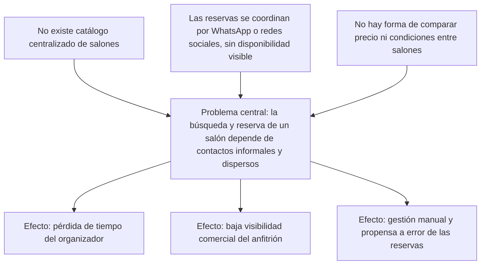
```mermaid
flowchart TD
 C1["No existe catálogo centralizado de salones"] --> P["Problema central: la búsqueda y reserva de un salón depende de contactos informales y dispersos"]
 C2["Las reservas se coordinan por WhatsApp o redes sociales, sin disponibilidad visible"] --> P
 C3["No hay forma de comparar precio ni condiciones entre salones"] --> P
 P --> E1["Efecto: pérdida de tiempo del organizador"]
 P --> E2["Efecto: baja visibilidad comercial del anfitrión"]
 P --> E3["Efecto: gestión manual y propensa a error de las reservas"]
```

*Figura 4 — Árbol de problemas: causas → problema central → efectos.*

## Problema, consecuencia y respuesta del sistema

| Problema | Consecuencia | Respuesta del sistema |
|---|---|---|
| No existe un catálogo centralizado de salones | El organizador dedica tiempo a buscar en múltiples redes sociales y grupos | Catálogo público con búsqueda y filtros en `/salones` |
| La disponibilidad de un salón no es visible de antemano | Se coordinan fechas por mensajería y, en ocasiones, se descubre el salón ya ocupado | Bloqueos de disponibilidad definidos por el anfitrión y validados en el wizard de reserva |
| No hay comparación de precio ni de condiciones entre salones | El organizador no puede estimar presupuesto sin contactar a cada salón por separado | Precio visible por salón (fijo, estimado o a cotizar) y cotización explícita por reserva |
| La gestión de reservas del anfitrión es manual (WhatsApp, teléfono, planillas) | Riesgo de doble reserva y de pérdida de mensajes o solicitudes | Panel del anfitrión con calendario y gestión del estado de cada reserva |
| Los salones nuevos o pequeños tienen baja visibilidad comercial | Dependencia casi exclusiva del boca a boca para conseguir clientes | Plan de suscripción "Destacado" que mejora la posición del salón en el catálogo |

*Tabla 8 — Problema, consecuencia y respuesta del sistema.*

## Puntos de dolor por actor y alternativas actuales

| Actor | Punto de dolor | Alternativa actual |
|---|---|---|
| Organizador | No sabe qué salones existen ni su disponibilidad real | Preguntar a conocidos o buscar publicaciones en redes sociales |
| Organizador | No puede comparar precio y condiciones entre salones sin contactarlos uno por uno | Contactar cada salón individualmente por WhatsApp o teléfono |
| Anfitrión | Baja visibilidad frente a salones con más trayectoria o presencia digital | Publicidad en redes sociales propias y recomendación boca a boca |
| Anfitrión | Gestión manual de la disponibilidad y de las reservas recibidas | Agenda física, planillas de cálculo o hilos de mensajería |

*Tabla 9 — Puntos de dolor por actor y alternativas actuales.*

*SIM-02 — reconstrucción razonada a partir del dominio del problema, no de una encuesta o
entrevista documentada; ver la nota metodológica completa en [Introducción](#3-introduccion).*

Las respuestas concretas que Hosty da a cada uno de estos puntos se retoman, en términos de
beneficio percibido, en [Impacto de la Solución](#6-impacto-de-la-solucion), y se contrastan con los objetivos
específicos definidos en [Objetivos](#4-objetivos).

---


# 6. Impacto de la Solución

## Beneficios por tipo de usuario

Para el organizador de eventos, Hosty concentra en un único lugar las tres etapas que antes
requerían canales distintos y descoordinados: la búsqueda de opciones, la comparación entre ellas y
la reserva propiamente dicha. En lugar de contactar salón por salón para conocer precio y
disponibilidad, el organizador filtra el catálogo público, compara alternativas con precio visible
y confirma una reserva mediante un flujo guiado que valida la disponibilidad antes de aceptarla.
Este cambio es particularmente relevante en la etapa de decisión, donde la posibilidad de descartar
alternativas sin necesidad de una conversación individual reduce la fricción del proceso completo
de reserva.

Para el anfitrión, el beneficio principal es doble: por un lado, un panel de gestión centralizado
que reemplaza la coordinación manual de reservas por una vista única de calendario, estado de cada
solicitud y cotización de precio por evento; por otro, una vía de visibilidad comercial adicional a
sus canales propios, tanto por aparecer en los resultados de búsqueda del catálogo público como,
opcionalmente, mediante el plan de suscripción "Destacado", que mejora su posición dentro de los
resultados. Ambos efectos son más relevantes cuanto menor es la trayectoria previa del salón, ya
que reducen su dependencia de canales de visibilidad que requieren tiempo o inversión constante
para sostenerse.

## Qué cambia respecto de la situación anterior

El cambio central que introduce Hosty es el pasaje de una coordinación manual y dispersa —apoyada
en WhatsApp, Instagram y el boca a boca— a un flujo digital centralizado, donde tanto la oferta (el
catálogo de salones) como la demanda (la reserva y sus estados) quedan registradas en un mismo
sistema, consultable por ambas partes. Este pasaje no es meramente cosmético: implica que la
disponibilidad de un salón, antes conocida sólo por su propietario, pasa a ser una condición
verificable por el sistema antes de aceptar una reserva, lo que reduce el margen de error humano en
la coordinación.

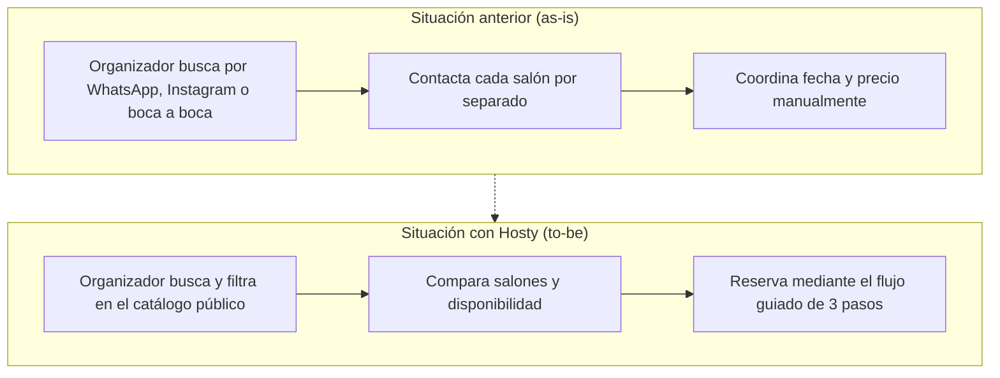
```mermaid
flowchart TD
 subgraph AsIs["Situación anterior (as-is)"]
 A1["Organizador busca por WhatsApp, Instagram o boca a boca"] --> A2["Contacta cada salón por separado"] --> A3["Coordina fecha y precio manualmente"]
 end
 subgraph ToBe["Situación con Hosty (to-be)"]
 B1["Organizador busca y filtra en el catálogo público"] --> B2["Compara salones y disponibilidad"] --> B3["Reserva mediante el flujo guiado de 3 pasos"]
 end
 AsIs -.-> ToBe
```

*Figura 5 — Proceso as-is (WhatsApp/Instagram/boca a boca) vs. to-be con Hosty.*

| Dimensión | Tipo de usuario | Impacto esperado | Indicador propuesto | Método de medición |
|---|---|---|---|---|
| Tiempo de búsqueda | Organizador | Reducción del tiempo dedicado a buscar y comparar salones | Tiempo entre el inicio de la búsqueda y la reserva confirmada | No instrumentado — requiere analítica de producto |
| Transparencia de precio | Organizador | Precio o rango visible antes de contactar al salón | Porcentaje de salones con precio fijo o estimado publicado | Consulta directa a la tabla `salones` |
| Visibilidad comercial | Anfitrión | Mayor exposición del salón dentro del catálogo | Suscripciones activas al plan Destacado | Consulta a `salon_subscriptions` (M10) |
| Centralización de la gestión | Anfitrión | Reservas gestionadas desde un único panel en lugar de canales externos | Reservas creadas y actualizadas desde el panel del anfitrión | No instrumentado — requiere adopción real por parte de los anfitriones |

*Tabla 10 — Impacto por dimensión y tipo de usuario, con indicador y método de medición.*

*SIM-03 — dos de las cuatro filas ya citan fuente verificable (M10); las otras dos son propuestas
de medición aún no instrumentadas; ver la nota metodológica completa en [Introducción](#3-introduccion).*

El impacto aquí descripto retoma directamente los puntos de dolor identificados en
[Problema a Resolver](#5-problema-a-resolver) y se refleja, en términos cuantitativos, en las métricas de
[Métricas](#14-metricas).

---


# 7. Equipo y Roles

## Composición del equipo

El proyecto fue desarrollado por un equipo de 5 integrantes, identificados de forma consolidada a
partir de 9 identidades Git distintas (M05): Juan Pablo Valdez, Juan Ignacio Mignone, Lautaro
Naglieri, Benjamín Garma y Pablo Czurylo. La distribución de roles —Product Owner, diseño de
producto y desarrollo frontend, dos desarrolladores repartidos entre frontend y backend, y un
integrante con foco en calidad (QA)— fue confirmada directamente por el equipo, y coincide con la
actividad observable en el historial de commits (detalle por integrante más abajo). El equipo **no
designó un Scrum Master formal**: la conducción del proyecto fue un co-liderazgo compartido entre
el Product Owner (Valdez), que además llevó la infraestructura, y el responsable de diseño de
producto (Mignone), que asumió la conducción técnica de la integración en los *sprints* 2 y 4.
Estas responsabilidades reflejan tanto la confirmación directa del equipo como el área funcional
donde cada integrante concentró su trabajo, verificable en el historial de commits del
repositorio, y no una asignación fija o exclusiva: la naturaleza de un equipo de 5 personas
trabajando sobre un mismo repositorio implica solapamientos razonables entre áreas.

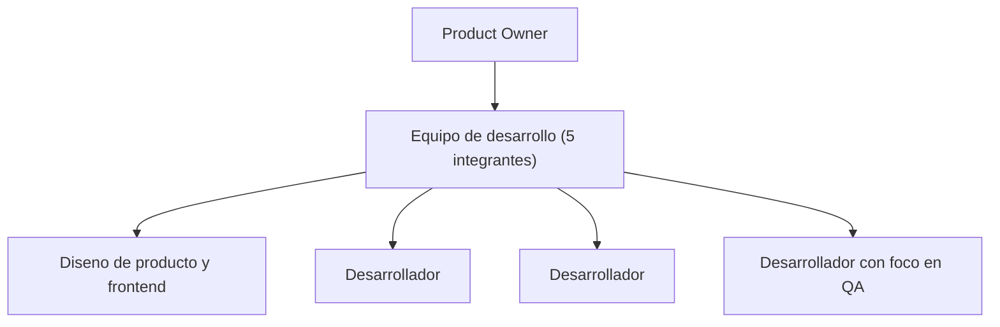
```mermaid
flowchart TD
 PO["Product Owner"] --> DEV["Equipo de desarrollo (5 integrantes)"]
 DEV --> D1["Diseno de producto y frontend"]
 DEV --> D2["Desarrollador"]
 DEV --> D3["Desarrollador"]
 DEV --> D4["Desarrollador con foco en QA"]
```

*Figura 6 — Organigrama del equipo: Product Owner y equipo de desarrollo (5 integrantes).*

| Integrante | Legajo | Rol de equipo | Responsabilidades principales |
|---|---|---|---|
| Valdez, Juan Pablo | UIA7 0262 | Product Owner | Arquitectura general; catálogo de salones, panel del anfitrión, flujo de reserva y autenticación; infraestructura de despliegue (CI/CD, Terraform); co-liderazgo del equipo junto con Mignone — mayor volumen de contribuciones del equipo |
| Mignone, Juan Ignacio | UIA7 0298 | Diseño de producto y desarrollo frontend | Sistema de diseño de la aplicación (Brandbook v1.0: isotipo, tokens de marca y tipografía); interfaz del catálogo de salones, página de inicio, panel del anfitrión y favoritos. Ejerció el co-liderazgo del equipo junto con el Product Owner, con conducción técnica de la integración de cambios durante los *sprints* 2 y 4 |
| Martinez Naglieri, Lautaro David | UIA7 0286 | Desarrollador | Catálogo de salones, panel del anfitrión y flujo de reserva |
| Garma, Benjamin | UIA7 0362 | Desarrollador con foco en QA | Infraestructura de pruebas (Vitest, Playwright, Cypress) y el workflow de CI `frontend-tests.yml` |
| Czurylo, Juan Pablo | UIA7 0331 | Desarrollador | Búsqueda y filtrado de salones (paginación, persistencia de filtros en URL); motor de reservas (flujo de reserva, confirmación); sistema de notificaciones de reserva por email, implementado en la rama `feat/email-notifications` (PR #96, aún no fusionada a `dev`) |

*Tabla 11 — Integrantes, legajo, rol de equipo y responsabilidades.*

> **Fuente.** Evidencia por integrante para la columna "Rol de equipo" y "Responsabilidades
> principales". **Valdez** (Product Owner): único colaborador con permisos de administrador del
> repositorio y autor del 90 % de las issues (45 de 50) — M33, M34 —, además de la autoría casi
> exclusiva del *backend* NestJS y la infraestructura Terraform descartados en el *sprint* 2 (ver
> Tabla 37a). **Mignone** (Diseño de producto y desarrollo frontend): *commits* que introducen el
> sistema de diseño —`apply Brandbook v1.0 — isotipo, tokens, typography`, `redesign v2 — Design
> Handoff tokens, editorial hero, HostyBadge system`, `update HostyLogo isotipo shape`— y mayor
> volumen de *commits* e integración de *pull requests* en los *sprints* 2 y 4. **Naglieri**
> (Desarrollador): mayor densidad de *commits* en `features/salones`, `features/host` y
> `features/bookings`. **Garma** (Desarrollador con foco en QA): archivos de configuración de
> pruebas (Vitest, Playwright, Cypress) y el *workflow* de CI que aportó. **Czurylo**
> (Desarrollador): `features/bookings` y `features/salones`, más la rama `feat/email-notifications`
> (M35). Comandos: `git log --author --since --until`, `git log --merges --author`, `gh api
> repos/.../collaborators`, `gh issue list --json author` (verificado 2026-08-03; detalle completo
> en `Datos-Verificables` M33–M35).

> **Fuente.** Título formal de cada rol de equipo, confirmado directamente por el equipo
> (Mignone, co-liderazgo, 2026-08-04): Product Owner e infraestructura (Valdez), diseño de
> producto y desarrollo frontend con co-liderazgo (Mignone), desarrollo frontend/backend repartido
> entre Naglieri y Czurylo, y testing (Garma). No existe un acta formal escrita con estos títulos,
> pero la confirmación directa del equipo, sumada a la evidencia verificable de la columna
> "Responsabilidades principales" (M33–M35), cierra la brecha que antes dejaba este dato como una
> reconstrucción no validada.

La conducción del equipo, por lo tanto, no fue estática a lo largo del proyecto: en los *sprints* 2
y 4 la coordinación de la integración recayó en el responsable de diseño de producto. Esa rotación
no responde a una decisión de proceso documentada, sino a la disponibilidad efectiva de los
integrantes en cada período, y se refleja tanto en el volumen de *commits* como en quién integró
los *pull requests* de cada uno.

> **Fuente.** `git log --author --since --until` acotado a los rangos de *sprint* de la Tabla
> 21, y `git log --merges --author` para la integración de *pull requests* (verificado 2026-08-03).

## Contribuciones por identidad Git

| Integrante | Commits (todas las identidades) | Porcentaje del total |
|---|---|---|
| Juan Pablo Valdez | 140 | 59,3 % |
| Juan Ignacio Mignone | 45 | 19,1 % |
| Lautaro Naglieri | 33 | 14,0 % |
| Benjamín Garma | 10 | 4,2 % |
| Pablo Czurylo | 8 | 3,4 % |

*Tabla 12 — Contribuciones por identidad Git.*

> **Fuente.** M05 / M02: `git shortlog -sne --all`. El detalle de cada identidad Git por
> integrante se documenta en `Datos-Verificables`; esta tabla sólo consolida el porcentaje sobre
> el total de 236 commits (M02).

**Alcance de esta tabla: qué mide y qué no mide.** El volumen de *commits* describe la actividad
registrada en el historial, no la magnitud ni el valor del aporte de cada integrante, y tres
factores verificables lo distorsionan en este proyecto. Primero, **34 de los 140 *commits* del
integrante con mayor volumen —un 24 %— corresponden a la rama `staging`**, la infraestructura del
*backend* NestJS que se descartó en el *sprint* 2 (ver la sección 14, Tabla 37a) y que no aportó
código al producto entregado. Segundo, el historial registra **9 identidades Git para 5 personas**
(M05), y quien integra las ramas acumula *commits* de fusión que no representan trabajo propio.
Tercero, el tamaño de un *commit* no está normalizado: los 10 *commits* de Benjamín Garma
introducen la infraestructura completa de pruebas —Vitest, Playwright y Cypress— y el *workflow* de
integración continua que hoy bloquea las fusiones que no pasan la suite.

La distribución de responsabilidades por área, que es la lectura pertinente del reparto de trabajo,
es la de la Tabla 11.

## Roles de usuario, permisos y mecanismo de autorización

A diferencia de los roles de equipo descriptos arriba, Hosty **no tiene una tabla de roles de
usuario ni un esquema de control de acceso basado en roles (RBAC)**. La autorización se resuelve
exclusivamente por propiedad (*ownership*): las políticas de seguridad a nivel de fila (RLS) de
Postgres restringen qué filas puede leer o modificar cada usuario autenticado según `auth.uid()`,
sin que exista un campo de rol que se consulte para decidir un permiso. Este enfoque implica que
ser anfitrión no es un estado que se activa mediante un campo de configuración o un permiso
otorgado por un administrador, sino una consecuencia directa de poseer al menos un registro en la
tabla `salones`: cualquier usuario autenticado puede convertirse en anfitrión publicando un salón,
sin necesidad de una aprobación previa.

| Perfil | Cómo se determina | Permisos principales | Mecanismo de autorización |
|---|---|---|---|
| Visitante anónimo | No autenticado | Ver el catálogo público y el detalle de cada salón | Ninguno — datos públicos vía políticas RLS de lectura |
| Usuario autenticado (organizador) | Sesión activa de Supabase Auth | Reservar, marcar favoritos, ver sus propias reservas | RLS: filas visibles o editables según `auth.uid()` |
| Anfitrión | Implícito: posee al menos una fila en `salones` | Gestionar sus salones, ver y responder reservas recibidas, suscribirse al plan Destacado | RLS: acceso restringido a filas de `salones`/`bookings` donde el propietario coincide con `auth.uid()` |
| Administrador | No implementado | — | — (ver hallazgo a continuación) |

*Tabla 13 — Roles de usuario, permisos y mecanismo de autorización.*

Esta decisión de diseño simplifica el modelo de permisos del sistema, a costa de no contar con una
jerarquía de administración: cualquier limitación operativa (por ejemplo, moderar un salón
inapropiado) requiere hoy una intervención manual directa sobre la base de datos, dado que no
existe un perfil de administrador funcional en la aplicación.

> **Fuente.** El issue #46 ("feat(admin): panel de aprobación y moderación de salones")
> figura cerrado en el repositorio, pero no existe en el código ninguna ruta, componente o columna
> de aprobación/moderación asociada (`grep` sobre `frontend/src/` y `supabase/migrations/*.sql`
> sin resultados): el panel de administrador no fue implementado pese al cierre del issue. La
> cadena de autorización por propiedad se ilustra gráficamente en el Anexo I (Figura 29).

La composición y las responsabilidades del equipo descriptas aquí se retoman, en clave de proceso
Scrum, en [Planificación Scrum](#9-planificacion-scrum); el detalle técnico de la arquitectura de autorización se
desarrolla en [Arquitectura](#11-arquitectura).

---


# 8. Diseño y Desarrollo

Esta sección describe el proceso de diseño seguido, el inventario funcional de pantallas
organizado por tipo de usuario, la arquitectura de carpetas que materializa esas pantallas en
código, y las decisiones de UX/UI adoptadas junto con su justificación. Los diagramas de flujo de
cada proceso de negocio (búsqueda, reserva, publicación, estados de una reserva, favoritos) se
documentan en detalle en [Anexo II. Diagramas de Flujo Complementarios](#anexo-ii-diagramas-de-flujo-complementarios) para evitar duplicación, y la
justificación arquitectónica de esta organización de carpetas se profundiza en
[Arquitectura](#11-arquitectura).

## 8.1 Proceso de diseño

El desarrollo de la interfaz siguió un proceso iterativo de cinco etapas, sin una fase de diseño
visual centralizada previa a la implementación: relevamiento de requerimientos por módulo,
wireframes de baja fidelidad, definición del sistema de diseño (tokens de marca en
`frontend/src/index.css`), implementación directa con componentes de `shadcn/ui`, y revisión
funcional antes de cada entrega. Las etapas de design system e implementación se retroalimentaron
de forma iterativa a medida que se incorporaron nuevos módulos (reservas, panel de anfitrión, plan
destacado).

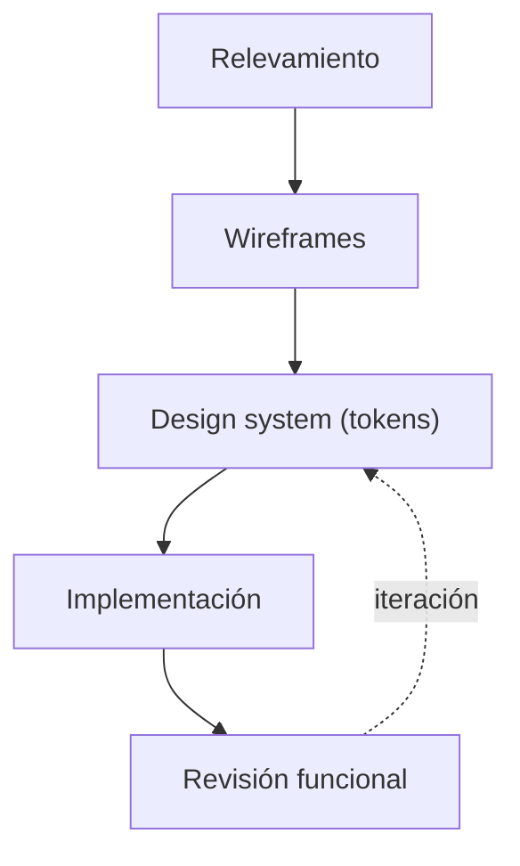
```mermaid
flowchart TD
 A[Relevamiento] --> B[Wireframes]
 B --> C["Design system (tokens)"]
 C --> D[Implementación]
 D --> E[Revisión funcional]
 E -.iteración.-> C
```

*Figura 7 — Proceso de diseño: relevamiento → wireframes → design system → implementación → revisión.*

## 8.2 Módulos y pantallas por tipo de usuario

El inventario de pantallas se organiza en tres tipos de usuario, coherentes con la aclaración de
[Equipo y Roles](#7-equipo-y-roles) de que Hosty no tiene una tabla de roles: "anfitrión" es una condición
derivada de poseer al menos un registro propio en `salones`, no un rol almacenado.

**Visitante (sin sesión).** La Home (`/`) presenta salones destacados
(`useFeaturedSalones`); `/salones` ofrece búsqueda con filtros y alterna entre vista de lista y
vista de mapa (Leaflet); `/salones/$id` muestra el detalle completo de un salón (fotos, precio,
servicios y disponibilidad). `/login` y `/register` completan el acceso.

**Usuario autenticado (organizador).** `/mis-reservas` lista las reservas propias con su estado;
`/mis-favoritos` lista los salones marcados; `/mi-perfil` permite actualizar nombre y contraseña;
`/salones/$id/reservar` implementa el flujo de reserva guiado de tres pasos.

**Anfitrión.** `/host/dashboard` centraliza los salones publicados y las reservas recibidas;
`/host/create` y `/host/$id/edit` exponen el mismo asistente de publicación de cuatro pasos, en
modo creación y edición respectivamente; `/host/$bookingId` permite revisar, cotizar, confirmar o
rechazar una reserva puntual.

| Ruta | Componente | Tipo de usuario |
|---|---|---|
| `/` | `HomePage` | Visitante |
| `/salones` | Layout (`Outlet`) | Visitante |
| `/salones/` | `SalonesPage` | Visitante |
| `/salones/$id` | `SalonDetailPage` | Visitante |
| `/login` | `LoginPage` | Visitante |
| `/register` | `RegisterPage` | Visitante |
| `/salones/$id/reservar` | `BookingFlow` | Usuario autenticado |
| `/mis-reservas` | `MyBookingsPage` | Usuario autenticado |
| `/mis-favoritos` | `MisFavoritosPage` | Usuario autenticado |
| `/mi-perfil` | `MiPerfilPage` | Usuario autenticado |
| `/host/dashboard` | `HostDashboardPage` | Anfitrión |
| `/host/create` | `CreateSalonPage` | Anfitrión |
| `/host/$id/edit` | `EditSalonPage` | Anfitrión |
| `/host/$bookingId` | `BookingDetailPage` | Anfitrión |

*Tabla 15 — Inventario de pantallas: ruta, componente y tipo de usuario.*

La ruta `/salones` es un caso particular: no renderiza una pantalla propia, sino un `Outlet` de
TanStack Router que agrupa `/salones/`, `/salones/$id` y `/salones/$id/reservar` bajo un mismo
segmento de URL. Se incluye en el inventario porque el comando de conteo de M09 la contabiliza
como archivo de ruta, aun cuando no tiene contenido visual propio.

> **Fuente.** M09: 14 rutas, 6 públicas / 8 protegidas con `requireAuth`
> (`frontend/src/routes/`).

## 8.3 Mapa de navegación

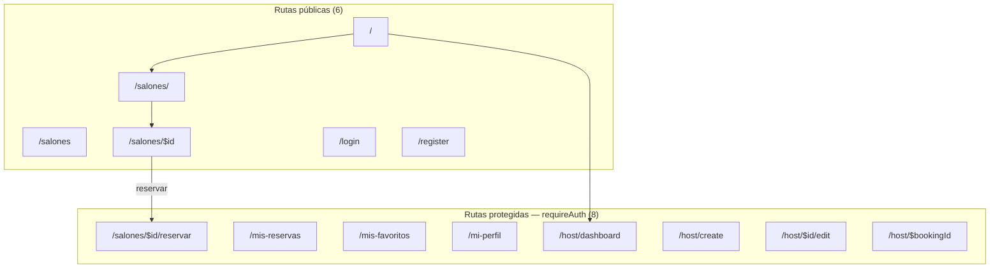
```mermaid
flowchart TD
 subgraph Publicas["Rutas públicas (6)"]
 R1["/"]
 R2["/salones"]
 R3["/salones/"]
 R4["/salones/$id"]
 R5["/login"]
 R6["/register"]
 end
 subgraph Protegidas["Rutas protegidas — requireAuth (8)"]
 P1["/salones/$id/reservar"]
 P2["/mis-reservas"]
 P3["/mis-favoritos"]
 P4["/mi-perfil"]
 P5["/host/dashboard"]
 P6["/host/create"]
 P7["/host/$id/edit"]
 P8["/host/$bookingId"]
 end
 R1 --> R3
 R3 --> R4
 R4 -->|reservar| P1
 R1 --> P5
```

*Figura 8 — Mapa de navegación: 14 rutas — 6 públicas / 8 protegidas (`requireAuth`).*

## 8.4 Anatomía de una feature

El código de cada módulo funcional sigue una organización por *feature*, no por tipo técnico de
archivo: cada carpeta bajo `features/<nombre>/` agrupa sus propios `components/`, `api/` (hooks de
TanStack Query sobre `supabase-js`) y `types.ts`. Las rutas de `routes/` son deliberadamente
delgadas — sólo declaran el path, la validación de búsqueda (Zod) y, cuando corresponde, el guard
`requireAuth` — y delegan toda la lógica visual y de datos en el componente de la feature
correspondiente.

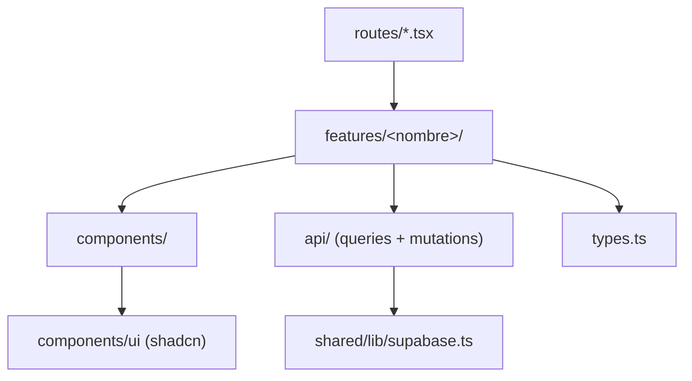
```mermaid
flowchart TD
 Route["routes/*.tsx"] --> Feature["features/&lt;nombre&gt;/"]
 Feature --> Components["components/"]
 Feature --> Api["api/ (queries + mutations)"]
 Feature --> Types["types.ts"]
 Api --> SharedLib["shared/lib/supabase.ts"]
 Components --> UI["components/ui (shadcn)"]
```

*Figura 9 — Anatomía de una feature: `features/<n>/{components,api,types.ts}` ↔ `routes/` ↔ `shared/lib`.*

## 8.5 Decisiones de UX/UI

La paleta e identidad visual provienen del `docs/hosty-brandbook.pdf` (v1.0, abril 2026): el
isotipo combina la letra "H" con un arco —la forma de una entrada o umbral— y un punto central que
representa un pin de ubicación, coherente con un producto de búsqueda geolocalizada de salones.

| Token | Valor | Uso |
|---|---|---|
| `--color-coral` | `#E8452A` | Acción principal (`primary`) |
| `--color-ink` | `#1C2B3A` | Texto y jerarquía visual (`foreground`) |
| `--color-bone` | `#FAF8F5` | Fondo cálido (`background`) |
| `--color-amber` | `#F5A623` | Acento cálido (`accent`) |
| `--font-sans` | Plus Jakarta Sans | Tipografía principal (encabezados y cuerpo) |
| `--font-serif-accent` | Instrument Serif | Acento tipográfico puntual |

*Tabla 14 — Tokens de marca y tipografía.*

> **Fuente.** `docs/hosty-brandbook.pdf` (págs. 4, 8-9); `frontend/src/index.css` (bloque
> `@theme`).

| Decisión | Justificación |
|---|---|
| Tokens de marca vía Tailwind v4 CSS-first (`@theme`) | Sin configuración JS separada; un único punto de verdad para color y tipografía |
| Diseño mobile-first | La búsqueda y reserva de un salón ocurren mayormente desde el celular |
| `shadcn/ui` sobre primitivos Radix | Componentes accesibles con código propio, sin dependencia de un paquete de UI cerrado |
| Búsqueda con mapa (Leaflet + Nominatim) | Experiencia geolocalizada específica de Tucumán sin costo de licencia de mapas |
| Asistentes ("wizards") de varios pasos para reserva (3) y publicación (4) | Reduce la carga cognitiva de formularios largos y permite validar por etapas |
| Iconografía outline uniforme (`lucide-react`, `strokeWidth=1.5`) | Coherente con el pack de íconos *outline* definido en el brandbook |

*Tabla 16 — Decisiones de UX/UI y su justificación.*

La escala tipográfica de encabezados también proviene del sistema de diseño: `h1` usa peso 800,
`h2` peso 700 y `h3`/`h4` peso 600, todos sobre la misma familia Plus Jakarta Sans, replicando la
jerarquía definida en el brandbook (H1/H2/H3 en la sección de tipografía) en lugar de introducir
pesos ad hoc por componente. El modo oscuro reutiliza los mismos tokens semánticos
(`--background`, `--foreground`, etc.) con valores HSL alternativos, de modo que ningún componente
necesita lógica condicional de tema: sólo cambia la clase `dark` en el elemento raíz.

## 8.6 Diagramas de flujo principales

El detalle diagramado de cada proceso de negocio —búsqueda y filtrado, reserva guiada,
publicación de un salón, máquina de estados de una reserva y gestión de favoritos/plan
destacado— se documenta como Figuras 30 a 34 en [Anexo II. Diagramas de Flujo Complementarios](#anexo-ii-diagramas-de-flujo-complementarios), para mantener en
esta sección únicamente el diseño de la interfaz y no duplicar diagramas de proceso.

---


# 9. Planificación Scrum

El proyecto se organizó bajo el marco Scrum, con iteraciones quincenales y un backlog gestionado
íntegramente como issues de GitHub, agrupadas en épicas y priorizadas mediante un tablero de
gestión visual. Esta sección documenta las épicas, las historias de usuario destacadas, los
criterios de aceptación, las reglas de trabajo del equipo, el calendario de sprints y el
mecanismo de seguimiento utilizado.

## Ceremonias y cadencia

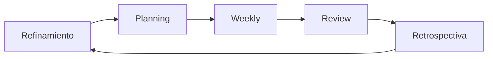
```mermaid
flowchart LR
 A[Refinamiento] --> B[Planning]
 B --> C[Weekly]
 C --> D[Review]
 D --> E[Retrospectiva]
 E --> A
```

*Figura 10 — Iteración Scrum: refinamiento, planificación, weekly, revisión y retrospectiva.*

> **Dato simulado (SIM-09) — Ceremonias Scrum y cadencia.**
> El equipo confirmó (2026-08-04) que la sincronización del equipo de desarrollo fue semanal
> ("*weekly*"), no diaria — ajustada a la disponibilidad real de un equipo part-time/estudiantil —,
> corregido en la fila correspondiente de la Tabla 17. El resto de las ceremonias (refinamiento,
> planning, review y retrospectiva) sigue sin acta formal en el repositorio: su frecuencia y
> participantes, en la Tabla 17 que aparece a continuación, son una reconstrucción plausible para
> un equipo estudiantil de cinco integrantes que trabaja con Scrum sobre issues de GitHub.

| Ceremonia | Frecuencia | Participantes | Propósito |
|---|---|---|---|
| Refinamiento | Semanal | Equipo completo | Detallar y estimar issues antes del siguiente sprint |
| Planning | Inicio de cada sprint | Equipo completo | Seleccionar y comprometer el alcance del sprint |
| Weekly | Semanal | Equipo de desarrollo | Sincronizar avance y destrabar bloqueos |
| Review | Cierre de cada sprint | Equipo + Product Owner | Demostrar el incremento funcional |
| Retrospectiva | Cierre de cada sprint | Equipo completo | Identificar mejoras de proceso |

*Tabla 17 — Ceremonias Scrum y cadencia.*

## Épicas

El backlog se organiza en siete épicas, correspondidas con los siete hitos (*milestones*) reales
del repositorio (M08). La correspondencia se estableció por afinidad temática de las issues que
integra cada hito; el detalle issue por issue se documenta en [Anexo III. Backlog Completo de User Stories](#anexo-iii-backlog-completo-de-user-stories)
(T51), donde cada fila cita el hito real de GitHub sin pasar por esta simplificación en siete
categorías.

| Épica | Objetivo | Hito(s) de GitHub asociados | Estado |
|---|---|---|---|
| E1 — Catálogo y búsqueda | Catálogo público con búsqueda, filtros y geolocalización | Phase 1.B: Search & Filtering; Phase 3.B: Admin Panel (moderación de publicaciones) | Completada (7/7 issues) |
| E2 — Autenticación y cuenta | Registro, login y alta de cuenta de organizador/anfitrión | Phase 1.A: Auth & Onboarding | Completada (3/3) |
| E3 — Reserva de salones | Flujo de reserva guiado y cobro de comisión | Phase 2: Booking & Payments | En curso (3/4; #45 abierta) |
| E4 — Panel del anfitrión | Gestión de reservas, precios, agenda y notificaciones | Phase 3: Host Features; Phase 2.B: Notifications | Completada (6/6) |
| E5 — Favoritos y plan destacado | Favoritos del organizador y suscripción destacada del anfitrión | Sin hito propio (issue #47 + issues #75/#88 sin hito) | Completada (3/3) |
| E6 — Calidad e integración continua | Pruebas automatizadas y estabilización del pipeline de CI | Subconjunto de Phase 2+: Polish & Optimization | Completada (4/4) |
| E7 — Infraestructura y despliegue | Infraestructura de producción y optimización de rendimiento | Subconjunto de Phase 2+: Polish & Optimization | En curso (3/4; #35 abierta) |

*Tabla 18 — Épicas: código, objetivo y estado.*

> **Fuente.** M06 (issues totales/cerradas), M08 (7 milestones): `gh issue list --state all`,
> `gh api .../milestones` (verificado 2026-07-28); ver `Datos-Verificables`.

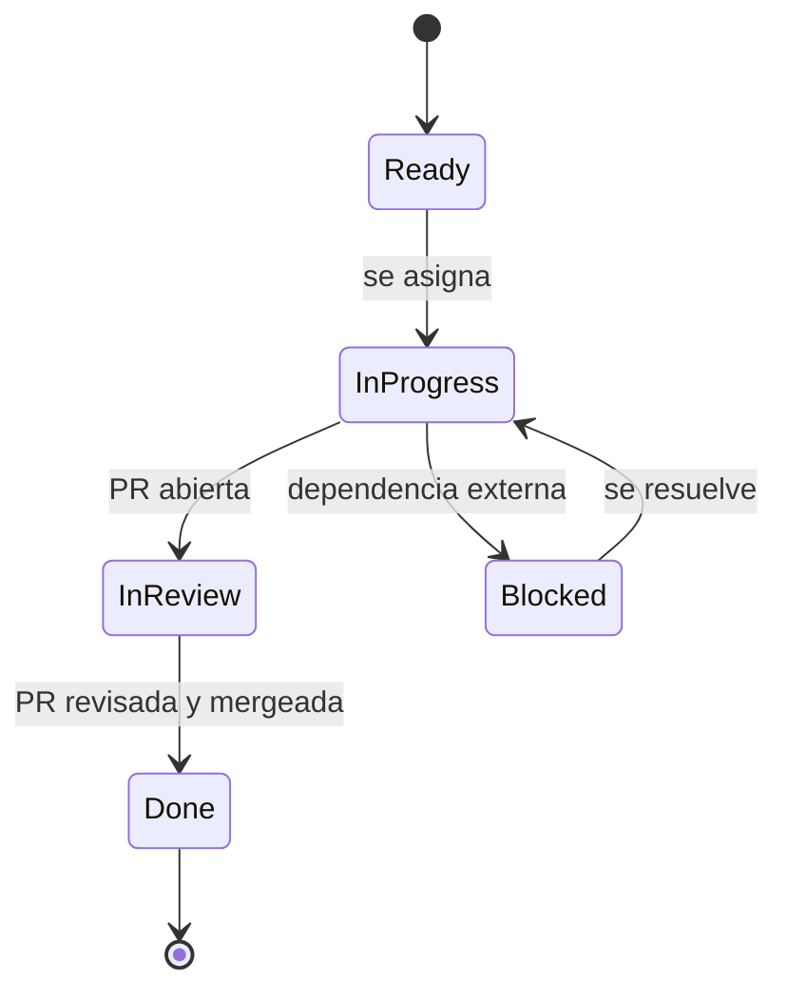
```mermaid
stateDiagram-v2
 [*] --> Ready
 Ready --> InProgress: se asigna
 InProgress --> InReview: PR abierta
 InReview --> Done: PR revisada y mergeada
 InProgress --> Blocked: dependencia externa
 Blocked --> InProgress: se resuelve
 Done --> [*]
```

*Figura 11 — Ciclo de vida de un issue en GitHub Projects v2: Todo → In Progress → In Review → Done (+ Blocked).*

> **Fuente.** M19: distribución real de estados en el tablero #4 al momento de la
> verificación — Done: 45, Ready: 4, In review: 1 (`gh project item-list 4 --owner
> juanpablovaldez --format json`, 2026-07-28). Los estados "In Progress" y "Blocked" existen en el
> esquema del tablero pero no tienen issues asignadas actualmente.

> **Fuente.** Captura del tablero #4, vista "Team items" (2026-07-29). La distribución
> visible (Ready: 4, In review: 1, Done: 45) coincide con la verificación de M19 citada arriba.


*Figura 12 — Tablero de gestión del proyecto en GitHub Projects v2 (board #4).*

## User stories destacadas

La siguiente selección de 15 historias, sobre un total de 50 issues (M06), cubre las siete
épicas. Los story points citados no son una estimación de este informe: corresponden al campo
"Size" registrado por el propio equipo en el tablero de GitHub Projects v2, con escala de
Fibonacci (1, 2, 3, 5, 8, 13, 21).

| Historia | Como / quiero / para | SP | Épica |
|---|---|---|---|
| #13 | Como usuario, quiero registrarme e iniciar sesión para acceder a mi cuenta y a las funciones protegidas | 13 | E2 |
| #18 | Como anfitrión, quiero un panel para ver y administrar mis salones publicados | 13 | E2 |
| #19 | Como anfitrión, quiero un asistente guiado de publicación para cargar un salón sin errores | 21 | E2 |
| #11 | Como organizador, quiero buscar y filtrar salones para encontrar opciones acordes a mi evento | 13 | E1 |
| #15 | Como organizador, quiero ver el detalle de un salón con galería y características para decidir si reservarlo | 13 | E1 |
| #30 | Como organizador, quiero paginación o scroll infinito en el listado para explorar más salones | 8 | E1 |
| #16 | Como organizador, quiero seleccionar fecha y horario disponibles para reservar sin conflictos | 21 | E3 |
| #17 | Como organizador, quiero confirmar mi reserva y verla en mi panel para hacer seguimiento de su estado | 13 | E3 |
| #31 | Como organizador, quiero completar el flujo de reserva de punta a punta para concretar el alquiler | 21 | E3 |
| #65 | Como anfitrión, quiero confirmar o rechazar reservas recibidas para controlar la ocupación de mi salón | 13 | E4 |
| #66 | Como anfitrión, quiero definir precios flexibles y servicios adicionales para ajustar mi oferta | 8 | E4 |
| #67 | Como anfitrión, quiero bloquear fechas en un calendario para evitar reservas en días no disponibles | 5 | E4 |
| #47 | Como anfitrión, quiero suscribirme a un plan destacado para aumentar la visibilidad de mi salón | 13 | E5 |
| #21 | Como equipo de desarrollo, quiero pruebas end-to-end del flujo de reserva para validar el camino crítico | 13 | E6 |
| #22 | Como equipo de desarrollo, quiero infraestructura de producción con CDN y HTTPS para publicar con seguridad | 8 | E7 |

*Tabla 19 — User stories destacadas: formato Como/quiero/para, story points y épica.*

> **Fuente.** M25: story points reales del campo "Size" del tablero #4 —
> `gh project item-list 4 --owner juanpablovaldez --format json` (verificado 2026-07-28); 40 de las
> 50 issues del backlog tienen el campo cargado. Ver `Datos-Verificables`.

### Ejemplo de criterio de aceptación

> **Dato simulado (SIM-12) — Ejemplo de criterio de aceptación (formato Given/When/Then).**
> El issue original no registra sus criterios de aceptación en formato Given/When/Then. La
> redacción siguiente se reconstruye a partir del comportamiento observable en
> `BookingFlow.tsx` y `useCreateBooking` para ilustrar el método de trabajo del equipo, sin
> constituir evidencia documental del proceso real.

**Historia**: Como organizador, quiero reservar un salón en una fecha y horario disponibles
(#16, #31).

- **Given** un salón publicado con disponibilidad para el rango de fechas solicitado.
- **When** el organizador completa el asistente de reserva (fecha/horario, datos del evento,
 confirmación) y no existe superposición con un bloqueo de disponibilidad ni con otra reserva
 confirmada.
- **Then** el sistema crea la reserva con estado `pending` y la expone en el panel del
 organizador y en el panel del anfitrión para su revisión.

## Definition of Ready y Definition of Done

> **Dato simulado (SIM-10) — Definition of Ready (DoR).**
> No hay un documento de DoR versionado en el repositorio. Las filas "DoR" de la Tabla 20 que
> aparece a continuación (Definition of Ready y Definition of Done) reconstruyen un criterio
> plausible para un equipo estudiantil de cinco integrantes.

> **Dato simulado (SIM-11) — Definition of Done (DoD).**
> Ídem SIM-10: las filas "DoD" de la misma Tabla 20 son una reconstrucción plausible, no un acta
> registrada del equipo.

| Tipo | Criterio |
|---|---|
| DoR | La historia tiene una descripción clara, un criterio de aceptación esbozado y no depende de otra historia sin resolver |
| DoR | La historia está estimada en story points y priorizada en el tablero antes del planning |
| DoD | El código pasa lint, typecheck y la suite de pruebas automatizadas (M12) |
| DoD | La funcionalidad fue revisada por al menos un integrante distinto del autor (pull request) |
| DoD | La historia se verificó manualmente contra su criterio de aceptación antes de cerrarse |

*Tabla 20 — Definition of Ready y Definition of Done.*

## Plan de sprints

> **Dato simulado (SIM-13) — Límites y foco de los sprints.**
> El equipo confirmó (2026-08-04) que trabajó con sprints formalmente definidos, con story points y
> un objetivo de sprint ("*sprint goal*") explícito por iteración — no es una simulación que el
> proyecto haya tenido sprints reales. Lo que no está disponible para este informe es el texto
> puntual de esos objetivos ni los límites de fecha exactos tal como se registraron originalmente:
> las etiquetas "S1"–"S5", sus rangos de fecha y su foco temático, en la Tabla 21 que aparece a
> continuación, se infieren a partir de la densidad real de commits y de los clústeres de fecha de
> las migraciones de Supabase. Los conteos de commits e issues cerradas por sprint sí son reales y
> verificables (M23, M24).

| Sprint | Rango | Foco | Commits | Issues cerradas | Decisión / resultado |
|---|---|---|---|---|---|
| S1 | 2026-03-29 – 2026-04-19 | Arranque, arquitectura base, home | 50 | 0 | Scaffolding inicial; sin cierres formales de issues aún |
| S2 | 2026-04-20 – 2026-05-15 | Catálogo, filtros, detalle de salón | 38 | 4 | Migración de NestJS a Supabase (commit `3a89616`) |
| S3 | 2026-05-16 – 2026-06-05 | Autenticación, carga de imágenes (Storage) | 39 | 16 | Mayor concentración de cierres del proyecto |
| S4 | 2026-06-06 – 2026-06-13 | Panel de anfitrión, reservas, precios y bloqueos | 13 | 12 | Corrección del `CHECK` de `bookings` a 4 estados |
| S5 | 2026-06-14 – 2026-06-24 | Plan destacado, coordenadas, favoritos | 41 | 13 | Consolidación de 7 PRs en la PR #93 |

*Tabla 21 — Plan de sprints: cantidad, duración, foco y resultado.*

> **Fuente.** M23 (commits por sprint) y M24 (issues cerradas por sprint), calculados para
> este informe: `git log dev --since --until --oneline | wc -l` y `gh issue list --state closed
> --json number,closedAt` por ventana (verificado 2026-07-28). Ver `Datos-Verificables`. El
> detalle cronológico se desarrolla en [Ejecución por Sprint](#13-ejecucion-por-sprint).

**Herramienta de gestión**: el seguimiento del backlog y del avance de cada sprint se realiza en
GitHub Projects v2, tablero #4 ("Hosty"), con campos de estado, tamaño (story points), objetivo de
sprint e hito (M19), integrado directamente con las issues y *pull requests* del repositorio.

## Retrospectivas

> **Dato simulado (SIM-14) — Retrospectiva S1–S2 · SIM-15 — Retrospectiva S3–S4 ·.**
> SIM-16 — Retrospectiva S5
> No existe acta de retrospectiva registrada. La Tabla 22 que aparece a continuación
> (retrospectivas) reconstruye de forma plausible el contenido a partir de fricciones observables
> en el historial (issues de re-trabajo, la corrección del `CHECK` de `bookings`, el evento de
> consolidación de PRs) y no debe interpretarse como transcripción real de una ceremonia.

| Sprints | Problema | Impacto | Acción correctiva |
|---|---|---|---|
| S1–S2 | Se subestimó el esfuerzo de migrar de NestJS a Supabase | Retrabajo de la capa de acceso a datos a mitad de sprint | Congelar decisiones de arquitectura de backend antes del planning siguiente |
| S3–S4 | Las políticas RLS por tabla se diseñaron de forma reactiva, issue por issue | El estado `declined` quedó implementado en el frontend antes de habilitarse en el `CHECK` de la base | Revisar el modelo de datos completo antes de habilitar un nuevo estado de negocio |
| S5 | Varias ramas de feature quedaron abiertas en simultáneo cerca del cierre | Riesgo de conflictos de integración y de una migración duplicada (`20260614000001`) | Consolidar las ramas activas en una única PR de integración antes de cerrar el período |

*Tabla 22 — Retrospectivas: problema, impacto y acción correctiva.*

---


# 10. Presupuesto

Esta sección presenta el presupuesto en dos componentes con naturaleza distinta. El primero,
**retrospectivo**, estima cuánto costaría a valor de mercado el esfuerzo que el equipo ya invirtió en
construir el MVP — un ejercicio de costo de oportunidad, no un desembolso real, ya que el equipo no
facturó horas entre sí. El segundo, **prospectivo**, estima cuánto costaría sostener Hosty en
producción una vez superado el MVP: infraestructura a escala comercial más una dedicación de
mantenimiento reducida. Ambos componentes comparten el mismo supuesto de fondo: los cinco
integrantes descriptos en [Equipo y Roles](#7-equipo-y-roles) (Tabla 11), con Valdez en un perfil Semi Senior y el
resto del equipo en un perfil Junior.

## 10.1 Retrospectivo — costo de desarrollo del MVP a valor de mercado

> **Fuente.** Tarifas de mercado por integrante
> Las tarifas ARS/mes de la Tabla 23 provienen de [Salancy](https://salarios.gonzalopozzo.com)
> (encuesta comunitaria de sueldos IT en Argentina, Gonzalo Pozzo), filtradas por categoría
> "Software Development" / "Quality Assurance", con "Ocultar salarios con pocos reportes" activado
> (`trusted=true`, oculta muestras con menos de 2 reportes) y ajuste de inflación por defecto del
> sitio (+15,8 % desde que cada persona reportó su sueldo). Datos registrados el 1/1/26 sobre 2.344
> salarios reportados; consultado el 2026-08-04. Cada integrante se mapeó a la categoría/seniority
> más cercana a su rol real (Tabla 11): Valdez → *Backend Developer*, Semi Senior (PO con foco en
> infraestructura, sin categoría propia de "Product Owner" en el sitio); Mignone → *Frontend
> Developer*, Junior; Naglieri y Czurylo → *Fullstack Developer*, Junior (reparto frontend/backend);
> Garma → *QA Automation Engineer*, Junior (Vitest, Playwright, Cypress, CI). La tarifa horaria se
> deriva dividiendo el sueldo mensual por 176 horas (22 días hábiles × 8 h), una convención estándar
> declarada, no un dato de la encuesta.

> **Dato simulado (SIM-17) — Dedicación horaria por integrante.**
> La dedicación semanal de la Tabla 23 (15 h Valdez, 12 h Mignone, 10 h Naglieri, 8 h Czurylo, 6 h
> Garma) es una reconstrucción propia, no un registro de horas trabajadas: se ordenó cualitativamente
> según el volumen de contribuciones de la Tabla 12, sin ser proporcional a él. La tarifa (fuente real,
> ver el callout anterior) y la dedicación (simulada) son dos ejes independientes de esta tabla.

| Integrante | Categoría de mercado (Salancy) | Dedicación semanal | Horas totales (12,6 semanas) | Tarifa (ARS/hora) | Subtotal (ARS) |
|---|---|---|---|---|---|
| Valdez, Juan Pablo | Backend Developer — Semi Senior | 15 h | 189 | 19.221 | 3.632.769 |
| Mignone, Juan Ignacio | Frontend Developer — Junior | 12 h | 151 | 11.339 | 1.712.189 |
| Martinez Naglieri, Lautaro | Fullstack Developer — Junior | 10 h | 126 | 11.087 | 1.396.962 |
| Czurylo, Juan Pablo | Fullstack Developer — Junior | 8 h | 101 | 11.087 | 1.119.787 |
| Garma, Benjamín | QA Automation Engineer — Junior | 6 h | 76 | 13.444 | 1.021.744 |
| **Subtotal RRHH (MVP, a valor de mercado)** | | | **643** | | **8.883.451** |

*Tabla 23 — Estimación de esfuerzo por integrante a tarifa de mercado real (Salancy), horas y
tarifa.*

La infraestructura real durante el desarrollo del MVP fue **USD 0**: el proyecto operó dentro de las
capas gratuitas de Supabase y de AWS (S3 + CloudFront) durante las 12,6 semanas del proyecto.

> **Fuente.** Costo real de infraestructura durante el desarrollo: USD 0, dado que el
> proyecto operó dentro de las capas gratuitas de Supabase y de AWS (S3 + CloudFront) —
> `infra/*.tf` (Terraform del proyecto), sin facturación registrada (verificado 2026-07-28).

**Total retrospectivo (MVP, a valor de mercado): ARS 8.883.451** (≈ USD 5.863 al tipo de cambio
oficial vendedor del 2026-08-04, ARS 1.515 = USD 1, Banco Nación). No lleva contingencia: es una
reconstrucción de costo de oportunidad sobre trabajo ya realizado, no una proyección con
incertidumbre futura.

## 10.2 Prospectivo — costo de sostener Hosty en producción

> **Fuente.** Precios de lista de infraestructura para producción (consultados 2026-08-04)
> **Supabase Pro**: USD 25/mes + USD 10 de crédito de cómputo incluido (supabase.com/pricing).
> **Dominio `.com.ar`**: ARS 8.500/año, arancel vigente publicado por NIC Argentina
> (nic.ar/es/dominios/aranceles), amortizado a mensual. **Resend** (notificaciones de reserva por
> email, rama `feat/email-notifications`, PR #96 sin fusionar): tier gratuito hasta 3.000 emails/mes
> (máx. 100/día), suficiente para el volumen esperado de un MVP; upgrade a Pro (USD 20/mes, 50.000
> emails) sólo si el volumen de reservas lo justifica.

> **Dato simulado (SIM-19) — Tráfico estimado de AWS S3 + CloudFront.**
> A diferencia de Supabase, el dominio y Resend (precios de lista fijos, arriba), AWS S3 + CloudFront
> no tiene plan fijo: cobra por uso real. El monto de USD 10-15/mes (punto medio USD 12,50 usado en la
> Tabla 24) es un rango de tráfico moderado tomado de la Tabla 24 original de este informe, no una
> cotización de la calculadora de AWS con el tráfico real proyectado de Hosty en producción.

| Servicio | Costo mensual (USD) | Costo mensual (ARS, TC 1.515) |
|---|---|---|
| Supabase (Auth, Postgres, Storage) — plan Pro | 25,00 | 37.875 |
| AWS S3 + CloudFront — tráfico moderado (estimado) | 12,50 | 18.938 |
| Dominio `.com.ar` (NIC Argentina, amortizado) | 0,47 | 708 |
| Resend (notificaciones por email) — tier gratuito | 0,00 | 0 |
| **Subtotal infraestructura fija** | **37,97** | **57.521** |

*Tabla 24 — Infraestructura estimada para producción comercial, mensual.*

> **Dato simulado.** Mercado Pago no forma parte del subtotal fijo anterior
> El plan Destacado del anfitrión (Tabla 13, suscripción paga) requeriría una integración de cobro —
> Mercado Pago Checkout API cobra entre 3,99 % y 6,49 % + IVA (21 %) por transacción, según el plazo
> de acreditación (inmediata vs. diferida a 7-30 días). Es un costo variable proporcional a la
> facturación, no un monto fijo mensual: no se proyecta aquí sin un supuesto de cantidad de
> suscripciones vendidas, que el equipo no tiene.

> **Dato simulado (SIM-18) — Dedicación de mantenimiento post-MVP.**
> No existe un plan de soporte formal para después del MVP. Se asume, como supuesto declarado, una
> dedicación combinada del equipo de 8 horas semanales (soporte, monitoreo, corrección de errores) a
> la tarifa Junior promedio de la Tabla 23 (ARS 11.739/hora) — no una decisión de negocio tomada, sino
> un piso razonable para poder presentar un número.

| Concepto | Monto mensual (ARS) |
|---|---|
| Infraestructura fija (Tabla 24) | 57.521 |
| RRHH de mantenimiento (8 h/semana × 4,33 semanas × ARS 11.739/h) | 406.680 |
| Subtotal prospectivo mensual | 464.201 |
| Contingencia (15 %) | 69.630 |
| **Total prospectivo mensual** | **533.831** |
| **Proyección a 12 meses** | **6.405.972** |

*Tabla 25 — Costo mensual y proyectado de sostener Hosty en producción, con contingencia.*

**Total prospectivo: ARS 533.831/mes** (≈ USD 352/mes), **≈ ARS 6.405.972/año** (≈ USD 4.228/año),
sin contar la comisión variable de Mercado Pago sobre los cobros del plan Destacado.

**Supuestos declarados**: (a) tarifas de RRHH de mercado real (Salancy, trusted, 2026-08-04), no
facturadas; (b) dedicación horaria del MVP ordenada cualitativamente por volumen de contribuciones
(Tabla 12), no medida; (c) duración de 12,6 semanas (M03/M04, 88 días corridos); (d) tipo de cambio
oficial vendedor ARS 1.515 = USD 1 (BNA, 2026-08-04) como referencia declarada, no contractual; (e)
tráfico de AWS S3 + CloudFront estimado como moderado, no medido sobre uso real; (f) dedicación de
mantenimiento post-MVP de 8 h/semana, supuesto propio sin plan de soporte formal; (g) contingencia
del 15 % sólo sobre el componente prospectivo, para cubrir imprevistos de una proyección a futuro —
no se aplica al retrospectivo, que reconstruye un costo ya incurrido.

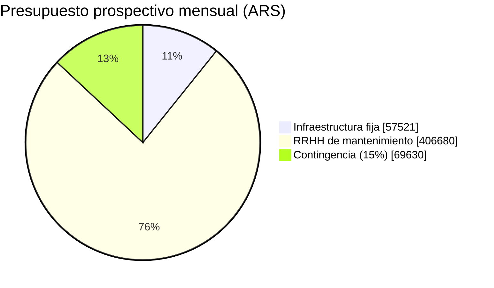
```mermaid
pie showData
 title Presupuesto prospectivo mensual (ARS)
 "Infraestructura fija" : 57521
 "RRHH de mantenimiento" : 406680
 "Contingencia (15%)" : 69630
```

*Figura 13 — Distribución del presupuesto prospectivo mensual: infraestructura, RRHH de
mantenimiento, contingencia.*

> **Dato simulado.** ver SIM-18. La distribución de la Figura 13 anterior (gráfico de
> presupuesto) proviene de la Tabla 25, de carácter parcialmente simulado (RRHH de mantenimiento y
> tráfico de AWS).

---


# 11. Arquitectura

## 11.1 Patrón arquitectónico

Hosty implementa una **arquitectura cliente-servidor de dos capas basada en BaaS** (*Backend as a
Service*): una *single-page application* en React que se comunica directamente con Supabase
(PostgREST, Auth, Storage y Postgres con Row Level Security), sin un servidor de aplicación
propio intermedio. No se trata de un monolito de tres capas (presentación / lógica de negocio /
datos con un backend a medida): la capa de lógica de negocio se reparte entre validación en el
cliente (Zod) y restricciones declarativas en la base de datos (`CHECK`, políticas RLS), y la capa
de API es generada automáticamente por PostgREST a partir del esquema de Postgres.

Esta decisión es, además, una migración real y no un diseño original: el repositorio contenía un
backend NestJS de tres capas (con Prisma sobre PostgreSQL) que fue eliminado por completo en el
commit `3a89616` ("refactor: remove entire backend directory and associated CI/CD workflows",
2026-04-29), en favor de Supabase como única capa de datos y autenticación. La justificación
observable de ese cambio es la escala del proyecto: un MVP de marketplace no requiere lógica de
servidor a medida cuando Postgres + RLS + PostgREST cubren CRUD, autorización por propiedad y
generación de API sin código adicional.

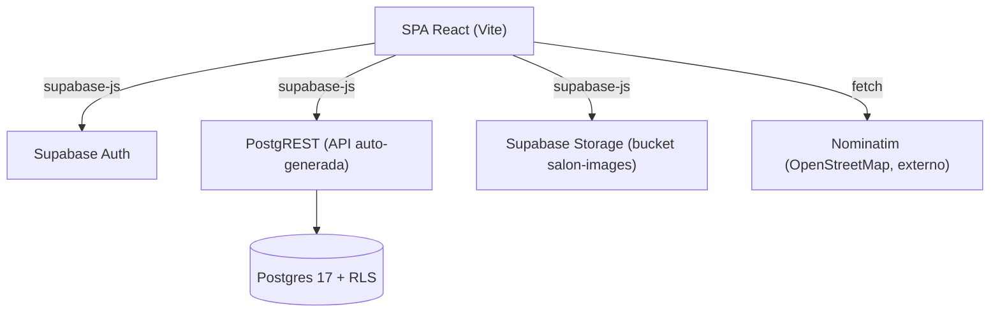
```mermaid
flowchart TD
 Client["SPA React (Vite)"] -->|supabase-js| Auth["Supabase Auth"]
 Client -->|supabase-js| PostgREST["PostgREST (API auto-generada)"]
 Client -->|supabase-js| Storage["Supabase Storage (bucket salon-images)"]
 PostgREST --> DB[("Postgres 17 + RLS")]
 Client -->|fetch| Nominatim["Nominatim (OpenStreetMap, externo)"]
```

*Figura 14 — Arquitectura general: SPA React ↔ Supabase (Auth/PostgREST/Storage/Postgres+RLS).*

## 11.2 Despliegue (visión general)

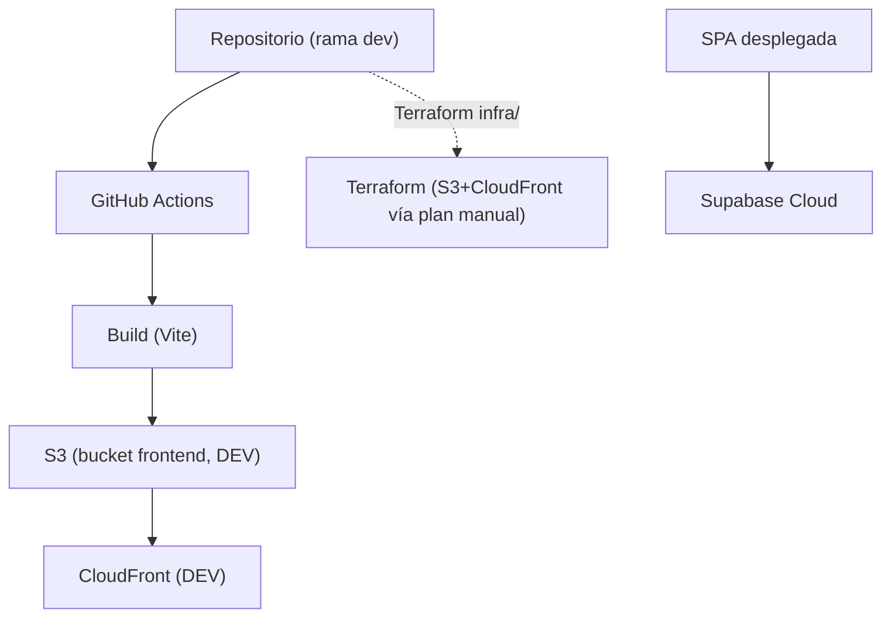
```mermaid
flowchart TD
 Repo["Repositorio (rama dev)"] --> GHA["GitHub Actions"]
 GHA --> Build["Build (Vite)"]
 Build --> S3["S3 (bucket frontend, DEV)"]
 S3 --> CF["CloudFront (DEV)"]
 Repo -.Terraform infra/.-> TF["Terraform (S3+CloudFront vía plan manual)"]
 Client2["SPA desplegada"] --> SupaCloud["Supabase Cloud"]
```

*Figura 15 — Despliegue: repo → GitHub Actions → build → S3+CloudFront (DEV); Supabase Cloud; Terraform.*

Una vez desplegada, la SPA resuelve su propia sesión de autenticación al arrancar en el
navegador, antes de que cualquier ruta protegida decida si continúa o redirige: `main.tsx`
invoca `initAuth()`, que resuelve la sesión existente (`getSession()`), la vuelca en
`auth.store` (Zustand) y resuelve una promesa módulo `authReady` antes de que cualquier
`beforeLoad`/`requireAuth` decida si redirige a `/login`.

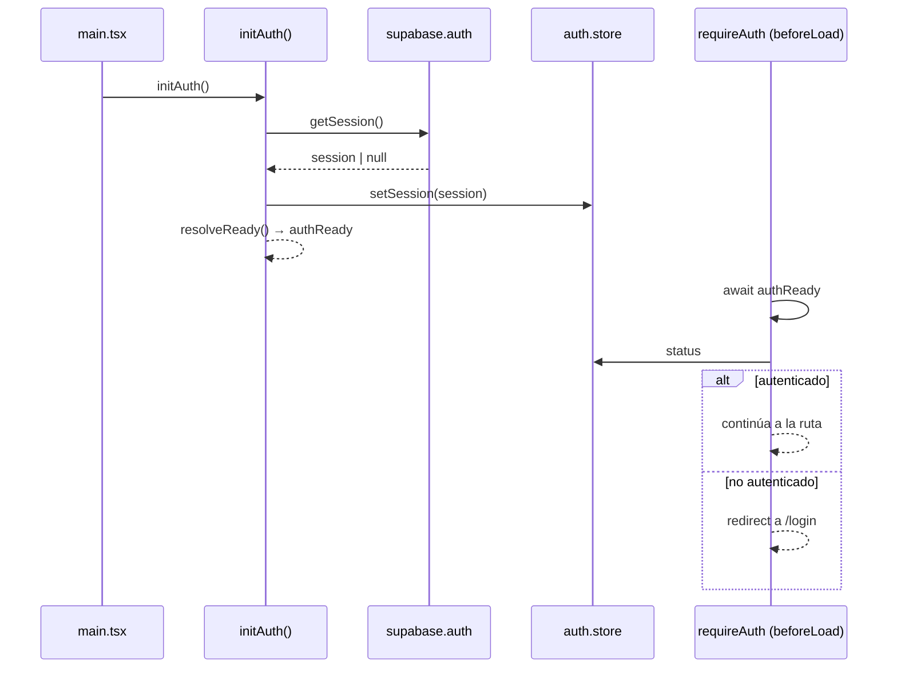
```mermaid
sequenceDiagram
 participant M as main.tsx
 participant A as initAuth()
 participant Sb as supabase.auth
 participant St as auth.store
 participant G as requireAuth (beforeLoad)
 M->>A: initAuth()
 A->>Sb: getSession()
 Sb-->>A: session | null
 A->>St: setSession(session)
 A-->>A: resolveReady() → authReady
 G->>G: await authReady
 G->>St: status
 alt autenticado
 G-->>G: continúa a la ruta
 else no autenticado
 G-->>G: redirect a /login
 end
```

*Figura 16 — Bootstrap de autenticación: `main.tsx` → `initAuth()` → `getSession()` → `auth.store` → `authReady` → ruta o redirect.*

## 11.3 Frontend

El frontend es una SPA React 19 servida por Vite, con enrutamiento *file-based* de TanStack
Router y estado de servidor manejado por TanStack Query sobre `supabase-js`. La organización de
carpetas es por *feature* (ver [Diseño y Desarrollo](#8-diseno-y-desarrollo), §8.4): `routes/` sólo declara paths,
`validateSearch` y guards; `features/<n>/` concentra componentes, hooks de datos y tipos; y
`shared/lib/` aloja el cliente de Supabase y utilidades transversales. La regla de dependencia es
estricta en un sentido: una feature nunca importa de otra feature.

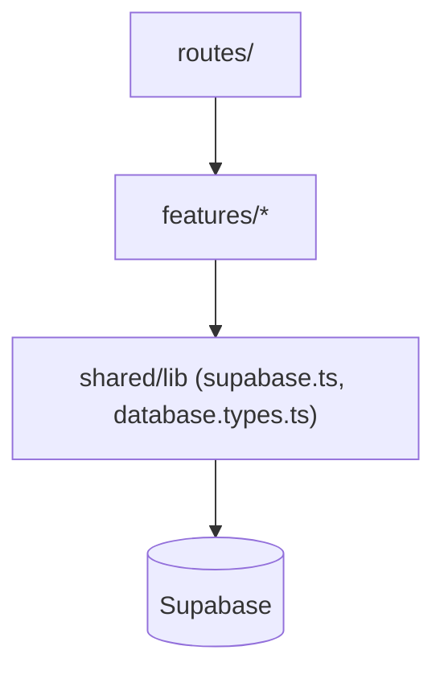
```mermaid
flowchart TD
 Routes["routes/"] --> Features["features/*"]
 Features --> SharedLib["shared/lib (supabase.ts, database.types.ts)"]
 SharedLib --> Supabase[("Supabase")]
```

*Figura 17 — Capas y dependencias permitidas: `routes → features → shared/lib → Supabase`.*

| Capa | Tecnología | Versión | Justificación |
|---|---|---|---|
| Framework UI | React | 19.2.4 | SPA pura, sin *server components* |
| Build/dev server | Vite | 8.0.1 | Arranque y HMR rápidos |
| Enrutamiento | TanStack Router | 1.168.8 | *File-based routing* tipado, `validateSearch` con Zod |
| Estado de servidor | TanStack Query | 5.95.2 | Caché e invalidación declarativas sobre PostgREST |
| Formularios | TanStack Form + Zod | 1.28.5 / 3.25.76 | Validación tipada en el cliente |
| Estado de cliente | Zustand | 5.0.12 | Store mínimo (sesión, tema) |
| Estilos | Tailwind CSS | 4.2.2 | Tokens CSS-first (`@theme`) |
| Componentes UI | shadcn/ui + Radix | — | Primitivos accesibles, código propio |
| Mapas / geocodificación | Leaflet + Nominatim | 1.9.4 | Sin costo de licencia de mapas |
| BaaS | Supabase (`supabase-js`) | 2.105.1 | Ver §11.4 |
| Lenguaje | TypeScript (strict) | 5.9.3 | Tipado generado desde el esquema real |

*Tabla 26 — Stack tecnológico por capa, versión y justificación.*

> **Fuente.** `frontend/package.json`; `supabase/config.toml:36` (Postgres `major_version =
> 17`).

## 11.4 "Backend" — capa BaaS

Hosty **no tiene un backend a medida**: no existe ningún servicio Node/NestJS en ejecución que
reciba peticiones HTTP de la SPA. La capa que cumple ese rol es Supabase, y se compone de tres
piezas verificables en `supabase/migrations/*.sql`:

- **Postgres + RLS** como capa de reglas de negocio: cada tabla tiene `enable row level security`
 y políticas por operación (detalle completo en [Anexo I. Modelo de Datos](#anexo-i-modelo-de-datos), Tabla 48); las
 restricciones de dominio (estados válidos, tipos de precio) son `CHECK` constraints, no código
 de aplicación.
- **PostgREST** como generador automático de API REST sobre el esquema `public` (§11.7).
- **Supabase Auth** para registro, login y sesión (JWT), y **Supabase Storage** para las imágenes
 de salones (bucket `salon-images`, público en lectura).

El manejo de errores ocurre en el cliente: cada hook de `api/*.queries.ts` /
`api/*.mutations.ts` propaga el `error` devuelto por `supabase-js` (que refleja el código de
Postgres/PostgREST, incluida una violación de `CHECK` o de política RLS) y TanStack Query lo
expone como estado `isError` para que el componente lo muestre.

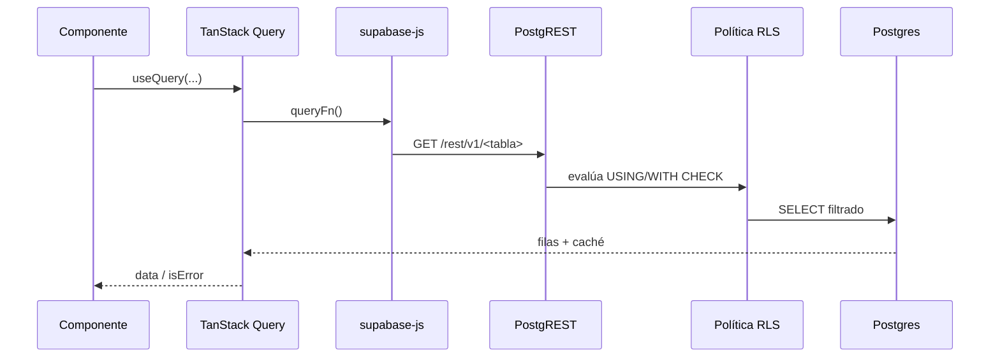
```mermaid
sequenceDiagram
 participant C as Componente
 participant Q as TanStack Query
 participant S as supabase-js
 participant P as PostgREST
 participant R as Política RLS
 participant D as Postgres
 C->>Q: useQuery(...)
 Q->>S: queryFn()
 S->>P: GET /rest/v1/<tabla>
 P->>R: evalúa USING/WITH CHECK
 R->>D: SELECT filtrado
 D-->>Q: filas + caché
 Q-->>C: data / isError
```

*Figura 18 — Ciclo de lectura de datos: componente → hook TanStack Query → `supabase-js` → PostgREST → RLS → Postgres → caché.*

## 11.5 Base de datos

El motor es **Postgres 17** (`supabase/config.toml:36`), sin ORM: los tipos de TypeScript se
generan desde el esquema real con `supabase gen types typescript` hacia
`frontend/src/shared/lib/database.types.ts`. El esquema `public` tiene 6 tablas (M10) más la
tabla `auth.users`, administrada por Supabase Auth. El diagrama entidad-relación completo, el
diccionario de datos por tabla y las políticas RLS se documentan en
[Anexo I. Modelo de Datos](#anexo-i-modelo-de-datos) (Figura 28, Tablas 42-49).

## 11.6 Seguridad

- **Autenticación**: Supabase Auth administra la sesión y el JWT; el frontend nunca implementa
 hashing de contraseñas propio. El arranque de la sesión al iniciar la aplicación (*bootstrap*)
 se detalla en la Figura 16 (§11.2).
- **Autorización**: no hay RBAC ni tabla de roles; cada política RLS compara `auth.uid()` contra
 la columna de propiedad (`host_id`, `user_id`), como se detalla en [Equipo y Roles](#7-equipo-y-roles)
 (Tabla 13) y en el diccionario RLS de [Anexo I. Modelo de Datos](#anexo-i-modelo-de-datos) (Tabla 48).
- **Validación**: esquemas Zod en el cliente (formularios, `validateSearch` de rutas) más
 restricciones `CHECK` en Postgres como última línea de defensa, aun si el cliente falla.
- **Sanitización**: todas las consultas usan el *query builder* parametrizado de `supabase-js`
 sobre PostgREST; no hay concatenación de SQL en ninguna capa del frontend.

| Ruta | Control de acceso | Política RLS asociada |
|---|---|---|
| `/`, `/salones`, `/salones/`, `/salones/$id` | Pública | `Salones are publicly readable`; `Salon services are publicly readable` |
| `/login`, `/register` | Pública | Supabase Auth (sin política de tabla) |
| `/salones/$id/reservar` | `requireAuth` | `Users can insert their own bookings` (`auth.uid() = user_id`) |
| `/mis-reservas` | `requireAuth` | `Users can view their own bookings` |
| `/mis-favoritos` | `requireAuth` | `user_read_own_favorites` / `user_insert_own_favorites` / `user_delete_own_favorites` |
| `/mi-perfil` | `requireAuth` | Supabase Auth (`updateUser`) |
| `/host/dashboard`, `/host/$bookingId` | `requireAuth` | `Hosts can view/update bookings for their salones` |
| `/host/create`, `/host/$id/edit` | `requireAuth` | `Host can insert/update their own salon`; `Host manages services/availability of their salones` |

*Tabla 29 — Rutas, control de acceso y política RLS asociada.*

## 11.7 API

No existe una especificación Swagger propia porque no hay un backend a medida: PostgREST expone
un documento OpenAPI auto-generado en `{SUPABASE_URL}/rest/v1/` a partir del esquema `public`
(la URL completa se detalla en [Anexo IV. API y Repositorio](#anexo-iv-api-y-repositorio)). Cada hook de `api/*.queries.ts` /
`*.mutations.ts` es una operación PostgREST; se tabulan por módulo:

| Módulo | Consultas | Mutaciones | Total | Tabla(s) principal(es) |
|---|---|---|---|---|
| `salones` | 5 | 0 | 5 | `salones`, `salon_availability_blocks` |
| `bookings` | 1 | 2 | 3 | `bookings` |
| `favorites` | 2 | 1 | 3 | `user_favorites` |
| `host` | 6 | 9 | 15 | `salones`, `bookings`, `salon_services`, `salon_availability_blocks`, `salon_subscriptions`, Storage |
| `auth` (Supabase Auth, no PostgREST) | — | — | 6 (`signInWithPassword`, `signUp`, `signOut`, `getSession`, `onAuthStateChange`, `updateUser`) | `auth.users` |
| **Total operaciones expuestas como *hooks*** | 14 | 12 | **26** | |

*Tabla 30 — Operaciones de API expuestas como hooks, por módulo.*

Esta tabla cuenta **operaciones expuestas**: cada *hook* de `api/*.queries.ts` / `*.mutations.ts`
vale uno, con independencia de cuántas llamadas encadene por dentro. Es una medida de la superficie
de API que consume la aplicación. La sección 14 (Tabla 38) y el [Anexo IV. API y Repositorio](#anexo-iv-api-y-repositorio)
(Tabla 53) reportan una magnitud distinta —**35 invocaciones** de `select`, `insert`, `update` y
`delete`—, que mide el tráfico real contra PostgREST. Los dos recuentos son correctos y no se
contradicen: un *hook* que resuelve una consulta y luego actualiza una fila cuenta como una
operación expuesta y como dos invocaciones.

> **Fuente.** conteo verificado directamente sobre `frontend/src/features/*/api/*.ts`
> (2026-07-28).

En cuanto a ambientes: el repositorio sólo define un ambiente de despliegue automatizado, **DEV**
(`web-dev.yml`, secretos con sufijo `_DEV`); no existe un workflow de *staging* ni de producción,
aunque `infra/config/stg.tfvars` reserva variables para un ambiente `stg` no conectado a ningún
pipeline de CI/CD.

## 11.8 Deployment

El frontend se compila con Vite y se publica en S3, servido por CloudFront (`infra/frontend.tf`),
mediante el workflow `web-dev.yml` disparado en cada push a `dev`. Terraform gestiona la
infraestructura de forma manual (`terraform plan` vía `infra-ci.yml`, `workflow_dispatch`).
Supabase Cloud aloja la base de datos, Auth y Storage; no requiere aprovisionamiento propio. La
invalidación de CloudFront tras cada despliegue asegura que los usuarios reciban siempre el build
más reciente sin depender del vencimiento natural de la caché del CDN, a costa de una invalidación
completa (`/*`) en cada push a `dev` en lugar de una invalidación selectiva por ruta.

| Estructura | Responsabilidad |
|---|---|
| `frontend/src/routes/` | Definición de rutas, `validateSearch`, guards |
| `frontend/src/features/<n>/` | Componentes, hooks de datos (`api/`), tipos |
| `frontend/src/shared/lib/` | Cliente Supabase, tipos generados, utilidades |
| `frontend/src/components/` | `layout/` (Header, RootLayout) y `ui/` (shadcn) |
| `infra/` | Terraform: S3 + CloudFront (frontend), EC2 + RDS (obsoletos, ver Tabla 27) |
| `supabase/migrations/` | Historial de esquema, RLS y datos semilla |

*Tabla 28 — Estructura de carpetas y responsabilidad.*

### Decisiones arquitectónicas (ADR resumidas)

| # | Decisión | Estado / hallazgo |
|---|---|---|
| ADR-1 | Migrar de backend NestJS de tres capas a BaaS de dos capas con Supabase | Aplicada en el commit `3a89616` (2026-04-29); justificada por la escala de un MVP |
| ADR-2 | Sin ORM: tipos generados desde el esquema real (`database.types.ts`) | Vigente; evita drift entre modelo y tipos declarados a mano |
| ADR-3 | Autorización por propiedad vía RLS (`auth.uid()`), sin tabla de roles/RBAC | Vigente (ver [Equipo y Roles](#7-equipo-y-roles), Tabla 13) |
| Hallazgo A | `frontend/package.json` declara `axios` como dependencia de runtime pese a que el proyecto usa exclusivamente `supabase-js` para acceder a datos | Inconsistencia no resuelta: dependencia sin uso activo identificado en el código de features revisado |
| Hallazgo B | `docker-compose.yml`, el `package.json` raíz (`workspaces: ["backend","frontend"]`) e `infra/backend.tf`/`infra/rds.tf` (EC2 + RDS) siguen describiendo y aprovisionando el backend NestJS eliminado en `3a89616` | Documentación y definición de infraestructura desactualizadas respecto del código real; no aprovisionadas en este cambio |
| Hallazgo C | La restricción `CHECK` de `bookings.status` no reflejaba los cuatro estados usados por la aplicación hasta la migración `20260609233130` | Corregido; desarrollado en detalle en [Anexo I. Modelo de Datos](#anexo-i-modelo-de-datos) (Tabla 43) y como deuda técnica en [Conclusiones](#15-conclusiones) (Tabla 40) |
| Hallazgo D | La tabla `salones` careció de política RLS de `DELETE` hasta la migración `20260616000001`: con RLS activo y sin esa política, el borrado desde el cliente afectaba 0 filas sin devolver error | Corregido; ver política `Host can delete their own salon` en [Anexo I. Modelo de Datos](#anexo-i-modelo-de-datos) (Tabla 48) |

*Tabla 27 — Decisiones arquitectónicas (ADR resumidas).*

> **Fuente.** commit `3a89616` (`git log`); `frontend/package.json`; `docker-compose.yml`;
> `package.json` (raíz); `infra/backend.tf`, `infra/rds.tf`;
> `supabase/migrations/20260609233130_host_booking_management.sql`;
> `supabase/migrations/20260616000001_add_salon_delete_policy.sql` (comentario verbatim del
> propio archivo). M22: 0 *enums* de Postgres — los dominios de valores válidos se modelan como
> `CHECK` más uniones de tipo TypeScript mantenidas a mano, el mecanismo que originó el Hallazgo C.

---


# 12. Testing y Calidad

## Estrategia general

El aseguramiento de calidad no se trata como una etapa posterior al desarrollo sino como una
actividad que interviene desde la redacción de las historias de usuario: cada user story
destacada en la sección 9 (Planificación Scrum) incluye un criterio de aceptación explícito, y
ese criterio es el insumo directo para diseñar los casos de prueba —manuales o automatizados— de
la funcionalidad correspondiente. La ejecución de pruebas automatizadas ocurre en dos momentos:
localmente, durante el desarrollo, y en la integración continua, al abrirse un *pull request*. Las
pruebas manuales y exploratorias se ejecutan antes de cerrar cada historia, sobre el ambiente de
desarrollo desplegado.

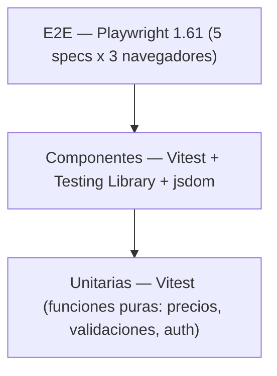
```mermaid
flowchart TD
 A["E2E — Playwright 1.61 (5 specs x 3 navegadores)"] --> B["Componentes — Vitest + Testing Library + jsdom"]
 B --> C["Unitarias — Vitest (funciones puras: precios, validaciones, auth)"]
```

*Figura 19 — Pirámide de pruebas: unitarias (Vitest) / componentes (RTL+jsdom) / E2E (Playwright).*

> **Fuente.** M12/M13 (`_meta/Datos-Verificables.md`): 75 pruebas Vitest en 15 archivos
> unitarios/de componentes, más 5 *specs* Playwright E2E.

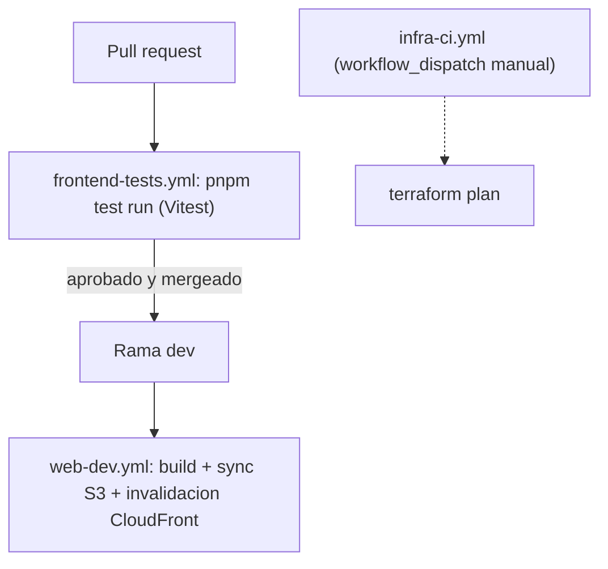
```mermaid
flowchart TD
 A[Pull request] --> B["frontend-tests.yml: pnpm test run (Vitest)"]
 B -->|aprobado y mergeado| C[Rama dev]
 C --> D["web-dev.yml: build + sync S3 + invalidacion CloudFront"]
 E["infra-ci.yml (workflow_dispatch manual)"] -.-> F["terraform plan"]
```

*Figura 20 — Pipeline CI/CD: PR → `frontend-tests.yml` (Vitest) → merge a `dev` → `web-dev.yml` (build + sync S3 + invalidación CloudFront); `infra-ci.yml` manual (`terraform plan`).*

> **Fuente.** M14 (`_meta/Datos-Verificables.md`): 3 workflows en `.github/workflows/`
> (`frontend-tests.yml`, `web-dev.yml`, `infra-ci.yml`).

## Tipos de prueba

| Tipo | Herramienta | Alcance real |
|---|---|---|
| Unitarias | Vitest 4.1.6 | Funciones puras: `pricing.ts` (formato de precio), `auth.ts` (lógica de sesión), validaciones de `search-validation.ts` |
| Componentes | Vitest + Testing Library (React) 16.3.2 + jsdom | Renderizado e interacción: `CardSalon`, `Header`, `LoginPage`, `RegisterPage` |
| Integración | Vitest, con el cliente de Supabase mockeado | Hooks de `api/`: `bookings.test.ts`, `favorites.test.ts`, `salones.queries.test.ts` — validan la traducción `snake_case` → dominio y el manejo de errores de PostgREST |
| E2E | Playwright 1.61.0, 3 navegadores (Chromium, Firefox, WebKit) | 5 *specs* en `src/e2e/`: `auth-flow`, `home`, `navigation`, `salon-detail`, `salones` |
| Legacy / exploratorio | Mocha 11.7.6 + Chai 6.2.2 (`test:mocha`); Cypress 15.17.0 | 1 archivo Mocha (`src/test/mocha/search-validation.test.ts`); 1 *spec* Cypress (`cypress/e2e/salon-search.cy.ts`) |

*Tabla 31 — Tipos de prueba, herramienta y alcance real.*

> **Fuente.** M12/M13, verificado ejecutando `npx vitest run` sobre el repositorio: 15
> archivos, 75 casos, todos en verde. Nota honesta: sólo la suite de Vitest está integrada al
> pipeline de CI (`frontend-tests.yml` ejecuta `pnpm test run`); Playwright, la corrida
> independiente de Mocha (`pnpm test:mocha`) y el *spec* de Cypress se ejecutan de forma local o
> manual y no forman parte de ningún *workflow* de `.github/workflows/`. El archivo de Mocha,
> además, también es recolectado por Vitest porque su ruta no está excluida en `vite.config.ts`
> (`exclude: [...configDefaults.exclude, 'src/e2e/**']`); por eso sus 4 casos ya están incluidos en
> el total de 75.

## Cobertura

La cobertura se mide con `@vitest/coverage-v8`, que instrumenta el código mediante el proveedor V8
nativo, y se ejecuta con `npm --prefix frontend run test:coverage`. El resultado se reporta bajo
**dos criterios**, porque informar uno solo distorsiona la lectura en sentidos opuestos:

- **Cobertura global.** Se instrumenta todo el código de aplicación bajo `src/` —95 archivos—,
 incluidos los 68 que ninguna prueba llega a importar. Es la cifra honesta del estado del
 proyecto y la que corresponde citar si se pide "la cobertura" sin más.
- **Cobertura del código ejercitado.** Se mide únicamente sobre los 27 archivos que la suite
 efectivamente importa. Indica qué tan a fondo se prueba aquello que sí está bajo prueba, pero no
 debe presentarse como cobertura del proyecto, porque ignora todo lo que quedó sin probar.

| Métrica | Cobertura global | Sobre el código ejercitado |
|---|---|---|
| Sentencias | 16,41 % (901 / 5.490) | 59,83 % (901 / 1.506) |
| Ramas | 11,95 % (566 / 4.735) | 43,84 % (566 / 1.291) |
| Funciones | 16,37 % (92 / 562) | 62,59 % (92 / 147) |
| Líneas | 20,16 % (653 / 3.238) | 72,31 % (653 / 903) |

*Tabla 32 — Cobertura de pruebas bajo ambos criterios.*

> **Fuente.** M37: `npm --prefix frontend run test:coverage` (`vitest run --coverage`,
> proveedor V8), ejecutado el 2026-08-04 sobre 15 archivos y 75 casos. Los totales se obtuvieron de
> `frontend/coverage/coverage-summary.json`. La configuración de proveedor, *reporters* y
> exclusiones está declarada en el bloque `test.coverage` de `frontend/vite.config.ts`: se excluyen
> del cómputo los propios archivos de prueba, `src/e2e/`, `src/test/`, `main.tsx` y los dos
> artefactos autogenerados (`routeTree.gen.ts` y `database.types.ts`), porque medir cobertura sobre
> código que nadie escribió a mano no aporta información.

La distribución por módulo muestra un patrón deliberado: la lógica de dominio y de acceso a datos
está cubierta, y la capa de presentación, todavía parcialmente.

| Módulo | Sentencias | Ramas | Funciones | Líneas |
|---|---|---|---|---|
| `features/auth/store` | 100,00 % | 100,00 % | 100,00 % | 100,00 % |
| `features/bookings/api` | 97,06 % | 79,31 % | 100,00 % | 100,00 % |
| `features/auth/lib` | 93,75 % | 100,00 % | 85,71 % | 93,33 % |
| `features/favorites/api` | 92,54 % | 85,42 % | 100,00 % | 97,83 % |
| `features/auth/components` | 80,25 % | 62,22 % | 83,33 % | 90,29 % |
| `shared/lib` | 72,73 % | 63,64 % | 100,00 % | 72,00 % |
| `features/salones/api` | 54,21 % | 47,92 % | 61,54 % | 61,25 % |
| `features/salones/lib` | 50,00 % | 75,00 % | 66,67 % | 55,56 % |
| `components/layout` | 43,08 % | 35,81 % | 35,00 % | 49,22 % |
| `components/ui` | 28,93 % | 15,77 % | 28,13 % | 37,03 % |
| `features/bookings/components` | 25,96 % | 22,58 % | 22,50 % | 30,34 % |
| `features/salones/components` | 7,69 % | 6,52 % | 2,27 % | 11,30 % |
| 16 carpetas restantes | 0,00 % | 0,00 % | 0,00 % | 0,00 % |

*Tabla 32a — Cobertura por módulo, ordenada por cobertura de sentencias.*

`components/ui` y `features/bookings/components` pasaron a tener cobertura parcial el 2026-08-04:
`BookingFlow.test.tsx` (cierre de SIM-33, ver Tabla 33) renderiza el componente completo, y de paso
ejercita los primitivos de shadcn/ui que usa (`Select`, `Button`, `Input`, `Skeleton`, entre otros).

Las 16 carpetas sin cobertura son, en su mayoría, componentes de pantalla y definiciones de ruta
(`routes/`, `features/host/components`, `features/home/components`, entre otras): código que la
suite E2E de Playwright sí ejercita sobre el navegador, pero que no aparece en esta medición porque
Playwright corre fuera del proceso de Vitest y no comparte su instrumentación. La cobertura de la
Tabla 32 es, por lo tanto, un piso y no un techo del código realmente probado.

Junto al porcentaje conviene leer el volumen absoluto de la suite, que no depende del criterio de
medición elegido:

| Métrica de volumen | Valor |
|---|---|
| Pruebas automatizadas (Vitest) | 75 |
| Archivos de prueba (Vitest/RTL + Playwright) | 20 (15 + 5) |
| Líneas de código de prueba (unitarias + componentes + E2E) | 1.603 |
| Líneas de código de producción (`src/`, sin pruebas) | 11.223 |
| Relación líneas de prueba / líneas de producción | ≈ 0,14 (14 %) |

*Tabla 32b — Volumen de la suite de pruebas.*

> **Fuente.** M12/M13/M31; líneas de prueba y de producción contadas con
> `find frontend/src -name '*.test.ts' -o -name '*.test.tsx' -o -path '*/e2e/*.spec.ts' | xargs wc -l`
> y su complemento sobre `*.ts`/`*.tsx`, respectivamente (2026-08-04, re-verificado tras agregar
> `BookingFlow.test.tsx` y el caso nuevo de `favorites.test.ts`). La cifra de producción incluye
> `src/routeTree.gen.ts` (343 líneas autogeneradas por TanStack Router), que sí se excluye del
> cómputo de cobertura de la Tabla 32.

El reporte HTML navegable queda en `frontend/coverage/index.html` y se anexa en
[Anexo V. Evidencias de QA](#anexo-v-evidencias-de-qa). Elevar la cobertura de la capa de presentación está registrado como
línea de evolución de corto plazo en [Conclusiones](#15-conclusiones).

## Matriz de casos de prueba manuales

Se documentan tres casos representativos, mapeados a flujos reales de la aplicación. Ninguno de los
tres tenía un test automatizado que cubriera exactamente el escenario descrito: `bookings.test.ts`
prueba los *hooks* `useCreateBooking`/`useCancelBooking`/`useMyBookings`, pero no la validación de
fecha bloqueada del *wizard*; `favorites.test.ts` probaba que se llamara a `insert`/`delete`, pero
no que la actualización optimista ocurriera *antes* de la respuesta del servidor. En vez de dejar
el resultado como una inferencia plausible, se escribió el test automatizado que faltaba para CP-01
y CP-02, y se ejecutaron los tres — el resultado de esta columna es la salida real de esa ejecución.

| ID | Precondiciones | Pasos | Datos | Resultado esperado | Resultado obtenido |
|---|---|---|---|---|---|
| CP-01 | Usuario autenticado; salón con un bloqueo de disponibilidad para el 2026-08-10 | 1. Ir a `/salones/:id/reservar`. 2. Seleccionar el 2026-08-10 como fecha. 3. Intentar confirmar el paso 1 del wizard | `salon_availability_blocks` con `date = 2026-08-10` para el salón | El wizard bloquea el avance y muestra un mensaje de fecha no disponible | **Verificado.** El wizard muestra "El salón no está disponible en la fecha elegida. Probá con otra fecha." y no avanza de paso |
| CP-02 | Usuario autenticado; salón sin favorito previo | 1. Abrir `/salones`. 2. Click en el ícono de favorito de una `CardSalon`. 3. Observar el estado del ícono antes de la respuesta del servidor | Salón sin fila en `user_favorites` para ese usuario | El ícono cambia a "favorito" de inmediato (actualización optimista) y persiste tras recargar | **Verificado.** La caché de React Query refleja el salón como favorito inmediatamente después de disparar la mutación, antes de que se resuelva la llamada a Supabase |
| CP-03 | Ninguna (usuario no autenticado) | 1. Ir a `/login`. 2. Ingresar un email válido con una contraseña incorrecta. 3. Enviar el formulario | `email: usuario@ejemplo.com`, `password: incorrecta123` | Se muestra un mensaje de error de credenciales inválidas y el usuario permanece en `/login` | **Verificado.** Se muestra "Email o contraseña incorrectos." y el usuario permanece en `/login` |

*Tabla 33 — Matriz de casos de prueba manuales.*

> **Fuente.** CP-01: `BookingFlow.test.tsx`, test "CP-01: bloquea el avance y muestra un
> mensaje cuando la fecha elegida tiene un bloqueo de disponibilidad" (nuevo, agregado para cerrar
> este caso). CP-02: `favorites.test.ts`, test "CP-02: aplica la actualización optimista antes de
> que responda el servidor" (nuevo, ídem). CP-03: `LoginPage.test.tsx`, test "muestra el error del
> servidor cuando las credenciales son incorrectas" (ya existente). Los tres se re-ejecutaron el
> 2026-08-03 (`npm --prefix frontend run test -- --run`): 75 pruebas, 75 aprobadas — ver M12/M13
> actualizados en `Datos-Verificables`. No sustituye una ejecución manual sobre el ambiente
> desplegado, pero es una verificación real y reproducible del comportamiento, no una inferencia.

## Manejo de incidencias

Las incidencias se reportan como *GitHub Issues* con la etiqueta `bug`. El repositorio registra 13
issues reales con esa etiqueta, las 13 cerradas.

> **Fuente.** `gh issue list --state all --label bug --json number,state` (2026-07-28): 13
> issues, 13 en estado `CLOSED`.

El ciclo de vida observado es: **Reportado** (se crea el issue) → **Triage** (se prioriza o se
etiqueta) → **En curso** (rama `fix/...` asociada) → **En revisión** (*pull request* abierto) →
**Retesting** (verificación manual sobre el ambiente DEV tras el *merge*) → **Cerrado**. Una
incidencia puede desviarse a **No reproducible** o **Diferida** en la etapa de *triage*.

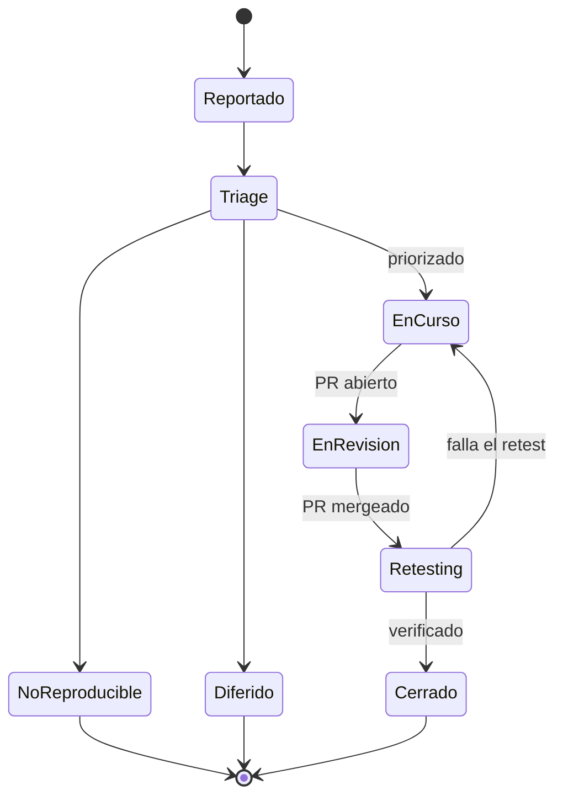
```mermaid
stateDiagram-v2
 [*] --> Reportado
 Reportado --> Triage
 Triage --> EnCurso: priorizado
 Triage --> NoReproducible
 Triage --> Diferido
 EnCurso --> EnRevision: PR abierto
 EnRevision --> Retesting: PR mergeado
 Retesting --> Cerrado: verificado
 Retesting --> EnCurso: falla el retest
 NoReproducible --> [*]
 Diferido --> [*]
 Cerrado --> [*]
```

*Figura 21 — Ciclo de vida de un defecto: Reportado → Triage → En curso → En revisión → Retesting → Cerrado (+ No reproducible / Diferido).*

Un defecto real, no simulado, ilustra este ciclo de punta a punta:

> **Fuente.** M17: la restricción `CHECK` original de `bookings.status` sólo admitía
> `pending`/`confirmed`/`cancelled` (`supabase/migrations/20240101000000_init_hosty.sql:57-58`),
> mientras que la aplicación ya emitía un cuarto estado, `declined`. El defecto se resolvió en la
> migración `supabase/migrations/20260609233130_host_booking_management.sql:7-11`, cuyo propio
> comentario documenta la causa ("`'declined' was used by the app but missing from the DB
> check.`"). Ver el detalle completo, con retest, en [Anexo V. Evidencias de QA](#anexo-v-evidencias-de-qa) (Tabla 58) y el
> análisis de deuda técnica en [Conclusiones](#15-conclusiones) (Tabla 40). La severidad de cada incidencia
> —Bloqueante, Alta, Media o Baja— se clasifica en la Tabla 34 de la siguiente sección, con
> ejemplos reales tomados de las 13 *issues* `bug` del repositorio.

## Revisión de usabilidad previa a la entrega final

Antes de la entrega se realizó una revisión de usabilidad centrada en la coherencia idiomática y en
la calidad de los mensajes de validación, dos aspectos que las pruebas automatizadas no cubren
porque no verifican el texto que efectivamente lee un usuario. La revisión detectó tres defectos,
todos corregidos y verificados.

| # | Defecto | Dónde se manifestaba | Severidad | Corrección aplicada |
|---|---|---|---|---|
| R-01 | Los mensajes de error devueltos por Supabase se mostraban en inglés, tal como llegan del servidor (por ejemplo, `User already registered` al intentar registrarse con un email existente) | Registro de usuario, publicación de salón y panel del anfitrión | Media | Se incorporó una capa de traducción de errores (`src/shared/lib/errors.ts`) que mapea los errores de Supabase Auth y de PostgREST a mensajes en español, con un mensaje genérico de respaldo que garantiza que nunca se filtre texto crudo del servidor a la interfaz |
| R-02 | El límite de asistentes se delegaba al atributo `max` del campo numérico, por lo que el navegador mostraba su propia advertencia nativa, en el idioma del navegador y con un estilo ajeno al del formulario | Paso 2 del flujo de reserva | Media | Se reemplazó por una validación propia del formulario, con mensaje en español que indica la capacidad real del salón, atributos `aria-invalid`/`aria-describedby` y `role="alert"` para que los lectores de pantalla la anuncien |
| R-03 | Las etiquetas de estado "pendiente" usaban valores de color ajenos al sistema de diseño, con contraste insuficiente en modo oscuro | Panel del anfitrión: resumen, calendario, detalle de reserva y tarjeta de plan | Baja | Se unificaron sobre los tokens de marca (`--color-amber`, `--color-amber-light`, `--color-amber-dark`) definidos en `src/index.css` |

*Tabla 34b — Defectos detectados en la revisión de usabilidad previa a la entrega y su corrección.*

> **Fuente.** R-01 se verifica con las 7 pruebas unitarias de `src/shared/lib/errors.test.ts`,
> incluida una que comprueba explícitamente que un error sin traducción conocida no propague el
> texto original en inglés. R-02 y R-03 se incorporaron mediante la rama
> `fix/detalles-ui-formulario`. En ese momento la suite completa quedó en 73 casos, todos en verde,
> con verificación de tipos (`tsc -b --noEmit`) y análisis estático (ESLint) sin errores; el total
> vigente al cierre de este informe es 75 (Tabla 31), tras los dos casos agregados el 2026-08-04.

## Criterios de salida

Una historia se considera lista para cerrar cuando se cumplen, en conjunto: (a) la suite de Vitest
pasa en verde localmente y en `frontend-tests.yml`; (b) `npx eslint .` y `npx tsc -b --noEmit` no
reportan errores; (c) el *pull request* asociado cuenta con al menos una aprobación y está
mergeado a `dev`. Estos criterios generales de cierre de historia se completan con una
clasificación de severidad de incidencias, que determina además un criterio de salida específico
por severidad al cierre de cada sprint.

| Severidad | Criterio de calificación en Hosty | Ejemplos reales (issues `bug`) | Criterio de salida adicional |
|---|---|---|---|
| Bloqueante | Impide completar una reserva o publicar un salón, o corrompe datos, sin ningún *workaround* disponible | Ninguna de las 13 incidencias reales alcanzó este nivel — banda documentada como vacía, no fabricada | No puede quedar ninguna incidencia Bloqueante abierta al cierre de un sprint; bloquea el *merge* a `dev` hasta resolverse |
| Alta | Una función completa falla o entrega un resultado incorrecto, con o sin *workaround* manual, fuera del camino crítico de reserva/publicación | `p1-high` (2): #74 "el mapa en /salones no está implementado — implementar o eliminar"; #75 "agregar a favoritos no persiste — solo estado local" | No puede quedar ninguna incidencia Alta abierta al cierre de un sprint; a lo sumo puede diferirse un (1) sprint con justificación registrada en el backlog |
| Media | Defecto de navegación, UX o consistencia que degrada la experiencia sin impedir completar el flujo | `p2-medium` (2): #72 "el link 'Cómo funciona' de la navbar no navega a ninguna sección"; #87 "links del footer apuntan a rutas incorrectas o inexistentes" | Puede diferirse a un sprint posterior si queda registrado en el backlog con responsable asignado |
| Baja | Defecto cosmético o de bajo impacto, sin efecto funcional sobre ningún flujo | `p3-low` (1): #76 "links del footer son placeholders — no navegan a destinos reales" | Puede diferirse indefinidamente; no bloquea el cierre de sprint ni el *merge* |

*Tabla 34 — Severidad de incidencias y criterios de salida.*

> **Fuente.** `gh issue list --repo juanpablovaldez/hosty --label bug --state all --json
> number,title,state,labels` (2026-07-28): 13 *issues* con etiqueta `bug`, las 13 cerradas; de
> ellas, 5 llevan además una etiqueta de prioridad — 2 `p1-high` (#74, #75), 2 `p2-medium` (#72,
> #87), 1 `p3-low` (#76) — y las 8 restantes no fueron priorizadas explícitamente con esa
> taxonomía. Verificación en vivo adicional sobre el estado actual del repositorio: `npx tsc -b
> --noEmit` no reporta errores; `npx eslint .` reporta 6 errores y 4 advertencias
> (`cypress.config.ts`: parámetros sin usar; `src/test/mocha/search-validation.test.ts`: la regla
> `no-unused-expressions` no reconoce las aserciones de Chai `expect(...).to.be.true`;
> `SalonesPage.tsx`: 4 advertencias de `react-hooks/exhaustive-deps`). El criterio de "lint
> limpio" no se cumple de forma estricta al momento de esta verificación; se documenta como
> hallazgo de calidad en [Conclusiones](#15-conclusiones) (Tabla 40).

---


# 13. Ejecución por Sprint

Esta sección reconstruye la ejecución cronológica del proyecto, sprint por sprint, sobre la base
del calendario presentado en [Planificación Scrum](#9-planificacion-scrum) (Tabla 21). A diferencia de esa tabla, que
resume cantidades, aquí se detallan los entregables concretos de cada sprint, los cambios de
alcance o diseño ocurridos durante el desarrollo y la capacidad funcional más distintiva del
sistema, ilustrada con un diagrama de secuencia.

> **Fuente.** Los límites de fecha de cada sprint son una reconstrucción inferida a partir de
> la densidad de commits y de los clústeres de fecha de las migraciones de Supabase; ver SIM-13 en
> [Planificación Scrum](#9-planificacion-scrum). Los conteos de commits e issues cerradas citados abajo son reales
> (M23, M24).

## Relato por sprint

| Sprint | Foco | Entregables | Decisión relevante | Cierre |
|---|---|---|---|---|
| S1 | Arranque, arquitectura base, home | Scaffolding Vite + React 19 + TypeScript, layout base, página de inicio | Elección de stack (React 19, Tailwind v4, Supabase) | 2026-04-19 |
| S2 | Catálogo, filtros, detalle de salón | Listado dinámico desde Supabase, UI de búsqueda, página de detalle de salón | Migración de NestJS a Supabase (commit `3a89616`) | 2026-05-15 |
| S3 | Autenticación, carga de imágenes | Login/registro con Supabase Auth, bucket `salon-images`, panel y asistente del anfitrión | Adopción de Supabase Storage para imágenes | 2026-06-05 |
| S4 | Panel del anfitrión, reservas, precios, bloqueos | Drawer de gestión de reservas, precios/servicios flexibles, bloqueos de disponibilidad | Corrección del `CHECK` de `bookings` a 4 estados | 2026-06-13 |
| S5 | Plan destacado, coordenadas, favoritos | Suscripción destacada, geocodificación de salones, favoritos persistentes, política de borrado | Consolidación de 7 pull requests en la PR #93 | 2026-06-24 |

*Tabla 35 — Sprints: foco, entregables, decisiones y fecha de cierre.*

```mermaid
xychart-beta
 title "Commits por mes en la rama dev"
 x-axis ["2026-03", "2026-04", "2026-05", "2026-06"]
 y-axis "Commits" 0 --> 70
 bar [1, 63, 63, 54]
```

*Figura 22 — Commits por mes en la rama dev (marzo-junio 2026).*

> **Fuente.** M01, M03, M04: `git log dev --date=format:'%Y-%m' --format=%ad | sort | uniq -c`
> (verificado 2026-07-28). Ver `Datos-Verificables`.

```mermaid
xychart-beta
 title "Issues cerradas por sprint"
 x-axis ["S1", "S2", "S3", "S4", "S5"]
 y-axis "Issues cerradas" 0 --> 20
 bar [0, 4, 16, 12, 13]
```

*Figura 23 — Issues cerradas por sprint (S1-S5).*

> **Fuente.** M24 (issues cerradas por sprint, calculado para este informe a partir de
> `closedAt`): `gh issue list --state closed --json number,closedAt` (verificado 2026-07-28). Los
> 45 cierres suman el total de M06. Ver `Datos-Verificables`.

## Cambios de alcance y de diseño

| Cambio | Justificación | Evidencia |
|---|---|---|
| Migración de NestJS a Supabase | Reducir la complejidad operativa de mantener un backend propio con un equipo part-time; aprovechar autenticación, PostgREST y Storage administrados | Commit `3a89616` (2026-04-29): remoción completa de `backend/` y de los workflows de CI/CD asociados |
| Consolidación de 7 pull requests en una única PR de integración | Evitar conflictos entre ramas de feature abiertas en simultáneo cerca del cierre del proyecto, incluyendo una colisión real de nombre de migración | PR #93, "consolidate all active PRs (#80 #82 #84 #86 #89 #90 #91)", mergeada el 2026-06-23 desde la rama `integration/consolidated-prs` |
| Postergación de la integración de Mercado Pago | La pasarela de pago no se completó dentro del período relevado | Issue #45, abierta al cierre del período |
| Postergación del sistema de reviews y calificaciones | Decisión explícita de alcance, etiquetada `post-mvp` en el propio backlog | Issue #33, etiqueta `post-mvp` |

*Tabla 36 — Cambios de alcance y de diseño con justificación.*

> **Fuente.** M26: de las 48 pull requests totales, 20 se cerraron sin fusionar (41,7 %) —
> `gh pr list --state all --json number,state,mergedAt` (verificado 2026-07-28). Siete de esas 20
> corresponden directamente al evento de consolidación descrito arriba (#80, #82, #84, #86, #89,
> #90, #91); el resto responde a un patrón similar de ramas reintegradas por otra vía a lo largo
> del proyecto, sin que exista un registro explícito del motivo caso por caso. Ver
> `Datos-Verificables`.

## Capacidad más distintiva: cotización y confirmación de una reserva

La funcionalidad que mejor distingue a Hosty de un simple formulario de contacto es el flujo de
cotización y confirmación de reservas del anfitrión, que combina un precio ajustable
(`quotedPrice`) con el bloqueo de fechas (`salon_availability_blocks`).

```mermaid
sequenceDiagram
 participant O as Organizador
 participant F as BookingFlow
 participant DB as Supabase (PostgREST)
 participant H as BookingDrawer (Anfitrión)

 O->>F: Selecciona fecha/horario y confirma el pedido
 F->>DB: insert bookings (status = pending)
 DB-->>F: reserva creada
 H->>DB: consulta reservas pendientes
 DB-->>H: lista de reservas (status = pending)
 H->>DB: useUpdateBookingQuote (quotedPrice)
 DB-->>H: reserva actualizada con precio cotizado
 H->>DB: useUpdateBookingStatus (confirmed | declined)
 DB-->>O: estado final visible en el panel del organizador
```

*Figura 24 — Capacidad más distintiva, extremo a extremo: huésped reserva → anfitrión cotiza (`quotedPrice`) → confirma/rechaza → estado final del huésped.*

> **Fuente.** `frontend/src/features/bookings/components/BookingFlow.tsx`,
> `frontend/src/features/host/components/BookingDrawer.tsx`,
> `frontend/src/features/host/api/host.mutations.ts` (`useUpdateBookingQuote`,
> `useUpdateBookingStatus`), `supabase/migrations/20260610082550_salon_availability_blocks.sql`
> (verificado 2026-07-28).

---


# 14. Métricas

Todas las cifras de esta sección se toman de `Datos-Verificables` (`M01`–`M22`), fuente única
del vault, y no se repiten sin su identificador `M##`.

## Métricas de repositorio y de gestión

| Métrica | Valor | Fuente |
|---|---|---|
| Duración del proyecto | 88 días (≈12,6 semanas), 2026-03-29 a 2026-06-24 | M03, M04 |
| Commits en `dev` | 181 | M01 |
| Commits en todas las refs | 236 | M02 |
| Contribuidores | 5 (9 identidades Git) | M05 |
| Issues totales / cerradas | 50 / 45 (90 %) | M06 |
| Pull requests totales / mergeados | 48 / 26 | M07 |
| Milestones (épicas) | 7 | M08 |
| Sprints reconstruidos | ≈5–6 (S1–S5, ver [Ejecución por Sprint](#13-ejecucion-por-sprint)) | Clústeres de `supabase/migrations/*.sql` |
| User stories destacadas | ≈15 principales, sobre un backlog de 50 issues | Anexo III (Backlog de User Stories) |
| Ambientes desplegados | 1 (DEV) | `web-dev.yml` (único *workflow* de despliegue; sin `web-staging.yml` ni `web-prod.yml`) |

*Tabla 37 — Métricas de repositorio y de gestión.*

> **Fuente.** M01–M08, M14; ambiente único verificado listando `.github/workflows/`
> (`frontend-tests.yml`, `web-dev.yml`, `infra-ci.yml`: ninguno despliega a `staging` ni `prod`),
> 2026-07-28.

```mermaid
pie title Commits por contribuidor (todas las refs, total 236 = M02)
 "Juan Pablo Valdez" : 140
 "Juan Ignacio Mignone" : 45
 "Lautaro Naglieri" : 33
 "Benjamin Garma" : 10
 "Pablo Czurylo" : 8
```

*Figura 25 — Distribución de commits por contribuidor (5 contribuidores).*

### Por qué 236 y 181 no son la misma cifra

La tabla anterior reporta dos totales de *commits* que conviene no confundir: **236 sobre todas las
referencias del repositorio y 181 sobre la rama `dev`**, la rama de integración del equipo. Los 55
restantes viven en ramas que nunca se fusionaron a `dev`, y su reparto es en sí mismo un dato del
proyecto:

| Dónde | *Commits* | Qué son |
|---|---|---|
| `staging` | 34 | Infraestructura del *backend* NestJS: EC2, RDS PostgreSQL, Prisma, Docker Compose y despliegue por SSH, concentrados en el 2 y 3 de abril de 2026 |
| 12 ramas de `feat/`, `fix/`, `qa/` y `test/` | ≈19 | Trabajo de *pull requests* que se cerraron sin fusionar (M07: 20 de 48) |
| `main` | 0 | Contenida en `dev`; no aporta *commits* propios |

*Tabla 37a — Distribución de los commits que no integran la rama `dev`.*

La rama `staging` es, por lo tanto, el registro fechado de la arquitectura que el equipo probó y
descartó: todo ese trabajo quedó sin efecto cuando el *commit* `3a89616` (2026-04-29) eliminó el
*backend* propio y el proyecto migró a Supabase, decisión documentada como ADR-1 en la sección 11.
No se trata de trabajo perdido por error, sino del costo real de haber evaluado una alternativa
antes de adoptarla.

> **Fuente.** `git rev-list --count --all` y `git rev-list --count dev` (M01, M02);
> desglose obtenido con `git rev-list <rama> --not dev` sobre cada referencia remota
> (verificado 2026-08-03).

> **Fuente.** M05: `git shortlog -sne --all` (2026-07-28), identidades consolidadas por
> email en `Datos-Verificables`. Un mismo contribuidor puede tener más de una identidad Git
> (por ejemplo, dos direcciones distintas para Juan Pablo Valdez); la consolidación agrupa por
> persona, no por email.

## Métricas de producto y de calidad

| Métrica | Valor | Fuente |
|---|---|---|
| Entidades del modelo de datos | 6 tablas públicas | M10 |
| Archivos de migración | 10 | M11 |
| Rutas / protegidas | 14 / 8 | M09 |
| Features del frontend | 8 módulos | M15 |
| Invocaciones PostgREST (`select`/`insert`/`update`/`delete` en `api/*.ts`) | 35, repartidas en 4 módulos activos (ver Anexo IV, API y Repositorio, Tabla 53). **No confundir con las 26 operaciones expuestas como *hooks* de la Tabla 30**: un mismo *hook* puede encadenar más de una invocación | Conteo propio, `grep` sobre `frontend/src/features/*/api/*.ts` |
| Pruebas automatizadas por tipo | 75 Vitest (15 archivos) + 5 *specs* Playwright E2E (× 3 navegadores) + 1 Mocha + 1 Cypress locales | M12, M13 |
| Workflows de CI/CD | 3 | M14 |

*Tabla 38 — Métricas de producto y de calidad.*

```mermaid
xychart-beta
 title "Pull requests por mes"
 x-axis ["2026-04", "2026-05", "2026-06"]
 y-axis "Cantidad de PRs" 0 --> 20
 bar "Abiertos" [9, 19, 20]
 bar "Mergeados" [7, 8, 11]
```

*Figura 26 — Pull requests abiertos vs. mergeados por mes.*

> **Fuente.** M07: `gh pr list --state all --json number,createdAt,mergedAt` (2026-07-28),
> agrupado por mes de creación y de *merge*. Total: 48 abiertos, 26 mergeados.

**Interpretación**: el volumen de *pull requests* abiertos crece mes a mes (9 → 19 → 20), pero la
proporción mergeada por mes cae de forma relativa (78 % en abril, 42 % en mayo, 55 % en junio),
consistente con la caída de commits observada en junio en [Ejecución por Sprint](#13-ejecucion-por-sprint) (Figura 22):
hacia el cierre del proyecto se concentró más trabajo en *pull requests* de integración y
consolidación (ramas como `integration/consolidated-prs`), que tardan más en revisarse y
mergearse que los cambios incrementales de abril y mayo.

---


# 15. Conclusiones

## Balance funcional

Del backlog total de 50 issues, 45 se cerraron (90 %) y 5 quedaron diferidos, cada uno con una
justificación explícita registrada en GitHub.

| Issue | Título | Estado | Justificación del diferimiento |
|---|---|---|---|
| #45 | `feat(payments)`: integrar Mercado Pago para reservas | Diferido | Requiere una cuenta comercial y credenciales de producción fuera del alcance del MVP académico |
| #38 | `chore(design)`: documentar todos los color tokens del brandbook | Diferido | Tarea de documentación de diseño sin impacto funcional; no bloquea ninguna épica |
| #35 | `perf`: auditar y mejorar Core Web Vitals | Diferido | Optimización de performance planificada como mejora post-entrega, no como requisito del MVP |
| #33 | `feat(social)`: implementar sistema de reviews y ratings | Diferido, etiquetado `post-mvp` | Declarado explícitamente fuera del alcance del MVP en su propia etiqueta |
| #23 | `DOCS-01`: Final Project Report & Handoff | En curso (es el propio cambio que produce este vault) | Se resuelve con la creación de `documentacion-final/` |

*Tabla 39 — Balance funcional: planificado vs. entregado.*

> **Fuente.** `gh issue list --state all --json number,state --limit 300`: 50 totales, 45
> `CLOSED` (2026-07-28). Detalle de los 5 diferidos: `gh issue list --json
> number,title,state,labels` filtrado por número.

Las 7 épicas planificadas (E1–E7, ver [Objetivos](#4-objetivos) y la sección 9, Planificación Scrum) alcanzaron
estado funcional en el ambiente de DEV: catálogo y búsqueda, autenticación, reserva, panel del
anfitrión, favoritos y plan destacado, calidad e integración continua, e infraestructura y
despliegue.

## Balance técnico y metodológico

Adoptar Supabase como *backend as a service* permitió al equipo entregar autenticación, control de
acceso y persistencia sin escribir ni operar un servidor propio: la autorización se resuelve
íntegramente con políticas RLS sobre `auth.uid()` (ver la sección 11, Arquitectura), lo que eliminó una
capa completa de código (controladores, DTOs, guards) que un backend propio en NestJS hubiera
requerido escribir y mantener. El costo de esa decisión es la dependencia total del modelo de
permisos de Postgres: cualquier regla de negocio que no se exprese como una política RLS queda sin
protección a nivel de datos.

La gestión con Scrum real —milestones de GitHub mapeados 1 a 1 con las épicas (M08), un tablero de
GitHub Projects v2 (M19) y *pull requests* vinculados a issues— dejó un rastro verificable de todo
el proceso: los 181 commits de `dev`, los 48 *pull requests* y los 50 issues son, en conjunto, la
evidencia primaria de este informe, no una reconstrucción posterior.

## Deuda técnica

| Hallazgo | Severidad | Impacto | Remediación propuesta |
|---|---|---|---|
| Deriva entre el `CHECK` de `bookings.status` en Postgres y el *union type* de TypeScript (ver detalle abajo) | Media | El estado `declined` fue usado por la aplicación antes de ser aceptado por la base; el drift se corrigió, pero nada impide que se repita | Generar los tipos de dominio de estado desde la base de datos (o migrar a un `enum` de Postgres) en vez de mantenerlos a mano en TS |
| 0 `enum` de Postgres en todo el esquema (M22); todos los dominios cerrados se implementan como `CHECK` + `text` | Media | Mayor superficie para que un valor nuevo en la aplicación no tenga correlato en la restricción de base | Evaluar `CREATE TYPE ... AS ENUM` para `bookings.status` y `salones` tipo de precio |
| `axios` declarado como dependencia de `frontend/package.json` | Media | Contradice la arquitectura BaaS documentada (CLAUDE.md prohíbe `axios` en `frontend/`; todo acceso a datos debe ir por `supabase-js`) | Auditar si `axios` se usa realmente; si no, quitarlo del `package.json` |
| Documentación previa desactualizada: `README.md` y `docs/tech-stack.md` describen un backend NestJS eliminado del repositorio, y `docs/tech-stack.md` todavía llama al proyecto "SalonSpot" | Media | Un lector nuevo del repositorio recibe información arquitectónica falsa | Reescribir `docs/tech-stack.md` para reflejar la arquitectura Supabase/BaaS actual (fuera del alcance de este cambio, ver Exclusiones de Alcance) |
| Inconsistencia de gestor de paquetes: `frontend/` y la raíz tienen tanto `package-lock.json` como `pnpm-lock.yaml`; CLAUDE.md indica usar `npm` en `frontend/`, pero `frontend-tests.yml` y `web-dev.yml` instalan con `pnpm` | Media | Riesgo de que las dependencias instaladas localmente (npm) diverjan de las de CI (pnpm) | Fijar un único gestor de paquetes para todo el monorepo y eliminar el lockfile sobrante |
| `root package.json` aún declara el workspace `backend` y scripts `docker:*`/`lint-staged` sobre `backend/src/**`, pese a que el directorio `backend/` fue eliminado del disco | Baja | Scripts inertes, potencial confusión sobre si el backend NestJS sigue vigente | Quitar `backend` de `workspaces` y los scripts asociados |
| Sólo la suite de Vitest corre en CI (`frontend-tests.yml`); Playwright, Mocha y Cypress se ejecutan únicamente en local | Baja | Regresiones E2E o de los *specs* legacy pueden llegar a `dev` sin detectarse automáticamente | Agregar un job de Playwright a CI (o a un *workflow* nocturno) |
| `tsconfig.app.json` excluye `src/test`, `*.test.ts(x)` y `*.spec.ts(x)` del *type-check* de build | Baja | Errores de tipos dentro de los propios tests no bloquean `npm run build` | Crear un `tsconfig.test.json` referenciado que sí tipe los archivos de prueba |
| `prettier` está scripteado (`format`, `format:check`) pero no figura como dependencia directa de `frontend/package.json`; sólo está presente de forma transitiva en `node_modules` | Baja | El script puede romperse si la dependencia transitiva que lo provee cambia | Declarar `prettier` como `devDependency` explícita |
| `react-i18next` está inicializado (`src/i18n/`) pero no se usa en ningún componente (`grep -rl useTranslation frontend/src` no devuelve resultados) | Baja | Infraestructura de internacionalización sin efecto — todo el texto sigue *hardcodeado* en español | Adoptar `useTranslation` de forma incremental o quitar la dependencia si no se usará |
| La capa de presentación queda mayormente fuera de la cobertura medida: 16 carpetas de componentes y rutas en 0 % (ver [Testing y Calidad](#12-testing-y-calidad), Tabla 32a) | Baja | La cobertura global es de 16,41 % en sentencias; las regresiones de interfaz sólo las detecta la suite E2E, que no corre en CI | Agregar pruebas de componente sobre el panel del anfitrión y el flujo de publicación, e incorporar Playwright al *pipeline* |
| `npx eslint .` reporta 6 errores y 4 advertencias sobre el estado actual del repositorio (ver [Testing y Calidad](#12-testing-y-calidad), Tabla 34) | Baja | El criterio de salida "lint limpio" no se cumple de forma estricta hoy | Corregir los parámetros sin usar de `cypress.config.ts`, ajustar la regla `no-unused-expressions` para aserciones de Chai, y resolver las dependencias de `useMemo` en `SalonesPage.tsx` |

*Tabla 40 — Deuda técnica: severidad, impacto y plan de remediación.*

> **Fuente.** M22 (`_meta/Datos-Verificables.md`): 0 resultados para
> `grep -rn "CREATE TYPE\|ENUM" supabase/migrations/*.sql` (2026-07-28). El hallazgo del `CHECK` de
> `bookings.status` cita `supabase/migrations/20240101000000_init_hosty.sql:57-58` (restricción
> original de 3 valores) y `supabase/migrations/20260609233130_host_booking_management.sql:7-11`
> (comentario verbatim: *"'declined' was used by the app but missing from the DB check."*), además
> del *union type* de 4 estados en `frontend/src/features/host/lib/booking-status.ts`. Detalle
> completo y retest en el Anexo V (Evidencias de QA, Tabla 58) y en [Testing y Calidad](#12-testing-y-calidad).

## Aprendizajes y líneas de evolución futura

No existe un registro documental de retrospectivas individuales por sprint, pero el equipo sí
identificó tres aprendizajes concretos al cierre del proyecto, cada uno con un hallazgo verificable
del propio repositorio detrás:

**Coordinación de equipo en un entorno de desarrollo real.** La asignación de roles no fue formal
ni estuvo definida desde el inicio: se reconstruyó recién al cierre, a partir de la evidencia de
`git log` y de GitHub (Tabla 11), porque nadie la había dejado por escrito durante el desarrollo. La
conducción técnica también rotó de forma implícita según disponibilidad —no por una decisión de
proceso documentada— entre los *sprints* 2 y 4 (sección 7). El aprendizaje es concreto: en un
equipo de 5 personas sobre un mismo repositorio, la falta de una asignación de roles explícita
desde el primer *sprint* no impide avanzar, pero sí obliga a reconstruir después, con esfuerzo,
algo que debería haber quedado registrado en el momento.

**Presupuestar un producto ya desarrollado es más difícil que presupuestarlo antes de empezar.**
El equipo no llevó un registro de horas ni de costos durante los cinco *sprints*, por lo que la
sección de presupuesto de este informe debió reconstruirse por completo al final, con tarifas de
mercado estimadas en lugar de datos propios (sección 10). El aprendizaje: un presupuesto confiable
necesita datos contemporáneos —horas por persona por *sprint*— relevados desde el arranque, no
inferidos retroactivamente sobre un proyecto ya cerrado.

**Entornos y estrategia de *branching* definidos tarde salen caros.** El equipo construyó un
*backend* completo en NestJS con infraestructura en Terraform y lo descartó en el *sprint* 2 al
migrar a Supabase (ADR-1): son 34 *commits* de trabajo real que no llegaron al producto entregado
(Tabla 37a). Además, el único proyecto de Supabase del equipo —el que en las conversaciones internas
llaman "DEV"— está etiquetado por el propio panel de Supabase como *branch* `PRODUCTION`: nunca hubo
una separación real entre ambiente de desarrollo y de producción, y todo el desarrollo corrió contra
el mismo entorno. El aprendizaje: la estrategia de entornos y la arquitectura de *backend* deberían
definirse y validarse antes de invertir *sprints* completos de desarrollo sobre una alternativa, no
descubrirse sobre la marcha ni quedar como una decisión implícita.

> **Fuente.** Tabla 11 y Tabla 21 (sección 7 y 9, rotación de conducción); Tabla 37a (sección
> 14, *commits* de la rama `staging`); panel de Supabase (`PRODUCTION`, único proyecto existente);
> sección 10 (presupuesto reconstruido). Aprendizajes declarados por el equipo el 2026-08-03, no
> reconstruidos por inferencia.

```mermaid
flowchart TD
 subgraph Corto["Corto plazo"]
 A1["Generar tipos de estado desde la BD / enums Postgres"]
 A2["Unificar gestor de paquetes (npm o pnpm)"]
 A3["Instalar herramienta de cobertura de lineas"]
 end
 subgraph Medio["Mediano plazo"]
 B1["Integrar Mercado Pago (#45)"]
 B2["Activar i18n con useTranslation"]
 B3["Ambientes staging y prod"]
 end
 subgraph Largo["Largo plazo"]
 C1["Sistema de reviews y ratings (#33)"]
 C2["Expansion a otras provincias"]
 end
 Corto --> Medio --> Largo
```

*Figura 27 — Roadmap de evolución: corto (deuda técnica) / medio (i18n, pagos) / largo (multi-provincia).*

| Horizonte | Línea de evolución | Relación con un hallazgo verificado |
|---|---|---|
| Corto plazo | Resolver la deuda técnica de la Tabla 40 | Deriva de `bookings.status`, dependencias duplicadas, cobertura ausente |
| Mediano plazo | Integrar Mercado Pago | Issue diferido #45 |
| Mediano plazo | Activar `react-i18next` (`useTranslation`) | `src/i18n/` inicializado sin uso (Tabla 40) |
| Mediano plazo | Ambientes `staging` y `prod` | Sólo `web-dev.yml` despliega hoy (Tabla 37, sección 14) |
| Largo plazo | Reviews y ratings, panel de administración | Issue diferido #33 (`post-mvp`) |
| Largo plazo | Expansión multi-provincia | Extensión natural del catálogo geolocalizado (sección 8) |

*Tabla 41 — Aprendizajes y líneas de evolución futura.*

---


# 16. Bibliografía

Las fuentes que sostienen las decisiones técnicas de este informe son, en su mayoría, la
documentación oficial de las herramientas empleadas. Se las cita porque cada una respalda una
decisión concreta —no como lectura de contexto— y se indica, cuando corresponde, la sección del
informe que se apoya en ella. Todas las direcciones se consultaron entre marzo y agosto de 2026.

## Metodología y proceso

Schwaber, K. y Sutherland, J. (2020). *The Scrum Guide: The Definitive Guide to Scrum — The Rules
of the Game*. Scrum.org. `https://scrumguides.org/scrum-guide.html`
— Marco de referencia para las ceremonias, los roles y la cadencia descritos en
[Planificación Scrum](#9-planificacion-scrum).

Beck, K. *et al.* (2001). *Manifesto for Agile Software Development*.
`https://agilemanifesto.org/iso/es/manifesto.html`
— Principios que orientan la priorización de alcance documentada en [Ejecución por Sprint](#13-ejecucion-por-sprint).

Conventional Commits (2023). *Conventional Commits 1.0.0*.
`https://www.conventionalcommits.org/es/v1.0.0/`
— Convención de mensajes de *commit* que el repositorio hace cumplir mediante `commitlint`, según
se detalla en [Testing y Calidad](#12-testing-y-calidad).

## Arquitectura y plataforma de datos

Supabase (2026). *Supabase Documentation*. `https://supabase.com/docs`
— Plataforma de base de datos, autenticación y almacenamiento sobre la que se apoya la arquitectura
de dos capas de [Arquitectura](#11-arquitectura).

PostgREST (2026). *PostgREST Documentation*. `https://postgrest.org/en/stable/`
— Componente que autogenera la API REST a partir del esquema de PostgreSQL; fundamenta el
contenido de [Anexo IV. API y Repositorio](#anexo-iv-api-y-repositorio).

The PostgreSQL Global Development Group (2026). *PostgreSQL 17 Documentation — Row Security
Policies*. `https://www.postgresql.org/docs/17/ddl-rowsecurity.html`
— Mecanismo de autorización por propiedad de fila que sustituye a un esquema de roles, descrito en
[Arquitectura](#11-arquitectura) y en [Anexo I. Modelo de Datos](#anexo-i-modelo-de-datos).

Fielding, R. T. (2000). *Architectural Styles and the Design of Network-based Software
Architectures* (tesis doctoral). University of California, Irvine.
`https://ics.uci.edu/~fielding/pubs/dissertation/top.htm`
— Formulación original del estilo arquitectónico REST, del que PostgREST es una implementación.

## Desarrollo del cliente

Meta Open Source (2026). *React Documentation*. `https://react.dev`
— Biblioteca de interfaz de usuario; versión 19, con el compilador de React habilitado.

Vite (2026). *Vite Guide*. `https://vite.dev/guide/`
— Herramienta de construcción y servidor de desarrollo del *frontend*.

Microsoft (2026). *TypeScript Handbook*. `https://www.typescriptlang.org/docs/handbook/intro.html`
— Sistema de tipos empleado en modo estricto en todo el código de aplicación.

TanStack (2026). *TanStack Router Documentation*. `https://tanstack.com/router/latest`
— Enrutado tipado basado en archivos; sustenta el inventario de rutas de la Tabla 15.

TanStack (2026). *TanStack Query Documentation*. `https://tanstack.com/query/latest`
— Caché de estado de servidor; define el ciclo de lectura de datos de la Figura 18.

Tailwind Labs (2026). *Tailwind CSS Documentation*. `https://tailwindcss.com/docs`
— Sistema de utilidades de estilo y variables de marca descritos en [Diseño y Desarrollo](#8-diseno-y-desarrollo).

WAI-ARIA Authoring Practices (2026). *ARIA Authoring Practices Guide*. W3C.
`https://www.w3.org/WAI/ARIA/apg/`
— Referencia de roles de accesibilidad; sustenta el hallazgo sobre el marcado semántico del control
de reserva registrado en [Anexo V. Evidencias de QA](#anexo-v-evidencias-de-qa).

## Calidad y automatización

Vitest (2026). *Vitest Guide*. `https://vitest.dev/guide/`
— Ejecutor de pruebas unitarias y de componente, y proveedor de la medición de cobertura de la
Tabla 32.

Testing Library (2026). *React Testing Library Documentation*.
`https://testing-library.com/docs/react-testing-library/intro/`
— Enfoque de prueba centrado en el comportamiento observable por la persona usuaria.

Microsoft (2026). *Playwright Documentation*. `https://playwright.dev/docs/intro`
— Automatización de pruebas de punta a punta sobre Chromium, Firefox y WebKit; incluye el modo
estricto de localizadores que explica dos de los fallos analizados en la Tabla 57c.

GitHub (2026). *GitHub Actions Documentation*. `https://docs.github.com/actions`
— Canalización de integración y despliegue continuos descrita en [Testing y Calidad](#12-testing-y-calidad).

## Infraestructura

Amazon Web Services (2026). *Amazon S3 y Amazon CloudFront — Developer Guides*.
`https://docs.aws.amazon.com/`
— Alojamiento estático y red de distribución de contenidos del *frontend* desplegado.

HashiCorp (2026). *Terraform Documentation*. `https://developer.hashicorp.com/terraform/docs`
— Infraestructura como código para los recursos de AWS, según [Arquitectura](#11-arquitectura).

OpenStreetMap Foundation (2026). *Nominatim Documentation*.
`https://nominatim.org/release-docs/latest/`
— Servicio de geocodificación empleado para ubicar cada salón en el mapa del catálogo.

---


# Anexo I. Modelo de Datos

El esquema `public` tiene 6 tablas (M10) más `auth.users`, administrada por Supabase Auth. No se
usa ningún ORM: los tipos de TypeScript se generan directamente desde el esquema real
(`frontend/src/shared/lib/database.types.ts`). Este anexo documenta el diagrama entidad-relación
completo, el diccionario de datos por tabla, las políticas RLS y el historial de migraciones; la
discusión arquitectónica de este modelo está en [Arquitectura](#11-arquitectura), y las métricas M10/M11/M17/M22
citadas a lo largo del anexo se consolidan, con su comando de reproducción, en
`Datos-Verificables`.

## Diagrama entidad-relación

```mermaid
erDiagram
 USERS ||--o{ SALONES : "host_id (nullable)"
 USERS ||--o{ BOOKINGS : "user_id"
 USERS ||--o{ USER_FAVORITES : "user_id"
 USERS ||--o{ SALON_SUBSCRIPTIONS : "host_id"
 SALONES ||--o{ BOOKINGS : "salon_id"
 SALONES ||--o{ SALON_SERVICES : "salon_id"
 SALONES ||--o{ SALON_AVAILABILITY_BLOCKS : "salon_id"
 SALONES ||--o{ USER_FAVORITES : "salon_id"

 USERS {
 uuid id PK
 }
 SALONES {
 uuid id PK
 uuid host_id FK
 text name
 text location
 text price_type
 boolean is_featured
 }
 BOOKINGS {
 uuid id PK
 uuid salon_id FK
 uuid user_id FK
 text status
 numeric quoted_price
 }
 SALON_SERVICES {
 uuid id PK
 uuid salon_id FK
 text name
 numeric price
 }
 SALON_AVAILABILITY_BLOCKS {
 uuid id PK
 uuid salon_id FK
 date date
 }
 USER_FAVORITES {
 uuid id PK
 uuid user_id FK
 uuid salon_id FK
 }
 SALON_SUBSCRIPTIONS {
 uuid id PK
 uuid host_id FK
 text status
 text plan_id
 }
```

*Figura 28 — Modelo de datos completo: `auth.users` + las 6 tablas públicas con cardinalidades y claves foráneas.*

```mermaid
flowchart TD
 Req["Request (supabase-js)"] --> JWT["JWT de sesión"]
 JWT --> UID["auth.uid()"]
 UID --> RLS{"Política RLS de la tabla"}
 RLS -->|cumple| Allow["Allow"]
 RLS -->|no cumple| Deny["Deny (0 filas / error)"]
```

*Figura 29 — Cadena de autorización por propiedad: request → JWT → `auth.uid()` → política RLS → allow/deny.*

Las ocho relaciones del diagrama son todas de cardinalidad uno a muchos desde `auth.users` o
desde `salones` hacia las tablas dependientes; ninguna tabla del esquema tiene una relación
muchos a muchos directa. `salones.host_id` es la única clave foránea nullable de todo el modelo
(`on delete set null`): un salón puede quedar sin propietario si la cuenta del anfitrión se
elimina, en lugar de eliminarse en cascada junto con ella. Todas las demás relaciones hacia
`salones` (`bookings`, `salon_services`, `salon_availability_blocks`, `user_favorites`) se borran
en cascada cuando se elimina el salón.

## Diccionario de datos

La tabla `salones` es la entidad central del modelo: concentra tanto los datos de catálogo
(nombre, ubicación, capacidad, imágenes) como el estado comercial del anfitrión (modo de precio,
plan destacado, verificación editorial). El campo `price_type` determina qué otras columnas de
precio son relevantes: `price_per_hour` sólo se usa cuando el precio es fijo, y `price_min`/
`price_max` sólo cuando es un rango estimado; con `on_request` ninguno de los tres se completa y
el anfitrión cotiza manualmente desde el panel (ver [Anexo II. Diagramas de Flujo Complementarios](#anexo-ii-diagramas-de-flujo-complementarios)).

| Columna | Tipo SQL | Restricción | Descripción |
|---|---|---|---|
| `id` | `uuid` | PK, `default gen_random_uuid()` | Identificador |
| `created_at` | `timestamptz` | `not null default now()` | Alta del registro |
| `name` | `text` | `not null` | Nombre del salón |
| `description` | `text` | nullable | Descripción |
| `location` | `text` | `not null` | Zona (Tucumán) |
| `address` | `text` | `not null` | Dirección completa |
| `price_per_hour` | `numeric(12,2)` | nullable | Precio fijo por hora (sólo `price_type='fixed'`) |
| `price_type` | `text` | `check in ('fixed','estimated','on_request')` | Modo de precio (M18) |
| `price_min` / `price_max` | `numeric(12,2)` | nullable | Rango estimado |
| `capacity` | `int` | `not null` | Capacidad máxima |
| `rating_value` / `rating_count` | `numeric(3,2)` / `int` | nullable | Calificación agregada |
| `is_verified` | `boolean` | `not null default false` | Verificación editorial |
| `is_featured` | `boolean` | `not null default false` | Plan Destacado activo |
| `availability_status` | `text` | `check in ('disponible','reservado','no disponible')` | Estado operativo |
| `event_types` / `amenities` / `images` | `text[]` | `not null default '{}'` | Listas |
| `host_id` | `uuid` | FK → `auth.users(id)` `on delete set null`, nullable | Propietario |
| `rent_time_hours` | `int` | `not null default 1` | Alquiler mínimo en horas |
| `latitude` / `longitude` | `double precision` | nullable | Geolocalización |

*Tabla 42 — Diccionario de datos — salones.*

| Columna | Tipo SQL | Restricción | Descripción |
|---|---|---|---|
| `id` | `uuid` | PK | Identificador |
| `salon_id` | `uuid` | `not null` FK → `salones(id)` `on delete cascade` | Salón reservado |
| `user_id` | `uuid` | `not null` FK → `auth.users(id)` `on delete cascade` | Huésped |
| `event_date`, `start_time`, `end_time` | `date`, `time`, `time` | `not null` | Fecha y horario |
| `attendees` | `int` | `not null` | Asistentes |
| `event_type` | `text` | `not null` | Tipo de evento |
| `status` | `text` | `check in ('pending','confirmed','declined','cancelled')` | Estado de la reserva — ver hallazgo abajo (M17) |
| `total_price` / `quoted_price` | `numeric(12,2)` | nullable | Precio final / cotizado por el anfitrión |
| `selected_services` | `jsonb` | `not null default '[]'` | Servicios extra elegidos |
| `rejection_reason`, `contact_name`, `contact_phone` | `text` | nullable | Datos agregados por gestión del anfitrión |

*Tabla 43 — Diccionario de datos — bookings.*

La tabla `bookings` registra tanto la solicitud original del huésped (fecha, horario,
asistentes, servicios elegidos) como el resultado de la gestión del anfitrión (`quoted_price`,
`rejection_reason`). El wizard de reserva de tres pasos descrito en
[Anexo II. Diagramas de Flujo Complementarios](#anexo-ii-diagramas-de-flujo-complementarios) escribe una única fila con `status = 'pending'`; las
transiciones posteriores las produce el panel del anfitrión mediante actualizaciones parciales
sobre esa misma fila, nunca filas nuevas.

> **Fuente.** M17: hallazgo verificado sobre `status`. La migración inicial
> `supabase/migrations/20240101000000_init_hosty.sql:57-58` sólo permitía tres valores
> (`'pending', 'confirmed', 'cancelled'`). El comentario verbatim de
> `supabase/migrations/20260609233130_host_booking_management.sql:7-11` documenta el defecto:
> *"'declined' was used by the app but missing from the DB check."* La migración reemplaza la
> restricción por `check (status in ('pending', 'confirmed', 'declined', 'cancelled'))`. El tipo
> TypeScript de `frontend/src/features/host/lib/booking-status.ts` ya modelaba las cuatro
> variantes antes de que la base de datos las aceptara: drift real entre el `CHECK` de Postgres y
> el dominio TS, sin ningún `enum` de Postgres de por medio (M22 = 0). Desarrollado como deuda
> técnica en [Conclusiones](#15-conclusiones) (Tabla 40) y en [Arquitectura](#11-arquitectura) (Tabla 27, Hallazgo C).

| Columna | Tipo SQL | Restricción | Descripción |
|---|---|---|---|
| `id` | `uuid` | PK | Identificador |
| `salon_id` | `uuid` | `not null` FK → `salones(id)` `on delete cascade` | Salón |
| `name` | `text` | `not null` | Nombre del servicio |
| `price` | `numeric(12,2)` | nullable ("a consultar" si es `null`) | Precio del servicio |

*Tabla 44 — Diccionario de datos — salon_services.*

| Columna | Tipo SQL | Restricción | Descripción |
|---|---|---|---|
| `id` | `uuid` | PK | Identificador |
| `salon_id` | `uuid` | `not null` FK → `salones(id)` `on delete cascade` | Salón bloqueado |
| `date` | `date` | `not null`, `unique(salon_id, date)` | Día no disponible |
| `reason` | `text` | nullable | Motivo |

*Tabla 45 — Diccionario de datos — salon_availability_blocks.*

`salon_services` y `salon_availability_blocks` son ambas sub-recursos de `salones` administrados
exclusivamente por el anfitrión propietario (política RLS `ALL`), pero de lectura pública: el
huésped las consulta durante el flujo de reserva sin necesitar sesión iniciada, ya que la
disponibilidad y los servicios extra de un salón son información de catálogo, no privada.

| Columna | Tipo SQL | Restricción | Descripción |
|---|---|---|---|
| `id` | `uuid` | PK | Identificador |
| `user_id` | `uuid` | `not null` FK → `auth.users(id)` | Usuario |
| `salon_id` | `uuid` | `not null` FK → `salones(id)` `on delete cascade` | Salón favorito |
| `created_at` | `timestamptz` | `not null default now()`, `unique(user_id, salon_id)` | Alta |

*Tabla 46 — Diccionario de datos — user_favorites.*

La restricción `unique(user_id, salon_id)` es la única regla de integridad que impide un
favorito duplicado; la lógica de alternar (agregar/quitar) vive enteramente en el cliente, como
se detalla en [Anexo II. Diagramas de Flujo Complementarios](#anexo-ii-diagramas-de-flujo-complementarios) (Figura 34).

| Columna | Tipo SQL | Restricción | Descripción |
|---|---|---|---|
| `id` | `uuid` | PK | Identificador |
| `host_id` | `uuid` | `not null` FK → `auth.users(id)` | Anfitrión suscripto |
| `status` | `text` | `check in ('pending','active','cancelled','expired')` | Estado de la suscripción |
| `plan_id` | `text` | `not null default 'destacado'` | Plan contratado |
| `amount_monthly` | `numeric(10,2)` | `not null default 4999` | Monto mensual |
| `mercadopago_subscription_id` | `text` | nullable | Referencia externa de pago |
| `started_at`, `current_period_end`, `cancelled_at` | `timestamptz` | nullable | Ciclo de vida |

*Tabla 47 — Diccionario de datos — salon_subscriptions.*

`salon_subscriptions` no tiene relación directa con `salones` a nivel de clave foránea: el
vínculo comercial se cierra mediante la aplicación, que al cancelar una suscripción actualiza por
separado `salones.is_featured` a `false` para el `host_id` correspondiente. El campo
`mercadopago_subscription_id` anticipa una integración de cobro que, a la fecha de esta
verificación, no está conectada a un flujo de pago real.

## Políticas RLS por tabla y operación

Todas las tablas del esquema `public` tienen Row Level Security habilitada; no existe ninguna
tabla de negocio con lectura o escritura sin restricción. El patrón dominante es "lectura
pública, escritura por propietario": el catálogo (`salones`, `salon_services`,
`salon_availability_blocks`) es visible sin sesión, mientras que las tablas de datos personales
(`bookings`, `user_favorites`, `salon_subscriptions`) exigen coincidencia de `auth.uid()` incluso
para `SELECT`.

| Tabla | Operación | Regla |
|---|---|---|
| `salones` | SELECT | Pública (`using (true)`) |
| `salones` | INSERT / UPDATE / DELETE | Propietario (`auth.uid() = host_id`) |
| `bookings` | SELECT | Huésped propio (`user_id`) o anfitrión del salón (`salon_id in (... host_id = auth.uid())`) |
| `bookings` | INSERT | Huésped propio (`auth.uid() = user_id`) |
| `bookings` | UPDATE | Huésped propio (cancelar) o anfitrión del salón (confirmar/rechazar/cotizar) |
| `salon_services` | SELECT | Pública |
| `salon_services` | ALL (host) | Anfitrión dueño del salón relacionado |
| `salon_availability_blocks` | SELECT | Pública |
| `salon_availability_blocks` | ALL (host) | Anfitrión dueño del salón relacionado |
| `user_favorites` | SELECT / INSERT / DELETE | Propietario (`user_id = auth.uid()`) |
| `salon_subscriptions` | SELECT / INSERT / UPDATE | Propietario (`host_id = auth.uid()`) |
| `storage.objects` (`salon-images`) | INSERT | Cualquier usuario autenticado |
| `storage.objects` (`salon-images`) | SELECT | Pública |
| `storage.objects` (`salon-images`) | UPDATE / DELETE | Dueño de la ruta (`salones/{auth.uid()}/...`) |

*Tabla 48 — Políticas RLS por tabla y operación.*

> **Fuente.** hallazgo verificado adicional: la tabla `salones` no tuvo política de `DELETE`
> hasta `supabase/migrations/20260616000001_add_salon_delete_policy.sql`. El comentario verbatim
> del archivo documenta el efecto: con RLS activo y sin política de `DELETE`, el borrado desde el
> cliente afectaba 0 filas sin devolver error, de modo que el salón nunca se eliminaba. Corregido
> con la política `Host can delete their own salon`. Ver también [Arquitectura](#11-arquitectura) (Tabla 27,
> Hallazgo D).

## Historial de migraciones

El esquema creció de forma incremental a lo largo de los cinco sprints documentados en
[Ejecución por Sprint](#13-ejecucion-por-sprint): la migración inicial cubre sólo `salones` y `bookings`; el resto de
las tablas y columnas se agregó a medida que se incorporaron precios flexibles, gestión de
disponibilidad, plan destacado, coordenadas geográficas y favoritos.

| Migración | Contenido |
|---|---|
| `20240101000000_init_hosty` | Esquema inicial: `salones`, `bookings`, RLS base, datos semilla |
| `20260516000001_add_performance_indexes` | Índices GIN/`trgm` y de rango para búsqueda |
| `20260525000001_create_storage_bucket` | Bucket `salon-images` (M16) y políticas de Storage |
| `20260609233130_host_booking_management` | Estado `declined`, motivo de rechazo, RLS de anfitrión sobre `bookings` |
| `20260609234240_pricing_and_services` | Precios flexibles, `salon_services`, `quoted_price` |
| `20260610082550_salon_availability_blocks` | Bloqueos de disponibilidad por fecha |
| `20260614000001_host_destacado_plan` | `salon_subscriptions`, `is_featured` |
| `20260614000002_add_salon_coordinates` | `latitude`/`longitude` y backfill de semillas |
| `20260616000001_add_salon_delete_policy` | Política de `DELETE` faltante en `salones` |
| `20260617000001_user_favorites` | Tabla `user_favorites` |

*Tabla 49 — Historial de migraciones.*

> **Fuente.** M11: 10 archivos de migración (`supabase/migrations/*.sql`). La marca de
> tiempo `20240101000000` del archivo inicial es un valor placeholder anterior a la creación real
> del repositorio (2026-03-29, M03) y no debe leerse como fecha real de ese cambio.

---


# Anexo II. Diagramas de Flujo Complementarios

Este anexo detalla los flujos de proceso que [Diseño y Desarrollo](#8-diseno-y-desarrollo) referencia sin
diagramar, para mantener esa sección centrada en la interfaz. La lectura de estos flujos
complementa el modelo de datos de [Anexo I. Modelo de Datos](#anexo-i-modelo-de-datos) y la arquitectura de
[Arquitectura](#11-arquitectura).

## Búsqueda y filtrado

La búsqueda no requiere sesión iniciada: los filtros de la ruta `/salones/` se codifican
enteramente en la URL (`validateSearch` con Zod), por lo que un resultado de búsqueda es
enlazable y compartible. El ordenamiento y la paginación se resuelven del lado del servidor
(PostgREST), no en el cliente, para no descargar el catálogo completo en cada búsqueda.

```mermaid
flowchart TD
 Home["Home (/)"] --> Salones["/salones"]
 Salones --> Filtros["Filtros: zona, fecha, capacidad, precio, tipo de evento, servicios"]
 Filtros --> Vista{"Vista"}
 Vista -->|lista| Lista["Listado paginado (server-side)"]
 Vista -->|mapa| Mapa["Mapa con marcadores (Leaflet)"]
 Lista --> Detalle["/salones/:id"]
 Mapa --> Detalle
```

*Figura 30 — Flujo de búsqueda y filtrado: home → `/salones` → filtros/mapa → `/salones/:id`.*

> **Fuente.** la ruta `/salones/` valida 17 parámetros de búsqueda con Zod
> (`frontend/src/routes/salones/index.tsx`, `searchSchema`; verificado 2026-07-28).

## Flujo de reserva

El asistente exige sesión iniciada (`requireAuth`) recién al llegar a
`/salones/:id/reservar`; los dos primeros pasos se validan íntegramente en el cliente antes de
escribir nada en la base de datos, y sólo la confirmación del paso 3 dispara la mutación. Si el
salón cotiza "a consultar", el total se muestra como pendiente de cotización en lugar de un
monto, y la reserva igual se crea en estado `pending`.

```mermaid
flowchart TD
 S1["Paso 1 — Fecha y horario"] --> V1{"¿Horario válido y ≥ rentTimeHours,\nfecha no bloqueada?"}
 V1 -->|no| S1
 V1 -->|sí| S2["Paso 2 — Datos del evento y servicios extra"]
 S2 --> S3["Paso 3 — Confirmación"]
 S3 --> Create["INSERT bookings (status = pending)"]
```

*Figura 31 — Flujo de reserva (wizard de 3 pasos): fecha y horario → datos del evento → confirmación.*

> **Fuente.** M20: 3 pasos (`frontend/src/features/bookings/components/BookingFlow.tsx`).
> Valida horario mínimo (`salon.rentTimeHours`) y fechas de `salon_availability_blocks`.

## Publicación de un salón (anfitrión)

El mismo componente (`SalonWizard`) se reutiliza en modo creación y en modo edición: en edición,
el paso de imágenes conserva las URLs existentes y sólo sube a Storage los archivos nuevos, y el
paso final reemplaza el registro completo de `salones` en lugar de aplicar un parche parcial.

```mermaid
flowchart TD
 W1["Paso 1 — Datos básicos (nombre, zona, dirección, mapa)"] --> W2["Paso 2 — Capacidad, precio, tipos de evento, servicios"]
 W2 --> W3["Paso 3 — Imágenes (Storage)"]
 W3 --> W4["Paso 4 — Vista previa"]
 W4 --> Publish["INSERT/UPDATE salones + salon_services"]
```

*Figura 32 — Flujo de publicación de salón (wizard de 4 pasos): datos básicos → capacidad/precio/servicios → imágenes → vista previa.*

> **Fuente.** M21: 4 pasos (`frontend/src/features/host/components/SalonWizard.tsx`).

## Máquina de estados de una reserva

Toda transición la ejecuta el anfitrión desde su panel, salvo la cancelación, que también puede
iniciarla el huésped desde `/mis-reservas`. No existe una transición automática por vencimiento
de fecha: una reserva `confirmed` para un evento ya pasado permanece en ese estado indefinidamente
si nadie la actualiza manualmente.

```mermaid
stateDiagram-v2
 [*] --> pending: huésped crea la reserva
 pending --> confirmed: anfitrión confirma
 pending --> declined: anfitrión rechaza (con motivo)
 pending --> cancelled: huésped cancela
 confirmed --> cancelled: huésped cancela
 declined --> [*]
 cancelled --> [*]
 confirmed --> [*]
```

*Figura 33 — Máquina de estados de una reserva: `pending` → `confirmed` | `declined` | `cancelled`.*

> **Fuente.** M17. El cuarto estado (`declined`) fue admitido por la restricción `CHECK` de
> Postgres recién en la migración `20260609233130`; el hallazgo completo, con cita verbatim de
> ambas migraciones, se documenta en [Anexo I. Modelo de Datos](#anexo-i-modelo-de-datos) (Tabla 43).

## Favoritos y plan destacado

El toggle de favorito actualiza el caché de TanStack Query antes de recibir respuesta del
servidor (`onMutate`), para que el ícono cambie sin demora perceptible; si la mutación falla, el
valor previo se restaura (`onError`) y la interfaz vuelve a su estado real. El plan destacado
sigue un ciclo independiente: al activarse la suscripción, un único salón por anfitrión pasa a
`is_featured = true` y gana prioridad de orden en los resultados de búsqueda por defecto; al
cancelarse, ambos cambios (suscripción y bandera) se revierten en la misma operación.

```mermaid
flowchart TD
 Click["Click en icono de favorito"] --> Optimistic["Actualización optimista del caché (onMutate)"]
 Optimistic --> Op{"¿Ya era favorito?"}
 Op -->|sí| Del["DELETE user_favorites"]
 Op -->|no| Ins["INSERT user_favorites"]
 Del --> Settle["onSettled: invalidateQueries"]
 Ins --> Settle
 Settle --> Err{"¿Error?"}
 Err -->|sí| Revert["Revertir caché (onError)"]
 Err -->|no| Done["Estado confirmado"]

 Sub["Anfitrión contrata Plan Destacado"] --> Active["salon_subscriptions.status = active"]
 Active --> Feat["salones.is_featured = true"]
 Feat --> Prior["Prioridad en useSearchSalones (order by is_featured)"]
```

*Figura 34 — Gestión de favoritos y plan destacado.*

## Índice de flujos

| Flujo | Actor | Precondición | Resultado |
|---|---|---|---|
| Búsqueda y filtrado | Visitante | Ninguna | Lista/mapa de salones filtrados |
| Reserva (3 pasos) | Usuario autenticado | Sesión iniciada; salón con disponibilidad en la fecha elegida | Reserva creada en estado `pending` |
| Publicación de salón (4 pasos) | Anfitrión | Sesión iniciada | Salón publicado o actualizado, con imágenes en Storage |
| Cambio de estado de reserva | Anfitrión | Reserva en estado `pending` | Reserva en `confirmed`, `declined` (con motivo) o cotizada |
| Gestión de favoritos | Usuario autenticado | Sesión iniciada | Salón agregado/quitado de favoritos, con reversión ante error |
| Plan destacado | Anfitrión | Sesión iniciada; suscripción `active` | Salón con `is_featured = true` y prioridad en resultados |

*Tabla 50 — Índice de flujos: actor, precondición y resultado.*

---


# Anexo III. Backlog Completo de User Stories

Este anexo reproduce el backlog completo del proyecto: las 50 issues del repositorio (M06), con
su hito de GitHub asociado y su estado real, clasificado como **entregada** (issue cerrada) o
**diferida** (issue abierta al momento de esta verificación). El detalle de las 15 historias
destacadas y su relación con criterios de aceptación se documenta en
[Planificación Scrum](#9-planificacion-scrum) (Tabla 19); la ejecución cronológica, en
[Ejecución por Sprint](#13-ejecucion-por-sprint).

## Backlog completo

| Issue | Título | Hito / épica (GitHub) | Estado |
|---|---|---|---|
| #11 | UI-01: High-fidelity Search UI (Filter logic, Plus Jakarta Sans) | Phase 1.B: Search & Filtering | Entregada |
| #12 | UI-02: High-fidelity Salon Cards (Verified badge, responsive) | Phase 1.B: Search & Filtering | Entregada |
| #13 | AUTH-01: Supabase Authentication (Login, Register, Session) | Phase 1.A: Auth & Onboarding | Entregada |
| #14 | DATA-01: Dynamic Salon Listing: Connect to Supabase Table | Phase 1.B: Search & Filtering | Entregada |
| #15 | SALON-01: Salon Detail Page: Gallery & Features | Phase 1.B: Search & Filtering | Entregada |
| #16 | BOOK-01: Booking Flow: Date Selection & Availability | Phase 2: Booking & Payments | Entregada |
| #17 | BOOK-02: Booking Confirmation & User Dashboard | Phase 2: Booking & Payments | Entregada |
| #18 | HOST-01: Host Dashboard: Manage own listings | Phase 1.A: Auth & Onboarding | Entregada |
| #19 | HOST-02: 'Create Salon' Wizard for Hosts | Phase 1.A: Auth & Onboarding | Entregada |
| #20 | TEST-01: Unit & Component Testing Setup (Vitest) | Phase 2+: Polish & Optimization | Entregada |
| #21 | TEST-02: E2E Testing for Booking Flow (Playwright) | Phase 2+: Polish & Optimization | Entregada |
| #22 | INFRA-01: Production Infrastructure (CloudFront + SSL) | Phase 2+: Polish & Optimization | Entregada |
| #23 | DOCS-01: Final Project Report & Handoff | Phase 2+: Polish & Optimization | Diferida |
| #24 | PERF-01: Performance & SEO Optimization | Phase 2+: Polish & Optimization | Entregada |
| #25 | chore(types): regenerar database.types.ts desde Supabase | Phase 2+: Polish & Optimization | Entregada |
| #26 | fix(responsive): página no es completamente responsive en mobile | Phase 2+: Polish & Optimization | Entregada |
| #27 | feat(salones): persistir filtros en URL o localStorage | Phase 1.B: Search & Filtering | Entregada |
| #28 | fix(ux): agregar loading states a búsquedas y filtros | Phase 2+: Polish & Optimization | Entregada |
| #29 | fix(ux): mejorar manejo de errores y mensajes al usuario | Phase 2+: Polish & Optimization | Entregada |
| #30 | feat(salones): implementar paginación o infinite scroll | Phase 1.B: Search & Filtering | Entregada |
| #31 | feat(booking): completar flujo de reserva | Phase 2: Booking & Payments | Entregada |
| #32 | feat(backend): implementar notificaciones por email | Phase 2.B: Notifications | Entregada |
| #33 | feat(social): implementar sistema de reviews y ratings | Phase 2+: Polish & Optimization | Diferida |
| #34 | fix(seo): implementar meta tags y Open Graph | Phase 2+: Polish & Optimization | Entregada |
| #35 | perf: auditar y mejorar Core Web Vitals | Phase 2+: Polish & Optimization | Diferida |
| #36 | feat(i18n): completar traducciones español-inglés | Phase 2+: Polish & Optimization | Entregada |
| #37 | chore(database): revisar y agregar indexes necesarios | Phase 2+: Polish & Optimization | Entregada |
| #38 | chore(design): documentar todos los color tokens del brandbook | Phase 2+: Polish & Optimization | Diferida |
| #45 | feat(payments): integrar Mercado Pago para reservas | Phase 2: Booking & Payments | Diferida |
| #46 | feat(admin): panel de aprobación y moderación de salones | Phase 3.B: Admin Panel | Entregada |
| #47 | feat(host): plan Destacado y suscripción de visibilidad para dueños | Phase 3: Host Features | Entregada |
| #63 | feat(ui): rediseño visual v2 — Design Handoff (tokens, hero editorial, HostyBadge) | Phase 2+: Polish & Optimization | Entregada |
| #64 | fix(ux): correcciones UX y features faltantes (Grupos 1-4) | Phase 2+: Polish & Optimization | Entregada |
| #65 | feat(host): gestión de reservas del host (drawer, confirmar/rechazar, conflictos, RLS) | Phase 3: Host Features | Entregada |
| #66 | feat(host): precios flexibles y catálogo de servicios extra | Phase 3: Host Features | Entregada |
| #67 | feat(host): agenda — calendario mensual con bloqueo de fechas | Phase 3: Host Features | Entregada |
| #68 | feat(host): gestión de salones (pausar/activar/eliminar, contacto WhatsApp/llamada) | Phase 3: Host Features | Entregada |
| #69 | chore(db): migraciones Supabase del panel host | Phase 3: Host Features | Entregada |
| #70 | fix(ci): commitear routeTree.gen.ts para desbloquear build de CI | Phase 2+: Polish & Optimization | Entregada |
| #71 | fix(ci): estabilizar pipeline de CI — npm ci en frontend/, sync de lockfiles | (sin hito) | Entregada |
| #72 | fix(nav): el link 'Cómo funciona' de la navbar no navega a ninguna sección | (sin hito) | Entregada |
| #73 | chore(nacho): integrar cambios pendientes de Nacho | (sin hito) | Entregada |
| #74 | fix(salones): el mapa en /salones no está implementado | (sin hito) | Entregada |
| #75 | fix(favorites): agregar a favoritos no persiste — solo estado local | (sin hito) | Entregada |
| #76 | fix(footer): links del footer son placeholders | (sin hito) | Entregada |
| #81 | feat(host): geolocalizar salones al crearlos para el mapa de /salones | (sin hito) | Entregada |
| #85 | fix: borrado de salón, horarios de reserva y validaciones del flujo | (sin hito) | Entregada |
| #87 | fix(footer): links apuntan a rutas incorrectas o inexistentes | (sin hito) | Entregada |
| #88 | feat(favorites): implementar persistencia de favoritos en Supabase | (sin hito) | Entregada |
| #92 | Test cases: flujo de register/login (unit, integración y e2e) | (sin hito) | Entregada |

*Tabla 51 — Backlog completo de user stories con estado (entregada/diferida).*

> **Fuente.** M06: `gh issue list --repo juanpablovaldez/hosty --state all --limit 200 --json
> number,title,state,labels,milestone` (verificado 2026-07-28); 45 entregadas, 5 diferidas. Ver
> `Datos-Verificables`.

### Sobre las 5 historias diferidas

Ninguna de las cinco issues abiertas representa trabajo inconcluso dentro de su propio alcance
declarado; las cuatro primeras quedaron simplemente sin cerrar al momento de esta verificación, y
la quinta es este mismo informe:

- **#45** (Mercado Pago) — integración de pasarela de pago no completada dentro del período
 relevado.
- **#38** (tokens de color del brandbook) — tarea de documentación de diseño pendiente.
- **#35** (Core Web Vitals) — auditoría de rendimiento pendiente.
- **#33** (reviews y ratings) — con etiqueta real `post-mvp` en el propio repositorio: se trata de
 una decisión explícita de excluir esta funcionalidad del alcance del MVP, no de trabajo
 incompleto.
- **#23** (este informe final) — es la propia tarea de documentación en curso; se cierra al
 finalizar este cambio.

## Trazabilidad: historia → issue → PR → archivo

| Historia | Issue | PR | Archivo principal |
|---|---|---|---|
| Registro e inicio de sesión | #13 | (sin PR con referencia explícita) | `frontend/src/features/auth/store/auth.store.ts` |
| Panel del anfitrión | #18 | #43 | `frontend/src/features/host/components/HostDashboardPage.tsx` |
| Asistente de publicación de salón | #19 | #44 | `frontend/src/features/host/components/SalonWizard.tsx` |
| Búsqueda y filtros | #11 | (sin PR con referencia explícita) | `frontend/src/features/salones/components/SalonFilters.tsx` |
| Detalle de salón | #15 | (sin PR con referencia explícita) | `frontend/src/features/salones/components/SalonDetailPage.tsx` |
| Paginación del listado | #30 | #55 | `frontend/src/features/salones/components/SalonGrid.tsx` |
| Selección de fecha y disponibilidad | #16 | #54 | `frontend/src/features/bookings/components/BookingFlow.tsx` |
| Confirmación y panel de reservas | #17 | (sin PR con referencia explícita) | `frontend/src/features/bookings/components/MyBookingsPage.tsx` |
| Flujo de reserva completo | #31 | (sin PR con referencia explícita) | `frontend/src/features/bookings/components/BookingFlow.tsx` |
| Gestión de reservas del anfitrión | #65 | (sin PR con referencia explícita) | `frontend/src/features/host/components/BookingDrawer.tsx` |
| Precios y servicios flexibles | #66 | (sin PR con referencia explícita) | `frontend/src/features/host/api/host.mutations.ts` |
| Agenda y bloqueo de fechas | #67 | (sin PR con referencia explícita) | `frontend/src/features/host/components/CalendarioView.tsx` |
| Plan destacado | #47 | #80 | `frontend/src/features/host/components/PlanCard.tsx` |
| Pruebas E2E del flujo de reserva | #21 | #57 | `frontend/src/e2e/` |
| Infraestructura de producción | #22 | (sin PR con referencia explícita) | `infra/frontend.tf` |

*Tabla 52 — Trazabilidad historia ↔ issue ↔ PR ↔ archivo.*

> **Fuente.** Búsqueda de referencias cruzadas issue↔PR sobre `gh pr list --state all --json
> number,title,body,mergedAt` (verificado 2026-07-28). Donde no se encontró una referencia textual
> explícita al número de issue en el título o cuerpo de ninguna PR, la celda se marca
> honestamente como tal en lugar de asumir una correspondencia; el archivo principal citado en esa
> fila sí es real y corresponde a la funcionalidad de la historia.

---


# Anexo IV. API y Repositorio

Hosty no expone una API propia documentada con Swagger ni mantiene una colección de Postman escrita
a mano: toda la capa de datos se sirve a través de **PostgREST**, el componente de Supabase que
autogenera una API REST directamente a partir del esquema de Postgres (ver [Arquitectura](#11-arquitectura)). El
contrato de esa API es el propio esquema de la base de datos, versionado como código en
`supabase/migrations/*.sql`, y su proyección tipada del lado del cliente es
`frontend/src/shared/lib/database.types.ts`, generado con `supabase gen types typescript`.

Esa ausencia es una consecuencia de la arquitectura, no una omisión: PostgREST publica en la raíz
del servicio un documento **OpenAPI** generado desde el esquema `public`, que se mantiene
sincronizado con la base sin intervención manual. Una colección de Postman curada a mano sería una
segunda fuente de verdad que habría que actualizar en cada migración y que quedaría desfasada a la
primera que se olvide. Si se requiere una colección para inspección interactiva, la vía correcta es
importar ese documento —Postman acepta OpenAPI de forma nativa— en lugar de transcribirlo:

```
GET https://gjxextyntxfsztpgkqig.supabase.co/rest/v1/
 apikey: <clave anónima del proyecto>
```

## Operaciones PostgREST por módulo

PostgREST expone, por cada tabla del esquema `public`, operaciones `GET` (con filtros como
`.eq()`, `.ilike()`, `.overlaps()`, `.range()`), `POST` (insert), `PATCH` (update) y `DELETE`,
además de proyección de relaciones anidadas vía claves foráneas. En lugar de listar el máximo
teórico por tabla, se cuentan las invocaciones reales de esas operaciones en el código del
frontend, módulo por módulo:

| Módulo | Invocaciones `select` | Invocaciones `insert` | Invocaciones `update` | Invocaciones `delete` | Total |
|---|---|---|---|---|---|
| `bookings` | 3 | 1 | 1 | 0 | 5 |
| `favorites` | 2 | 1 | 0 | 2 | 5 |
| `host` | 8 | 4 | 6 | 3 | 21 |
| `salones` | 4 | 0 | 0 | 0 | 4 |
| **Total** | **17** | **6** | **7** | **5** | **35** |

*Tabla 53 — Invocaciones PostgREST por módulo.*

Este recuento mide **invocaciones**: cada `.select()`, `.insert()`, `.update()` o `.delete()` vale
uno. No debe compararse con las **26 operaciones expuestas como *hooks*** de la Tabla 30 (sección
11, Arquitectura), que cuenta una magnitud distinta —un *hook* puede encadenar más de una
invocación—. Ambos recuentos son correctos bajo su propio criterio.

> **Fuente.** conteo propio con
> `grep -oE '\.(select|insert|update|delete|upsert|rpc)\(' frontend/src/features/<módulo>/api/*.ts`
> (2026-07-28). Los módulos `auth`, `home`, `profile` y `errors` no tienen carpeta `api/`: `auth`
> opera contra Supabase Auth (GoTrue), una API separada de PostgREST, y los otros tres no
> consultan tablas propias.

## Documento OpenAPI

PostgREST publica un documento OpenAPI autogenerado a partir del esquema `public`, que cumple la
función de especificación formal de la API sin requerir un Swagger escrito a mano:

| Campo | Valor |
|---|---|
| URL del documento OpenAPI | `https://gjxextyntxfsztpgkqig.supabase.co/rest/v1/` |
| Encabezado requerido | `Accept: application/openapi+json` |
| Esquema expuesto | `public` (6 tablas, 31 funciones) |

*Tabla 52b — Documento OpenAPI de la API de datos.*

> **Fuente.** URL verificada en la consola de Supabase (proyecto `hosty`, región
> `us-west-2`) y en la traza de red de la aplicación desplegada (Figura 35). La URL del proyecto y
> la clave anónima son datos públicos por diseño en la arquitectura de Supabase: el control de
> acceso efectivo lo ejercen las políticas RLS descriptas en [Arquitectura](#11-arquitectura), no el
> desconocimiento de la URL.

## Repositorio

| Campo | Valor |
|---|---|
| Repositorio | `https://github.com/juanpablovaldez/hosty` |
| Rama principal de integración | `dev` |
| Ramas de entorno | `main`, `staging`, `dev` |
| Convención de commits | Conventional Commits, forzada por `commitlint` (`@commitlint/config-conventional`) vía hook `commit-msg` de Husky |
| *Hook* de pre-commit | `npx lint-staged` (lint sobre `frontend/src/**/*.{ts,tsx}` antes de cada commit) |
| Estructura | Monorepo con *workspaces* de npm (`frontend` y `backend`); `backend` sigue declarado en `package.json` pese a haber sido eliminado del disco — ver la sección 15 (Conclusiones, Tabla 40) |

*Tabla 54 — Estructura del repositorio y convenciones de commits y ramas.*

> **Fuente.** `git remote -v`; `git branch -a` (2026-07-28): ramas locales `main`, `dev`,
> `staging`, además de ramas de features/fixes; `commitlint.config.js` y `.husky/commit-msg`.

## Workflows de CI/CD

| Workflow | Disparador | Jobs | Resultado |
|---|---|---|---|
| `frontend-tests.yml` | `pull_request` sobre paths `frontend/**` | Instala dependencias con pnpm y ejecuta `pnpm test run` (Vitest) | Bloquea el merge si algún test falla |
| `web-dev.yml` | `push` a `dev` sobre paths `frontend/**`; también `workflow_dispatch` | Build (`npm run build`), `aws s3 sync` al bucket de DEV, invalidación de CloudFront | Despliega el frontend a DEV (único ambiente desplegado, ver [Testing y Calidad](#12-testing-y-calidad)) |
| `infra-ci.yml` | `workflow_dispatch` (manual) | `terraform fmt -check`, `terraform init`, `terraform validate`, `terraform plan` sobre `infra/` | Valida cambios de infraestructura sin aplicarlos automáticamente |

*Tabla 55 — Workflows de CI/CD: disparador, jobs y resultado.*

> **Fuente.** M14: `ls .github/workflows` (2026-07-28); lectura directa de
> `frontend-tests.yml`, `web-dev.yml`, `infra-ci.yml`.

---


# Anexo V. Evidencias de QA

Este anexo reúne la evidencia de ejecución de la suite automatizada y el registro de defectos
reales del proyecto, complementando la matriz de casos manuales de [Testing y Calidad](#12-testing-y-calidad).

## Suite de pruebas automatizadas

| Archivo | Tipo | Casos |
|---|---|---|
| `src/features/salones/lib/pricing.test.ts` | Unitaria | 9 |
| `src/test/button.test.tsx` | Componente | 3 |
| `src/test/badge.test.tsx` | Componente | 3 |
| `src/features/bookings/api/bookings.test.ts` | Integración | 6 |
| `src/features/bookings/components/BookingFlow.test.tsx` | Componente | 1 |
| `src/features/salones/api/salones.queries.test.ts` | Integración | 8 |
| `src/features/favorites/api/favorites.test.ts` | Integración | 7 |
| `src/features/salones/components/CardSalon.test.tsx` | Componente | 9 |
| `src/components/layout/Header.test.tsx` | Componente | 5 |
| `src/features/auth/components/LoginPage.test.tsx` | Integración | 1 |
| `src/features/auth/lib/auth.test.ts` | Unitaria | 6 |
| `src/features/auth/components/RegisterPage.test.tsx` | Integración | 2 |
| `src/features/auth/store/auth.store.test.ts` | Unitaria | 4 |
| `src/shared/lib/errors.test.ts` | Unitaria | 7 |
| `src/test/mocha/search-validation.test.ts` | Legacy (Mocha + Chai, también recolectado por Vitest) | 4 |
| **Total (Vitest)** | | **75** |

*Tabla 56 — Suite de pruebas automatizadas: archivo y casos.*

> **Fuente.** `npx vitest run --reporter=verbose` ejecutado sobre el repositorio
> (2026-08-03): 15 archivos, 75 casos, todos en verde (`Test Files 15 passed`, `Tests 75 passed`).
> El conteo de casos por archivo se obtuvo con
> `grep -cE '^\s*(it|test)\(' <archivo>` sobre cada uno. `BookingFlow.test.tsx` y el séptimo caso de
> `favorites.test.ts` se agregaron el 2026-08-03 para cerrar SIM-33/SIM-34 de
> [Testing y Calidad](#12-testing-y-calidad) (Tabla 33).

## Escenarios de prueba E2E (Playwright)

| *Spec* | Escenarios | Navegadores |
|---|---|---|
| `src/e2e/auth-flow.spec.ts` | 9 | Chromium, Firefox, WebKit |
| `src/e2e/home.spec.ts` | 7 | Chromium, Firefox, WebKit |
| `src/e2e/navigation.spec.ts` | 8 | Chromium, Firefox, WebKit |
| `src/e2e/salon-detail.spec.ts` | 5 | Chromium, Firefox, WebKit |
| `src/e2e/salones.spec.ts` | 8 | Chromium, Firefox, WebKit |
| **Total** | **37 escenarios × 3 navegadores = 111 ejecuciones** | |

*Tabla 57 — Escenarios de prueba E2E (Playwright).*

> **Fuente.** `grep -cE '^\s*test\(' <spec>` sobre cada archivo de `frontend/src/e2e/`
> (2026-07-28); configuración de navegadores en `frontend/playwright.config.ts`
> (`projects: chromium, firefox, webkit`).

### Resultado de la última corrida E2E

La suite completa de Playwright se ejecutó sobre el frontend desplegado, no sobre un servidor
local, de modo que el resultado refleja el comportamiento del sistema tal como lo recibe un
usuario final.

| Parámetro | Valor |
|---|---|
| Fecha de ejecución | 2026-08-02 |
| Entorno | `https://d1ako6y2uvskg7.cloudfront.net` (frontend desplegado) |
| Navegadores | 3 (Chromium, Firefox y WebKit) |
| *Specs* ejecutados | 5 (`auth-flow`, `home`, `navigation`, `salon-detail`, `salones`) |
| Casos ejecutados | 111 (37 casos × 3 navegadores) |
| Casos exitosos | 111 |
| Casos fallidos | 0 |

*Tabla 57b — Resultado de la corrida E2E sobre el entorno desplegado.*

La suite quedó completamente en verde tras la corrección de los seis casos que fallaban en la
corrida anterior (2026-07-29). El análisis caso por caso distinguió dos situaciones de naturaleza
distinta, y esa distinción es el resultado más relevante de esta ronda de pruebas: **cuatro fallos
eran localizadores mal escritos, pero dos estaban señalando un defecto real del producto.**

| # | *Spec* | Causa del fallo | Clasificación | Corrección |
|---|---|---|---|---|
| 1 | `auth-flow.spec.ts` | El mensaje de validación "Email inválido" nunca llegaba a renderizarse: el campo declara `type="email"` y el formulario no desactivaba la validación nativa del navegador, que interceptaba el envío y mostraba su propio aviso, en el idioma del navegador y con un estilo ajeno a la aplicación | **Defecto del producto** | Se agregó el atributo `noValidate` al formulario de inicio de sesión, de modo que la validación la resuelva el formulario de la aplicación y el mensaje se muestre en español |
| 2 | `auth-flow.spec.ts` | Misma causa que el caso 1, en el formulario de registro | **Defecto del producto** | Se agregó `noValidate` al formulario de registro |
| 3 | `home.spec.ts` | El localizador `getByText(/\+120/)` resolvía a dos elementos —el indicador de confianza y la tarjeta de propuesta de valor—, lo que Playwright rechaza por su modo estricto. El texto sí estaba presente | *Spec* mal escrito | Se acotó el localizador a la primera coincidencia |
| 4 | `salon-detail.spec.ts` | El localizador buscaba el control de reserva con el rol `button`, pero el componente se renderiza como enlace (`<Button asChild>` delega el elemento al `<Link>` que envuelve), por lo que su rol de accesibilidad es `link` | *Spec* mal escrito | Se corrigió el rol del localizador a `link` |
| 5 | `salon-detail.spec.ts` | Caso dependiente del anterior | Consecuencia del caso 4 | Resuelto con la misma corrección |
| 6 | `salones.spec.ts` | `locator('select').first()` resolvía al selector de zona, que aparece antes en el documento y no contiene las opciones de ordenamiento | *Spec* mal escrito | Se apuntó el localizador al identificador explícito `#salones-sort-select` |

*Tabla 57c — Análisis de los casos fallidos y su corrección.*

Los casos 1 y 2 merecen una lectura aparte. Ambos habían sido clasificados en una revisión
preliminar como *specs* desactualizados; el análisis detallado mostró lo contrario: las pruebas
estaban correctamente escritas y señalaban una falla real, del mismo tipo que la registrada como
R-01 y R-02 en la Tabla 34b. Es un ejemplo concreto del valor de las pruebas automatizadas de punta
a punta, y también de que el diagnóstico de un fallo no puede darse por supuesto sin reproducirlo:
descartar los dos casos como "*specs* viejos" habría dejado el defecto en el producto.

El caso 4 tiene, además, valor como hallazgo de accesibilidad: que una herramienta automatizada no
pueda identificar el control de reserva por su rol sugiere revisar su marcado semántico, dado que
un lector de pantalla enfrentaría la misma limitación. Los seis casos quedaron corregidos y la
suite completa en verde; lo que permanece abierto es esa revisión del marcado semántico del control
de reserva, registrada como trabajo de corto plazo en [Conclusiones](#15-conclusiones).

El reporte HTML completo de esta corrida se anexa en `assets/playwright-report-2026-08-02/`.

## Evidencia de pruebas sobre la API PostgREST

La Figura 35 documenta una llamada real a la API de datos, capturada desde el inspector de red del
navegador sobre la aplicación desplegada: la primera imagen muestra la URL completa del *endpoint*,
el método y los encabezados de la petición; la segunda, el cuerpo de la respuesta con registros
reales de la tabla `salones`.

> **Fuente.** Captura tomada el 2026-07-29 sobre `/salones` en el entorno desplegado. El
> código de estado es `206 Partial Content` y no `200`: PostgREST responde `206` cuando la
> consulta está paginada mediante el encabezado `Range`, como ocurre aquí con `limit=4`. Es el
> comportamiento esperado del protocolo, no una condición de error.

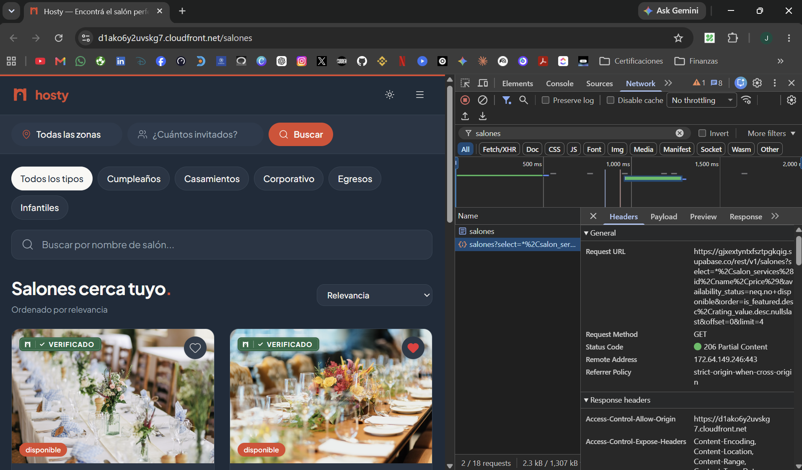
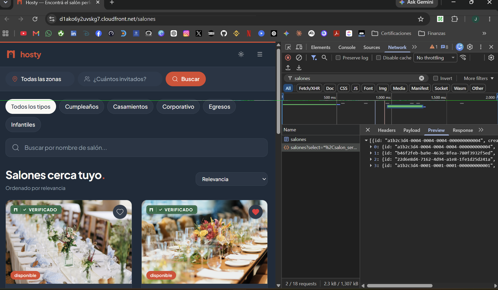

*Figura 35 — Evidencia de pruebas sobre la API PostgREST.*

## Registro de defectos y retesting

Trece incidencias reales, todas etiquetadas `bug` en GitHub y todas cerradas, constituyen el
registro verificable de defectos del proyecto. De esas 13, **5 llevan además una etiqueta de
prioridad real** (`p1-high`/`p2-medium`/`p3-low`) asignada en GitHub — la misma usada en
[Testing y Calidad](#12-testing-y-calidad) (criterios de severidad) —, por lo que su columna "Severidad" queda
verificada, no estimada. Las 8 restantes no fueron priorizadas explícitamente con esa etiqueta, así
que su severidad sigue siendo una estimación (SIM-37).

| Issue | Título | Severidad | Estado | Retesting |
|---|---|---|---|---|
| #87 | `fix(footer)`: links apuntan a rutas incorrectas o inexistentes | Media *(verificada)* | Cerrado | Manual, sobre DEV |
| #85 | `fix`: borrado de salón, horarios de reserva y validaciones del flujo | Media *(estimada)* | Cerrado | Manual, sobre DEV |
| #76 | `fix(footer)`: links del footer son placeholders | Baja *(verificada)* | Cerrado | Manual, sobre DEV |
| #75 | `fix(favorites)`: agregar a favoritos no persiste (sólo estado local) | Alta *(verificada)* | Cerrado | Manual, sobre DEV |
| #74 | `fix(salones)`: el mapa en `/salones` no está implementado | Alta *(verificada)* | Cerrado | Manual, sobre DEV |
| #72 | `fix(nav)`: el link "Cómo funciona" no navega a ninguna sección | Media *(verificada)* | Cerrado | Manual, sobre DEV |
| #71 | `fix(ci)`: estabilizar pipeline de CI | Media *(estimada)* | Cerrado | Verificado en `frontend-tests.yml` |
| #70 | `fix(ci)`: commitear `routeTree.gen.ts` para desbloquear build de CI | Alta *(estimada)* | Cerrado | Verificado en CI |
| #64 | `fix(ux)`: correcciones UX y features faltantes (grupos 1-4) | Media *(estimada)* | Cerrado | Manual, sobre DEV |
| #34 | `fix(seo)`: implementar meta tags y Open Graph | Baja *(estimada)* | Cerrado | Manual, sobre DEV |
| #29 | `fix(ux)`: mejorar manejo de errores y mensajes al usuario | Media *(estimada)* | Cerrado | Manual, sobre DEV |
| #28 | `fix(ux)`: agregar *loading states* a búsquedas y filtros | Baja *(estimada)* | Cerrado | Manual, sobre DEV |
| #26 | `fix(responsive)`: página no es completamente responsive en mobile | Media *(estimada)* | Cerrado | Manual, sobre DEV |

*Tabla 58 — Registro de defectos y retesting. "(verificada)" = severidad confirmada por etiqueta real de GitHub, no estimación.*

> **Fuente.** `gh issue list --state all --label bug --json number,title,state` (2026-07-28):
> 13 issues, 13 `CLOSED`. Etiquetas de prioridad: `gh issue list --state all --label bug --json
> number,labels` (2026-08-03) — #74 y #75 con `p1-high` (Alta); #72 y #87 con `p2-medium` (Media);
> #76 con `p3-low` (Baja). La versión anterior de esta tabla tenía #74 como "Media" y #87 y #72
> como "Baja", en contradicción con la propia etiqueta de GitHub y con la clasificación ya correcta
> de [Testing y Calidad](#12-testing-y-calidad) (criterios de severidad); se corrige aquí para que ambas notas
> coincidan.

> **Dato simulado (SIM-37) — Severidad estimada de 8 de los 13 defectos.**
> GitHub no tiene una etiqueta de prioridad para #85, #71, #70, #64, #34, #29, #28 y #26. Su
> columna "Severidad" es una estimación plausible basada en el impacto funcional descrito en el
> título del issue, no un criterio de triage documentado por el equipo. Los 5 defectos restantes
> (#74, #75, #72, #87, #76) ya no son estimados: su severidad es la etiqueta real de GitHub.

Un defecto adicional, real y verificado —no simulado— se documenta aparte por su relevancia
arquitectónica. A diferencia de las incidencias reconstruidas de la tabla anterior, su nota va
encabezada como *Fuente* y no como *Dato simulado*, porque cada afirmación se verifica leyendo los
archivos de migración que se citan:

> **Fuente.** Defecto real: deriva del estado de `bookings` (M17). El estado `declined` fue
> utilizado por la aplicación (`frontend/src/features/host/lib/booking-status.ts`) antes de que la
> restricción `CHECK` de la base de datos lo permitiera
> (`supabase/migrations/20240101000000_init_hosty.sql:57-58`, que sólo aceptaba `pending`,
> `confirmed` y `cancelled`). **Severidad: media.** **Resolución:** migración
> `supabase/migrations/20260609233130_host_booking_management.sql:7-11`, que elimina y recrea la
> restricción con los 4 valores. **Retest:** se verificó, leyendo la migración, que la restricción
> `bookings_status_check` recreada admite explícitamente `'pending', 'confirmed', 'declined',
> 'cancelled'`. Análisis de deuda técnica asociado en [Testing y Calidad](#12-testing-y-calidad) y en la sección 15
> (Conclusiones, Tabla 40).

## Evidencia de la aplicación en ejecución

La Figura 36 documenta el flujo de reserva completo sobre el entorno desplegado, para el salón
"Villa Eventos Tafí": **Paso 1 — Fecha y hora** (25/12/2026, 16:00–22:15), **Paso 2 — Tu evento**
(casamiento, 150 asistentes y datos de contacto) y **Paso 3 — Confirmar**, donde el sistema
calcula la duración (6,25 h) y el total estimado ($125.000) a partir del precio por hora del salón.
El indicador de progreso superior aparece en las tres capturas, mostrando el avance entre pasos.

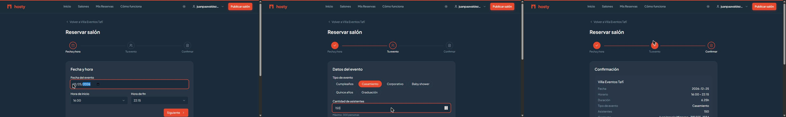

*Figura 36 — Flujo de reserva de la aplicación en ejecución.*

## Evidencia de cobertura de pruebas

La Figura 37 reproduce el encabezado del reporte HTML generado por `@vitest/coverage-v8` sobre la
corrida del 2026-08-02, con las cuatro métricas globales y el desglose por carpeta. Es la fuente
directa de las Tablas 32 y 32a de [Testing y Calidad](#12-testing-y-calidad): el contraste entre las carpetas de
dominio en verde (`features/auth/store` al 100 %, `features/bookings/api` al 97,05 %) y las de
presentación en rojo (`features/bookings/components` y `features/home/components` en 0 %) es
visible de un vistazo y corresponde a la priorización declarada en la sección 12.

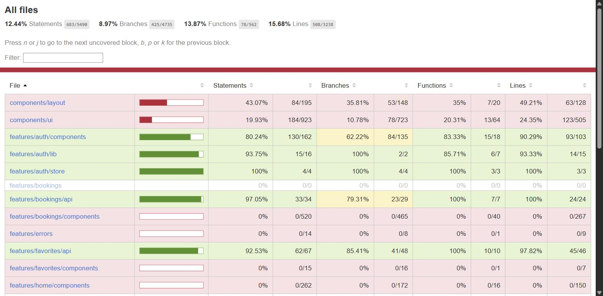

*Figura 37 — Reporte de cobertura de pruebas (`@vitest/coverage-v8`, 2026-08-02).*

> **Fuente.** `npm --prefix frontend run test:coverage`; captura del reporte HTML generado en
> `frontend/coverage/index.html`. Los porcentajes de la captura (12,44 % de sentencias, 8,97 % de
> ramas, 13,87 % de funciones y 15,68 % de líneas) corresponden a la corrida del 2026-08-02, sobre
> 14 archivos y 73 casos. **Quedaron desactualizados el 2026-08-04**, al agregar
> `BookingFlow.test.tsx` y un caso nuevo en `favorites.test.ts` (cierre de SIM-33/SIM-34, ver
> [Testing y Calidad](#12-testing-y-calidad) Tabla 33): la cobertura global subió a 16,41 % de sentencias (Tabla 32).
> La captura no se regeneró; **Tabla 32 es la cifra vigente**, no esta figura.

## Resumen de evidencias

| Evidencia | Resultado |
|---|---|
| Corrida de Vitest | 15 archivos, 75 casos, todos exitosos (2026-08-04) |
| Corrida E2E de Playwright sobre el entorno desplegado | 111 casos sobre 3 navegadores, todos exitosos (2026-08-02; ver Tablas 57b y 57c) |
| Cobertura de pruebas (`@vitest/coverage-v8`) | 16,41 % global de sentencias; 59,83 % sobre el código ejercitado (2026-08-04; ver Tablas 32 y 32a) |
| Verificación de tipos (`tsc -b --noEmit`) | Sin errores (2026-07-28) |
| Análisis estático (`eslint .`) | 6 errores y 4 advertencias (2026-07-28; ver [Testing y Calidad](#12-testing-y-calidad), Tabla 34) |
| Evidencia de la API de datos | Figura 35 — llamada real capturada sobre el entorno desplegado |
| Evidencia de la aplicación en ejecución | Figura 36 — flujo de reserva de tres pasos |
| Evidencia de cobertura | Figura 37 — reporte HTML de `@vitest/coverage-v8` |

*Tabla 59 — Resumen de evidencias de calidad.*
