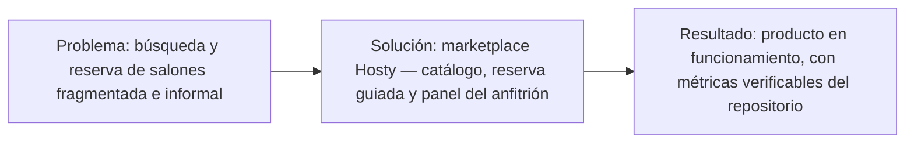

# 01. Resumen Ejecutivo

En la provincia de Tucumán, la búsqueda, comparación y reserva de un salón de eventos depende
todavía de canales informales y dispersos: recomendaciones personales, publicaciones en redes
sociales o llamados telefónicos, sin un canal único que permita comparar disponibilidad, precio y
condiciones entre distintas opciones (ver [[03-Introduccion]] para el desarrollo completo de este
contexto). **Hosty** es una plataforma web de tipo *marketplace* que centraliza la búsqueda, la
comparación y la reserva de salones de eventos, vinculando directamente a dos tipos de usuario: el
organizador, que necesita encontrar y reservar un salón acorde a su presupuesto y ubicación, y el
propietario o anfitrión, que necesita mayor visibilidad comercial y una gestión centralizada de las
reservas que recibe.

La propuesta de valor de Hosty se apoya en tres capacidades centrales: un catálogo público con
búsqueda, filtros y visualización geolocalizada de salones; un flujo de reserva guiado que valida
disponibilidad y horarios antes de confirmar; y un panel de gestión para el anfitrión, con
calendario de reservas y cotización de precio por evento. El alcance del MVP entregado cubre estas
tres capacidades de punta a punta, junto con un sistema de favoritos para el organizador y un plan
de suscripción "Destacado" que mejora la posición del salón dentro del catálogo. Dos capacidades
quedaron fuera del alcance entregado y se documentan explícitamente como diferidas: la integración
de cobro con Mercado Pago, tanto para las reservas como para el plan Destacado, y un sistema de
reseñas y calificaciones de usuarios.

El proyecto se desarrolló bajo la metodología Scrum, en iteraciones (sprints) sucesivas, a lo
largo de un período de aproximadamente 12,6 semanas, entre el 2026-03-29 y el 2026-06-24. Desde el
punto de vista técnico, Hosty es una aplicación de una sola página (*SPA*) construida en React 19,
sin servidor de aplicación propio: la persistencia, la autenticación y la autorización se apoyan
íntegramente en Supabase como plataforma de *backend as a service* (BaaS), con control de acceso a
los datos basado en la propiedad de cada registro y no en un esquema de roles.

*Figura 1 — Síntesis: problema → solución (marketplace de salones) → resultados verificables.*

| Cifra | Valor | Fuente |
|---|---|---|
| Duración del proyecto | ~12,6 semanas (2026-03-29 – 2026-06-24) | M03, M04 |
| Commits en `dev` | 181 | M01 |
| Contribuidores | 5 (9 identidades Git) | M05 |
| Issues cerradas / totales | 45 / 50 | M06 |
| Pull requests mergeados / totales | 26 / 48 | M07 |
| Épicas / milestones | 7 | M08 |
| Rutas totales / protegidas | 14 / 8 | M09 |
| Tablas del modelo de datos | 6 | M10 |
| Pruebas automatizadas / archivos de prueba | 73 / 19 | M12, M13 |

*Tabla 3 — Cifras clave del proyecto.*

> [!info] Fuente — Todos los valores de esta tabla se citan textualmente desde la nota
> `Datos-Verificables` (M01, M03, M04, M05, M06, M07, M08, M09, M10, M12, M13); no se recalculan ni
> se aproximan en esta nota.

El detalle de estas métricas y su interpretación se desarrolla en [[14-Metricas]]; el balance
final entre lo planificado y lo entregado se documenta en [[15-Conclusiones]].

---
[[Indice|Índice]] · ← [[00-Portada-y-Ficha]] · [[02-Acronimos]] →
