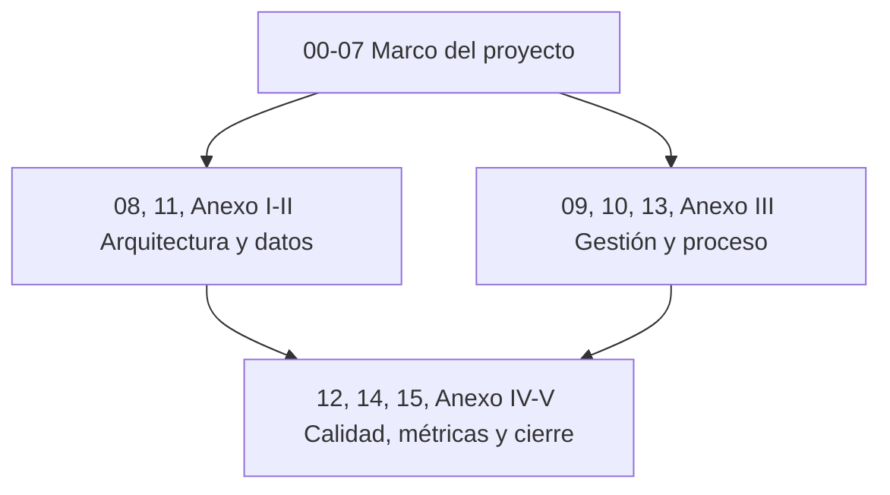

# 3. Introducción

## Contexto y dominio

El mercado de salones de eventos en la provincia de Tucumán está fragmentado: la oferta de
espacios para fiestas, casamientos, cumpleaños y eventos corporativos no se concentra en ningún
canal digital especializado. Su descubrimiento depende, en la práctica, de recomendaciones
personales, publicaciones en redes sociales de alcance limitado o directorios genéricos que no
están orientados a este rubro y que no permiten comparar disponibilidad, precio ni condiciones
entre distintas opciones. Como consecuencia, un organizador de eventos no cuenta con una forma
sistemática de evaluar alternativas antes de comprometerse con un salón, y un propietario que
recién comienza a ofrecer su espacio no dispone de un canal propio para ganar visibilidad frente a
organizadores que todavía no lo conocen. La coordinación de la reserva en sí —fecha, horario,
condiciones del evento— también queda librada a intercambios informales por mensajería o llamada
telefónica, sin un registro estructurado que ambas partes puedan consultar.

Hosty surge como respuesta directa a esta fragmentación: propone un punto de encuentro digital
único entre organizadores y propietarios, que reemplaza la búsqueda dispersa por un catálogo
consultable, y la coordinación manual de la reserva por un flujo guiado con validación de
disponibilidad. El desarrollo del producto tomó como referencia el comportamiento observable de
mercados similares (alojamiento, servicios para eventos) para definir cuáles de estas capacidades
constituían el núcleo mínimo indispensable del producto.

## Relevamiento de requerimientos

El alcance funcional del producto entregado se definió a partir del documento `Definicion de MVP -
HOSTY-2026040419562816.pdf`, elaborado por el equipo al inicio del proyecto como especificación de
referencia del producto a construir. Este documento fue el que fijó, en última instancia, cuáles
funcionalidades formaban parte del MVP (catálogo, reserva, panel del anfitrión) y cuáles quedaban
fuera de su alcance inicial, como el cobro en línea o las reseñas de usuarios (ver sección 1).

> [!warning] Dato simulado SIM-01 — Contenido reconstruido en las secciones 3, 5 y 6 (cubre también SIM-02 y SIM-03)
> El documento de alcance del MVP (`Definicion de MVP - HOSTY-2026040419562816.pdf`) fue la única
> fuente documental disponible para esta introducción, para los puntos de dolor por actor (sección
> 5, [[05-Problema-a-Resolver]], Tabla 9) y para los indicadores de impacto (sección 6,
> [[06-Impacto-de-la-Solucion]], Tabla 10). No hubo entrevistas, encuestas ni instrumentación de
> producto registradas: lo que ese documento no cubre se completó con una reconstrucción razonada a
> partir del dominio del problema y de las funcionalidades priorizadas, no con datos verificados.
> Dos de las cuatro filas de la Tabla 10 sí tienen fuente citada (M10). Esta nota aplica a los tres
> identificadores y no se repite en cada sección; en Problema a Resolver e Impacto de la Solución
> queda sólo una referencia breve a este mismo párrafo.

## Alcance de este documento

Este informe documenta el producto, su arquitectura técnica, el proceso de gestión bajo el que se
construyó y la evidencia de calidad reunida durante el desarrollo. Deliberadamente, no reproduce
un manual de usuario final exhaustivo ni transcribe el código fuente completo del proyecto: ambos
elementos ya están disponibles en el repositorio y su transcripción no aportaría valor adicional a
una audiencia académica. La siguiente tabla resume, de forma explícita, qué contenidos entran y
cuáles quedan fuera del alcance de este documento.

| Incluye | No incluye |
|---|---|
| Descripción funcional del producto y su arquitectura técnica | Manual de usuario final extenso, paso a paso, por cada pantalla |
| Proceso de gestión del proyecto (Scrum, épicas, sprints, backlog) | Código fuente completo (se referencia el repositorio, no se transcribe) |
| Estrategia y evidencias de calidad (testing, incidencias) | Actas originales de entrevistas o encuestas no documentadas en el repositorio |
| Métricas verificables del repositorio y del proceso, con su fuente citada | Capturas de pantalla ya incorporadas — quedan como pendiente en el Anexo V |

*Tabla 5 — Alcance incluido y excluido.*

*Figura 2 — Estructura del informe: 16 secciones + 5 anexos y sus dependencias de lectura.*

Los objetivos que se desprenden de este contexto se desarrollan en [[04-Objetivos]], y el problema
central junto con sus consecuencias se detalla en [[05-Problema-a-Resolver]].

---
[[Indice|Índice]] · ← [[02-Acronimos]] · [[04-Objetivos]] →
