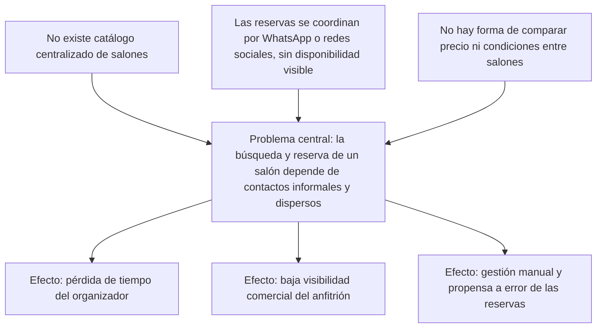

# 5. Problema a Resolver

## Problema central

Buscar, comparar y reservar un salón de eventos en la provincia de Tucumán depende, en la
actualidad, de canales informales y dispersos —recomendaciones personales, publicaciones en redes
sociales, llamados telefónicos— sin un canal único que permita comparar disponibilidad, precio y
condiciones entre distintas opciones antes de comprometerse con una reserva. Este problema afecta a
los dos perfiles de usuario de forma distinta pero relacionada: al organizador, porque no cuenta
con una forma sistemática de evaluar alternativas ni de conocer el precio real de un salón sin
contactarlo directamente; y al propietario del salón (el anfitrión), porque no dispone de un canal
propio de visibilidad comercial y debe gestionar cada reserva de forma manual, típicamente por
WhatsApp, redes sociales o llamadas telefónicas, sin un registro centralizado del estado de cada
una.

## Consecuencias para el organizador

Para el organizador de un evento, la ausencia de un catálogo centralizado se traduce en un costo de
búsqueda elevado: para conocer siquiera las opciones disponibles en una zona o rango de precio
determinado, debe recurrir a múltiples fuentes dispersas —grupos de redes sociales, recomendaciones
de conocidos, búsquedas genéricas— sin garantía de estar viendo el universo real de salones
disponibles. A esto se suma la falta de transparencia de precios: la mayoría de los salones no
publica un precio de referencia, por lo que el organizador debe iniciar una conversación individual
con cada opción antes de poder comparar presupuestos, lo que multiplica el tiempo invertido en la
etapa de decisión y dificulta descartar alternativas tempranamente.

## Consecuencias para el anfitrión

Para el propietario de un salón, la falta de un canal de visibilidad especializado limita su
alcance a la red de contactos existente o a la inversión en publicidad genérica en redes sociales,
sin un espacio donde competir en igualdad de condiciones frente a salones con mayor trayectoria. La
gestión de las reservas recibidas, además, ocurre por canales no estructurados —mensajería
instantánea, llamadas telefónicas, planillas manuales— lo que incrementa el riesgo de errores de
coordinación, como aceptar dos reservas para la misma fecha y horario, o perder el registro de una
solicitud que no llegó a confirmarse.

*Figura 4 — Árbol de problemas: causas → problema central → efectos.*

## Problema, consecuencia y respuesta del sistema

| Problema | Consecuencia | Respuesta del sistema |
|---|---|---|
| No existe un catálogo centralizado de salones | El organizador dedica tiempo a buscar en múltiples redes sociales y grupos | Catálogo público con búsqueda y filtros en `/salones` |
| La disponibilidad de un salón no es visible de antemano | Se coordinan fechas por mensajería y, en ocasiones, se descubre el salón ya ocupado | Bloqueos de disponibilidad definidos por el anfitrión y validados en el wizard de reserva |
| No hay comparación de precio ni de condiciones entre salones | El organizador no puede estimar presupuesto sin contactar a cada salón por separado | Precio visible por salón (fijo, estimado o a cotizar) y cotización explícita por reserva |
| La gestión de reservas del anfitrión es manual (WhatsApp, teléfono, planillas) | Riesgo de doble reserva y de pérdida de mensajes o solicitudes | Panel del anfitrión con calendario y gestión del estado de cada reserva |
| Los salones nuevos o pequeños tienen baja visibilidad comercial | Dependencia casi exclusiva del boca a boca para conseguir clientes | Plan de suscripción "Destacado" que mejora la posición del salón en el catálogo |

*Tabla 8 — Problema, consecuencia y respuesta del sistema.*

## Puntos de dolor por actor y alternativas actuales

| Actor | Punto de dolor | Alternativa actual |
|---|---|---|
| Organizador | No sabe qué salones existen ni su disponibilidad real | Preguntar a conocidos o buscar publicaciones en redes sociales |
| Organizador | No puede comparar precio y condiciones entre salones sin contactarlos uno por uno | Contactar cada salón individualmente por WhatsApp o teléfono |
| Anfitrión | Baja visibilidad frente a salones con más trayectoria o presencia digital | Publicidad en redes sociales propias y recomendación boca a boca |
| Anfitrión | Gestión manual de la disponibilidad y de las reservas recibidas | Agenda física, planillas de cálculo o hilos de mensajería |

*Tabla 9 — Puntos de dolor por actor y alternativas actuales.*

*SIM-02 — reconstrucción razonada a partir del dominio del problema, no de una encuesta o
entrevista documentada; ver la nota metodológica completa en [[03-Introduccion]].*

Las respuestas concretas que Hosty da a cada uno de estos puntos se retoman, en términos de
beneficio percibido, en [[06-Impacto-de-la-Solucion]], y se contrastan con los objetivos
específicos definidos en [[04-Objetivos]].

---
[[Indice|Índice]] · ← [[04-Objetivos]] · [[06-Impacto-de-la-Solucion]] →
