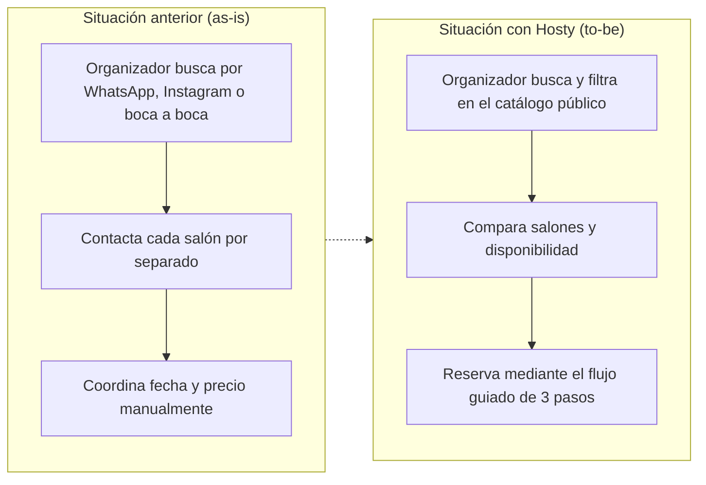

# 6. Impacto de la Solución

## Beneficios por tipo de usuario

Para el organizador de eventos, Hosty concentra en un único lugar las tres etapas que antes
requerían canales distintos y descoordinados: la búsqueda de opciones, la comparación entre ellas y
la reserva propiamente dicha. En lugar de contactar salón por salón para conocer precio y
disponibilidad, el organizador filtra el catálogo público, compara alternativas con precio visible
y confirma una reserva mediante un flujo guiado que valida la disponibilidad antes de aceptarla.
Este cambio es particularmente relevante en la etapa de decisión, donde la posibilidad de descartar
alternativas sin necesidad de una conversación individual reduce la fricción del proceso completo
de reserva.

Para el anfitrión, el beneficio principal es doble: por un lado, un panel de gestión centralizado
que reemplaza la coordinación manual de reservas por una vista única de calendario, estado de cada
solicitud y cotización de precio por evento; por otro, una vía de visibilidad comercial adicional a
sus canales propios, tanto por aparecer en los resultados de búsqueda del catálogo público como,
opcionalmente, mediante el plan de suscripción "Destacado", que mejora su posición dentro de los
resultados. Ambos efectos son más relevantes cuanto menor es la trayectoria previa del salón, ya
que reducen su dependencia de canales de visibilidad que requieren tiempo o inversión constante
para sostenerse.

## Qué cambia respecto de la situación anterior

El cambio central que introduce Hosty es el pasaje de una coordinación manual y dispersa —apoyada
en WhatsApp, Instagram y el boca a boca— a un flujo digital centralizado, donde tanto la oferta (el
catálogo de salones) como la demanda (la reserva y sus estados) quedan registradas en un mismo
sistema, consultable por ambas partes. Este pasaje no es meramente cosmético: implica que la
disponibilidad de un salón, antes conocida sólo por su propietario, pasa a ser una condición
verificable por el sistema antes de aceptar una reserva, lo que reduce el margen de error humano en
la coordinación.

*Figura 5 — Proceso as-is (WhatsApp/Instagram/boca a boca) vs. to-be con Hosty.*

| Dimensión | Tipo de usuario | Impacto esperado | Indicador propuesto | Método de medición |
|---|---|---|---|---|
| Tiempo de búsqueda | Organizador | Reducción del tiempo dedicado a buscar y comparar salones | Tiempo entre el inicio de la búsqueda y la reserva confirmada | No instrumentado — requiere analítica de producto |
| Transparencia de precio | Organizador | Precio o rango visible antes de contactar al salón | Porcentaje de salones con precio fijo o estimado publicado | Consulta directa a la tabla `salones` |
| Visibilidad comercial | Anfitrión | Mayor exposición del salón dentro del catálogo | Suscripciones activas al plan Destacado | Consulta a `salon_subscriptions` (M10) |
| Centralización de la gestión | Anfitrión | Reservas gestionadas desde un único panel en lugar de canales externos | Reservas creadas y actualizadas desde el panel del anfitrión | No instrumentado — requiere adopción real por parte de los anfitriones |

*Tabla 10 — Impacto por dimensión y tipo de usuario, con indicador y método de medición.*

*SIM-03 — dos de las cuatro filas ya citan fuente verificable (M10); las otras dos son propuestas
de medición aún no instrumentadas; ver la nota metodológica completa en [[03-Introduccion]].*

El impacto aquí descripto retoma directamente los puntos de dolor identificados en
[[05-Problema-a-Resolver]] y se refleja, en términos cuantitativos, en las métricas de
[[14-Metricas]].

## Tamaño del mercado y modelo de negocio

El impacto por usuario de la tabla anterior tiene, además, una lectura de mercado. Con la tasa de
eventos y el ticket promedio estimados en el Anexo VI, el mercado disponible en Tucumán (SAM) es de
aproximadamente **ARS 1.060 millones/año**, y el volumen alcanzable en el corto plazo con la base
actual de +120 salones verificados (SOM) es de unos **ARS 120 millones/año** transaccionados —entre
ARS 9,6 y 18 millones/año de ingreso potencial sólo por comisión, al 8–15 % ya declarado en el
issue #45. El desarrollo completo del cálculo, con cada supuesto citado por separado, está en
[[Anexos/Anexo-VI-Descubrimiento-y-Mercado]].

Ese mismo anexo documenta las tres líneas de ingreso previstas —suscripción "Destacado" (ya
implementada), comisión por reserva concretada (declarada desde la planificación de la épica E3) y,
a futuro, reventa del servicio de organización integral del evento— y el proceso de *product
discovery* que llevó de un brainstorming de treinta ideas a las tres capacidades que efectivamente
se construyeron.

---
[[Indice|Índice]] · ← [[05-Problema-a-Resolver]] · [[07-Equipo-y-Roles]] →
