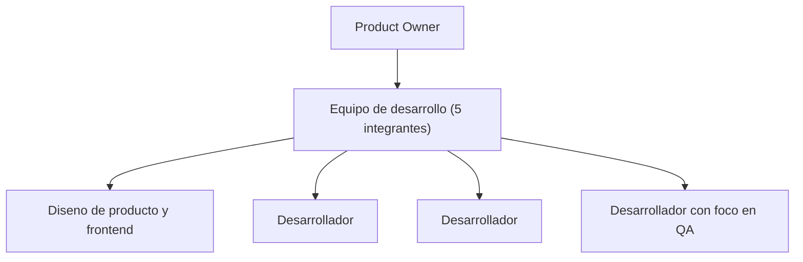

# 7. Equipo y Roles

## Composición del equipo

El proyecto fue desarrollado por un equipo de 5 integrantes, identificados de forma consolidada a
partir de 9 identidades Git distintas (M05): Juan Pablo Valdez, Juan Ignacio Mignone, Lautaro
Naglieri, Benjamín Garma y Pablo Czurylo. La distribución de roles —1 Product Owner y 4
desarrolladores, uno con foco en calidad (QA) y otro con foco en diseño de producto— se infiere de
la actividad observable en el historial de commits, ya que el proyecto no cuenta con un registro
documental explícito de la asignación formal de roles. El equipo **no designó un Scrum Master
formal**: la conducción de la iteración se distribuyó entre el Product Owner y el responsable de
diseño de producto según el período, como se detalla más abajo. Estas
responsabilidades reflejan, ante todo, el área funcional donde cada integrante concentró su
trabajo a lo largo del proyecto, verificable directamente en el historial de commits del
repositorio, y no necesariamente una asignación fija o exclusiva: la naturaleza de un equipo de 5
personas trabajando sobre un mismo repositorio implica solapamientos razonables entre áreas.

*Figura 6 — Organigrama del equipo: Product Owner y equipo de desarrollo (5 integrantes).*

| Integrante | Legajo | Rol de equipo | Responsabilidades principales |
|---|---|---|---|
| Valdez, Juan Pablo | UIA7 0262 | Product Owner | Arquitectura general; catálogo de salones, panel del anfitrión, flujo de reserva y autenticación — mayor volumen de contribuciones del equipo |
| Mignone, Juan Ignacio | UIA7 0298 | Diseño de producto y desarrollo frontend | Sistema de diseño de la aplicación (Brandbook v1.0: isotipo, tokens de marca y tipografía); interfaz del catálogo de salones, página de inicio, panel del anfitrión y favoritos. Ejerció la conducción técnica del equipo y la integración de cambios durante los *sprints* 2 y 4 |
| Martinez Naglieri, Lautaro David | UIA7 0286 | Desarrollador | Catálogo de salones, panel del anfitrión y flujo de reserva |
| Garma, Benjamin | UIA7 0362 | Desarrollador con foco en QA | Infraestructura de pruebas (Vitest, Playwright, Cypress) y el workflow de CI `frontend-tests.yml` |
| Czurylo, Juan Pablo | UIA7 0331 | Desarrollador | Búsqueda y filtrado de salones (paginación, persistencia de filtros en URL); motor de reservas (flujo de reserva, confirmación); sistema de notificaciones de reserva por email, implementado en la rama `feat/email-notifications` (PR #96, aún no fusionada a `dev`) |

*Tabla 11 — Integrantes, legajo, rol de equipo y responsabilidades.*

> [!info] Fuente — Evidencia por integrante para la columna "Rol de equipo" y "Responsabilidades
> principales". **Valdez** (Product Owner): único colaborador con permisos de administrador del
> repositorio y autor del 90 % de las issues (45 de 50) — M33, M34 —, además de la autoría casi
> exclusiva del *backend* NestJS y la infraestructura Terraform descartados en el *sprint* 2 (ver
> Tabla 37a). **Mignone** (Diseño de producto y desarrollo frontend): *commits* que introducen el
> sistema de diseño —`apply Brandbook v1.0 — isotipo, tokens, typography`, `redesign v2 — Design
> Handoff tokens, editorial hero, HostyBadge system`, `update HostyLogo isotipo shape`— y mayor
> volumen de *commits* e integración de *pull requests* en los *sprints* 2 y 4. **Naglieri**
> (Desarrollador): mayor densidad de *commits* en `features/salones`, `features/host` y
> `features/bookings`. **Garma** (Desarrollador con foco en QA): archivos de configuración de
> pruebas (Vitest, Playwright, Cypress) y el *workflow* de CI que aportó. **Czurylo**
> (Desarrollador): `features/bookings` y `features/salones`, más la rama `feat/email-notifications`
> (M35). Comandos: `git log --author --since --until`, `git log --merges --author`, `gh api
> repos/.../collaborators`, `gh issue list --json author` (verificado 2026-08-04; detalle completo
> en [[Datos-Verificables]] M33–M35).

> [!warning] Dato simulado SIM-04 — Título formal de cada rol de equipo
> Lo único que sigue sin registro documental es el título formal en sí (que el equipo se haya
> reunido y acordado llamar "Product Owner" a Valdez, por ejemplo): no existe un acta de asignación
> de roles. Los títulos de esta tabla son la etiqueta que mejor describe la evidencia verificable
> citada arriba, no una cita textual de una decisión de equipo documentada.

La conducción del equipo, por lo tanto, no fue estática a lo largo del proyecto: en los *sprints* 2
y 4 la coordinación de la integración recayó en el responsable de diseño de producto. Esa rotación
no responde a una decisión de proceso documentada, sino a la disponibilidad efectiva de los
integrantes en cada período, y se refleja tanto en el volumen de *commits* como en quién integró
los *pull requests* de cada uno.

> [!info] Fuente — `git log --author --since --until` acotado a los rangos de *sprint* de la Tabla
> 21, y `git log --merges --author` para la integración de *pull requests* (verificado 2026-08-03).

## Contribuciones por identidad Git

| Integrante | Commits (todas las identidades) | Porcentaje del total |
|---|---|---|
| Juan Pablo Valdez | 140 | 59,3 % |
| Juan Ignacio Mignone | 45 | 19,1 % |
| Lautaro Naglieri | 33 | 14,0 % |
| Benjamín Garma | 10 | 4,2 % |
| Pablo Czurylo | 8 | 3,4 % |

*Tabla 12 — Contribuciones por identidad Git.*

> [!info] Fuente — M05 / M02: `git shortlog -sne --all`. El detalle de cada identidad Git por
> integrante se documenta en [[Datos-Verificables]]; esta tabla sólo consolida el porcentaje sobre
> el total de 236 commits (M02).

**Alcance de esta tabla: qué mide y qué no mide.** El volumen de *commits* describe la actividad
registrada en el historial, no la magnitud ni el valor del aporte de cada integrante, y tres
factores verificables lo distorsionan en este proyecto. Primero, **34 de los 140 *commits* del
integrante con mayor volumen —un 24 %— corresponden a la rama `staging`**, la infraestructura del
*backend* NestJS que se descartó en el *sprint* 2 (ver la sección 14, Tabla 37a) y que no aportó
código al producto entregado. Segundo, el historial registra **9 identidades Git para 5 personas**
(M05), y quien integra las ramas acumula *commits* de fusión que no representan trabajo propio.
Tercero, el tamaño de un *commit* no está normalizado: los 10 *commits* de Benjamín Garma
introducen la infraestructura completa de pruebas —Vitest, Playwright y Cypress— y el *workflow* de
integración continua que hoy bloquea las fusiones que no pasan la suite.

La distribución de responsabilidades por área, que es la lectura pertinente del reparto de trabajo,
es la de la Tabla 11.

## Roles de usuario, permisos y mecanismo de autorización

A diferencia de los roles de equipo descriptos arriba, Hosty **no tiene una tabla de roles de
usuario ni un esquema de control de acceso basado en roles (RBAC)**. La autorización se resuelve
exclusivamente por propiedad (*ownership*): las políticas de seguridad a nivel de fila (RLS) de
Postgres restringen qué filas puede leer o modificar cada usuario autenticado según `auth.uid()`,
sin que exista un campo de rol que se consulte para decidir un permiso. Este enfoque implica que
ser anfitrión no es un estado que se activa mediante un campo de configuración o un permiso
otorgado por un administrador, sino una consecuencia directa de poseer al menos un registro en la
tabla `salones`: cualquier usuario autenticado puede convertirse en anfitrión publicando un salón,
sin necesidad de una aprobación previa.

| Perfil | Cómo se determina | Permisos principales | Mecanismo de autorización |
|---|---|---|---|
| Visitante anónimo | No autenticado | Ver el catálogo público y el detalle de cada salón | Ninguno — datos públicos vía políticas RLS de lectura |
| Usuario autenticado (organizador) | Sesión activa de Supabase Auth | Reservar, marcar favoritos, ver sus propias reservas | RLS: filas visibles o editables según `auth.uid()` |
| Anfitrión | Implícito: posee al menos una fila en `salones` | Gestionar sus salones, ver y responder reservas recibidas, suscribirse al plan Destacado | RLS: acceso restringido a filas de `salones`/`bookings` donde el propietario coincide con `auth.uid()` |
| Administrador | No implementado | — | — (ver hallazgo a continuación) |

*Tabla 13 — Roles de usuario, permisos y mecanismo de autorización.*

Esta decisión de diseño simplifica el modelo de permisos del sistema, a costa de no contar con una
jerarquía de administración: cualquier limitación operativa (por ejemplo, moderar un salón
inapropiado) requiere hoy una intervención manual directa sobre la base de datos, dado que no
existe un perfil de administrador funcional en la aplicación.

> [!info] Fuente — El issue #46 ("feat(admin): panel de aprobación y moderación de salones")
> figura cerrado en el repositorio, pero no existe en el código ninguna ruta, componente o columna
> de aprobación/moderación asociada (`grep` sobre `frontend/src/` y `supabase/migrations/*.sql`
> sin resultados): el panel de administrador no fue implementado pese al cierre del issue. La
> cadena de autorización por propiedad se ilustra gráficamente en el Anexo I (Figura 29).

La composición y las responsabilidades del equipo descriptas aquí se retoman, en clave de proceso
Scrum, en [[09-Planificacion-Scrum]]; el detalle técnico de la arquitectura de autorización se
desarrolla en [[11-Arquitectura]].

---
[[Indice|Índice]] · ← [[06-Impacto-de-la-Solucion]] · [[08-Diseno-y-Desarrollo]] →
