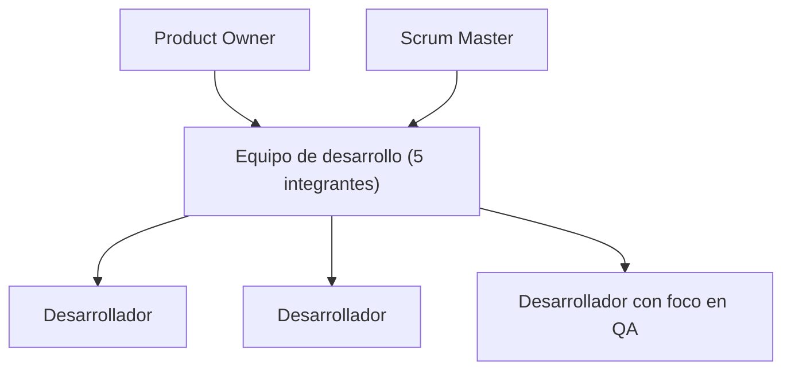

# 07. Equipo y Roles

## Composición del equipo

El proyecto fue desarrollado por un equipo de 5 integrantes, identificados de forma consolidada a
partir de 9 identidades Git distintas (M05): Juan Pablo Valdez, Juan Ignacio Mignone, Lautaro
Naglieri, Benjamín Garma y Pablo Czurylo. La distribución de roles de equipo bajo el marco Scrum
adoptado —1 Product Owner, 1 Scrum Master y 3 desarrolladores, uno de ellos con foco en calidad
(QA)— se infiere de la actividad observable en el historial de commits, ya que el proyecto no
cuenta con un registro documental explícito de la asignación formal de roles. Estas
responsabilidades reflejan, ante todo, el área funcional donde cada integrante concentró su
trabajo a lo largo del proyecto, verificable directamente en el historial de commits del
repositorio, y no necesariamente una asignación fija o exclusiva: la naturaleza de un equipo de 5
personas trabajando sobre un mismo repositorio implica solapamientos razonables entre áreas.

*Figura 6 — Organigrama Scrum: PO / SM / equipo de desarrollo (5 integrantes).*

| Integrante | Rol de equipo (Scrum) | Responsabilidades principales |
|---|---|---|
| Juan Pablo Valdez | Product Owner | Arquitectura general; catálogo de salones, panel del anfitrión, flujo de reserva y autenticación — mayor volumen de contribuciones del equipo |
| Juan Ignacio Mignone | Scrum Master | Catálogo de salones, página de inicio, panel del anfitrión y favoritos |
| Lautaro Naglieri | Desarrollador | Catálogo de salones, panel del anfitrión y flujo de reserva |
| Benjamín Garma | Desarrollador con foco en QA | Infraestructura de pruebas (Vitest, Playwright, Cypress) y el workflow de CI `frontend-tests.yml` |
| Pablo Czurylo | Desarrollador | Búsqueda de salones, flujo de reserva y notificaciones por email |

*Tabla 11 — Integrantes, rol de equipo y responsabilidades.*

> [!warning] Dato simulado SIM-04 — Asignación de rol de equipo
> La columna "Rol de equipo (Scrum)" es una reconstrucción plausible a partir del volumen y del
> área de los commits de cada integrante, no un registro documentado de la asignación real de
> roles. La única excepción es el foco en QA de Benjamín Garma, que se verifica directamente en
> los archivos de configuración de pruebas (Vitest, Playwright, Cypress) y en el workflow de CI que
> aportó al repositorio.

> [!todo] PLACEHOLDER P-09 — Rol formal de cada integrante
> Completar, para la Tabla 11, el rol formal de cátedra de cada integrante (no el rol de equipo
> Scrum de la fila anterior) y sus legajos — el mismo dato pendiente ya señalado como P-06 en la
> sección 00 (Tabla 1). Responsable: equipo.

## Contribuciones por identidad Git

| Integrante | Commits (todas las identidades) | Porcentaje del total |
|---|---|---|
| Juan Pablo Valdez | 140 | 59,3 % |
| Juan Ignacio Mignone | 45 | 19,1 % |
| Lautaro Naglieri | 33 | 14,0 % |
| Benjamín Garma | 10 | 4,2 % |
| Pablo Czurylo | 8 | 3,4 % |

*Tabla 12 — Contribuciones por identidad Git.*

> [!info] Fuente — M05 / M02: `git shortlog -sne --all`. El detalle de cada identidad Git por
> integrante se documenta en [[Datos-Verificables]]; esta tabla sólo consolida el porcentaje sobre
> el total de 236 commits (M02).

## Roles de usuario, permisos y mecanismo de autorización

A diferencia de los roles de equipo descriptos arriba, Hosty **no tiene una tabla de roles de
usuario ni un esquema de control de acceso basado en roles (RBAC)**. La autorización se resuelve
exclusivamente por propiedad (*ownership*): las políticas de seguridad a nivel de fila (RLS) de
Postgres restringen qué filas puede leer o modificar cada usuario autenticado según `auth.uid()`,
sin que exista un campo de rol que se consulte para decidir un permiso. Este enfoque implica que
ser anfitrión no es un estado que se activa mediante un campo de configuración o un permiso
otorgado por un administrador, sino una consecuencia directa de poseer al menos un registro en la
tabla `salones`: cualquier usuario autenticado puede convertirse en anfitrión publicando un salón,
sin necesidad de una aprobación previa.

| Perfil | Cómo se determina | Permisos principales | Mecanismo de autorización |
|---|---|---|---|
| Visitante anónimo | No autenticado | Ver el catálogo público y el detalle de cada salón | Ninguno — datos públicos vía políticas RLS de lectura |
| Usuario autenticado (organizador) | Sesión activa de Supabase Auth | Reservar, marcar favoritos, ver sus propias reservas | RLS: filas visibles o editables según `auth.uid()` |
| Anfitrión | Implícito: posee al menos una fila en `salones` | Gestionar sus salones, ver y responder reservas recibidas, suscribirse al plan Destacado | RLS: acceso restringido a filas de `salones`/`bookings` donde el propietario coincide con `auth.uid()` |
| Administrador | No implementado | — | — (ver hallazgo a continuación) |

*Tabla 13 — Roles de usuario, permisos y mecanismo de autorización.*

Esta decisión de diseño simplifica el modelo de permisos del sistema, a costa de no contar con una
jerarquía de administración: cualquier limitación operativa (por ejemplo, moderar un salón
inapropiado) requiere hoy una intervención manual directa sobre la base de datos, dado que no
existe un perfil de administrador funcional en la aplicación.

> [!info] Fuente — El issue #46 ("feat(admin): panel de aprobación y moderación de salones")
> figura cerrado en el repositorio, pero no existe en el código ninguna ruta, componente o columna
> de aprobación/moderación asociada (`grep` sobre `frontend/src/` y `supabase/migrations/*.sql`
> sin resultados): el panel de administrador no fue implementado pese al cierre del issue. La
> cadena de autorización por propiedad se ilustra gráficamente en el Anexo I (Figura 29).

La composición y las responsabilidades del equipo descriptas aquí se retoman, en clave de proceso
Scrum, en [[09-Planificacion-Scrum]]; el detalle técnico de la arquitectura de autorización se
desarrolla en [[11-Arquitectura]].

---
[[Indice|Índice]] · ← [[06-Impacto-de-la-Solucion]] · [[08-Diseno-y-Desarrollo]] →
