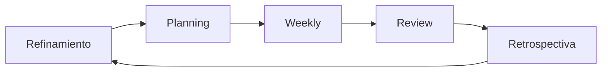
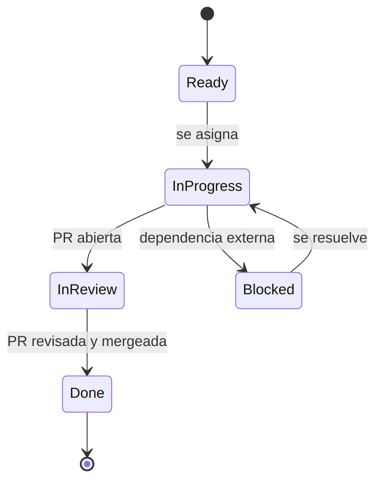
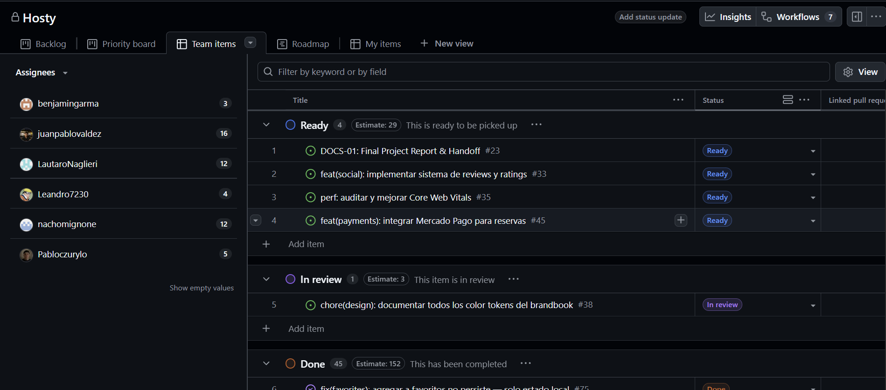

# 9. Planificación Scrum

El proyecto se organizó bajo el marco Scrum, con iteraciones quincenales y un backlog gestionado
íntegramente como issues de GitHub, agrupadas en épicas y priorizadas mediante un tablero de
gestión visual. Esta sección documenta las épicas, las historias de usuario destacadas, los
criterios de aceptación, las reglas de trabajo del equipo, el calendario de sprints y el
mecanismo de seguimiento utilizado.

## Ceremonias y cadencia

*Figura 10 — Iteración Scrum: refinamiento, planificación, weekly, revisión y retrospectiva.*

> [!note] Dato simulado SIM-09 — Ceremonias Scrum y cadencia
> El equipo confirmó (2026-08-04) que la sincronización del equipo de desarrollo fue semanal
> ("*weekly*"), no diaria — ajustada a la disponibilidad real de un equipo part-time/estudiantil —,
> corregido en la fila correspondiente de la Tabla 17. El resto de las ceremonias (refinamiento,
> planning, review y retrospectiva) sigue sin acta formal en el repositorio: su frecuencia y
> participantes, en la Tabla 17 que aparece a continuación, son una reconstrucción plausible para
> un equipo estudiantil de cinco integrantes que trabaja con Scrum sobre issues de GitHub.

| Ceremonia | Frecuencia | Participantes | Propósito |
|---|---|---|---|
| Refinamiento | Semanal | Equipo completo | Detallar y estimar issues antes del siguiente sprint |
| Planning | Inicio de cada sprint | Equipo completo | Seleccionar y comprometer el alcance del sprint |
| Weekly | Semanal | Equipo de desarrollo | Sincronizar avance y destrabar bloqueos |
| Review | Cierre de cada sprint | Equipo + Product Owner | Demostrar el incremento funcional |
| Retrospectiva | Cierre de cada sprint | Equipo completo | Identificar mejoras de proceso |

*Tabla 17 — Ceremonias Scrum y cadencia.*

## Épicas

El backlog se organiza en siete épicas, correspondidas con los siete hitos (*milestones*) reales
del repositorio (M08). La correspondencia se estableció por afinidad temática de las issues que
integra cada hito; el detalle issue por issue se documenta en [[Anexo-III-Backlog-User-Stories]]
(T51), donde cada fila cita el hito real de GitHub sin pasar por esta simplificación en siete
categorías.

| Épica | Objetivo | Hito(s) de GitHub asociados | Estado |
|---|---|---|---|
| E1 — Catálogo y búsqueda | Catálogo público con búsqueda, filtros y geolocalización | Phase 1.B: Search & Filtering; Phase 3.B: Admin Panel (moderación de publicaciones) | Completada (7/7 issues) |
| E2 — Autenticación y cuenta | Registro, login y alta de cuenta de organizador/anfitrión | Phase 1.A: Auth & Onboarding | Completada (3/3) |
| E3 — Reserva de salones | Flujo de reserva guiado y cobro de comisión | Phase 2: Booking & Payments | En curso (3/4; #45 abierta) |
| E4 — Panel del anfitrión | Gestión de reservas, precios, agenda y notificaciones | Phase 3: Host Features; Phase 2.B: Notifications | Completada (6/6) |
| E5 — Favoritos y plan destacado | Favoritos del organizador y suscripción destacada del anfitrión | Sin hito propio (issue #47 + issues #75/#88 sin hito) | Completada (3/3) |
| E6 — Calidad e integración continua | Pruebas automatizadas y estabilización del pipeline de CI | Subconjunto de Phase 2+: Polish & Optimization | Completada (4/4) |
| E7 — Infraestructura y despliegue | Infraestructura de producción y optimización de rendimiento | Subconjunto de Phase 2+: Polish & Optimization | En curso (3/4; #35 abierta) |

*Tabla 18 — Épicas: código, objetivo y estado.*

> [!info] Fuente — M06 (issues totales/cerradas), M08 (7 milestones): `gh issue list --state all`,
> `gh api .../milestones` (verificado 2026-07-28); ver [[Datos-Verificables]].

*Figura 11 — Ciclo de vida de un issue en GitHub Projects v2: Todo → In Progress → In Review → Done (+ Blocked).*

> [!info] Fuente — M19: distribución real de estados en el tablero #4 al momento de la
> verificación — Done: 45, Ready: 4, In review: 1 (`gh project item-list 4 --owner
> juanpablovaldez --format json`, 2026-07-28). Los estados "In Progress" y "Blocked" existen en el
> esquema del tablero pero no tienen issues asignadas actualmente.

> [!info] Fuente — Captura del tablero #4, vista "Team items" (2026-07-29). La distribución
> visible (Ready: 4, In review: 1, Done: 45) coincide con la verificación de M19 citada arriba.

*Figura 12 — Tablero de gestión del proyecto en GitHub Projects v2 (board #4).*

## User stories destacadas

La siguiente selección de 15 historias, sobre un total de 50 issues (M06), cubre las siete
épicas. Los story points citados no son una estimación de este informe: corresponden al campo
"Size" registrado por el propio equipo en el tablero de GitHub Projects v2, con escala de
Fibonacci (1, 2, 3, 5, 8, 13, 21).

| Historia | Como / quiero / para | SP | Épica |
|---|---|---|---|
| #13 | Como usuario, quiero registrarme e iniciar sesión para acceder a mi cuenta y a las funciones protegidas | 13 | E2 |
| #18 | Como anfitrión, quiero un panel para ver y administrar mis salones publicados | 13 | E2 |
| #19 | Como anfitrión, quiero un asistente guiado de publicación para cargar un salón sin errores | 21 | E2 |
| #11 | Como organizador, quiero buscar y filtrar salones para encontrar opciones acordes a mi evento | 13 | E1 |
| #15 | Como organizador, quiero ver el detalle de un salón con galería y características para decidir si reservarlo | 13 | E1 |
| #30 | Como organizador, quiero paginación o scroll infinito en el listado para explorar más salones | 8 | E1 |
| #16 | Como organizador, quiero seleccionar fecha y horario disponibles para reservar sin conflictos | 21 | E3 |
| #17 | Como organizador, quiero confirmar mi reserva y verla en mi panel para hacer seguimiento de su estado | 13 | E3 |
| #31 | Como organizador, quiero completar el flujo de reserva de punta a punta para concretar el alquiler | 21 | E3 |
| #65 | Como anfitrión, quiero confirmar o rechazar reservas recibidas para controlar la ocupación de mi salón | 13 | E4 |
| #66 | Como anfitrión, quiero definir precios flexibles y servicios adicionales para ajustar mi oferta | 8 | E4 |
| #67 | Como anfitrión, quiero bloquear fechas en un calendario para evitar reservas en días no disponibles | 5 | E4 |
| #47 | Como anfitrión, quiero suscribirme a un plan destacado para aumentar la visibilidad de mi salón | 13 | E5 |
| #21 | Como equipo de desarrollo, quiero pruebas end-to-end del flujo de reserva para validar el camino crítico | 13 | E6 |
| #22 | Como equipo de desarrollo, quiero infraestructura de producción con CDN y HTTPS para publicar con seguridad | 8 | E7 |

*Tabla 19 — User stories destacadas: formato Como/quiero/para, story points y épica.*

> [!info] Fuente — M25: story points reales del campo "Size" del tablero #4 —
> `gh project item-list 4 --owner juanpablovaldez --format json` (verificado 2026-07-28); 40 de las
> 50 issues del backlog tienen el campo cargado. Ver [[Datos-Verificables]].

### Ejemplo de criterio de aceptación

> [!note] Dato simulado SIM-12 — Ejemplo de criterio de aceptación (formato Given/When/Then)
> El issue original no registra sus criterios de aceptación en formato Given/When/Then. La
> redacción siguiente se reconstruye a partir del comportamiento observable en
> `BookingFlow.tsx` y `useCreateBooking` para ilustrar el método de trabajo del equipo, sin
> constituir evidencia documental del proceso real.

**Historia**: Como organizador, quiero reservar un salón en una fecha y horario disponibles
(#16, #31).

- **Given** un salón publicado con disponibilidad para el rango de fechas solicitado.
- **When** el organizador completa el asistente de reserva (fecha/horario, datos del evento,
  confirmación) y no existe superposición con un bloqueo de disponibilidad ni con otra reserva
  confirmada.
- **Then** el sistema crea la reserva con estado `pending` y la expone en el panel del
  organizador y en el panel del anfitrión para su revisión.

## Definition of Ready y Definition of Done

> [!note] Dato simulado SIM-10 — Definition of Ready (DoR)
> No hay un documento de DoR versionado en el repositorio. Las filas "DoR" de la Tabla 20 que
> aparece a continuación (Definition of Ready y Definition of Done) reconstruyen un criterio
> plausible para un equipo estudiantil de cinco integrantes.

> [!note] Dato simulado SIM-11 — Definition of Done (DoD)
> Ídem SIM-10: las filas "DoD" de la misma Tabla 20 son una reconstrucción plausible, no un acta
> registrada del equipo.

| Tipo | Criterio |
|---|---|
| DoR | La historia tiene una descripción clara, un criterio de aceptación esbozado y no depende de otra historia sin resolver |
| DoR | La historia está estimada en story points y priorizada en el tablero antes del planning |
| DoD | El código pasa lint, typecheck y la suite de pruebas automatizadas (M12) |
| DoD | La funcionalidad fue revisada por al menos un integrante distinto del autor (pull request) |
| DoD | La historia se verificó manualmente contra su criterio de aceptación antes de cerrarse |

*Tabla 20 — Definition of Ready y Definition of Done.*

## Plan de sprints

> [!note] Dato simulado SIM-13 — Límites y foco de los sprints
> El equipo confirmó (2026-08-04) que trabajó con sprints formalmente definidos, con story points y
> un objetivo de sprint ("*sprint goal*") explícito por iteración — no es una simulación que el
> proyecto haya tenido sprints reales. Lo que no está disponible para este informe es el texto
> puntual de esos objetivos ni los límites de fecha exactos tal como se registraron originalmente:
> las etiquetas "S1"–"S5", sus rangos de fecha y su foco temático, en la Tabla 21 que aparece a
> continuación, se infieren a partir de la densidad real de commits y de los clústeres de fecha de
> las migraciones de Supabase. Los conteos de commits e issues cerradas por sprint sí son reales y
> verificables (M23, M24).

| Sprint | Rango | Foco | Commits | Issues cerradas | Decisión / resultado |
|---|---|---|---|---|---|
| S1 | 2026-03-29 – 2026-04-19 | Arranque, arquitectura base, home | 50 | 0 | Scaffolding inicial; sin cierres formales de issues aún |
| S2 | 2026-04-20 – 2026-05-15 | Catálogo, filtros, detalle de salón | 38 | 4 | Migración de NestJS a Supabase (commit `3a89616`) |
| S3 | 2026-05-16 – 2026-06-05 | Autenticación, carga de imágenes (Storage) | 39 | 16 | Mayor concentración de cierres del proyecto |
| S4 | 2026-06-06 – 2026-06-13 | Panel de anfitrión, reservas, precios y bloqueos | 13 | 12 | Corrección del `CHECK` de `bookings` a 4 estados |
| S5 | 2026-06-14 – 2026-06-24 | Plan destacado, coordenadas, favoritos | 41 | 13 | Consolidación de 7 PRs en la PR #93 |

*Tabla 21 — Plan de sprints: cantidad, duración, foco y resultado.*

> [!info] Fuente — M23 (commits por sprint) y M24 (issues cerradas por sprint), calculados para
> este informe: `git log dev --since --until --oneline | wc -l` y `gh issue list --state closed
> --json number,closedAt` por ventana (verificado 2026-07-28). Ver [[Datos-Verificables]]. El
> detalle cronológico se desarrolla en [[13-Ejecucion-por-Sprint]].

**Herramienta de gestión**: el seguimiento del backlog y del avance de cada sprint se realiza en
GitHub Projects v2, tablero #4 ("Hosty"), con campos de estado, tamaño (story points), objetivo de
sprint e hito (M19), integrado directamente con las issues y *pull requests* del repositorio.

## Retrospectivas

> [!note] Dato simulado SIM-14 — Retrospectiva S1–S2 · SIM-15 — Retrospectiva S3–S4 ·
> SIM-16 — Retrospectiva S5
> No existe acta de retrospectiva registrada. La Tabla 22 que aparece a continuación
> (retrospectivas) reconstruye de forma plausible el contenido a partir de fricciones observables
> en el historial (issues de re-trabajo, la corrección del `CHECK` de `bookings`, el evento de
> consolidación de PRs) y no debe interpretarse como transcripción real de una ceremonia.

| Sprints | Problema | Impacto | Acción correctiva |
|---|---|---|---|
| S1–S2 | Se subestimó el esfuerzo de migrar de NestJS a Supabase | Retrabajo de la capa de acceso a datos a mitad de sprint | Congelar decisiones de arquitectura de backend antes del planning siguiente |
| S3–S4 | Las políticas RLS por tabla se diseñaron de forma reactiva, issue por issue | El estado `declined` quedó implementado en el frontend antes de habilitarse en el `CHECK` de la base | Revisar el modelo de datos completo antes de habilitar un nuevo estado de negocio |
| S5 | Varias ramas de feature quedaron abiertas en simultáneo cerca del cierre | Riesgo de conflictos de integración y de una migración duplicada (`20260614000001`) | Consolidar las ramas activas en una única PR de integración antes de cerrar el período |

*Tabla 22 — Retrospectivas: problema, impacto y acción correctiva.*

---
[[Indice|Índice]] · ← [[08-Diseno-y-Desarrollo]] · [[10-Presupuesto]] →
