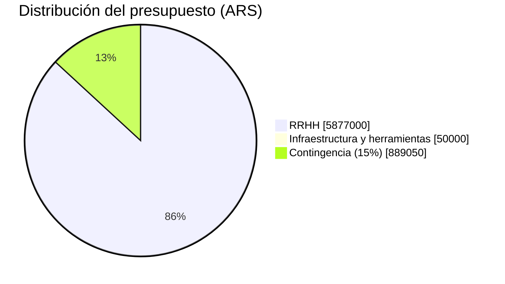

# 10. Presupuesto

Esta sección presenta una estimación de costos del proyecto bajo dos componentes: el esfuerzo de
las personas involucradas (recursos humanos) y la infraestructura tecnológica utilizada. El primer
componente es una simulación con supuestos declarados, dado que el equipo no facturó horas reales;
el segundo es un dato verificado, ya que el proyecto operó dentro de capas gratuitas durante todo
el desarrollo.

## Esfuerzo por perfil

> [!warning] Dato simulado SIM-17 — Tarifas y dedicación horaria
> Las tarifas por hora y la dedicación semanal son una estimación de mercado para perfiles
> junior/estudiantiles en Tucumán durante 2026; no provienen de una factura o cotización real. La
> Tabla 23 que aparece a continuación (estimación de esfuerzo por perfil) reagrupa a los mismos
> cinco integrantes de [[07-Equipo-y-Roles]] (Tabla 11) por perfil de costeo, que no coincide
> necesariamente con el rol Scrum de cada persona.

| Perfil | Dedicación semanal | Horas totales (12,6 semanas) | Tarifa (ARS/hora) | Subtotal (ARS) |
|---|---|---|---|---|
| Product Owner / Scrum Master | 5 h | 63 | 8.000 | 504.000 |
| Desarrollador/a Frontend (1) | 15 h | 189 | 10.000 | 1.890.000 |
| Desarrollador/a Frontend (2) | 15 h | 189 | 10.000 | 1.890.000 |
| QA | 8 h | 101 | 9.000 | 909.000 |
| Diseño UX/UI | 6 h | 76 | 9.000 | 684.000 |
| **Subtotal RRHH** | | **618** | | **5.877.000** |

*Tabla 23 — Estimación de esfuerzo por perfil, horas y tarifa.*

## Infraestructura y capas gratuitas

| Servicio | Costo real durante el desarrollo | Estimación de producción comercial |
|---|---|---|
| Supabase (Auth, Postgres, Storage) | USD 0 — plan Free | USD ≈ 25/mes — plan Pro |
| AWS S3 + CloudFront | USD 0 — Free Tier (12 meses) | USD ≈ 10-15/mes — tráfico moderado |
| Dominio propio | — (no adquirido) | USD ≈ 12/año |
| Nominatim (geocodificación) | USD 0 — API pública | USD 0 dentro de límites de tasa |

*Tabla 24 — Costos de infraestructura y capas gratuitas.*

> [!info] Fuente — Costo real de infraestructura durante el desarrollo: USD 0, dado que el
> proyecto operó dentro de las capas gratuitas de Supabase y de AWS (S3 + CloudFront) —
> `infra/*.tf` (Terraform del proyecto), sin facturación registrada (verificado 2026-07-28).

> [!warning] Dato simulado SIM-19 — Estimación de costo de producción comercial
> En la Tabla 24 anterior (costos de infraestructura y capas gratuitas), los montos de la columna
> "Estimación de producción comercial" son valores de lista pública de los proveedores al momento
> de redactar este informe, no una cotización contratada.

## Costo total y supuestos

> [!warning] Dato simulado SIM-18 — Costo total del proyecto
> El total de la Tabla 25 que aparece a continuación (costo total, contingencia y supuestos) surge
> de aplicar los supuestos de la Tabla 23 (simulados) más una contingencia; no refleja un
> desembolso real, ya que el equipo no facturó honorarios entre sí.

| Concepto | Monto (ARS) |
|---|---|
| Subtotal RRHH | 5.877.000 |
| Infraestructura y herramientas (provisión) | 50.000 |
| Contingencia (15% sobre RRHH + infraestructura) | 889.050 |
| **Total estimado** | **6.816.050** |

*Tabla 25 — Costo total, contingencia y supuestos declarados.*

**Supuestos declarados**: (a) tarifas de mercado junior/estudiantil de Tucumán, 2026, sin
facturación real; (b) dedicación part-time compatible con cursada, entre 5 y 15 horas semanales
según perfil; (c) duración de 12,6 semanas (M03/M04, 88 días corridos); (d) infraestructura
excluida del subtotal de RRHH y presentada por separado (Tabla 24), dado que su costo real fue
nulo; (e) contingencia del 15% para cubrir retrabajo e imprevistos de alcance no planificados.

*Figura 13 — Distribución del presupuesto por rubro: RRHH, infraestructura y herramientas, contingencia.*

> [!warning] Dato simulado — ver SIM-18. La distribución de la Figura 13 anterior (gráfico de
> presupuesto) proviene íntegramente de la Tabla 25, de carácter simulado.

---
[[Indice|Índice]] · ← [[09-Planificacion-Scrum]] · [[11-Arquitectura]] →
