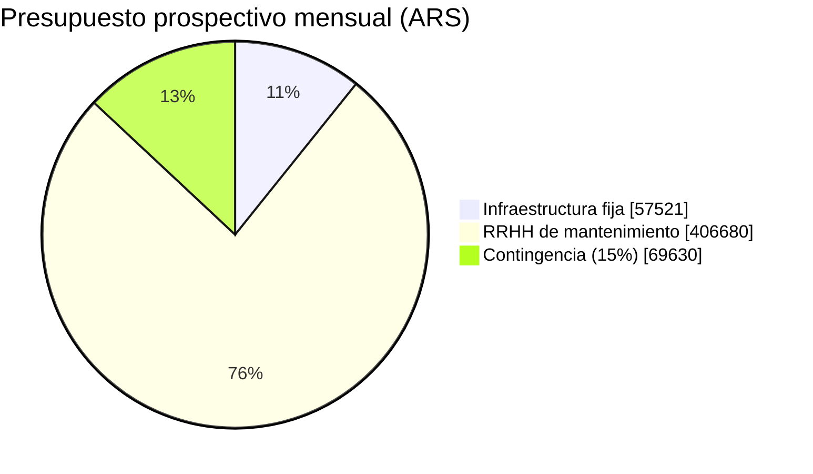

# 10. Presupuesto

Esta sección presenta el presupuesto en dos componentes con naturaleza distinta. El primero,
**retrospectivo**, estima cuánto costaría a valor de mercado el esfuerzo que el equipo ya invirtió en
construir el MVP — un ejercicio de costo de oportunidad, no un desembolso real, ya que el equipo no
facturó horas entre sí. El segundo, **prospectivo**, estima cuánto costaría sostener Hosty en
producción una vez superado el MVP: infraestructura a escala comercial más una dedicación de
mantenimiento reducida. Ambos componentes comparten el mismo supuesto de fondo: los cinco
integrantes descriptos en [[07-Equipo-y-Roles]] (Tabla 11), con Valdez en un perfil Semi Senior y el
resto del equipo en un perfil Junior.

## 10.1 Retrospectivo — costo de desarrollo del MVP a valor de mercado

> [!info] Fuente — Tarifas de mercado por integrante
> Las tarifas ARS/mes de la Tabla 23 provienen de [Salancy](https://salarios.gonzalopozzo.com)
> (encuesta comunitaria de sueldos IT en Argentina, Gonzalo Pozzo), filtradas por categoría
> "Software Development" / "Quality Assurance", con "Ocultar salarios con pocos reportes" activado
> (`trusted=true`, oculta muestras con menos de 2 reportes) y ajuste de inflación por defecto del
> sitio (+15,8 % desde que cada persona reportó su sueldo). Datos registrados el 1/1/26 sobre 2.344
> salarios reportados; consultado el 2026-08-04. Cada integrante se mapeó a la categoría/seniority
> más cercana a su rol real (Tabla 11): Valdez → *Backend Developer*, Semi Senior (PO con foco en
> infraestructura, sin categoría propia de "Product Owner" en el sitio); Mignone → *Frontend
> Developer*, Junior; Naglieri y Czurylo → *Fullstack Developer*, Junior (reparto frontend/backend);
> Garma → *QA Automation Engineer*, Junior (Vitest, Playwright, Cypress, CI). La tarifa horaria se
> deriva dividiendo el sueldo mensual por 176 horas (22 días hábiles × 8 h), una convención estándar
> declarada, no un dato de la encuesta.

> [!warning] Dato simulado SIM-17 — Dedicación horaria por integrante
> La dedicación semanal de la Tabla 23 (15 h Valdez, 12 h Mignone, 10 h Naglieri, 8 h Czurylo, 6 h
> Garma) es una reconstrucción propia, no un registro de horas trabajadas: se ordenó cualitativamente
> según el volumen de contribuciones de la Tabla 12, sin ser proporcional a él. La tarifa (fuente real,
> ver el callout anterior) y la dedicación (simulada) son dos ejes independientes de esta tabla.

| Integrante | Categoría de mercado (Salancy) | Dedicación semanal | Horas totales (12,6 semanas) | Tarifa (ARS/hora) | Subtotal (ARS) |
|---|---|---|---|---|---|
| Valdez, Juan Pablo | Backend Developer — Semi Senior | 15 h | 189 | 19.221 | 3.632.769 |
| Mignone, Juan Ignacio | Frontend Developer — Junior | 12 h | 151 | 11.339 | 1.712.189 |
| Martinez Naglieri, Lautaro | Fullstack Developer — Junior | 10 h | 126 | 11.087 | 1.396.962 |
| Czurylo, Juan Pablo | Fullstack Developer — Junior | 8 h | 101 | 11.087 | 1.119.787 |
| Garma, Benjamín | QA Automation Engineer — Junior | 6 h | 76 | 13.444 | 1.021.744 |
| **Subtotal RRHH (MVP, a valor de mercado)** | | | **643** | | **8.883.451** |

*Tabla 23 — Estimación de esfuerzo por integrante a tarifa de mercado real (Salancy), horas y
tarifa.*

La infraestructura real durante el desarrollo del MVP fue **USD 0**: el proyecto operó dentro de las
capas gratuitas de Supabase y de AWS (S3 + CloudFront) durante las 12,6 semanas del proyecto.

> [!info] Fuente — Costo real de infraestructura durante el desarrollo: USD 0, dado que el
> proyecto operó dentro de las capas gratuitas de Supabase y de AWS (S3 + CloudFront) —
> `infra/*.tf` (Terraform del proyecto), sin facturación registrada (verificado 2026-07-28).

**Total retrospectivo (MVP, a valor de mercado): ARS 8.883.451** (≈ USD 5.863 al tipo de cambio
oficial vendedor del 2026-08-04, ARS 1.515 = USD 1, Banco Nación). No lleva contingencia: es una
reconstrucción de costo de oportunidad sobre trabajo ya realizado, no una proyección con
incertidumbre futura.

## 10.2 Prospectivo — costo de sostener Hosty en producción

> [!info] Fuente — Precios de lista de infraestructura para producción (consultados 2026-08-04)
> **Supabase Pro**: USD 25/mes + USD 10 de crédito de cómputo incluido (supabase.com/pricing).
> **Dominio `.com.ar`**: ARS 8.500/año, arancel vigente publicado por NIC Argentina
> (nic.ar/es/dominios/aranceles), amortizado a mensual. **Resend** (notificaciones de reserva por
> email, rama `feat/email-notifications`, PR #96 sin fusionar): tier gratuito hasta 3.000 emails/mes
> (máx. 100/día), suficiente para el volumen esperado de un MVP; upgrade a Pro (USD 20/mes, 50.000
> emails) sólo si el volumen de reservas lo justifica.

> [!warning] Dato simulado SIM-19 — Tráfico estimado de AWS S3 + CloudFront
> A diferencia de Supabase, el dominio y Resend (precios de lista fijos, arriba), AWS S3 + CloudFront
> no tiene plan fijo: cobra por uso real. El monto de USD 10-15/mes (punto medio USD 12,50 usado en la
> Tabla 24) es un rango de tráfico moderado tomado de la Tabla 24 original de este informe, no una
> cotización de la calculadora de AWS con el tráfico real proyectado de Hosty en producción.

| Servicio | Costo mensual (USD) | Costo mensual (ARS, TC 1.515) |
|---|---|---|
| Supabase (Auth, Postgres, Storage) — plan Pro | 25,00 | 37.875 |
| AWS S3 + CloudFront — tráfico moderado (estimado) | 12,50 | 18.938 |
| Dominio `.com.ar` (NIC Argentina, amortizado) | 0,47 | 708 |
| Resend (notificaciones por email) — tier gratuito | 0,00 | 0 |
| **Subtotal infraestructura fija** | **37,97** | **57.521** |

*Tabla 24 — Infraestructura estimada para producción comercial, mensual.*

> [!warning] Dato simulado — Mercado Pago no forma parte del subtotal fijo anterior
> El plan Destacado del anfitrión (Tabla 13, suscripción paga) requeriría una integración de cobro —
> Mercado Pago Checkout API cobra entre 3,99 % y 6,49 % + IVA (21 %) por transacción, según el plazo
> de acreditación (inmediata vs. diferida a 7-30 días). Es un costo variable proporcional a la
> facturación, no un monto fijo mensual: no se proyecta aquí sin un supuesto de cantidad de
> suscripciones vendidas, que el equipo no tiene.

> [!warning] Dato simulado SIM-18 — Dedicación de mantenimiento post-MVP
> No existe un plan de soporte formal para después del MVP. Se asume, como supuesto declarado, una
> dedicación combinada del equipo de 8 horas semanales (soporte, monitoreo, corrección de errores) a
> la tarifa Junior promedio de la Tabla 23 (ARS 11.739/hora) — no una decisión de negocio tomada, sino
> un piso razonable para poder presentar un número.

| Concepto | Monto mensual (ARS) |
|---|---|
| Infraestructura fija (Tabla 24) | 57.521 |
| RRHH de mantenimiento (8 h/semana × 4,33 semanas × ARS 11.739/h) | 406.680 |
| Subtotal prospectivo mensual | 464.201 |
| Contingencia (15 %) | 69.630 |
| **Total prospectivo mensual** | **533.831** |
| **Proyección a 12 meses** | **6.405.972** |

*Tabla 25 — Costo mensual y proyectado de sostener Hosty en producción, con contingencia.*

**Total prospectivo: ARS 533.831/mes** (≈ USD 352/mes), **≈ ARS 6.405.972/año** (≈ USD 4.228/año),
sin contar la comisión variable de Mercado Pago sobre los cobros del plan Destacado.

**Supuestos declarados**: (a) tarifas de RRHH de mercado real (Salancy, trusted, 2026-08-04), no
facturadas; (b) dedicación horaria del MVP ordenada cualitativamente por volumen de contribuciones
(Tabla 12), no medida; (c) duración de 12,6 semanas (M03/M04, 88 días corridos); (d) tipo de cambio
oficial vendedor ARS 1.515 = USD 1 (BNA, 2026-08-04) como referencia declarada, no contractual; (e)
tráfico de AWS S3 + CloudFront estimado como moderado, no medido sobre uso real; (f) dedicación de
mantenimiento post-MVP de 8 h/semana, supuesto propio sin plan de soporte formal; (g) contingencia
del 15 % sólo sobre el componente prospectivo, para cubrir imprevistos de una proyección a futuro —
no se aplica al retrospectivo, que reconstruye un costo ya incurrido.

*Figura 13 — Distribución del presupuesto prospectivo mensual: infraestructura, RRHH de
mantenimiento, contingencia.*

> [!warning] Dato simulado — ver SIM-18. La distribución de la Figura 13 anterior (gráfico de
> presupuesto) proviene de la Tabla 25, de carácter parcialmente simulado (RRHH de mantenimiento y
> tráfico de AWS).

---
[[Indice|Índice]] · ← [[09-Planificacion-Scrum]] · [[11-Arquitectura]] →
