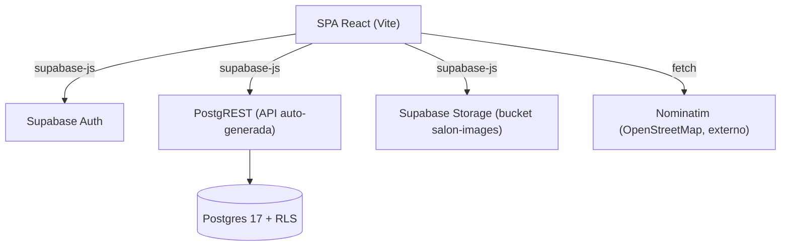
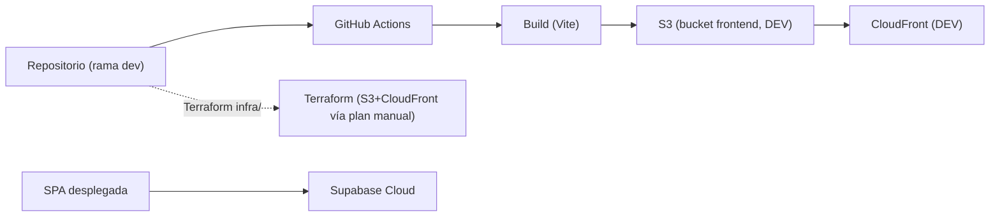
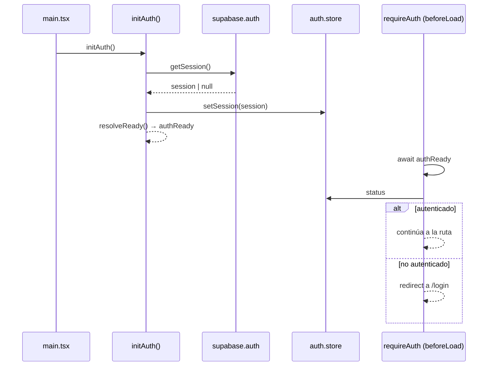
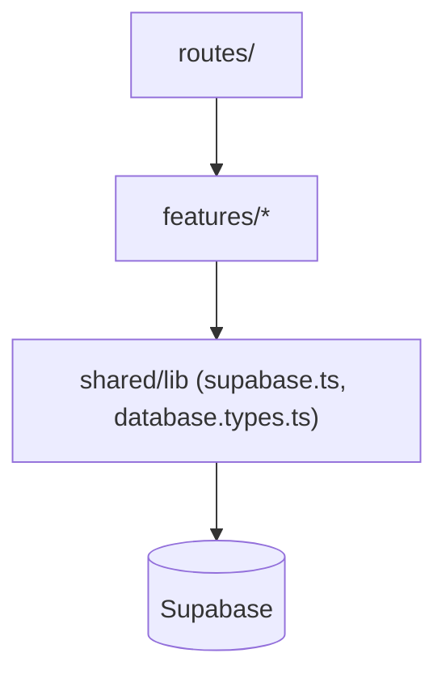
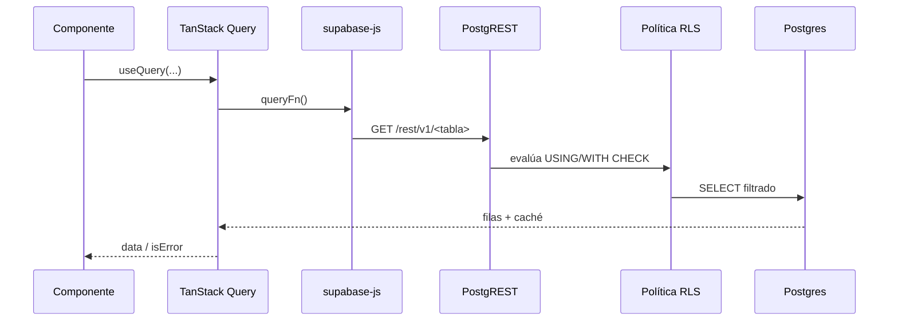

# 11. Arquitectura

## 11.1 Patrón arquitectónico

Hosty implementa una **arquitectura cliente-servidor de dos capas basada en BaaS** (*Backend as a
Service*): una *single-page application* en React que se comunica directamente con Supabase
(PostgREST, Auth, Storage y Postgres con Row Level Security), sin un servidor de aplicación
propio intermedio. No se trata de un monolito de tres capas (presentación / lógica de negocio /
datos con un backend a medida): la capa de lógica de negocio se reparte entre validación en el
cliente (Zod) y restricciones declarativas en la base de datos (`CHECK`, políticas RLS), y la capa
de API es generada automáticamente por PostgREST a partir del esquema de Postgres.

Esta decisión es, además, una migración real y no un diseño original: el repositorio contenía un
backend NestJS de tres capas (con Prisma sobre PostgreSQL) que fue eliminado por completo en el
commit `3a89616` ("refactor: remove entire backend directory and associated CI/CD workflows",
2026-04-29), en favor de Supabase como única capa de datos y autenticación. La justificación
observable de ese cambio es la escala del proyecto: un MVP de marketplace no requiere lógica de
servidor a medida cuando Postgres + RLS + PostgREST cubren CRUD, autorización por propiedad y
generación de API sin código adicional.

*Figura 14 — Arquitectura general: SPA React ↔ Supabase (Auth/PostgREST/Storage/Postgres+RLS).*

## 11.2 Despliegue (visión general)

*Figura 15 — Despliegue: repo → GitHub Actions → build → S3+CloudFront (DEV); Supabase Cloud; Terraform.*

Una vez desplegada, la SPA resuelve su propia sesión de autenticación al arrancar en el
navegador, antes de que cualquier ruta protegida decida si continúa o redirige: `main.tsx`
invoca `initAuth()`, que resuelve la sesión existente (`getSession()`), la vuelca en
`auth.store` (Zustand) y resuelve una promesa módulo `authReady` antes de que cualquier
`beforeLoad`/`requireAuth` decida si redirige a `/login`.

*Figura 16 — Bootstrap de autenticación: `main.tsx` → `initAuth()` → `getSession()` → `auth.store` → `authReady` → ruta o redirect.*

## 11.3 Frontend

El frontend es una SPA React 19 servida por Vite, con enrutamiento *file-based* de TanStack
Router y estado de servidor manejado por TanStack Query sobre `supabase-js`. La organización de
carpetas es por *feature* (ver [[08-Diseno-y-Desarrollo]], §8.4): `routes/` sólo declara paths,
`validateSearch` y guards; `features/<n>/` concentra componentes, hooks de datos y tipos; y
`shared/lib/` aloja el cliente de Supabase y utilidades transversales. La regla de dependencia es
estricta en un sentido: una feature nunca importa de otra feature.

*Figura 17 — Capas y dependencias permitidas: `routes → features → shared/lib → Supabase`.*

| Capa | Tecnología | Versión | Justificación |
|---|---|---|---|
| Framework UI | React | 19.2.4 | SPA pura, sin *server components* |
| Build/dev server | Vite | 8.0.1 | Arranque y HMR rápidos |
| Enrutamiento | TanStack Router | 1.168.8 | *File-based routing* tipado, `validateSearch` con Zod |
| Estado de servidor | TanStack Query | 5.95.2 | Caché e invalidación declarativas sobre PostgREST |
| Formularios | TanStack Form + Zod | 1.28.5 / 3.25.76 | Validación tipada en el cliente |
| Estado de cliente | Zustand | 5.0.12 | Store mínimo (sesión, tema) |
| Estilos | Tailwind CSS | 4.2.2 | Tokens CSS-first (`@theme`) |
| Componentes UI | shadcn/ui + Radix | — | Primitivos accesibles, código propio |
| Mapas / geocodificación | Leaflet + Nominatim | 1.9.4 | Sin costo de licencia de mapas |
| BaaS | Supabase (`supabase-js`) | 2.105.1 | Ver §11.4 |
| Lenguaje | TypeScript (strict) | 5.9.3 | Tipado generado desde el esquema real |

*Tabla 26 — Stack tecnológico por capa, versión y justificación.*

> [!info] Fuente — `frontend/package.json`; `supabase/config.toml:36` (Postgres `major_version =
> 17`).

## 11.4 "Backend" — capa BaaS

Hosty **no tiene un backend a medida**: no existe ningún servicio Node/NestJS en ejecución que
reciba peticiones HTTP de la SPA. La capa que cumple ese rol es Supabase, y se compone de tres
piezas verificables en `supabase/migrations/*.sql`:

- **Postgres + RLS** como capa de reglas de negocio: cada tabla tiene `enable row level security`
  y políticas por operación (detalle completo en [[Anexo-I-Modelo-de-Datos]], Tabla 48); las
  restricciones de dominio (estados válidos, tipos de precio) son `CHECK` constraints, no código
  de aplicación.
- **PostgREST** como generador automático de API REST sobre el esquema `public` (§11.7).
- **Supabase Auth** para registro, login y sesión (JWT), y **Supabase Storage** para las imágenes
  de salones (bucket `salon-images`, público en lectura).

El manejo de errores ocurre en el cliente: cada hook de `api/*.queries.ts` /
`api/*.mutations.ts` propaga el `error` devuelto por `supabase-js` (que refleja el código de
Postgres/PostgREST, incluida una violación de `CHECK` o de política RLS) y TanStack Query lo
expone como estado `isError` para que el componente lo muestre.

*Figura 18 — Ciclo de lectura de datos: componente → hook TanStack Query → `supabase-js` → PostgREST → RLS → Postgres → caché.*

## 11.5 Base de datos

El motor es **Postgres 17** (`supabase/config.toml:36`), sin ORM: los tipos de TypeScript se
generan desde el esquema real con `supabase gen types typescript` hacia
`frontend/src/shared/lib/database.types.ts`. El esquema `public` tiene 6 tablas (M10) más la
tabla `auth.users`, administrada por Supabase Auth. El diagrama entidad-relación completo, el
diccionario de datos por tabla y las políticas RLS se documentan en
[[Anexo-I-Modelo-de-Datos]] (Figura 28, Tablas 42-49).

## 11.6 Seguridad

- **Autenticación**: Supabase Auth administra la sesión y el JWT; el frontend nunca implementa
  hashing de contraseñas propio. El arranque de la sesión al iniciar la aplicación (*bootstrap*)
  se detalla en la Figura 16 (§11.2).
- **Autorización**: no hay RBAC ni tabla de roles; cada política RLS compara `auth.uid()` contra
  la columna de propiedad (`host_id`, `user_id`), como se detalla en [[07-Equipo-y-Roles]]
  (Tabla 13) y en el diccionario RLS de [[Anexo-I-Modelo-de-Datos]] (Tabla 48).
- **Validación**: esquemas Zod en el cliente (formularios, `validateSearch` de rutas) más
  restricciones `CHECK` en Postgres como última línea de defensa, aun si el cliente falla.
- **Sanitización**: todas las consultas usan el *query builder* parametrizado de `supabase-js`
  sobre PostgREST; no hay concatenación de SQL en ninguna capa del frontend.

| Ruta | Control de acceso | Política RLS asociada |
|---|---|---|
| `/`, `/salones`, `/salones/`, `/salones/$id` | Pública | `Salones are publicly readable`; `Salon services are publicly readable` |
| `/login`, `/register` | Pública | Supabase Auth (sin política de tabla) |
| `/salones/$id/reservar` | `requireAuth` | `Users can insert their own bookings` (`auth.uid() = user_id`) |
| `/mis-reservas` | `requireAuth` | `Users can view their own bookings` |
| `/mis-favoritos` | `requireAuth` | `user_read_own_favorites` / `user_insert_own_favorites` / `user_delete_own_favorites` |
| `/mi-perfil` | `requireAuth` | Supabase Auth (`updateUser`) |
| `/host/dashboard`, `/host/$bookingId` | `requireAuth` | `Hosts can view/update bookings for their salones` |
| `/host/create`, `/host/$id/edit` | `requireAuth` | `Host can insert/update their own salon`; `Host manages services/availability of their salones` |

*Tabla 29 — Rutas, control de acceso y política RLS asociada.*

## 11.7 API

No existe una especificación Swagger propia porque no hay un backend a medida: PostgREST expone
un documento OpenAPI auto-generado en `{SUPABASE_URL}/rest/v1/` a partir del esquema `public`
(detalle de la URL real en [[Anexo-IV-API-y-Repositorio]], y en [[00-Portada-y-Ficha]] como
placeholder P-07 de URLs de producción). Cada hook de `api/*.queries.ts` / `*.mutations.ts` es una
operación PostgREST; se tabulan por módulo:

| Módulo | Consultas | Mutaciones | Total | Tabla(s) principal(es) |
|---|---|---|---|---|
| `salones` | 5 | 0 | 5 | `salones`, `salon_availability_blocks` |
| `bookings` | 1 | 2 | 3 | `bookings` |
| `favorites` | 2 | 1 | 3 | `user_favorites` |
| `host` | 6 | 9 | 15 | `salones`, `bookings`, `salon_services`, `salon_availability_blocks`, `salon_subscriptions`, Storage |
| `auth` (Supabase Auth, no PostgREST) | — | — | 6 (`signInWithPassword`, `signUp`, `signOut`, `getSession`, `onAuthStateChange`, `updateUser`) | `auth.users` |
| **Total operaciones PostgREST** | 14 | 12 | **26** | |

*Tabla 30 — Operaciones de API por módulo y ambientes de despliegue.*

> [!info] Fuente — conteo verificado directamente sobre `frontend/src/features/*/api/*.ts`
> (2026-07-28).

En cuanto a ambientes: el repositorio sólo define un ambiente de despliegue automatizado, **DEV**
(`web-dev.yml`, secretos con sufijo `_DEV`); no existe un workflow de *staging* ni de producción,
aunque `infra/config/stg.tfvars` reserva variables para un ambiente `stg` no conectado a ningún
pipeline de CI/CD.

## 11.8 Deployment

El frontend se compila con Vite y se publica en S3, servido por CloudFront (`infra/frontend.tf`),
mediante el workflow `web-dev.yml` disparado en cada push a `dev`. Terraform gestiona la
infraestructura de forma manual (`terraform plan` vía `infra-ci.yml`, `workflow_dispatch`).
Supabase Cloud aloja la base de datos, Auth y Storage; no requiere aprovisionamiento propio. La
invalidación de CloudFront tras cada despliegue asegura que los usuarios reciban siempre el build
más reciente sin depender del vencimiento natural de la caché del CDN, a costa de una invalidación
completa (`/*`) en cada push a `dev` en lugar de una invalidación selectiva por ruta.

| Estructura | Responsabilidad |
|---|---|
| `frontend/src/routes/` | Definición de rutas, `validateSearch`, guards |
| `frontend/src/features/<n>/` | Componentes, hooks de datos (`api/`), tipos |
| `frontend/src/shared/lib/` | Cliente Supabase, tipos generados, utilidades |
| `frontend/src/components/` | `layout/` (Header, RootLayout) y `ui/` (shadcn) |
| `infra/` | Terraform: S3 + CloudFront (frontend), EC2 + RDS (obsoletos, ver Tabla 27) |
| `supabase/migrations/` | Historial de esquema, RLS y datos semilla |

*Tabla 28 — Estructura de carpetas y responsabilidad.*

### Decisiones arquitectónicas (ADR resumidas)

| # | Decisión | Estado / hallazgo |
|---|---|---|
| ADR-1 | Migrar de backend NestJS de tres capas a BaaS de dos capas con Supabase | Aplicada en el commit `3a89616` (2026-04-29); justificada por la escala de un MVP |
| ADR-2 | Sin ORM: tipos generados desde el esquema real (`database.types.ts`) | Vigente; evita drift entre modelo y tipos declarados a mano |
| ADR-3 | Autorización por propiedad vía RLS (`auth.uid()`), sin tabla de roles/RBAC | Vigente (ver [[07-Equipo-y-Roles]], Tabla 13) |
| Hallazgo A | `frontend/package.json` declara `axios` como dependencia de runtime pese a que el proyecto usa exclusivamente `supabase-js` para acceder a datos | Inconsistencia no resuelta: dependencia sin uso activo identificado en el código de features revisado |
| Hallazgo B | `docker-compose.yml`, el `package.json` raíz (`workspaces: ["backend","frontend"]`) e `infra/backend.tf`/`infra/rds.tf` (EC2 + RDS) siguen describiendo y aprovisionando el backend NestJS eliminado en `3a89616` | Documentación y definición de infraestructura desactualizadas respecto del código real; no aprovisionadas en este cambio |
| Hallazgo C | La restricción `CHECK` de `bookings.status` no reflejaba los cuatro estados usados por la aplicación hasta la migración `20260609233130` | Corregido; desarrollado en detalle en [[Anexo-I-Modelo-de-Datos]] (Tabla 43) y como deuda técnica en [[15-Conclusiones]] (Tabla 40) |
| Hallazgo D | La tabla `salones` careció de política RLS de `DELETE` hasta la migración `20260616000001`: con RLS activo y sin esa política, el borrado desde el cliente afectaba 0 filas sin devolver error | Corregido; ver política `Host can delete their own salon` en [[Anexo-I-Modelo-de-Datos]] (Tabla 48) |

*Tabla 27 — Decisiones arquitectónicas (ADR resumidas).*

> [!info] Fuente — commit `3a89616` (`git log`); `frontend/package.json`; `docker-compose.yml`;
> `package.json` (raíz); `infra/backend.tf`, `infra/rds.tf`;
> `supabase/migrations/20260609233130_host_booking_management.sql`;
> `supabase/migrations/20260616000001_add_salon_delete_policy.sql` (comentario verbatim del
> propio archivo). M22: 0 *enums* de Postgres — los dominios de valores válidos se modelan como
> `CHECK` más uniones de tipo TypeScript mantenidas a mano, el mecanismo que originó el Hallazgo C.

---
[[Indice|Índice]] · ← [[10-Presupuesto]] · [[12-Testing-y-Calidad]] →
