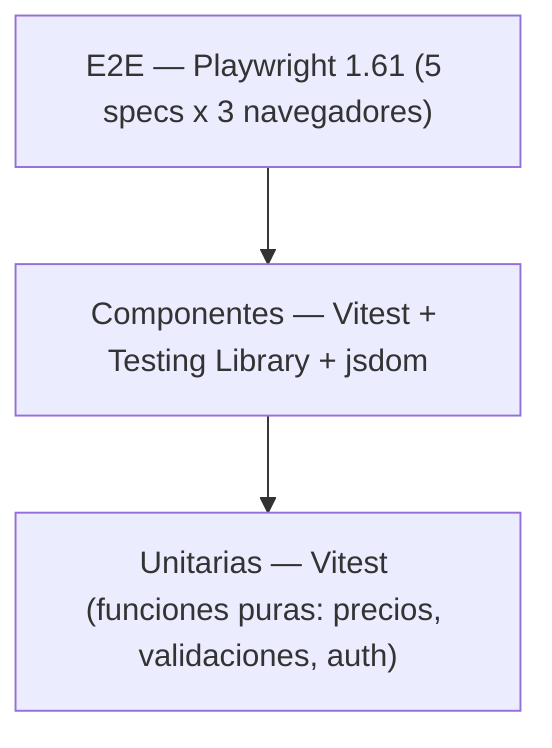
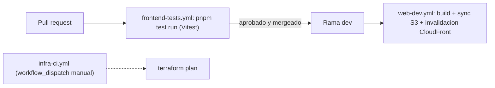
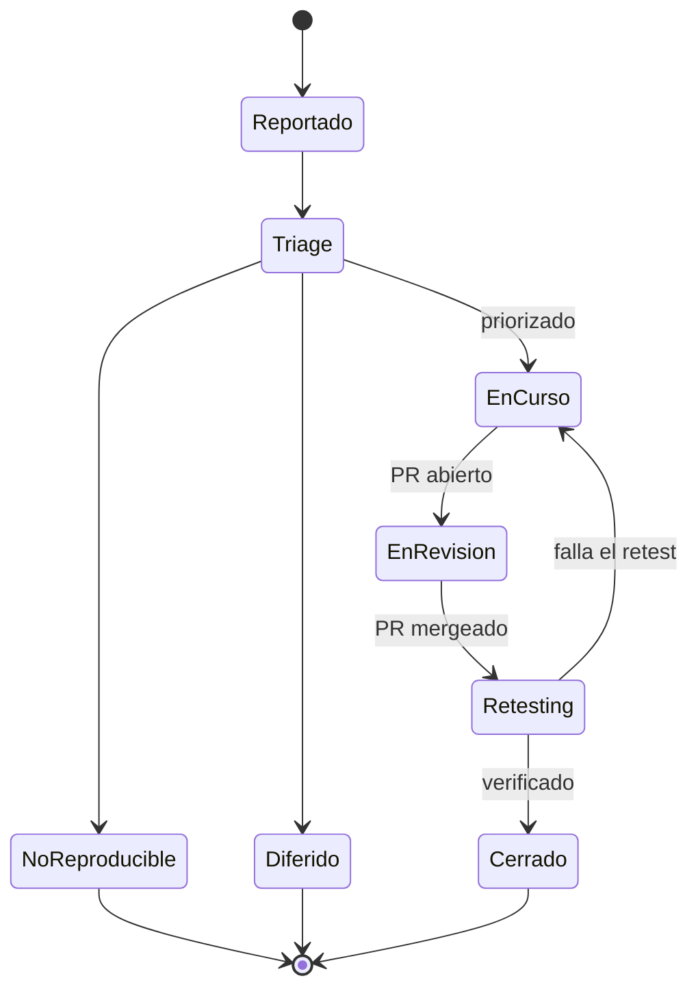

# 12. Testing y Calidad

## Estrategia general

El aseguramiento de calidad no se trata como una etapa posterior al desarrollo sino como una
actividad que interviene desde la redacción de las historias de usuario: cada user story
destacada en la sección 9 (Planificación Scrum) incluye un criterio de aceptación explícito, y
ese criterio es el insumo directo para diseñar los casos de prueba —manuales o automatizados— de
la funcionalidad correspondiente. La ejecución de pruebas automatizadas ocurre en dos momentos:
localmente, durante el desarrollo, y en la integración continua, al abrirse un *pull request*. Las
pruebas manuales y exploratorias se ejecutan antes de cerrar cada historia, sobre el ambiente de
desarrollo desplegado.

*Figura 19 — Pirámide de pruebas: unitarias (Vitest) / componentes (RTL+jsdom) / E2E (Playwright).*

> [!info] Fuente — M12/M13 (`_meta/Datos-Verificables.md`): 75 pruebas Vitest en 15 archivos
> unitarios/de componentes, más 5 *specs* Playwright E2E.

*Figura 20 — Pipeline CI/CD: PR → `frontend-tests.yml` (Vitest) → merge a `dev` → `web-dev.yml` (build + sync S3 + invalidación CloudFront); `infra-ci.yml` manual (`terraform plan`).*

> [!info] Fuente — M14 (`_meta/Datos-Verificables.md`): 3 workflows en `.github/workflows/`
> (`frontend-tests.yml`, `web-dev.yml`, `infra-ci.yml`).

## Tipos de prueba

| Tipo | Herramienta | Alcance real |
|---|---|---|
| Unitarias | Vitest 4.1.6 | Funciones puras: `pricing.ts` (formato de precio), `auth.ts` (lógica de sesión), validaciones de `search-validation.ts` |
| Componentes | Vitest + Testing Library (React) 16.3.2 + jsdom | Renderizado e interacción: `CardSalon`, `Header`, `LoginPage`, `RegisterPage` |
| Integración | Vitest, con el cliente de Supabase mockeado | Hooks de `api/`: `bookings.test.ts`, `favorites.test.ts`, `salones.queries.test.ts` — validan la traducción `snake_case` → dominio y el manejo de errores de PostgREST |
| E2E | Playwright 1.61.0, 3 navegadores (Chromium, Firefox, WebKit) | 5 *specs* en `src/e2e/`: `auth-flow`, `home`, `navigation`, `salon-detail`, `salones` |
| Legacy / exploratorio | Mocha 11.7.6 + Chai 6.2.2 (`test:mocha`); Cypress 15.17.0 | 1 archivo Mocha (`src/test/mocha/search-validation.test.ts`); 1 *spec* Cypress (`cypress/e2e/salon-search.cy.ts`) |

*Tabla 31 — Tipos de prueba, herramienta y alcance real.*

> [!info] Fuente — M12/M13, verificado ejecutando `npx vitest run` sobre el repositorio: 15
> archivos, 75 casos, todos en verde. Nota honesta: sólo la suite de Vitest está integrada al
> pipeline de CI (`frontend-tests.yml` ejecuta `pnpm test run`); Playwright, la corrida
> independiente de Mocha (`pnpm test:mocha`) y el *spec* de Cypress se ejecutan de forma local o
> manual y no forman parte de ningún *workflow* de `.github/workflows/`. El archivo de Mocha,
> además, también es recolectado por Vitest porque su ruta no está excluida en `vite.config.ts`
> (`exclude: [...configDefaults.exclude, 'src/e2e/**']`); por eso sus 4 casos ya están incluidos en
> el total de 75.

## Cobertura

La cobertura se mide con `@vitest/coverage-v8`, que instrumenta el código mediante el proveedor V8
nativo, y se ejecuta con `npm --prefix frontend run test:coverage`. El resultado se reporta bajo
**dos criterios**, porque informar uno solo distorsiona la lectura en sentidos opuestos:

- **Cobertura global.** Se instrumenta todo el código de aplicación bajo `src/` —95 archivos—,
  incluidos los 68 que ninguna prueba llega a importar. Es la cifra honesta del estado del
  proyecto y la que corresponde citar si se pide "la cobertura" sin más.
- **Cobertura del código ejercitado.** Se mide únicamente sobre los 27 archivos que la suite
  efectivamente importa. Indica qué tan a fondo se prueba aquello que sí está bajo prueba, pero no
  debe presentarse como cobertura del proyecto, porque ignora todo lo que quedó sin probar.

| Métrica | Cobertura global | Sobre el código ejercitado |
|---|---|---|
| Sentencias | 16,41 % (901 / 5.490) | 59,83 % (901 / 1.506) |
| Ramas | 11,95 % (566 / 4.735) | 43,84 % (566 / 1.291) |
| Funciones | 16,37 % (92 / 562) | 62,59 % (92 / 147) |
| Líneas | 20,16 % (653 / 3.238) | 72,31 % (653 / 903) |

*Tabla 32 — Cobertura de pruebas bajo ambos criterios.*

> [!info] Fuente — M37: `npm --prefix frontend run test:coverage` (`vitest run --coverage`,
> proveedor V8), ejecutado el 2026-08-04 sobre 15 archivos y 75 casos. Los totales se obtuvieron de
> `frontend/coverage/coverage-summary.json`. La configuración de proveedor, *reporters* y
> exclusiones está declarada en el bloque `test.coverage` de `frontend/vite.config.ts`: se excluyen
> del cómputo los propios archivos de prueba, `src/e2e/`, `src/test/`, `main.tsx` y los dos
> artefactos autogenerados (`routeTree.gen.ts` y `database.types.ts`), porque medir cobertura sobre
> código que nadie escribió a mano no aporta información.

La distribución por módulo muestra un patrón deliberado: la lógica de dominio y de acceso a datos
está cubierta, y la capa de presentación, todavía parcialmente.

| Módulo | Sentencias | Ramas | Funciones | Líneas |
|---|---|---|---|---|
| `features/auth/store` | 100,00 % | 100,00 % | 100,00 % | 100,00 % |
| `features/bookings/api` | 97,06 % | 79,31 % | 100,00 % | 100,00 % |
| `features/auth/lib` | 93,75 % | 100,00 % | 85,71 % | 93,33 % |
| `features/favorites/api` | 92,54 % | 85,42 % | 100,00 % | 97,83 % |
| `features/auth/components` | 80,25 % | 62,22 % | 83,33 % | 90,29 % |
| `shared/lib` | 72,73 % | 63,64 % | 100,00 % | 72,00 % |
| `features/salones/api` | 54,21 % | 47,92 % | 61,54 % | 61,25 % |
| `features/salones/lib` | 50,00 % | 75,00 % | 66,67 % | 55,56 % |
| `components/layout` | 43,08 % | 35,81 % | 35,00 % | 49,22 % |
| `components/ui` | 28,93 % | 15,77 % | 28,13 % | 37,03 % |
| `features/bookings/components` | 25,96 % | 22,58 % | 22,50 % | 30,34 % |
| `features/salones/components` | 7,69 % | 6,52 % | 2,27 % | 11,30 % |
| 16 carpetas restantes | 0,00 % | 0,00 % | 0,00 % | 0,00 % |

*Tabla 32a — Cobertura por módulo, ordenada por cobertura de sentencias.*

`components/ui` y `features/bookings/components` pasaron a tener cobertura parcial el 2026-08-04:
`BookingFlow.test.tsx` (cierre de SIM-33, ver Tabla 33) renderiza el componente completo, y de paso
ejercita los primitivos de shadcn/ui que usa (`Select`, `Button`, `Input`, `Skeleton`, entre otros).

Las 16 carpetas sin cobertura son, en su mayoría, componentes de pantalla y definiciones de ruta
(`routes/`, `features/host/components`, `features/home/components`, entre otras): código que la
suite E2E de Playwright sí ejercita sobre el navegador, pero que no aparece en esta medición porque
Playwright corre fuera del proceso de Vitest y no comparte su instrumentación. La cobertura de la
Tabla 32 es, por lo tanto, un piso y no un techo del código realmente probado.

Junto al porcentaje conviene leer el volumen absoluto de la suite, que no depende del criterio de
medición elegido:

| Métrica de volumen | Valor |
|---|---|
| Pruebas automatizadas (Vitest) | 75 |
| Archivos de prueba (Vitest/RTL + Playwright) | 20 (15 + 5) |
| Líneas de código de prueba (unitarias + componentes + E2E) | 1.603 |
| Líneas de código de producción (`src/`, sin pruebas) | 11.223 |
| Relación líneas de prueba / líneas de producción | ≈ 0,14 (14 %) |

*Tabla 32b — Volumen de la suite de pruebas.*

> [!info] Fuente — M12/M13/M31; líneas de prueba y de producción contadas con
> `find frontend/src -name '*.test.ts' -o -name '*.test.tsx' -o -path '*/e2e/*.spec.ts' | xargs wc -l`
> y su complemento sobre `*.ts`/`*.tsx`, respectivamente (2026-08-04, re-verificado tras agregar
> `BookingFlow.test.tsx` y el caso nuevo de `favorites.test.ts`). La cifra de producción incluye
> `src/routeTree.gen.ts` (343 líneas autogeneradas por TanStack Router), que sí se excluye del
> cómputo de cobertura de la Tabla 32.

El reporte HTML navegable queda en `frontend/coverage/index.html` y se anexa en
[[Anexo-V-Evidencias-QA]]. Elevar la cobertura de la capa de presentación está registrado como
línea de evolución de corto plazo en [[15-Conclusiones]].

## Matriz de casos de prueba manuales

Se documentan tres casos representativos, mapeados a flujos reales de la aplicación. Ninguno de los
tres tenía un test automatizado que cubriera exactamente el escenario descrito: `bookings.test.ts`
prueba los *hooks* `useCreateBooking`/`useCancelBooking`/`useMyBookings`, pero no la validación de
fecha bloqueada del *wizard*; `favorites.test.ts` probaba que se llamara a `insert`/`delete`, pero
no que la actualización optimista ocurriera *antes* de la respuesta del servidor. En vez de dejar
el resultado como una inferencia plausible, se escribió el test automatizado que faltaba para CP-01
y CP-02, y se ejecutaron los tres — el resultado de esta columna es la salida real de esa ejecución.

| ID | Precondiciones | Pasos | Datos | Resultado esperado | Resultado obtenido |
|---|---|---|---|---|---|
| CP-01 | Usuario autenticado; salón con un bloqueo de disponibilidad para el 2026-08-10 | 1. Ir a `/salones/:id/reservar`. 2. Seleccionar el 2026-08-10 como fecha. 3. Intentar confirmar el paso 1 del wizard | `salon_availability_blocks` con `date = 2026-08-10` para el salón | El wizard bloquea el avance y muestra un mensaje de fecha no disponible | **Verificado.** El wizard muestra "El salón no está disponible en la fecha elegida. Probá con otra fecha." y no avanza de paso |
| CP-02 | Usuario autenticado; salón sin favorito previo | 1. Abrir `/salones`. 2. Click en el ícono de favorito de una `CardSalon`. 3. Observar el estado del ícono antes de la respuesta del servidor | Salón sin fila en `user_favorites` para ese usuario | El ícono cambia a "favorito" de inmediato (actualización optimista) y persiste tras recargar | **Verificado.** La caché de React Query refleja el salón como favorito inmediatamente después de disparar la mutación, antes de que se resuelva la llamada a Supabase |
| CP-03 | Ninguna (usuario no autenticado) | 1. Ir a `/login`. 2. Ingresar un email válido con una contraseña incorrecta. 3. Enviar el formulario | `email: usuario@ejemplo.com`, `password: incorrecta123` | Se muestra un mensaje de error de credenciales inválidas y el usuario permanece en `/login` | **Verificado.** Se muestra "Email o contraseña incorrectos." y el usuario permanece en `/login` |

*Tabla 33 — Matriz de casos de prueba manuales.*

> [!info] Fuente — CP-01: `BookingFlow.test.tsx`, test "CP-01: bloquea el avance y muestra un
> mensaje cuando la fecha elegida tiene un bloqueo de disponibilidad" (nuevo, agregado para cerrar
> este caso). CP-02: `favorites.test.ts`, test "CP-02: aplica la actualización optimista antes de
> que responda el servidor" (nuevo, ídem). CP-03: `LoginPage.test.tsx`, test "muestra el error del
> servidor cuando las credenciales son incorrectas" (ya existente). Los tres se re-ejecutaron el
> 2026-08-03 (`npm --prefix frontend run test -- --run`): 75 pruebas, 75 aprobadas — ver M12/M13
> actualizados en [[Datos-Verificables]]. No sustituye una ejecución manual sobre el ambiente
> desplegado, pero es una verificación real y reproducible del comportamiento, no una inferencia.

## Manejo de incidencias

Las incidencias se reportan como *GitHub Issues* con la etiqueta `bug`. El repositorio registra 13
issues reales con esa etiqueta, las 13 cerradas.

> [!info] Fuente — `gh issue list --state all --label bug --json number,state` (2026-07-28): 13
> issues, 13 en estado `CLOSED`.

El ciclo de vida observado es: **Reportado** (se crea el issue) → **Triage** (se prioriza o se
etiqueta) → **En curso** (rama `fix/...` asociada) → **En revisión** (*pull request* abierto) →
**Retesting** (verificación manual sobre el ambiente DEV tras el *merge*) → **Cerrado**. Una
incidencia puede desviarse a **No reproducible** o **Diferida** en la etapa de *triage*.

*Figura 21 — Ciclo de vida de un defecto: Reportado → Triage → En curso → En revisión → Retesting → Cerrado (+ No reproducible / Diferido).*

Un defecto real, no simulado, ilustra este ciclo de punta a punta:

> [!info] Fuente — M17: la restricción `CHECK` original de `bookings.status` sólo admitía
> `pending`/`confirmed`/`cancelled` (`supabase/migrations/20240101000000_init_hosty.sql:57-58`),
> mientras que la aplicación ya emitía un cuarto estado, `declined`. El defecto se resolvió en la
> migración `supabase/migrations/20260609233130_host_booking_management.sql:7-11`, cuyo propio
> comentario documenta la causa ("`'declined' was used by the app but missing from the DB
> check.`"). Ver el detalle completo, con retest, en [[Anexo-V-Evidencias-QA]] (Tabla 58) y el
> análisis de deuda técnica en [[15-Conclusiones]] (Tabla 40). La severidad de cada incidencia
> —Bloqueante, Alta, Media o Baja— se clasifica en la Tabla 34 de la siguiente sección, con
> ejemplos reales tomados de las 13 *issues* `bug` del repositorio.

## Revisión de usabilidad previa a la entrega final

Antes de la entrega se realizó una revisión de usabilidad centrada en la coherencia idiomática y en
la calidad de los mensajes de validación, dos aspectos que las pruebas automatizadas no cubren
porque no verifican el texto que efectivamente lee un usuario. La revisión detectó tres defectos,
todos corregidos y verificados.

| # | Defecto | Dónde se manifestaba | Severidad | Corrección aplicada |
|---|---|---|---|---|
| R-01 | Los mensajes de error devueltos por Supabase se mostraban en inglés, tal como llegan del servidor (por ejemplo, `User already registered` al intentar registrarse con un email existente) | Registro de usuario, publicación de salón y panel del anfitrión | Media | Se incorporó una capa de traducción de errores (`src/shared/lib/errors.ts`) que mapea los errores de Supabase Auth y de PostgREST a mensajes en español, con un mensaje genérico de respaldo que garantiza que nunca se filtre texto crudo del servidor a la interfaz |
| R-02 | El límite de asistentes se delegaba al atributo `max` del campo numérico, por lo que el navegador mostraba su propia advertencia nativa, en el idioma del navegador y con un estilo ajeno al del formulario | Paso 2 del flujo de reserva | Media | Se reemplazó por una validación propia del formulario, con mensaje en español que indica la capacidad real del salón, atributos `aria-invalid`/`aria-describedby` y `role="alert"` para que los lectores de pantalla la anuncien |
| R-03 | Las etiquetas de estado "pendiente" usaban valores de color ajenos al sistema de diseño, con contraste insuficiente en modo oscuro | Panel del anfitrión: resumen, calendario, detalle de reserva y tarjeta de plan | Baja | Se unificaron sobre los tokens de marca (`--color-amber`, `--color-amber-light`, `--color-amber-dark`) definidos en `src/index.css` |

*Tabla 34b — Defectos detectados en la revisión de usabilidad previa a la entrega y su corrección.*

> [!info] Fuente — R-01 se verifica con las 7 pruebas unitarias de `src/shared/lib/errors.test.ts`,
> incluida una que comprueba explícitamente que un error sin traducción conocida no propague el
> texto original en inglés. R-02 y R-03 se incorporaron mediante la rama
> `fix/detalles-ui-formulario`. En ese momento la suite completa quedó en 73 casos, todos en verde,
> con verificación de tipos (`tsc -b --noEmit`) y análisis estático (ESLint) sin errores; el total
> vigente al cierre de este informe es 75 (Tabla 31), tras los dos casos agregados el 2026-08-04.

## Criterios de salida

Una historia se considera lista para cerrar cuando se cumplen, en conjunto: (a) la suite de Vitest
pasa en verde localmente y en `frontend-tests.yml`; (b) `npx eslint .` y `npx tsc -b --noEmit` no
reportan errores; (c) el *pull request* asociado cuenta con al menos una aprobación y está
mergeado a `dev`. Estos criterios generales de cierre de historia se completan con una
clasificación de severidad de incidencias, que determina además un criterio de salida específico
por severidad al cierre de cada sprint.

| Severidad | Criterio de calificación en Hosty | Ejemplos reales (issues `bug`) | Criterio de salida adicional |
|---|---|---|---|
| Bloqueante | Impide completar una reserva o publicar un salón, o corrompe datos, sin ningún *workaround* disponible | Ninguna de las 13 incidencias reales alcanzó este nivel — banda documentada como vacía, no fabricada | No puede quedar ninguna incidencia Bloqueante abierta al cierre de un sprint; bloquea el *merge* a `dev` hasta resolverse |
| Alta | Una función completa falla o entrega un resultado incorrecto, con o sin *workaround* manual, fuera del camino crítico de reserva/publicación | `p1-high` (2): #74 "el mapa en /salones no está implementado — implementar o eliminar"; #75 "agregar a favoritos no persiste — solo estado local" | No puede quedar ninguna incidencia Alta abierta al cierre de un sprint; a lo sumo puede diferirse un (1) sprint con justificación registrada en el backlog |
| Media | Defecto de navegación, UX o consistencia que degrada la experiencia sin impedir completar el flujo | `p2-medium` (2): #72 "el link 'Cómo funciona' de la navbar no navega a ninguna sección"; #87 "links del footer apuntan a rutas incorrectas o inexistentes" | Puede diferirse a un sprint posterior si queda registrado en el backlog con responsable asignado |
| Baja | Defecto cosmético o de bajo impacto, sin efecto funcional sobre ningún flujo | `p3-low` (1): #76 "links del footer son placeholders — no navegan a destinos reales" | Puede diferirse indefinidamente; no bloquea el cierre de sprint ni el *merge* |

*Tabla 34 — Severidad de incidencias y criterios de salida.*

> [!info] Fuente — `gh issue list --repo juanpablovaldez/hosty --label bug --state all --json
> number,title,state,labels` (2026-07-28): 13 *issues* con etiqueta `bug`, las 13 cerradas; de
> ellas, 5 llevan además una etiqueta de prioridad — 2 `p1-high` (#74, #75), 2 `p2-medium` (#72,
> #87), 1 `p3-low` (#76) — y las 8 restantes no fueron priorizadas explícitamente con esa
> taxonomía. Verificación en vivo adicional sobre el estado actual del repositorio: `npx tsc -b
> --noEmit` no reporta errores; `npx eslint .` reporta 6 errores y 4 advertencias
> (`cypress.config.ts`: parámetros sin usar; `src/test/mocha/search-validation.test.ts`: la regla
> `no-unused-expressions` no reconoce las aserciones de Chai `expect(...).to.be.true`;
> `SalonesPage.tsx`: 4 advertencias de `react-hooks/exhaustive-deps`). El criterio de "lint
> limpio" no se cumple de forma estricta al momento de esta verificación; se documenta como
> hallazgo de calidad en [[15-Conclusiones]] (Tabla 40).

---
[[Indice|Índice]] · ← [[11-Arquitectura]] · [[13-Ejecucion-por-Sprint]] →
