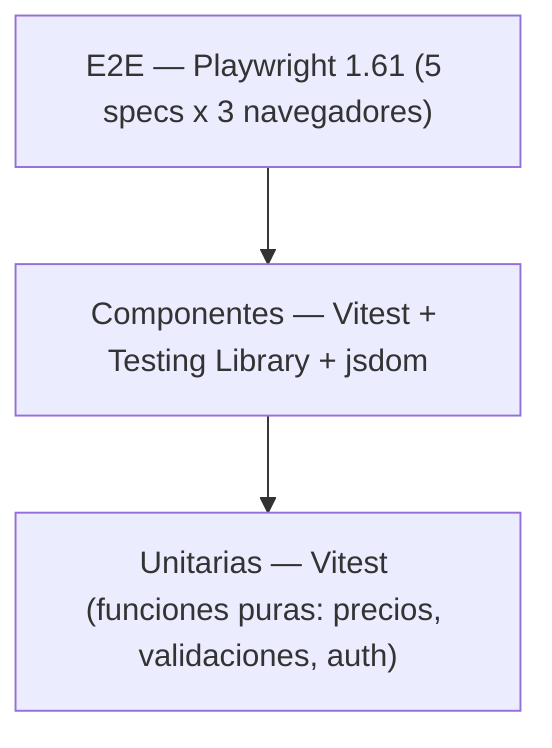
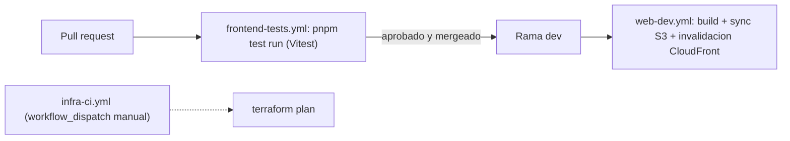
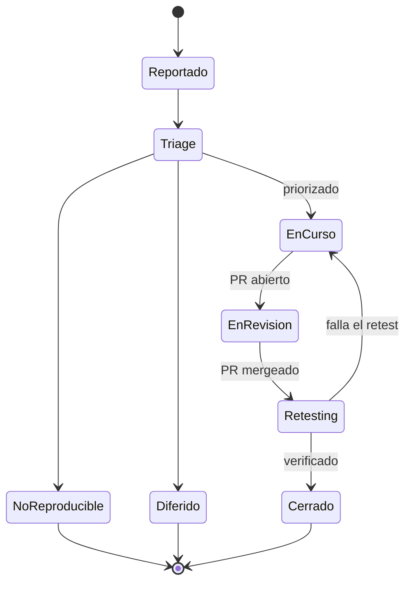

# 12. Testing y Calidad

## Estrategia general

El aseguramiento de calidad no se trata como una etapa posterior al desarrollo sino como una
actividad que interviene desde la redacción de las historias de usuario: cada user story
destacada en la sección 09 (Planificación Scrum) incluye un criterio de aceptación explícito, y
ese criterio es el insumo directo para diseñar los casos de prueba —manuales o automatizados— de
la funcionalidad correspondiente. La ejecución de pruebas automatizadas ocurre en dos momentos:
localmente, durante el desarrollo, y en la integración continua, al abrirse un *pull request*. Las
pruebas manuales y exploratorias se ejecutan antes de cerrar cada historia, sobre el ambiente de
desarrollo desplegado.

*Figura 19 — Pirámide de pruebas: unitarias (Vitest) / componentes (RTL+jsdom) / E2E (Playwright).*

> [!info] Fuente — M12/M13 (`_meta/Datos-Verificables.md`): 66 pruebas Vitest en 13 archivos
> unitarios/de componentes, más 5 *specs* Playwright E2E.

*Figura 20 — Pipeline CI/CD: PR → `frontend-tests.yml` (Vitest) → merge a `dev` → `web-dev.yml` (build + sync S3 + invalidación CloudFront); `infra-ci.yml` manual (`terraform plan`).*

> [!info] Fuente — M14 (`_meta/Datos-Verificables.md`): 3 workflows en `.github/workflows/`
> (`frontend-tests.yml`, `web-dev.yml`, `infra-ci.yml`).

## Tipos de prueba

| Tipo | Herramienta | Alcance real |
|---|---|---|
| Unitarias | Vitest 4.1.6 | Funciones puras: `pricing.ts` (formato de precio), `auth.ts` (lógica de sesión), validaciones de `search-validation.ts` |
| Componentes | Vitest + Testing Library (React) 16.3.2 + jsdom | Renderizado e interacción: `CardSalon`, `Header`, `LoginPage`, `RegisterPage` |
| Integración | Vitest, con el cliente de Supabase mockeado | Hooks de `api/`: `bookings.test.ts`, `favorites.test.ts`, `salones.queries.test.ts` — validan la traducción `snake_case` → dominio y el manejo de errores de PostgREST |
| E2E | Playwright 1.61.0, 3 navegadores (Chromium, Firefox, WebKit) | 5 *specs* en `src/e2e/`: `auth-flow`, `home`, `navigation`, `salon-detail`, `salones` |
| Legacy / exploratorio | Mocha 11.7.6 + Chai 6.2.2 (`test:mocha`); Cypress 15.17.0 | 1 archivo Mocha (`src/test/mocha/search-validation.test.ts`); 1 *spec* Cypress (`cypress/e2e/salon-search.cy.ts`) |

*Tabla 31 — Tipos de prueba, herramienta y alcance real.*

> [!info] Fuente — M12/M13, verificado ejecutando `npx vitest run` sobre el repositorio: 13
> archivos, 66 casos, todos en verde. Nota honesta: sólo la suite de Vitest está integrada al
> pipeline de CI (`frontend-tests.yml` ejecuta `pnpm test run`); Playwright, la corrida
> independiente de Mocha (`pnpm test:mocha`) y el *spec* de Cypress se ejecutan de forma local o
> manual y no forman parte de ningún *workflow* de `.github/workflows/`. El archivo de Mocha,
> además, también es recolectado por Vitest porque su ruta no está excluida en `vite.config.ts`
> (`exclude: [...configDefaults.exclude, 'src/e2e/**']`); por eso sus 4 casos ya están incluidos en
> el total de 66.

## Cobertura

No hay una herramienta de cobertura de líneas configurada en el proyecto (no existe `--coverage`
en el script `test`, ni `@vitest/coverage-v8`/`@vitest/coverage-istanbul` entre las dependencias).
Por lo tanto, este informe **no reporta un porcentaje de cobertura de líneas**: hacerlo sin una
herramienta que lo mida sería un dato inventado. En su lugar, se reportan únicamente los conteos
verificables:

| Métrica | Valor |
|---|---|
| Pruebas automatizadas (Vitest) | 66 |
| Archivos de prueba (Vitest/RTL + Playwright) | 18 (13 + 5) |
| Líneas de código de prueba (unitarias + componentes + E2E) | 1.462 |
| Líneas de código de producción (`src/`, sin pruebas) | 11.148 |
| Relación líneas de prueba / líneas de producción | ≈ 0,13 (13 %) |

*Tabla 32 — Cobertura de pruebas por módulo.*

> [!info] Fuente — M12/M13; líneas de prueba y de producción contadas con
> `find frontend/src -name '*.test.ts' -o -name '*.test.tsx' -o -path '*/e2e/*.spec.ts' | xargs wc -l`
> y su complemento sobre `*.ts`/`*.tsx`, respectivamente (2026-07-28). La cifra de producción
> incluye `src/routeTree.gen.ts` (343 líneas autogeneradas por TanStack Router).

> [!todo] PLACEHOLDER P-46 — Adopción de una herramienta de cobertura de líneas
> Evaluar e instalar `@vitest/coverage-v8` (u otra) para obtener un porcentaje de cobertura real
> antes de la próxima entrega; ver también la línea de evolución futura en
> [[15-Conclusiones]]. Responsable: equipo. Destino: script `test` de `frontend/package.json`.

## Matriz de casos de prueba manuales

Se documentan tres casos representativos, mapeados a flujos reales de la aplicación. El campo
"Resultado obtenido" no proviene de un registro de ejecución real (no existe un sistema de *test
management* en uso), por lo que se marca como dato simulado.

| ID | Precondiciones | Pasos | Datos | Resultado esperado | Resultado obtenido |
|---|---|---|---|---|---|
| CP-01 | Usuario autenticado; salón con un bloqueo de disponibilidad para el 2026-08-10 | 1. Ir a `/salones/:id/reservar`. 2. Seleccionar el 2026-08-10 como fecha. 3. Intentar confirmar el paso 1 del wizard | `salon_availability_blocks` con `date = 2026-08-10` para el salón | El wizard bloquea el avance y muestra un mensaje de fecha no disponible | *(ver SIM-33)* |
| CP-02 | Usuario autenticado; salón sin favorito previo | 1. Abrir `/salones`. 2. Click en el ícono de favorito de una `CardSalon`. 3. Observar el estado del ícono antes de la respuesta del servidor | Salón sin fila en `user_favorites` para ese usuario | El ícono cambia a "favorito" de inmediato (actualización optimista) y persiste tras recargar | *(ver SIM-34)* |
| CP-03 | Ninguna (usuario no autenticado) | 1. Ir a `/login`. 2. Ingresar un email válido con una contraseña incorrecta. 3. Enviar el formulario | `email: usuario@ejemplo.com`, `password: incorrecta123` | Se muestra un mensaje de error de credenciales inválidas y el usuario permanece en `/login` | *(ver SIM-35)* |

*Tabla 33 — Matriz de casos de prueba manuales.*

> [!warning] Dato simulado SIM-33 — Resultado obtenido de CP-01
> No hay un registro de ejecución manual real para este caso. El resultado se infiere de forma
> plausible a partir de la prueba de integración equivalente (`bookings.test.ts`) y de la lógica de
> validación de disponibilidad implementada, pero no debe interpretarse como una ejecución
> verificada.

> [!warning] Dato simulado SIM-34 — Resultado obtenido de CP-02
> Ídem SIM-33: se infiere del comportamiento de `useToggleFavorite` (`favorites.test.ts`), que
> aplica la actualización optimista antes de confirmar la respuesta de Supabase, pero no constituye
> una ejecución manual registrada.

> [!warning] Dato simulado SIM-35 — Resultado obtenido de CP-03
> Ídem SIM-33/34: se infiere del test de integración `LoginPage.test.tsx` ("muestra el error del
> servidor cuando las credenciales son incorrectas"), sin una ejecución manual documentada.

## Manejo de incidencias

Las incidencias se reportan como *GitHub Issues* con la etiqueta `bug`. El repositorio registra 13
issues reales con esa etiqueta, las 13 cerradas.

> [!info] Fuente — `gh issue list --state all --label bug --json number,state` (2026-07-28): 13
> issues, 13 en estado `CLOSED`.

El ciclo de vida observado es: **Reportado** (se crea el issue) → **Triage** (se prioriza o se
etiqueta) → **En curso** (rama `fix/...` asociada) → **En revisión** (*pull request* abierto) →
**Retesting** (verificación manual sobre el ambiente DEV tras el *merge*) → **Cerrado**. Una
incidencia puede desviarse a **No reproducible** o **Diferida** en la etapa de *triage*.

*Figura 21 — Ciclo de vida de un defecto: Reportado → Triage → En curso → En revisión → Retesting → Cerrado (+ No reproducible / Diferido).*

Un defecto real, no simulado, ilustra este ciclo de punta a punta:

> [!info] Fuente — M17: la restricción `CHECK` original de `bookings.status` sólo admitía
> `pending`/`confirmed`/`cancelled` (`supabase/migrations/20240101000000_init_hosty.sql:57-58`),
> mientras que la aplicación ya emitía un cuarto estado, `declined`. El defecto se resolvió en la
> migración `supabase/migrations/20260609233130_host_booking_management.sql:7-11`, cuyo propio
> comentario documenta la causa ("`'declined' was used by the app but missing from the DB
> check.`"). Ver el detalle completo, con retest, en [[Anexo-V-Evidencias-QA]] (Tabla 58) y el
> análisis de deuda técnica en [[15-Conclusiones]] (Tabla 40). La severidad de cada incidencia
> —Bloqueante, Alta, Media o Baja— se clasifica en la Tabla 34 de la siguiente sección, con
> ejemplos reales tomados de las 13 *issues* `bug` del repositorio.

## Criterios de salida

Una historia se considera lista para cerrar cuando se cumplen, en conjunto: (a) la suite de Vitest
pasa en verde localmente y en `frontend-tests.yml`; (b) `npx eslint .` y `npx tsc -b --noEmit` no
reportan errores; (c) el *pull request* asociado cuenta con al menos una aprobación y está
mergeado a `dev`. Estos criterios generales de cierre de historia se completan con una
clasificación de severidad de incidencias, que determina además un criterio de salida específico
por severidad al cierre de cada sprint.

| Severidad | Criterio de calificación en Hosty | Ejemplos reales (issues `bug`) | Criterio de salida adicional |
|---|---|---|---|
| Bloqueante | Impide completar una reserva o publicar un salón, o corrompe datos, sin ningún *workaround* disponible | Ninguna de las 13 incidencias reales alcanzó este nivel — banda documentada como vacía, no fabricada | No puede quedar ninguna incidencia Bloqueante abierta al cierre de un sprint; bloquea el *merge* a `dev` hasta resolverse |
| Alta | Una función completa falla o entrega un resultado incorrecto, con o sin *workaround* manual, fuera del camino crítico de reserva/publicación | `p1-high` (2): #74 "el mapa en /salones no está implementado — implementar o eliminar"; #75 "agregar a favoritos no persiste — solo estado local" | No puede quedar ninguna incidencia Alta abierta al cierre de un sprint; a lo sumo puede diferirse un (1) sprint con justificación registrada en el backlog |
| Media | Defecto de navegación, UX o consistencia que degrada la experiencia sin impedir completar el flujo | `p2-medium` (2): #72 "el link 'Cómo funciona' de la navbar no navega a ninguna sección"; #87 "links del footer apuntan a rutas incorrectas o inexistentes" | Puede diferirse a un sprint posterior si queda registrado en el backlog con responsable asignado |
| Baja | Defecto cosmético o de bajo impacto, sin efecto funcional sobre ningún flujo | `p3-low` (1): #76 "links del footer son placeholders — no navegan a destinos reales" | Puede diferirse indefinidamente; no bloquea el cierre de sprint ni el *merge* |

*Tabla 34 — Severidad de incidencias y criterios de salida.*

> [!info] Fuente — `gh issue list --repo juanpablovaldez/hosty --label bug --state all --json
> number,title,state,labels` (2026-07-28): 13 *issues* con etiqueta `bug`, las 13 cerradas; de
> ellas, 5 llevan además una etiqueta de prioridad — 2 `p1-high` (#74, #75), 2 `p2-medium` (#72,
> #87), 1 `p3-low` (#76) — y las 8 restantes no fueron priorizadas explícitamente con esa
> taxonomía. Verificación en vivo adicional sobre el estado actual del repositorio: `npx tsc -b
> --noEmit` no reporta errores; `npx eslint .` reporta 6 errores y 4 advertencias
> (`cypress.config.ts`: parámetros sin usar; `src/test/mocha/search-validation.test.ts`: la regla
> `no-unused-expressions` no reconoce las aserciones de Chai `expect(...).to.be.true`;
> `SalonesPage.tsx`: 4 advertencias de `react-hooks/exhaustive-deps`). El criterio de "lint
> limpio" no se cumple de forma estricta al momento de esta verificación; se documenta como
> hallazgo de calidad en [[15-Conclusiones]] (Tabla 40).

---
[[Indice|Índice]] · ← [[11-Arquitectura]] · [[13-Ejecucion-por-Sprint]] →
