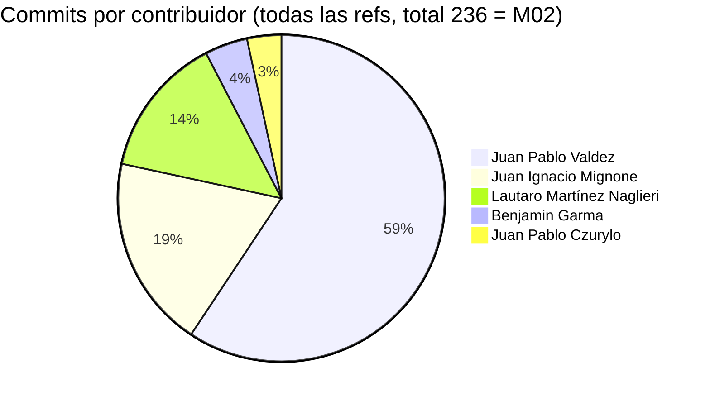

# 14. Métricas

Todas las cifras de esta sección se toman de [[Datos-Verificables]] (`M01`–`M22`), fuente única
del vault, y no se repiten sin su identificador `M##`.

## Métricas de repositorio y de gestión

| Métrica | Valor | Fuente |
|---|---|---|
| Duración del proyecto | 88 días (≈12,6 semanas), 2026-03-29 a 2026-06-24 | M03, M04 |
| Commits en `dev` | 181 | M01 |
| Commits en todas las refs | 236 | M02 |
| Contribuidores | 5 (9 identidades Git) | M05 |
| Issues totales / cerradas | 50 / 45 (90 %) | M06 |
| Pull requests totales / mergeados | 48 / 26 | M07 |
| Milestones (épicas) | 7 | M08 |
| Sprints reconstruidos | ≈5–6 (S1–S5, ver [[13-Ejecucion-por-Sprint]]) | Clústeres de `supabase/migrations/*.sql` |
| User stories destacadas | ≈15 principales, sobre un backlog de 50 issues | Anexo III (Backlog de User Stories) |
| Ambientes desplegados | 1 (DEV) | `web-dev.yml` (único *workflow* de despliegue; sin `web-staging.yml` ni `web-prod.yml`) |

*Tabla 37 — Métricas de repositorio y de gestión.*

> [!info] Fuente — M01–M08, M14; ambiente único verificado listando `.github/workflows/`
> (`frontend-tests.yml`, `web-dev.yml`, `infra-ci.yml`: ninguno despliega a `staging` ni `prod`),
> 2026-07-28.

*Figura 25 — Distribución de commits por contribuidor (5 contribuidores).*

> [!info] Fuente — M05: `git shortlog -sne --all` (2026-07-28), identidades consolidadas por
> email en [[Datos-Verificables]]. Un mismo contribuidor puede tener más de una identidad Git
> (por ejemplo, dos direcciones distintas para Juan Pablo Valdez); la consolidación agrupa por
> persona, no por email.

## Métricas de producto y de calidad

| Métrica | Valor | Fuente |
|---|---|---|
| Entidades del modelo de datos | 6 tablas públicas | M10 |
| Archivos de migración | 10 | M11 |
| Rutas / protegidas | 14 / 8 | M09 |
| Features del frontend | 8 módulos | M15 |
| Operaciones PostgREST (invocaciones `select`/`insert`/`update`/`delete` en `api/*.ts`) | 35, repartidas en 4 módulos activos (ver Anexo IV, API y Repositorio, Tabla 53) | Conteo propio, `grep` sobre `frontend/src/features/*/api/*.ts` |
| Pruebas automatizadas por tipo | 66 Vitest (13 archivos) + 5 *specs* Playwright E2E (× 3 navegadores) + 1 Mocha + 1 Cypress locales | M12, M13 |
| Workflows de CI/CD | 3 | M14 |

*Tabla 38 — Métricas de producto y de calidad.*

```mermaid
xychart-beta
    title "Pull requests por mes"
    x-axis ["2026-04", "2026-05", "2026-06"]
    y-axis "Cantidad de PRs" 0 --> 20
    bar "Abiertos" [9, 19, 20]
    bar "Mergeados" [7, 8, 11]
```

*Figura 26 — Pull requests abiertos vs. mergeados por mes.*

> [!info] Fuente — M07: `gh pr list --state all --json number,createdAt,mergedAt` (2026-07-28),
> agrupado por mes de creación y de *merge*. Total: 48 abiertos, 26 mergeados.

**Interpretación**: el volumen de *pull requests* abiertos crece mes a mes (9 → 19 → 20), pero la
proporción mergeada por mes cae de forma relativa (78 % en abril, 42 % en mayo, 55 % en junio),
consistente con la caída de commits observada en junio en [[13-Ejecucion-por-Sprint]] (Figura 22):
hacia el cierre del proyecto se concentró más trabajo en *pull requests* de integración y
consolidación (ramas como `integration/consolidated-prs`), que tardan más en revisarse y
mergearse que los cambios incrementales de abril y mayo.

---
[[Indice|Índice]] · ← [[13-Ejecucion-por-Sprint]] · [[15-Conclusiones]] →
