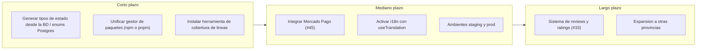

# 15. Conclusiones

## Balance funcional

Del backlog total de 50 issues, 45 se cerraron (90 %) y 5 quedaron diferidos, cada uno con una
justificación explícita registrada en GitHub.

| Issue | Título | Estado | Justificación del diferimiento |
|---|---|---|---|
| #45 | `feat(payments)`: integrar Mercado Pago para reservas | Diferido | Requiere una cuenta comercial y credenciales de producción fuera del alcance del MVP académico |
| #38 | `chore(design)`: documentar todos los color tokens del brandbook | Diferido | Tarea de documentación de diseño sin impacto funcional; no bloquea ninguna épica |
| #35 | `perf`: auditar y mejorar Core Web Vitals | Diferido | Optimización de performance planificada como mejora post-entrega, no como requisito del MVP |
| #33 | `feat(social)`: implementar sistema de reviews y ratings | Diferido, etiquetado `post-mvp` | Declarado explícitamente fuera del alcance del MVP en su propia etiqueta |
| #23 | `DOCS-01`: Final Project Report & Handoff | En curso (es el propio cambio que produce este vault) | Se resuelve con la creación de `documentacion-final/` |

*Tabla 39 — Balance funcional: planificado vs. entregado.*

> [!info] Fuente — `gh issue list --state all --json number,state --limit 300`: 50 totales, 45
> `CLOSED` (2026-07-28). Detalle de los 5 diferidos: `gh issue list --json
> number,title,state,labels` filtrado por número.

Las 7 épicas planificadas (E1–E7, ver [[04-Objetivos]] y la sección 9, Planificación Scrum) alcanzaron
estado funcional en el ambiente de DEV: catálogo y búsqueda, autenticación, reserva, panel del
anfitrión, favoritos y plan destacado, calidad e integración continua, e infraestructura y
despliegue.

## Balance técnico y metodológico

Adoptar Supabase como *backend as a service* permitió al equipo entregar autenticación, control de
acceso y persistencia sin escribir ni operar un servidor propio: la autorización se resuelve
íntegramente con políticas RLS sobre `auth.uid()` (ver la sección 11, Arquitectura), lo que eliminó una
capa completa de código (controladores, DTOs, guards) que un backend propio en NestJS hubiera
requerido escribir y mantener. El costo de esa decisión es la dependencia total del modelo de
permisos de Postgres: cualquier regla de negocio que no se exprese como una política RLS queda sin
protección a nivel de datos.

La gestión con Scrum real —milestones de GitHub mapeados 1 a 1 con las épicas (M08), un tablero de
GitHub Projects v2 (M19) y *pull requests* vinculados a issues— dejó un rastro verificable de todo
el proceso: los 181 commits de `dev`, los 48 *pull requests* y los 50 issues son, en conjunto, la
evidencia primaria de este informe, no una reconstrucción posterior.

## Deuda técnica

| Hallazgo | Severidad | Impacto | Remediación propuesta |
|---|---|---|---|
| Deriva entre el `CHECK` de `bookings.status` en Postgres y el *union type* de TypeScript (ver detalle abajo) | Media | El estado `declined` fue usado por la aplicación antes de ser aceptado por la base; el drift se corrigió, pero nada impide que se repita | Generar los tipos de dominio de estado desde la base de datos (o migrar a un `enum` de Postgres) en vez de mantenerlos a mano en TS |
| 0 `enum` de Postgres en todo el esquema (M22); todos los dominios cerrados se implementan como `CHECK` + `text` | Media | Mayor superficie para que un valor nuevo en la aplicación no tenga correlato en la restricción de base | Evaluar `CREATE TYPE ... AS ENUM` para `bookings.status` y `salones` tipo de precio |
| `axios` declarado como dependencia de `frontend/package.json` | Media | Contradice la arquitectura BaaS documentada (CLAUDE.md prohíbe `axios` en `frontend/`; todo acceso a datos debe ir por `supabase-js`) | Auditar si `axios` se usa realmente; si no, quitarlo del `package.json` |
| Documentación previa desactualizada: `README.md` y `docs/tech-stack.md` describen un backend NestJS eliminado del repositorio, y `docs/tech-stack.md` todavía llama al proyecto "SalonSpot" | Media | Un lector nuevo del repositorio recibe información arquitectónica falsa | Reescribir `docs/tech-stack.md` para reflejar la arquitectura Supabase/BaaS actual (fuera del alcance de este cambio, ver Exclusiones de Alcance) |
| Inconsistencia de gestor de paquetes: `frontend/` y la raíz tienen tanto `package-lock.json` como `pnpm-lock.yaml`; CLAUDE.md indica usar `npm` en `frontend/`, pero `frontend-tests.yml` y `web-dev.yml` instalan con `pnpm` | Media | Riesgo de que las dependencias instaladas localmente (npm) diverjan de las de CI (pnpm) | Fijar un único gestor de paquetes para todo el monorepo y eliminar el lockfile sobrante |
| `root package.json` aún declara el workspace `backend` y scripts `docker:*`/`lint-staged` sobre `backend/src/**`, pese a que el directorio `backend/` fue eliminado del disco | Baja | Scripts inertes, potencial confusión sobre si el backend NestJS sigue vigente | Quitar `backend` de `workspaces` y los scripts asociados |
| Sólo la suite de Vitest corre en CI (`frontend-tests.yml`); Playwright, Mocha y Cypress se ejecutan únicamente en local | Baja | Regresiones E2E o de los *specs* legacy pueden llegar a `dev` sin detectarse automáticamente | Agregar un job de Playwright a CI (o a un *workflow* nocturno) |
| `tsconfig.app.json` excluye `src/test`, `*.test.ts(x)` y `*.spec.ts(x)` del *type-check* de build | Baja | Errores de tipos dentro de los propios tests no bloquean `npm run build` | Crear un `tsconfig.test.json` referenciado que sí tipe los archivos de prueba |
| `prettier` está scripteado (`format`, `format:check`) pero no figura como dependencia directa de `frontend/package.json`; sólo está presente de forma transitiva en `node_modules` | Baja | El script puede romperse si la dependencia transitiva que lo provee cambia | Declarar `prettier` como `devDependency` explícita |
| `react-i18next` está inicializado (`src/i18n/`) pero no se usa en ningún componente (`grep -rl useTranslation frontend/src` no devuelve resultados) | Baja | Infraestructura de internacionalización sin efecto — todo el texto sigue *hardcodeado* en español | Adoptar `useTranslation` de forma incremental o quitar la dependencia si no se usará |
| La capa de presentación queda fuera de la cobertura medida: 17 carpetas de componentes y rutas en 0 % (ver [[12-Testing-y-Calidad]], Tabla 32a) | Baja | La cobertura global es de 12,44 % en sentencias; las regresiones de interfaz sólo las detecta la suite E2E, que no corre en CI | Agregar pruebas de componente sobre el panel del anfitrión y el flujo de reserva, e incorporar Playwright al *pipeline* |
| `npx eslint .` reporta 6 errores y 4 advertencias sobre el estado actual del repositorio (ver [[12-Testing-y-Calidad]], Tabla 34) | Baja | El criterio de salida "lint limpio" no se cumple de forma estricta hoy | Corregir los parámetros sin usar de `cypress.config.ts`, ajustar la regla `no-unused-expressions` para aserciones de Chai, y resolver las dependencias de `useMemo` en `SalonesPage.tsx` |

*Tabla 40 — Deuda técnica: severidad, impacto y plan de remediación.*

> [!info] Fuente — M22 (`_meta/Datos-Verificables.md`): 0 resultados para
> `grep -rn "CREATE TYPE\|ENUM" supabase/migrations/*.sql` (2026-07-28). El hallazgo del `CHECK` de
> `bookings.status` cita `supabase/migrations/20240101000000_init_hosty.sql:57-58` (restricción
> original de 3 valores) y `supabase/migrations/20260609233130_host_booking_management.sql:7-11`
> (comentario verbatim: *"'declined' was used by the app but missing from the DB check."*), además
> del *union type* de 4 estados en `frontend/src/features/host/lib/booking-status.ts`. Detalle
> completo y retest en el Anexo V (Evidencias de QA, Tabla 58) y en [[12-Testing-y-Calidad]].

## Aprendizajes y líneas de evolución futura

> [!warning] Dato simulado SIM-36 — Aprendizajes del equipo
> No existe un registro documental de retrospectivas individuales que permita citar textualmente
> qué aprendió cada integrante. De forma plausible, a partir de la naturaleza del proyecto —una
> plataforma construida sobre un *backend as a service*, gestionada con Scrum real sobre GitHub—,
> se reconstruyen dos aprendizajes verosímiles: (a) el equipo profundizó en el modelado de
> autorización con Postgres RLS como alternativa a un *backend* propio, incluyendo sus límites
> (una regla de negocio no expresable como política RLS requiere lógica adicional en el cliente o
> funciones de base de datos); (b) la gestión de alcance con *milestones* e issues etiquetados
> (`post-mvp`, `bug`, `feature`) ayudó a sostener 45 de 50 issues entregados sin perder trazabilidad
> sobre lo diferido. Ninguna de estas dos afirmaciones debe tomarse como cita textual de una
> retrospectiva real.

*Figura 27 — Roadmap de evolución: corto (deuda técnica) / medio (i18n, pagos) / largo (multi-provincia).*

| Horizonte | Línea de evolución | Relación con un hallazgo verificado |
|---|---|---|
| Corto plazo | Resolver la deuda técnica de la Tabla 40 | Deriva de `bookings.status`, dependencias duplicadas, cobertura ausente |
| Mediano plazo | Integrar Mercado Pago | Issue diferido #45 |
| Mediano plazo | Activar `react-i18next` (`useTranslation`) | `src/i18n/` inicializado sin uso (Tabla 40) |
| Mediano plazo | Ambientes `staging` y `prod` | Sólo `web-dev.yml` despliega hoy (Tabla 37, sección 14) |
| Largo plazo | Reviews y ratings, panel de administración | Issue diferido #33 (`post-mvp`) |
| Largo plazo | Expansión multi-provincia | Extensión natural del catálogo geolocalizado (sección 8) |

*Tabla 41 — Aprendizajes y líneas de evolución futura.*

---
[[Indice|Índice]] · ← [[14-Metricas]] · [[Anexo-I-Modelo-de-Datos]] →
