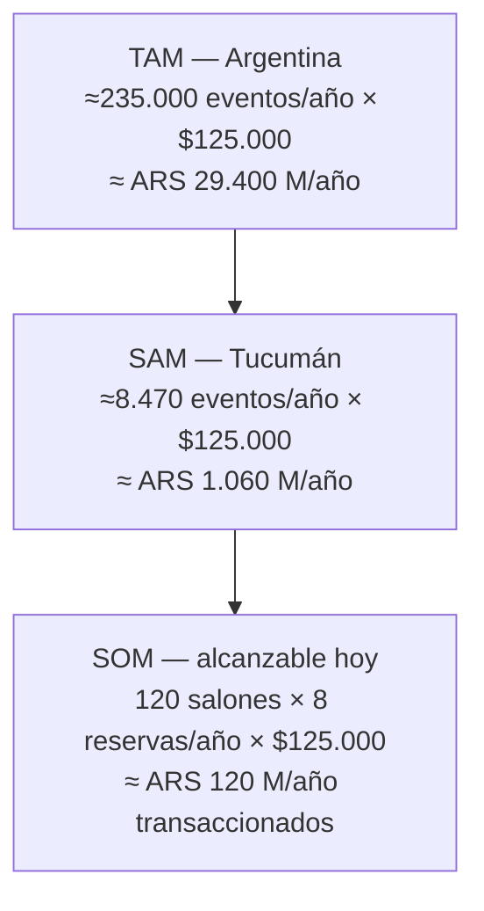

# Anexo VI. Descubrimiento de Producto y Mercado

Este anexo documenta cómo se llegó a la idea de Hosty y por qué se construyó exactamente lo que se
construyó, en vez de una lista más amplia de funcionalidades posibles. Complementa a
[[05-Problema-a-Resolver]] (que arranca de la misma anécdota fundacional) y a
[[06-Impacto-de-la-Solucion]] (que resume el modelo de negocio que se desprende de este análisis).

> [!info] Fuente — Todo el contenido de este anexo, salvo donde se cita explícitamente un dato
> verificable (`M##`), es testimonio directo del equipo aportado en la sesión de trabajo del
> 2026-08-04: no existe un acta de brainstorming, una planilla de benchmarking ni un documento de
> *product discovery* versionado en el repositorio. Es la misma situación que ya resolvió SIM-04
> (títulos formales de rol): información real, confirmada por el equipo, sin artefacto propio. Los
> supuestos numéricos de la sección de mercado sí están marcados como simulados (`SIM-##`) por
> separado, porque son estimaciones de método visible y no una cifra reportada por el equipo.

## Del brainstorming a la idea elegida

El proyecto no arrancó de la idea de un marketplace de salones. Arrancó de una ronda de
*brainstorming* de **alrededor de 30 ideas** de producto, sin restricción de tema, hecha por el
equipo completo. De esa lista se debatieron cuáles generaban más interés genuino en el equipo y
cuáles parecían viables de construir en el tiempo de un cuatrimestre con cinco personas part-time,
hasta quedarse con **tres finalistas**.

| # | Idea finalista | Por qué llegó a la terna | Por qué no fue la elegida (si no lo fue) |
|---|---|---|---|
| 1 | **Marketplace de salones de eventos** | Problema vivido en primera persona por el equipo (ver [[05-Problema-a-Resolver]]); mercado local con oferta fragmentada y verificable | — Elegida |
| 2 | Plataforma de coordinación de tareas para grupos de estudio universitarios | Problema cotidiano y de alcance técnico acotado | Mercado sin disposición a pagar clara; validación de negocio débil frente a la opción 1 |
| 3 | Marketplace de servicios freelance locales (diseño, fotografía, edición) | Mercado más grande que el de salones | Competencia directa de plataformas ya instaladas (Workana, Fiverr) sin una ventaja local clara |

*Tabla 60 — Del brainstorming a las tres ideas finalistas y el criterio de selección.*

Sobre esas tres finalistas, y no antes, el equipo investigó a la competencia: quiénes resuelven hoy
ese mismo problema, aunque no sea con una plataforma dedicada, y qué le falta a cada alternativa.
Ese ejercicio es el benchmarking de la sección siguiente, y fue lo que inclinó la decisión hacia la
idea 1: en las otras dos, la "competencia" eran plataformas grandes y ya consolidadas; en salones de
eventos en Tucumán, la "competencia" son canales genéricos sin ninguna funcionalidad dedicada al
problema — la oportunidad era más clara.

## Benchmarking

No hay, en Tucumán, un competidor directo dedicado a salones de eventos. Los canales reales que
compiten hoy por ese mismo trabajo del usuario son genéricos, y ninguno resuelve el problema de
punta a punta:

| Dimensión | Instagram / redes | Marketplace de Facebook | Grupos de WhatsApp | Agencia de eventos | **Hosty** |
|---|---|---|---|---|---|
| Catálogo navegable de salones | No | Parcial, mezclado con otros rubros | No | Sí, pero acotado a su cartera | Sí |
| Precio visible antes de contactar | No | Raramente | No | No | Sí (fijo, estimado o a cotizar) |
| Disponibilidad verificable | No | No | No | Por consulta manual | Sí, validada en el flujo de reserva |
| Reserva en línea | No | No | No | No | Sí, con confirmación del anfitrión |
| Panel de gestión para el dueño del salón | No | No | No | N/A (es intermediario) | Sí |
| Costo para el organizador | Gratis (tiempo propio) | Gratis (tiempo propio) | Gratis (tiempo propio) | Comisión alta, no transparente | Gratis para buscar; comisión sólo si reserva |

*Tabla 61 — Benchmarking: Hosty frente a las alternativas reales del mercado en Tucumán.*

La columna vacía que comparten los cuatro canales existentes —ninguno ofrece catálogo navegable,
precio visible, disponibilidad verificable y reserva en línea al mismo tiempo— es la oportunidad
concreta que ataca el MVP.

## FODA

| | Positivo | Negativo |
|---|---|---|
| **Interno** | **Fortalezas:** problema validado por experiencia directa del equipo · producto real, desplegado y con datos reales, no un prototipo · arquitectura de bajo costo (Supabase + AWS) que permite operar con margen desde el día uno | **Debilidades:** sin cobro integrado todavía (Mercado Pago diferido, issue #45) · un solo ambiente desplegado, sin *staging* separado · equipo sin experiencia previa operando un producto en producción |
| **Externo** | **Oportunidades:** sin competidor dedicado en la provincia (ver benchmarking) · mercado de eventos con demanda estable e independiente del ciclo económico general · posibilidad de extender a otros rubros del evento (DJ, catering, fotografía) sobre la misma base de usuarios | **Amenazas:** que un actor nacional (ej. una vertical de Airbnb o MercadoLibre) entre al segmento de alquiler de espacios para eventos · dependencia de que los anfitriones adopten la gestión digital en vez de sostener sus canales manuales actuales |

*Tabla 62 — Análisis FODA.*

## Product discovery → alcance del MVP

La regla que se siguió fue deliberada: **construir sólo lo que el discovery señalaba como necesario
para resolver el problema de punta a punta, no todo lo que se le podía ocurrir al equipo.** La Tabla
5 de [[03-Introduccion]] y la Tabla 39 de [[15-Conclusiones]] ya documentan qué entró y qué quedó
fuera del alcance; lo que agrega este anexo es el criterio detrás de esa lista.

Las tres capacidades centrales del MVP (catálogo comparable, reserva verificable, panel del
anfitrión) se mapean directamente a los tres pasos de la anécdota fundacional en
[[05-Problema-a-Resolver]]: encontrar opciones, confirmar sin ida y vuelta manual, y que el anfitrión
pueda gestionar sin depender de mensajería. Todo lo que el discovery identificó como valioso pero no
crítico para ese circuito básico —cobro integrado, reviews, panel de administración, auditoría de
performance— se declaró explícitamente fuera de alcance en vez de construirse "porque se podía": son
exactamente las cinco issues que se documentan como diferidas con justificación en la Tabla 39.

## TAM / SAM / SOM

Estimación con método visible: cada supuesto está declarado y puede discutirse por separado del
resultado final. El ticket promedio se ancla en un dato real de la propia aplicación —no en una
cifra de mercado externa— para que al menos un extremo del cálculo sea verificable.

| Paso | Supuesto o dato | Valor | Fuente |
|---|---|---|---|
| 1 | Población de Argentina | ≈ 47.000.000 | Redondeo de proyecciones INDEC 2022 |
| 2 | Población de Tucumán | 1.694.656 | Censo Nacional 2022 (INDEC) |
| 3 | Tasa de eventos/año que requieren alquilar un salón (bodas, XV años, corporativos, aniversarios) | 0,5 % de la población | **SIM-38** — estimación propia, sin fuente estadística verificada; método visible para poder ajustarla |
| 4 | Ticket promedio por reserva | $125.000 | Figura 36 de [[Anexos/Anexo-V-Evidencias-QA]] — recorrido real del flujo de reserva sobre el entorno desplegado (6,25 h × $20.000/h) |
| 5 | Salones activos y verificados en el catálogo hoy | +120 | Copy verificado de la propia aplicación (`HomePage.tsx`, `ComoFunciona.tsx`) |
| 6 | Reservas pagas por salón por año, alcanzables en el corto plazo | 8 | **SIM-39** — estimación conservadora para una plataforma recién lanzada, sin dato histórico propio |
| 7 | Comisión por reserva concretada | 8–15 % | Rango ya declarado en el issue #45 (Mercado Pago, diferido) |

*Tabla 63 — Supuestos y fuentes del cálculo de TAM/SAM/SOM.*

*Figura 38 — TAM / SAM / SOM: del mercado nacional al volumen alcanzable con la base de salones
actual.*

- **TAM** (mercado total, Argentina): 47.000.000 × 0,5 % ≈ 235.000 eventos/año × $125.000 ≈ **ARS
  29.400 millones/año**.
- **SAM** (mercado disponible, Tucumán): 1.694.656 × 0,5 % ≈ 8.470 eventos/año × $125.000 ≈ **ARS
  1.060 millones/año**.
- **SOM** (mercado obtenible en el corto plazo, con la base de salones de hoy): 120 salones × 8
  reservas/año × $125.000 ≈ **ARS 120 millones/año transaccionados**. Con una comisión del 8–15 %,
  eso es entre **ARS 9,6 y 18 millones/año** de ingreso potencial sólo por la línea de comisión, sin
  contar publicidad ni reventa de servicios.

> [!warning] Dato simulado SIM-38/SIM-39 — Tasa de eventos y reservas por salón
> Las filas 3 y 6 de la Tabla 63 (0,5 % de tasa de eventos, 8 reservas/salón/año) son supuestos
> propios sin respaldo estadístico externo verificado, elegidos para que el cálculo sea conservador
> y no para maximizar el resultado. El resto de la cadena (población, ticket promedio, cantidad de
> salones, rango de comisión) sí cita una fuente verificable.

## Modelo de negocio

Tres líneas de ingreso, dos de ellas con rastro real ya en el producto o en el backlog, no
inventadas para este anexo:

1. **Publicidad / plan Destacado** — ya implementado: la tabla `salon_subscriptions` y el plan
   "Destacado" mejoran la posición de un salón en el catálogo a cambio de una suscripción (ver
   [[Anexo-I-Modelo-de-Datos]]). Es la única línea de ingreso que el MVP ya puede cobrar hoy, aunque
   el cobro en sí (Mercado Pago) esté diferido.
2. **Comisión por reserva concretada** — declarada desde la planificación: el objetivo de la épica
   E3 en [[09-Planificacion-Scrum]] ya dice textualmente "flujo de reserva guiado y cobro de
   comisión". El rango de 8–15 % está en el propio issue #45. Es la línea de ingreso principal a
   mediano plazo, condicionada a integrar un medio de pago.
3. **Reventa del servicio de organización integral (*wedding planning*)** — línea a futuro, sin
   desarrollo todavía: una vez que la plataforma concentra la demanda de organizadores y la oferta
   de salones, el mismo canal permite ofrecer coordinación integral del evento (salón + DJ +
   catering + decoración) como servicio propio, en vez de sólo la intermediación del salón. Es
   evolución de producto, no una funcionalidad de este MVP.

---
[[Indice|Índice]] · ← [[Anexo-V-Evidencias-QA]]
